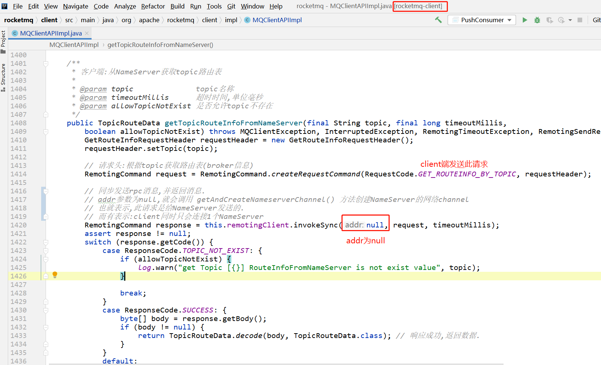
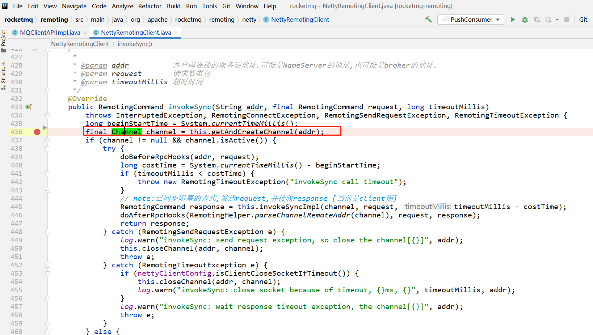
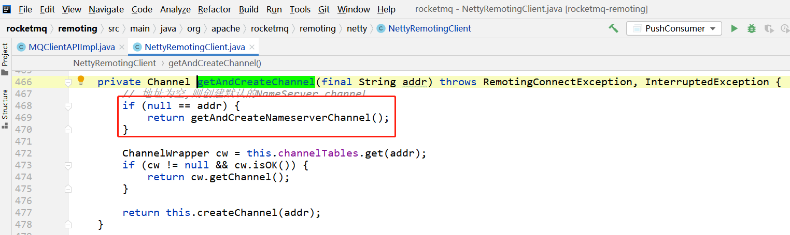
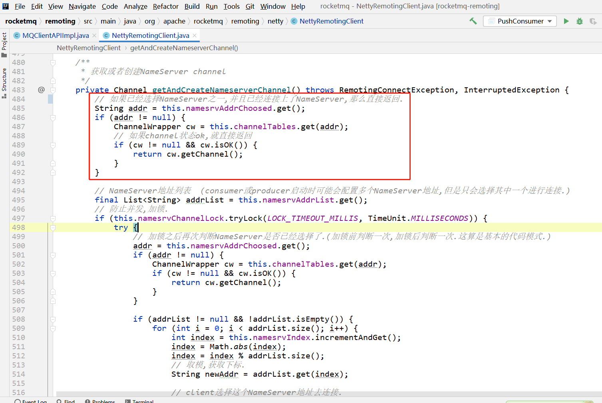

# client在同一时刻只会连接1个NameServer


请求code

> org.apache.rocketmq.common.protocol.RequestCode#GET_ROUTEINFO_BY_TOPIC
>
> ```java
> /**
>  * client端(producer或consumer)根据topic名称获取路由表
>  * NameServer处理此请求
>  *
>  * 请求: {@link GetRouteInfoRequestHeader}
>  * 响应体: {@link TopicRouteData}
>  */
> public static final int GET_ROUTEINFO_BY_TOPIC = 105;
> ```











