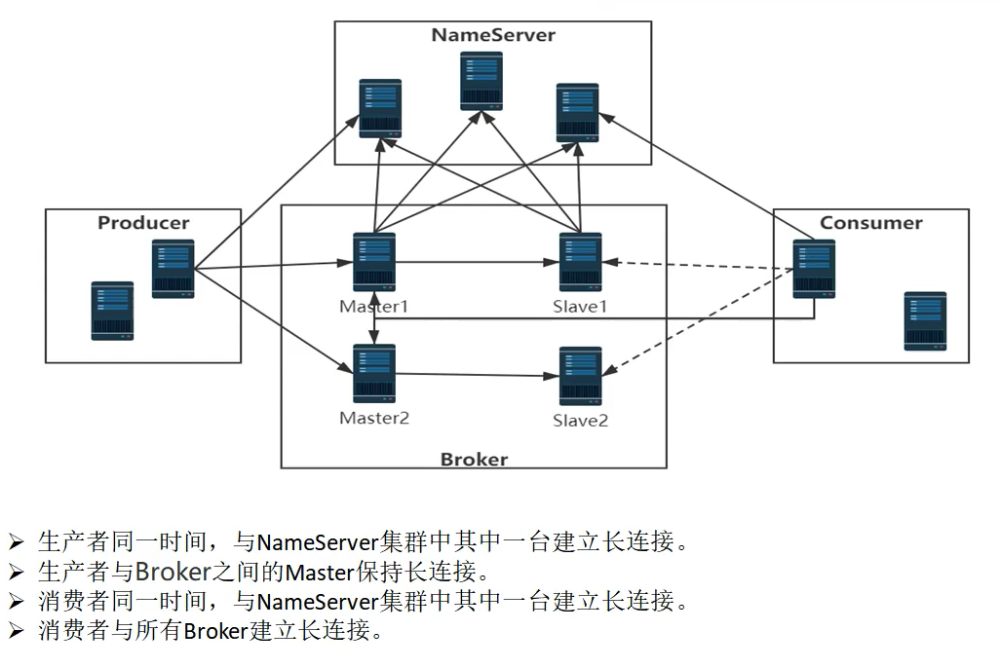

在RocketMQ中各个组件之间用于数据交换的通道，都是基于netty的长连接，那么为了维护长连接的状态，就需要有一个【客户端管理器】的概念。


一般来说，对于长链接的优点：

- 启动时一次创建连接，后续直接复用连接就行了。不需要像http这种，每次请求都重新创建连接。

缺点：

- 由于时长链接，所以可能因为网络不稳定的等原因，需要定时检查连接通道的状态是否OK。一般都是client端定时发送心跳，server端接收心跳请求并记录client端的信息。如果超过一定时间没有接受到心跳，则认为和client之间的网络通道已经断开。


# client端发送心跳

在RocketMQ中，producer和consumer都是client角色，broker是server角色。

所以producer和consumer都需要使用定时任务发送心跳请求给broker。

## 心跳请求的请求code:

```java
package org.apache.rocketmq.common.protocol;
public class RequestCode {
    /**
     * 心跳请求   （忽略其他请求code）
     */
    public static final int HEART_BEAT = 34;
}    
```


## 定时任务

> producer和consumer启动之后，需要每隔一段时间定时给broker发送心跳请求。
>
> 这个启动定时任务`startScheduledTask()` 方法是在 `MQClientInstance` 中：org.apache.rocketmq.client.impl.factory.MQClientInstance#startScheduledTask

- producer端启动：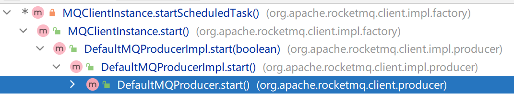

  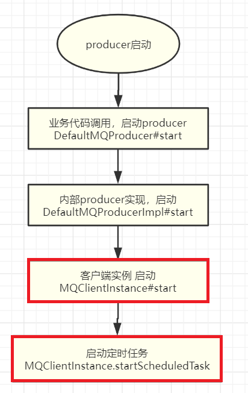


`MQClientInstance#startScheduledTask` 中，注册心跳定时任务：

```java
// 定时任务：移除已下线的broker 和 给所有broker发送心跳请求。
this.scheduledExecutorService.scheduleAtFixedRate(new Runnable() {
    @Override
    public void run() {
        try {
            // 移除已下线的broker
            MQClientInstance.this.cleanOfflineBroker();
            // 【给所有的broker发送心跳。】
            MQClientInstance.this.sendHeartbeatToAllBrokerWithLock();
        } catch (Exception e) {
            log.error("ScheduledTask sendHeartbeatToAllBroker exception", e);
        }
    }
}, 1000, this.clientConfig.getHeartbeatBrokerInterval(), TimeUnit.MILLISECONDS);
```


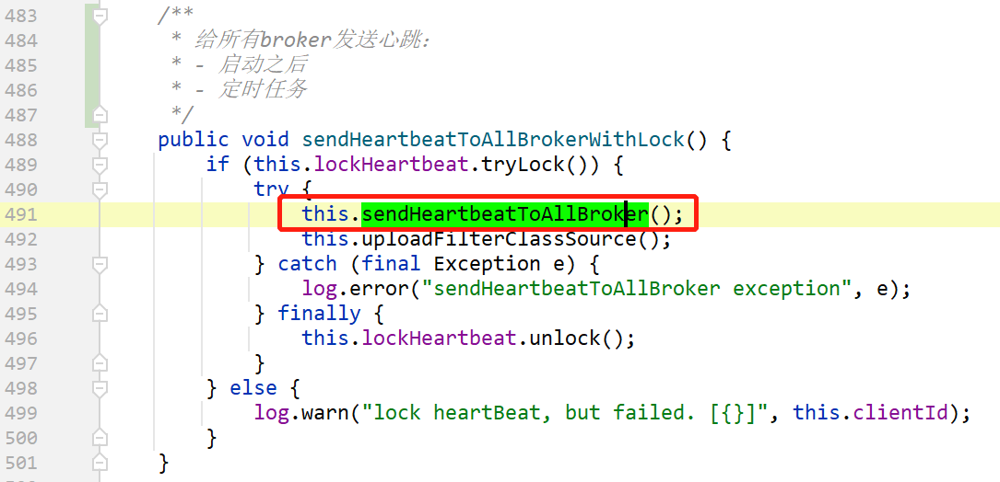

给所有broker发送心跳：

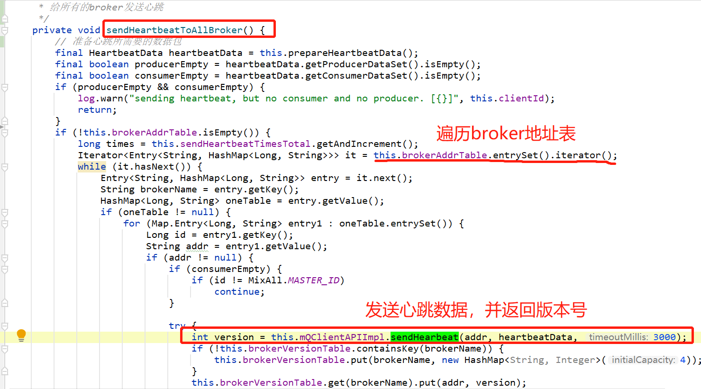

使用客户端api发送心跳请求：

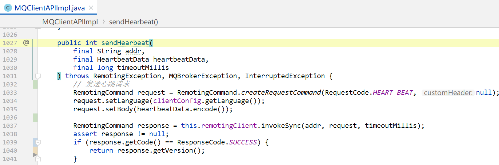


## 启动之后发送心跳

> 在启动成功之后，也会直接调用 `sendHeartbeatToAllBrokerWithLock()` 方法给broker发送心跳。
>
> 这里以producer的启动来举例。

业务代码直接调用`start()`方法，用于启动producer：

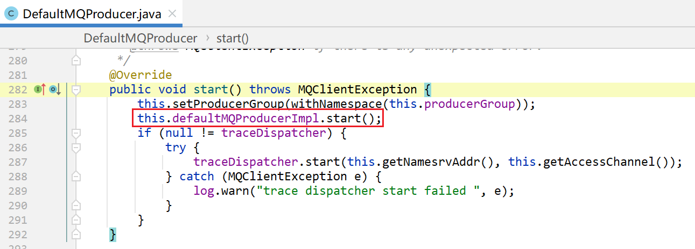

启动：

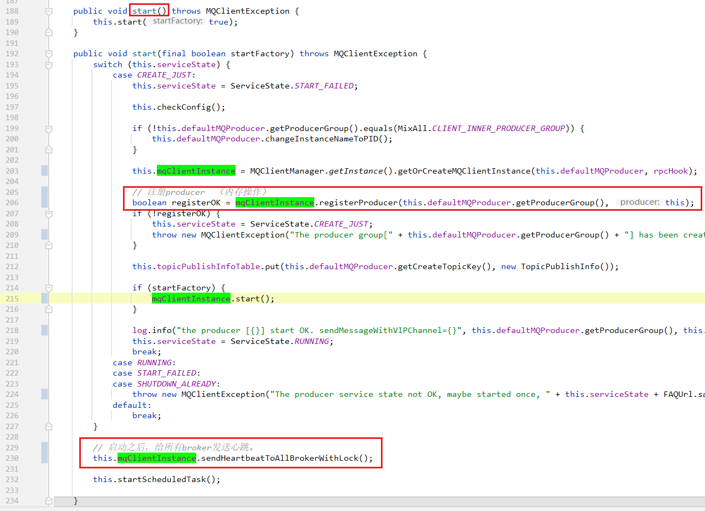


# server端接收心跳

server端接收心跳请求，其实就是broker中的请求处理器：

`ClientManageProcessor` 支持以下三种请求：

| 请求类别                        | 描述             |
| ------------------------------- | ---------------- |
| RequestCode#HEART_BEAT          | 心跳请求         |
| RequestCode#UNREGISTER_CLIENT   | 注销客户端       |
| RequestCode#CHECK_CLIENT_CONFIG | 检查客户端的配置 |

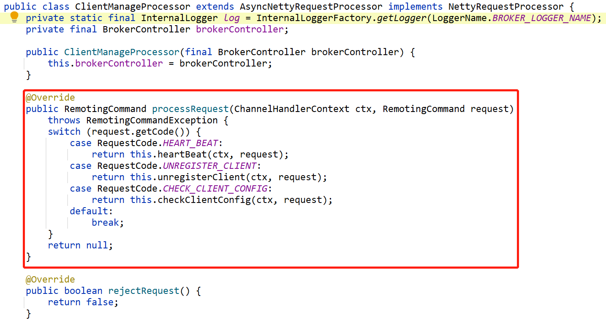

## 心跳请求：

```java
case RequestCode.HEART_BEAT:
    return this.heartBeat(ctx, request);
```

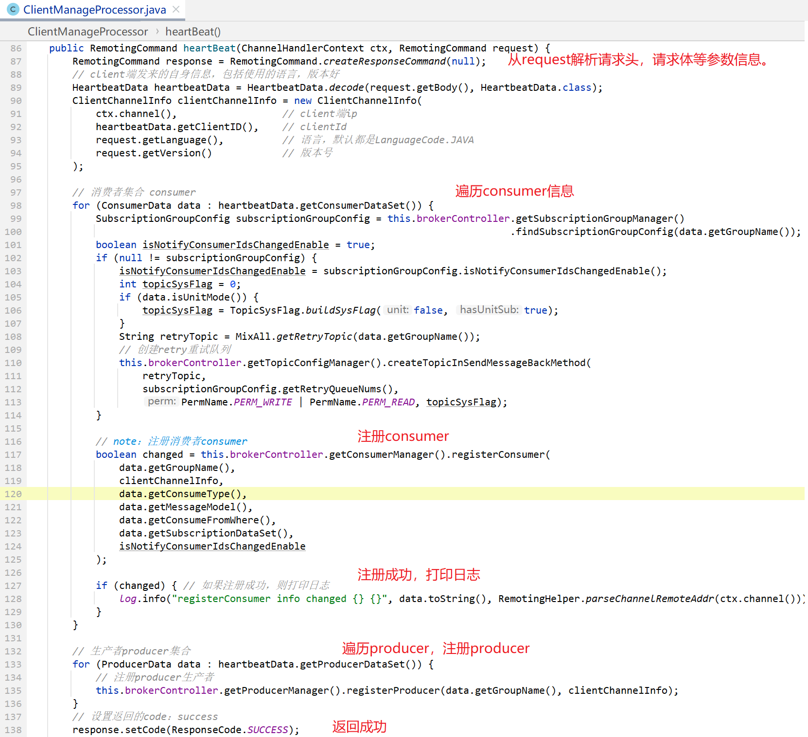

上图，在请求处理器中，

- 先遍历consumerSet，然后使用`ConsumerManager`注册consumer，

- 然后遍历producerSet，使用`ProducerManager`注册producer。

那么顾名思义：

- ProducerManager 是在broker端，管理消费者 consumer 相关信息的 。
- ProducerManager 是在broker端，管理生产者 producer 相关信息的 。

## ConsumerManager 消费者管理器

有两个重要的方法：一个是注册consumer，一个是注销consumer，

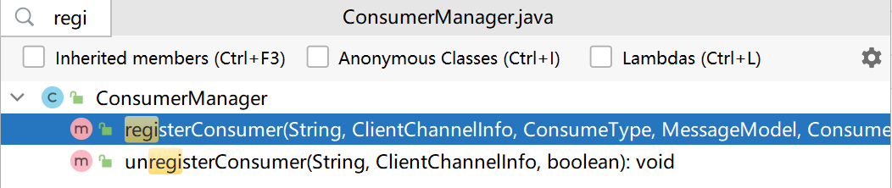

那么在内部肯定有个实例变量，用于记录已经管理的consumer集合：

```java
/**
 * 集合
 * 用于记录consumer信息
 * 
 * @see #registerConsumer    注册consumer
 * @see #unregisterConsumer  注销consumer
 */
private final ConcurrentMap<String/* Group */, ConsumerGroupInfo> consumerTable = 
    new ConcurrentHashMap<>(1024);
```

#### registerConsumer() 注册

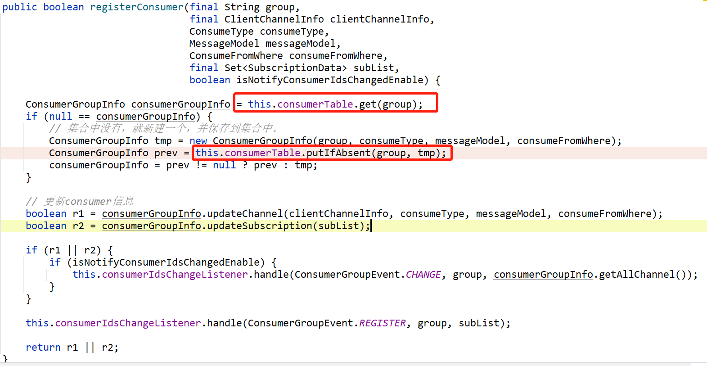


#### unregisterConsumer() 注销

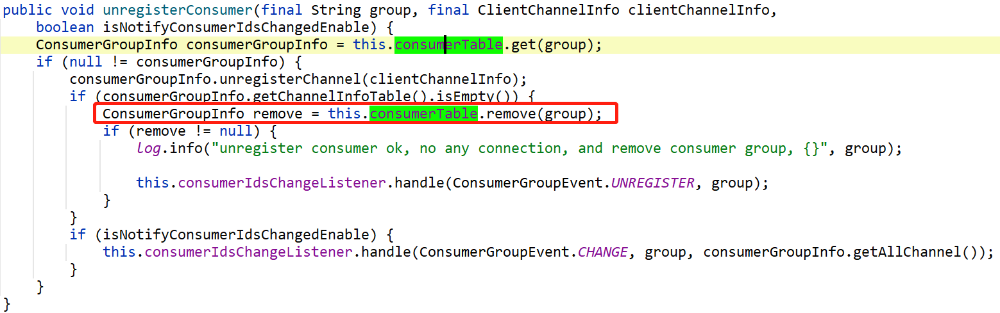

#### scanNotActiveChannel() 扫描不存活的通道

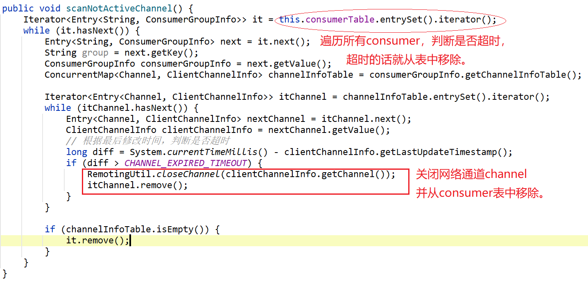


另外，还有一些工具方法：

#### findChannel() 查找consumer

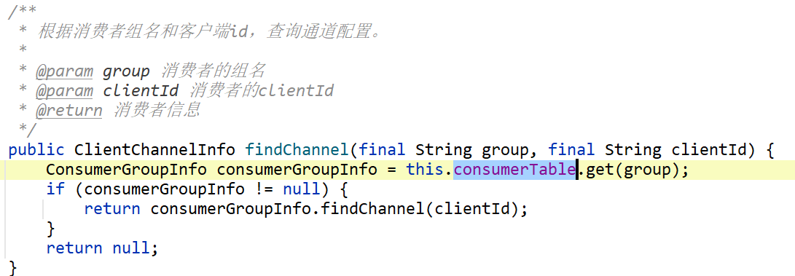


## ProducerManager 生产者管理器


## 注销请求：

```java
case RequestCode.UNREGISTER_CLIENT:
    return this.unregisterClient(ctx, request);
```

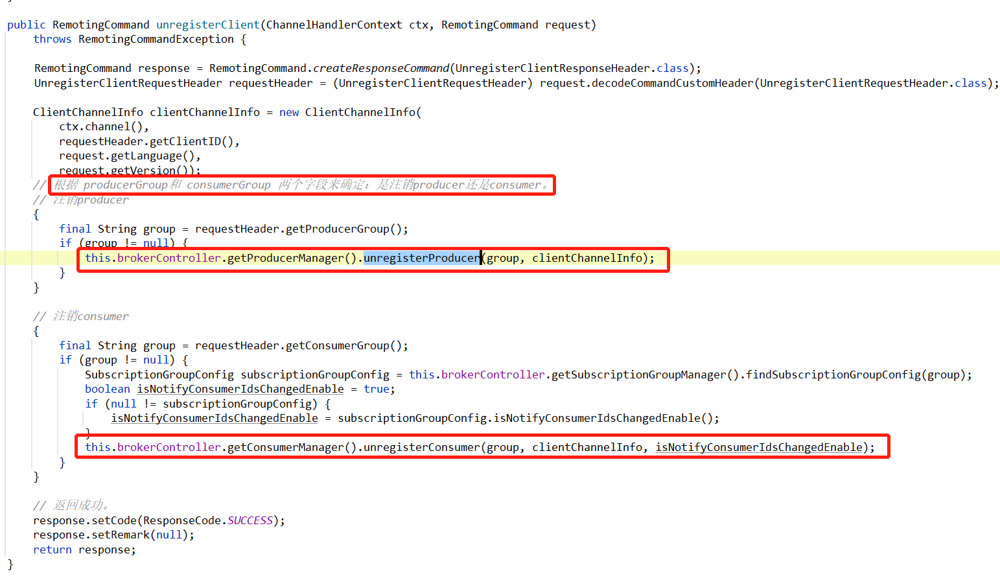


# 总结

综上，我们一起学习了，在broker中的另一个组件：客户端管理器

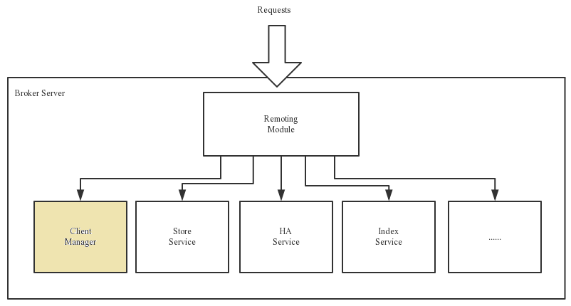


站在broker的角度，producer和consumer都是`客户端`—— `MQClientInstance`


在`sendHeartbeatToAllBrokerWithLock()` 方法中，给broker发送心跳请求：

> RequestCode#HEART_BEAT


当broker收到request后，使用的是 `ClientManageProcessor` 这个请求处理器，负责请求的分发，`客户端管理器ClientManager`分为两个：

- ConsumerManager
- ProducerManager


# 参考：

https://www.jianshu.com/p/d78dc06377cc
