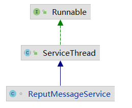
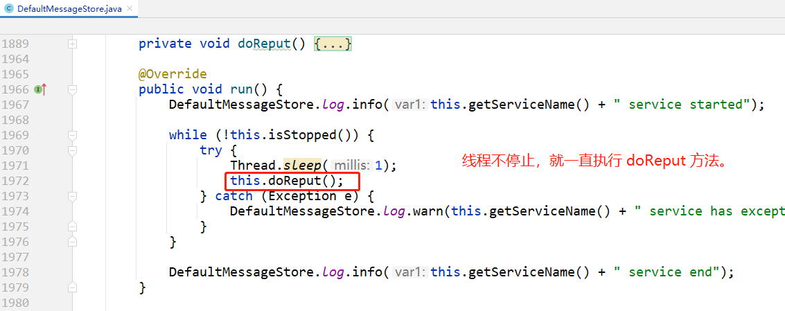

# 官方文档
https://gitee.com/anxiaole/rocketmq/blob/master/docs/cn/design.md#1-%E6%B6%88%E6%81%AF%E5%AD%98%E5%82%A8

## ReputMessageService

> broker把接收到的所有topic的消息都存储在commitlog文件中，Broker端的后台服务线程—`ReputMessageService`不停地分发请求并异步构建ConsumeQueue（逻辑消费队列）和IndexFile（索引文件）数据。
>

### **结构**

实现了 Runnable#run 方法，作为线程使用。所以主要看一下run 方法。

### **run方法**

