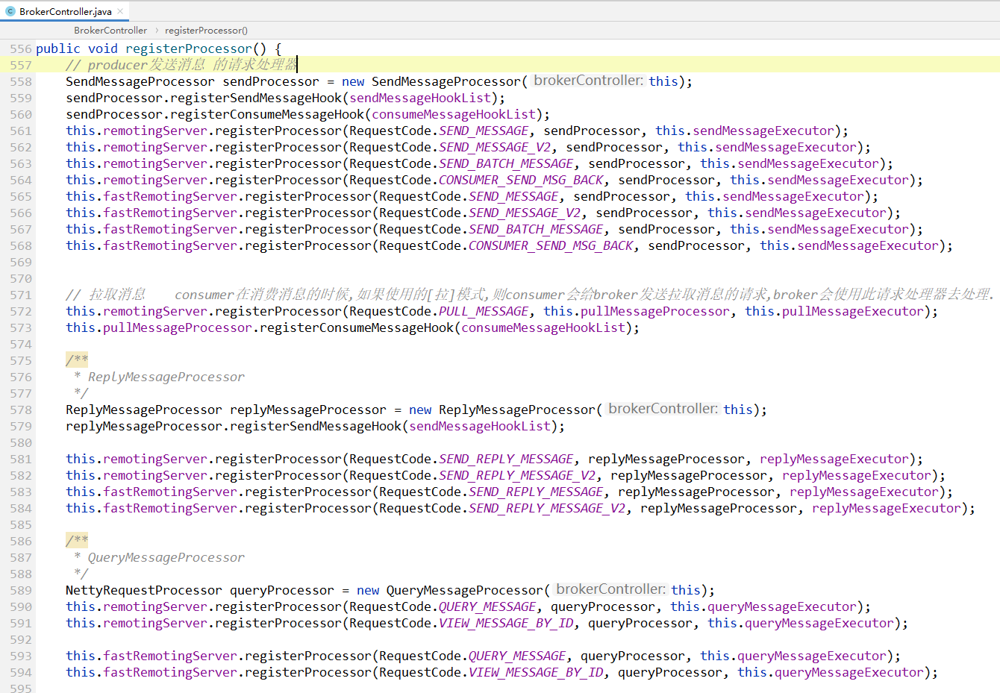
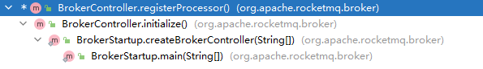

在 [网络组件Remoting.md](网络组件Remoting.md) 前言部分，我们知道了RocketMQ中各个角色之间要发送各式各样的数据包，其实就是client给server端发送请求，server端去处理请求。

那么对于**server端处理请求这个概念**，声明了一个接口来表示：

# Netty请求处理器

org.apache.rocketmq.remoting.netty.NettyRequestProcessor

```java
public interface NettyRequestProcessor {

    /**
     * 处理请求，并返回响应
     *
     * @param ctx        netty网络I/O通道等上线文
     * @param request    请求
     * @return response  响应
     */
    RemotingCommand processRequest(ChannelHandlerContext ctx, RemotingCommand request) throws Exception;

    /**
     * 是否拒绝处理请求
     *
     * @return true:拒绝处理此请求.
     */
    boolean rejectRequest();

}
```

从上面接口中，我们看到只有两个方法：

- 处理请求方法 processRequest，参数有两个：一个`ctx`表示网络通道上线文，另一个`request`表示请求。
- `rejectRequest()`  方法，表示是否要拒绝处理此请求。


# NameServer中的请求处理器

在RocketMQ中，NameServer是作为server端的，那么就需要接收client端的请求、处理请求、返回响应，所以就需要有对应的请求处理器。

NameServer中的请求处理器只有一个：org.apache.rocketmq.namesrv.processor.DefaultRequestProcessor

更多，详见文档：[NameServer中的请求处理器](..\NameServer\请求处理器DefaultRequestProcessor.md)

> 画外音：
>
> 其实NameServer的请求处理器还是很好理解的，
>
> 我们只需要理解NameServer需要处理哪些请求就行了.而且不同的请求类型都是有不同的处理逻辑。
>


# Broker中的请求处理器

| 请求处理器 | 作用 |
| ---- | ---- |
|  SendMessageProcessor    | 发送消息 |
|  PullMessageProcessor    | 拉取消息请求 |
|  ReplyMessageProcessor    |      |
|  QueryMessageProcessor    | 查询消息 |
|  ClientManageProcessor    | 客户端管理 |
|  ConsumerManageProcessor    | 消费者管理 |
|  EndTransactionProcessor    |      |
|  AdminBrokerProcessor    | 用于处理mqadmin命令的请求 |


以上最重要的请求处理器是：`SendMessageProcessor` —— producer发送mq消息给broker，broker需要把消息保存下来，就是使用这个请求处理器来处理的。

我们首先来看一下请求处理器是在哪地方注册进去的。

# 注册请求处理器

org.apache.rocketmq.broker.BrokerController#registerProcessor 这个方法是broker根据不同的`请求code` 注册对应的请求处理器的地方。

下图看到，首先注册的就是 `SendMessageProcessor` 这个发送消息请求处理器，这个处理器会处理 以下这些请求code：

```
RequestCode.SEND_MESSAGE
RequestCode.SEND_MESSAGE_V2
RequestCode.SEND_BATCH_MESSAGE
RequestCode.CONSUMER_SEND_MSG_BACK
```



*（注释：上图只是截了一部分图，总共broker需要注册8个请求处理器，具体逻辑都类似，就没有截全）*


而什么时候会调用这个 `registerProcessor()` 方法来注册这些请求处理器呢？



根据上图的调用栈发现：

- 在broker启动的时候，会调用`BrokerStartup.main` 方法，在这个方法中，会去创建`BrokerController`
- 当`brokerController`在初始化时—— `initialize()` 发放中，会调用注册处理器的方法。

也就是：


# SendMessageProcessor


