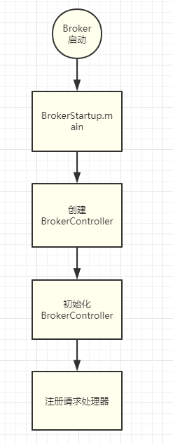
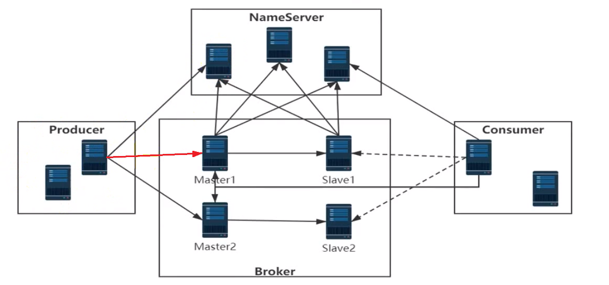

在 [网络组件Remoting.md](网络组件Remoting.md) 前言部分，我们知道了RocketMQ中各个角色之间要发送各式各样的数据包，其实就是client给server端发送请求，server端去处理请求。

那么对于**server端处理请求这个概念**，声明了一个接口来表示：

# Netty请求处理器

org.apache.rocketmq.remoting.netty.NettyRequestProcessor

```java
public interface NettyRequestProcessor {

    /**
     * 处理请求，并返回响应
     *
     * @param ctx        netty网络I/O通道等上线文
     * @param request    请求
     * @return response  响应
     */
    RemotingCommand processRequest(ChannelHandlerContext ctx, RemotingCommand request) throws Exception;

    /**
     * 是否拒绝处理请求
     *
     * @return true:拒绝处理此请求.
     */
    boolean rejectRequest();

}
```

从上面接口中，我们看到只有两个方法：

- 处理请求方法 processRequest，参数有两个：一个`ctx`表示网络通道上线文，另一个`request`表示请求。
- `rejectRequest()`  方法，表示是否要拒绝处理此请求。


# NameServer中的请求处理器

在RocketMQ中，NameServer是作为server端的，那么就需要接收client端的请求、处理请求、返回响应，所以就需要有对应的请求处理器。

NameServer中的请求处理器只有一个：org.apache.rocketmq.namesrv.processor.DefaultRequestProcessor

更多，详见文档：[NameServer中的请求处理器](..\NameServer\请求处理器DefaultRequestProcessor.md)

> 画外音：
>
> 其实NameServer的请求处理器还是很好理解的，
>
> 我们只需要理解NameServer需要处理哪些请求就行了.而且不同的请求类型都是有不同的处理逻辑。
>


# Broker中的请求处理器

| 请求处理器 | 作用 |
| ---- | ---- |
|  SendMessageProcessor    | 发送消息 |
|  PullMessageProcessor    | 拉取消息请求 |
|  ReplyMessageProcessor    |      |
|  QueryMessageProcessor    | 查询消息 |
|  ClientManageProcessor    | 客户端管理 |
|  ConsumerManageProcessor    | 消费者管理 |
|  EndTransactionProcessor    |      |
|  AdminBrokerProcessor    | 用于处理mqadmin命令的请求 |


以上最重要的请求处理器是：`SendMessageProcessor` —— producer发送mq消息给broker，broker需要把消息保存下来，就是使用这个请求处理器来处理的。

我们首先来看一下请求处理器是在哪地方注册进去的。

# 注册请求处理器

org.apache.rocketmq.broker.BrokerController#registerProcessor 这个方法是broker根据不同的`请求code` 注册对应的请求处理器的地方。

下图看到，首先注册的就是 `SendMessageProcessor` 这个发送消息请求处理器，这个处理器会处理 以下这些请求code：

```
RequestCode.SEND_MESSAGE
RequestCode.SEND_MESSAGE_V2
RequestCode.SEND_BATCH_MESSAGE
RequestCode.CONSUMER_SEND_MSG_BACK
```


*（注释：上图只是截了一部分图，总共broker需要注册8个请求处理器，具体逻辑都类似，就没有截全）*


而什么时候会调用这个 `registerProcessor()` 方法来注册这些请求处理器呢？


根据上图的调用栈发现：

- 在broker启动的时候，会调用`BrokerStartup.main` 方法，在这个方法中，会去创建`BrokerController`
- 当`brokerController`在初始化时—— `initialize()` 发放中，会调用注册处理器的方法。

也就是：




# SendMessageProcessor

## 视频讲解

源码阅读过程录制的视频：https://www.bilibili.com/video/BV1mr4y1r76r/

欢迎关注。不定期更新源码阅读视频。

## 类图


下图，**红色线条的就表示生产者producer把生产的消息发送给broker的请求，当broker接收到此请求后，会使用 `SendMessageProcessor` 来处理这个消息，并返回响应。**



## processRequest() 

> 画外音：
>
> 以下展示的代码，经过部分省略。**只展示最重要的逻辑** —— 我们先了解主线逻辑，然后再下载源码，自己去精读。

```java
@Override
public RemotingCommand processRequest(ChannelHandlerContext ctx, RemotingCommand request) {
    return asyncProcessRequest(ctx, request)
           .get();// get方法等待异步处理结果.   (也就是异步转同步的大致思路)
}
```

处理请求方法中，直接调用异步处理并返回异步Future，然后调用`get()`方法，获取结果。这就相当于异步转同步了。

## asyncProcessRequest(ctx,request)

```java
public CompletableFuture<RemotingCommand> asyncProcessRequest(ChannelHandlerContext ctx, RemotingCommand request) {
    final SendMessageContext mqtraceContext;
    switch (request.getCode()) {
        // 这种消息类型暂时先忽略。
        case RequestCode.CONSUMER_SEND_MSG_BACK:
            return this.asyncConsumerSendMsgBack(ctx, request);
        default:
            // SEND_BATCH_MESSAGE，SEND_MESSAGE，SEND_MESSAGE_V2都走下面这个逻辑:
            // 解析出请求头
            SendMessageRequestHeader requestHeader = parseRequestHeader(request);
            mqtraceContext = buildMsgContext(ctx, requestHeader);

            // 处理批量消息   SEND_BATCH_MESSAGE 批量消息
            if (requestHeader.isBatch()) {
                return this.asyncSendBatchMessage(ctx, request, mqtraceContext, requestHeader);
            }
            
            // 处理普通消息   SEND_MESSAGE  SEND_MESSAGE_V2 这两种情况:
            return this.asyncSendMessage(ctx, request, mqtraceContext, requestHeader);
    }
}
```

这个方法会根据请求code判断，不同的请求code，走不同的逻辑。

这里对于批量消息，则使用  `asyncSendBatchMessage()` 方法处理，（批量消息就不细讲了）

普通消息使用  `asyncSendMessage()` 方法处理：

## asyncSendMessage()

```java
private CompletableFuture<RemotingCommand> asyncSendMessage(ChannelHandlerContext ctx, RemotingCommand    request, SendMessageContext mqtraceContext, SendMessageRequestHeader requestHeader) {

    // 忽略check参数、包装消息的流程  ...............
    
    // note:异步保存消息的结果
    CompletableFuture<PutMessageResult> putMessageResult = null;
    // 事务标识
    String transFlag = origProps.get(MessageConst.PROPERTY_TRANSACTION_PREPARED);
    if (Boolean.parseBoolean(transFlag)) {
        // 事务消息,则去处理事务消息
        putMessageResult = brokerController.getTransactionalMessageService().asyncPrepareMessage(msgInner);
    } else {
        // 普通消息,异步处理
        putMessageResult = brokerController.getMessageStore().asyncPutMessage(msgInner);
    }
    return handlePutMessageResultFuture(putMessageResult, response, request, msgInner, responseHeader, mqtraceContext, ctx, queueIdInt);
}
```

这里会判断事务标识`transFlag`，

- 如果是个事务消息，则去处理事务消息，

- 对于普通消息，使用 brokerController.getMessageStore().asyncPutMessage(msgInner); 处理。

  - 这里的 `MessageStore` 标识消息存储模块。主要负责对消息持久化、在broker启动的时候，从磁盘中读取消息文件到内存中。

    其实现类只有一个：`DefaultMessageStore`

## asyncPutMessage(msgInner)

org.apache.rocketmq.store.DefaultMessageStore#asyncPutMessage

```java
@Override
public CompletableFuture<PutMessageResult> asyncPutMessage(MessageExtBrokerInner msg) {
    // 忽略：各种检查
    // 检查完毕,记录开始时间
    long beginTime = this.getSystemClock().now();
    
    // ================【异步保存消息】================
    CompletableFuture<PutMessageResult> putResultFuture = this.commitLog.asyncPutMessage(msg);
    // ================【异步保存消息】================
    
    
    // 忽略：异步保存完消息后,统计状态:处理耗时、错误次数等.
    return putResultFuture;
}
```

这里经过各种检查、记录开始时间之后，就开始把消息异步保存到`commitLog文件`中了。

> commitLog文件是什么？
>
> 详见：[commitLog文件](https://gitee.com/anxiaole/rocketmq/blob/master/docs/cn/design.md#1-%E6%B6%88%E6%81%AF%E5%AD%98%E5%82%A8)
>
> 视频讲解：https://www.bilibili.com/video/BV1mr4y1r76r/    从 21:28 秒开始讲解 commitLog文件和 ConsumeQueue文件。从31:35秒开始，讲解mappedFile文件。

```java
public CompletableFuture<PutMessageResult> asyncPutMessage(final MessageExtBrokerInner msg) {

    putMessageLock.lock(); //spin or ReentrantLock ,depending on store config
    try {
        // 获取最后一个commitlog,也就是mappedFile
        MappedFile mappedFile = this.mappedFileQueue.getLastMappedFile();
        long beginLockTimestamp = this.defaultMessageStore.getSystemClock().now();

        msg.setStoreTimestamp(beginLockTimestamp);

        if (null == mappedFile || mappedFile.isFull()) {
            // 当前消息需要保存到一个mappedFile中.(有可能是新创建的一个mappedFile)
            mappedFile = this.mappedFileQueue.getLastMappedFile(0); // Mark: NewFile may be cause noise
        }

        // note:向指定文件中追加消息
        result = mappedFile.appendMessage(msg, this.appendMessageCallback, putMessageContext);
        
        // 追加消息结果的状态,
        switch (result.getStatus()) {
            case PUT_OK: // 如果追加成功,则直接跳出.
                break;
            // 追加状态:数据已经到达了结尾,则重新创建一个新的文件,并且重新写入消息.
            case END_OF_FILE:
                mappedFile = this.mappedFileQueue.getLastMappedFile(0);
                if (null == mappedFile) {
                    return CompletableFuture.completedFuture(new PutMessageResult(PutMessageStatus.CREATE_MAPEDFILE_FAILED, result));
                }
                result = mappedFile.appendMessage(msg, this.appendMessageCallback, putMessageContext);
                break;

            // 忽略其他异常情况的情况。
        }
    } finally {
        putMessageLock.unlock();
    }

    PutMessageResult putMessageResult = new PutMessageResult(PutMessageStatus.PUT_OK, result);
    // 忽略各种统计、比如执行时间、是否失败、失败次数等等的统计
    return submitFlushRequest(result, msg);
}
```

### commitLog文件、mappedFile文件

这个方法还是比较有意思的，这里又有一个概念，叫：`mappedFile` 文件，其实`mappedFile`文件就是`commitLog`文件（名称不同，但是本质上都是一个东西。）

- commitLog文件是一个统称——producer发送的消息都是存储在commitLog文件，但是如果这个文件存储数据量太多了，就会导致性能很低，所以就把commitLog文件以**`1G`**大小切分成很多小的commitLog文件，这些分片之后的文件，称为`mappedFile`文件。
- 所以其实commitLog文件就是mappedFile文件。这个概念知道就行了。
- 并且在 [commitLog文件](https://gitee.com/anxiaole/rocketmq/blob/master/docs/cn/design.md#1-%E6%B6%88%E6%81%AF%E5%AD%98%E5%82%A8) 这个官方文档中，也是有讲到的。
- 详细可以看视频：https://www.bilibili.com/video/BV1mr4y1r76r/    从 21:28 秒开始讲解 commitLog文件和 ConsumeQueue文件。31:35秒开始，讲解mappedFile文件。


经过上面的学习，我们知道了mappedFile文件，所以在 

```java
result = mappedFile.appendMessage(msg, this.appendMessageCallback, putMessageContext);
```

一行，就是向mappedFile文件中`追加`消息，并返回追加文件的结果。

拿到结果之后，肯定就需要判断一下结果是否成功等：

```java
    // 追加消息结果的状态,
    switch (result.getStatus()) {
        case PUT_OK: // 如果追加成功,则直接跳出.
            break;
```

这里如果消息正常保存到mappedFile文件中，则直接跳出这个结果的判断。

```java
        // 追加状态:数据已经到达了结尾,则重新创建一个新的文件,并且重新写入消息.
        case END_OF_FILE:
            mappedFile = this.mappedFileQueue.getLastMappedFile(0);
            if (null == mappedFile) {
                return CompletableFuture.completedFuture(new PutMessageResult(PutMessageStatus.CREATE_MAPEDFILE_FAILED, result));
            }
            result = mappedFile.appendMessage(msg, this.appendMessageCallback, putMessageContext);
            break;
```

这里 `case END_OF_FILE` ,也就是当保存消息的时候，正好当前mappedFile文件已经达到1G，已经写满了，则会新创建一个mappedFile文件，然后向新的mappedFile文件中保存消息。


```java
    finally {
        putMessageLock.unlock();
    }

    PutMessageResult putMessageResult = new PutMessageResult(PutMessageStatus.PUT_OK, result);
    // 忽略各种统计、比如执行时间、是否失败、失败次数等等的统计
    return submitFlushRequest(result, msg);
```

最后在finally中解锁。

然后返回此方法return，返回结果。


## 小结

到此，producer发送给broker的消息，在broker端会使用 `SendMessageProcessor` 这个请求处理器来处理：

- 经过一系列的**异步**处理，把消息内容最终保存到mappedFile磁盘文件上，并返回异步的`CompletableFuture`结果。

- 最后调用**get()**方法（把调用的异步方法，转成同步方法）返回 `RemotingCommand response` 响应数据，经过netty这个网络层框架，把响应最终发送给producer端。


# client端的请求处理器

> 画外音：
>
> 上面讲的都是server端的请求处理器，无论是NameServer端，broker端，都是server端。
>
> 但是在client端——producer和consumer端，也是有请求处理器的。也就是broker也会给client端发送请求。
>
> 这也是后来翻看代码中才发现的。每天都有新收获啊。

## broker都会给client发送哪些请求？

详见 `org.apache.rocketmq.broker.client.net.Broker2Client` 类中的方法。

构造方法：

```java
public class Broker2Client {
    private final BrokerController brokerController;
    public Broker2Client(BrokerController brokerController) {
        this.brokerController = brokerController;
    }
}
```

> 画外音：
>
> 个人是这么理解这个类的：
>
> 这个类把远程remoting模块封装了一下：如果说**远程remoting**是`底层组件`的角度，那么 `Broker2Client` 就是站在`RocketMQ具体业务`的角度，声明了一些实用的方法。
>
> 也可以理解为是个工具类。


## 注册请求处理器接口

```java
public interface RemotingClient extends RemotingService {
    /**
     * 注册处理器及线程池
     *
     * @param requestCode 请求code org.apache.rocketmq.common.protocol.RequestCode
     * @param processor   处理器:这个请求使用哪个处理器来处理
     * @param executor    处理这个请求的时候,在哪个线程池中执行
     */
    void registerProcessor(int requestCode,
                           NettyRequestProcessor processor,
                           ExecutorService executor);
}    
```

在`RemotingClient`这个客户端远程组件接口上，都有注册请求处理器的方法。

*不过和 `RemotingServer`的区别是：`RemotingClient`没有`registerDefaultProcessor()` 方法。*

## 注册请求处理器实现

```java
    @Override
    public void registerProcessor(int requestCode, 
                                  NettyRequestProcessor processor, 
                                  ExecutorService executor) {
        
        ExecutorService executorThis = executor;
        if (null == executor) {
            executorThis = this.publicExecutor;
        }

        this.processorTable.put(requestCode, new Pair<>(processor, executorThis));
    }
```

方法实现的代码和 `NettyRemotingServer#registerProcessor` 是一模一样的。都是把参数放到一个map中。


## 注册请求处理器


在client端启动的时候，会注册请求处理器，如上图看到，client使用唯一的一个请求处理器来处理broker给client发来的请求。


## client端请求处理器

`org.apache.rocketmq.client.impl.ClientRemotingProcessor`

构造函数：

```java
public class ClientRemotingProcessor 
    extends AsyncNettyRequestProcessor implements NettyRequestProcessor {
    
    private final MQClientInstance mqClientFactory;

    public ClientRemotingProcessor(final MQClientInstance mqClientFactory) {
        this.mqClientFactory = mqClientFactory;
    }
}    
```

实现接口中的两个方法：

```java
@Override
public RemotingCommand processRequest(ChannelHandlerContext ctx,RemotingCommand request){
    switch (request.getCode()) {
        case RequestCode.CHECK_TRANSACTION_STATE:
            return this.checkTransactionState(ctx, request);
        case RequestCode.NOTIFY_CONSUMER_IDS_CHANGED:
            return this.notifyConsumerIdsChanged(ctx, request);
        case RequestCode.RESET_CONSUMER_CLIENT_OFFSET:
            return this.resetOffset(ctx, request);
        case RequestCode.GET_CONSUMER_STATUS_FROM_CLIENT:
            return this.getConsumeStatus(ctx, request);
        case RequestCode.GET_CONSUMER_RUNNING_INFO:
            return this.getConsumerRunningInfo(ctx, request);
        case RequestCode.CONSUME_MESSAGE_DIRECTLY:
            return this.consumeMessageDirectly(ctx, request);
        case RequestCode.PUSH_REPLY_MESSAGE_TO_CLIENT:
            return this.receiveReplyMessage(ctx, request);
        default:
            break;
    }
    return null;
}

@Override
public boolean rejectRequest() {
    return false;
}
```

在 `processRequest()` 方法中，套路还是一样的，根据请求code来调用不同的方法。


## broker给client发送的请求类别

|      |      |
| ---- | ---- |
|  RequestCode.CHECK_TRANSACTION_STATE   | 检查事务状态 |
|  RequestCode.NOTIFY_CONSUMER_IDS_CHANGED   | 通知consumer消费者，id变化。<br />consumer收到请求后会立即rebalance |
|  RequestCode.RESET_CONSUMER_CLIENT_OFFSET   | 重置consumer消费者的消费偏移量 |
|  RequestCode.GET_CONSUMER_STATUS_FROM_CLIENT   | 从client端获取consumer消费者的状态 |
|  RequestCode.GET_CONSUMER_RUNNING_INFO   | 获取消费者运行信息 |
|  RequestCode.CONSUME_MESSAGE_DIRECTLY   | broker给consumer发送请求，直接要求当前的consumer消费mq消息。 |
|  RequestCode.PUSH_REPLY_MESSAGE_TO_CLIENT   | todo |

以上就是broker给client发送的所有的请求，这里每种请求的具体实现流程就不赘述了。

有兴趣的话，可以自己clone源码，或者直接在线看看：[org.apache.rocketmq.client.impl.ClientRemotingProcessor#processRequest](https://gitee.com/anxiaole/rocketmq/blob/master/client/src/main/java/org/apache/rocketmq/client/impl/ClientRemotingProcessor.java)


# 总结

以上就是RocketMQ中的**请求处理器**的概念。


其实和ZooKeeper的请求处理器对比的话，从设计方面，还是不太一样：

- ZooKeeper请求处理器,是使用了设计模式——责任链模式.详见博客: https://my.oschina.net/anxiaole/blog/3217584

- 而RocketMQ的请求处理器，使用了一个map，为不同的RequestCode来指定请求处理器。


有兴趣的话可以去了解一下ZooKeeper的请求处理器，并对比一下。


