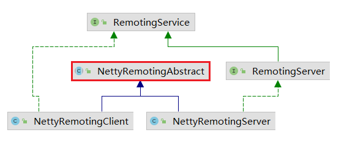

# 服务端netty处理器

```java
class NettyServerHandler extends SimpleChannelInboundHandler<RemotingCommand> {
    @Override
    protected void channelRead0(ChannelHandlerContext ctx, RemotingCommand msg) throws Exception {
        processMessageReceived(ctx, msg);
    }
}
```

这是 `NettyRemotingServer` 类中的内部类。继承自 `SimpleChannelInboundHandler` ，实现了 `channelRead0()` 方法：

当netty收到消息之后，经过 `NettyDecoder`解码成`RemotingCommand`后，会调用 `channelRead0()` 方法。


> 同样，在客户端处理流程一样：

# 客户端netty处理器

```java
class NettyClientHandler extends SimpleChannelInboundHandler<RemotingCommand> {
    @Override
    protected void channelRead0(ChannelHandlerContext ctx, RemotingCommand msg) throws Exception {
        processMessageReceived(ctx, msg);
    }
}
```

这是 `NettyRemotingClient` 类中的内部类。继承自 `SimpleChannelInboundHandler` ，实现了 `channelRead0()` 方法：

当netty收到消息之后，经过 `NettyDecoder`解码成`RemotingCommand`后，会调用 `channelRead0()` 方法。


# processMessageReceived 处理收到的消息

这个方法是在抽象类中的：

org.apache.rocketmq.remoting.netty.NettyRemotingAbstract#processMessageReceived

```java
/**
 * 处理netty网络层'收到'的消息.<br/>
 * '收到'的消息,可能是请求,也有可能是响应.毕竟这是使用netty的tcp来实现的request和response.
 * tcp中是没有request和response的概念的.(http中是有的.)
 * 所以就需要中间件自己去实现.一般都是使用 [请求id] 来区分两个数据包是一个 请求&响应 组.
 *
 * 请求id 详见: {@link RemotingCommand#getOpaque}
 */
public void processMessageReceived(ChannelHandlerContext ctx, RemotingCommand msg) throws Exception {
    final RemotingCommand cmd = msg;
    if (cmd != null) {
        switch (cmd.getType()) {
            case REQUEST_COMMAND:      // request   接收到的这个消息,是请求类型
                processRequestCommand(ctx, cmd);
                break;
            case RESPONSE_COMMAND:     // response  接收到的这个消息,是响应类型
                processResponseCommand(ctx, cmd);
                break;
            default:
                break;
        }
    }
}
```

上面这个方法代码很简单，就不细说了。


## 请求类型

```java
// org.apache.rocketmq.remoting.protocol.RemotingCommand#getType
public RemotingCommandType getType() {
    if (this.isResponseType()) {
        return RemotingCommandType.RESPONSE_COMMAND;
    }
    return RemotingCommandType.REQUEST_COMMAND;
}
```

在  [网络组件Remoting.md](网络组件Remoting.md#远程命令 RemotingCommand)  章节中，描述RocketMQ使用 `RemotingCommand` 一个类表示`request`和`response`。


## 处理请求命令

对于request，那肯定是client端发给server端的，那么当server端收到request请求大致需要做：

- 根据请求类型，找到`请求处理器`
- 使用`请求处理器`处理请求
- 返回处理结果（也就是给client端发送response）

### - 根据请求类型，找到`请求处理器`

请求id：

```java
final int opaque = cmd.getOpaque();
```

请求类型：

```java
int code = cmd.getCode();
```

请求类型对应的枚举类：

```java
// org.apache.rocketmq.common.protocol.RequestCode
public class RequestCode {
    public static final int SEND_MESSAGE = 10;
    public static final int PULL_MESSAGE = 11;
    // 请求类型太多了，这里只列出两个。其他的自己去源码中看吧。
}    
```

根据请求类型，找到`请求处理器`：

```java
Pair<NettyRequestProcessor, ExecutorService> pair = 
    processorTable.getOrDefault(cmd.getCode(), this.defaultRequestProcessor);
```

从 `processorTable`中，根据请求类型，获取`请求处理器`和`线程池`。

> 这里简单说一下 `请求处理器` 和 `线程池` 的作用。
>
> `请求处理器`：在RocketMQ中存在很多类型的请求，也就是RequestCode，那么不同类型的请求，处理方式肯定是不同的。所以需要很多的请求处理器来处理各式各样的请求。
>
> `线程池`：在请求处理器处理请求的时候，指定是在哪个线程中执行。可以让不同的请求，在不同的线程池中处理。
>
> 请求处理器详解：[NettyRequestProcessor.md](NettyRequestProcessor.md)

### - 处理请求

> 处理请求，就很好理解了。其实就是调用 请求处理器的 `processRequest` 方法：
>
> ```java
> RemotingCommand processRequest(ChannelHandlerContext ctx, RemotingCommand request) throws Exception;
> ```

`异步`处理请求：

```java
// 根据请求处理器，判断是否能够异步处理
if (pair.getObject1() instanceof AsyncNettyRequestProcessor) {
    AsyncNettyRequestProcessor processor = (AsyncNettyRequestProcessor) pair.getObject1();
    processor.asyncProcessRequest(ctx, cmd, callback);
}
```

`同步方式`处理：

```java
NettyRequestProcessor processor = pair.getObject1();
RemotingCommand response = processor.processRequest(ctx, cmd);
```


### - 返回处理结果

请求处理器处理完之后，会返回 `RemotingCommand response` ，那么如果request不是使用 `oneway` 这种通信方式的话，server端就需要把response数据发送给client端。

对于`同步处理`的请求处理器，很好处理：直接使用client和server之间的网络`channel`通道，把response数据发给对方就行了，比如：

```java
// 伪代码：
// 设置请求id
response.setOpaque(opaque);
// 标记当前发送的数据包是response类型的
response.markResponseType();
// 使用netty网络通道,把response消息发送给对方.
ctx.writeAndFlush(response);
```

但是上面请求处理器中，我们知道了请求处理器是存在`异步请求处理器`的。那么问题来了，如何在异步请求之后把response发给对方呢？

这里我们先看一下异步请求处理器的声明：

```java
public abstract class AsyncNettyRequestProcessor implements NettyRequestProcessor {

    public void asyncProcessRequest(ChannelHandlerContext ctx, 
                                    RemotingCommand request, 
                                    RemotingResponseCallback responseCallback) throws Exception {
        RemotingCommand response = processRequest(ctx, request);
        responseCallback.callback(response);
    }
}
```

- 首先，异步请求处理器是个抽象类，实现了 `NettyRequestProcessor` 接口。

- 这里定义了一个异步处理器请求的 `asyncProcessRequest()`方法，比同步处理请求的方法，多了一个参数：`RemotingResponseCallback responseCallback`

- 从下面代码中：

  ```java
      RemotingCommand response = processRequest(ctx, request);
      responseCallback.callback(response);
  ```

  我们知道：异步处理请求，其实就先调用同步处理，然后再调用回调函数。

- 那么回调函数的逻辑是什么呢？

  ```java
  final RemotingResponseCallback callback = new RemotingResponseCallback() {
      @Override
      public void callback(RemotingCommand response) {
          // 处理request之后的回调
          doAfterRpcHooks(RemotingHelper.parseChannelRemoteAddr(ctx.channel()), cmd, response);
          
          if (!cmd.isOnewayRPC()) {
              // 设置请求id
              response.setOpaque(opaque);
              // 标记当前发送的数据包是response类型的
              response.markResponseType();
              // 使用netty网络通道,把response消息发送给对方.
              ctx.writeAndFlush(response);
          }
      }
  }
  ```

  从上面这个回调函数中：

  - 调用钩子函数
  - 使用client和server之间的网络`channel`通道，把response数据发给对方

所以经过上面的描述，我们再来看一下：

**同步处理请求并返回response：**

```java
NettyRequestProcessor processor = pair.getObject1();
// 同步处理接收到的request
RemotingCommand response = processor.processRequest(ctx, cmd);
// 同步处理request之后,调用callback
callback.callback(response);     // 这一行需要结合上面的 RemotingResponseCallback callback 一起理解。
```

**异步处理请求并返回response：**

```java
NettyRequestProcessor requestProcessor = pair.getObject1();
if (requestProcessor instanceof AsyncNettyRequestProcessor) {
    AsyncNettyRequestProcessor processor = (AsyncNettyRequestProcessor)pair.getObject1();
    processor.asyncProcessRequest(ctx, cmd, callback);
}
```

异步请求：

```java
// org.apache.rocketmq.remoting.netty.AsyncNettyRequestProcessor#asyncProcessRequest
public void asyncProcessRequest(ChannelHandlerContext ctx, RemotingCommand request, RemotingResponseCallback callback){
    RemotingCommand response = processRequest(ctx, request);
    callback.callback(response);
}
```


> *画外音：*
>
> *这地方我第一次看的时候，确实没有看懂。估计看到这里的伙伴们也是一脸懵逼。*
>
> *但是在写这个博客的时候，为了能表达清楚，我又仔细梳理了一遍，总算看懂了。*
>
> *建议看到这里的伙伴，把代码下载下来，多梳理梳理他们的关系，多看几遍。*
>
> *看源码本身就不是一件着急的事情。需要静下心来。*
>
> *如果你看源码的目的是为了出去面试时说，那我建议还是不要看源码了。还是多背背面试宝典吧。*
>
> *因为我觉得看源码的付出收益曲线是这样的：*
>
> **
>
> *刚开始看的时候，是很痛苦的，不知道怎么看源码才能快速理解，越是心急越是看不进去。但是看的多了，再看其他源码就能很快的理解了。*


## 处理响应命令

```java
public void processResponseCommand(ChannelHandlerContext ctx, RemotingCommand cmd) {
    // 请求id requestId  详见 : RemotingCommand.getOpaque
    final int opaque = cmd.getOpaque();
    // 获取response
    final ResponseFuture responseFuture = responseTable.get(opaque);
    if (responseFuture != null) {
        // 设置response,但是不countDown
        responseFuture.setResponseCommand(cmd);
        // 从集合中移除此请求.
        responseTable.remove(opaque);

        // callback不为空,则去调用callback  [这种情况说明client是异步请求]
        if (responseFuture.getInvokeCallback() != null) {
            executeInvokeCallback(responseFuture);
        } else {
            // 否则设置响应                 [这种情况说明client是同步请求]
            responseFuture.putResponse(cmd); // 设置response并countDown.那么发送request的线程就能跳出阻塞.
            responseFuture.release(); // 释放资源.
        }
    } else {
        log.warn("receive response, but not matched any request, " + RemotingHelper.parseChannelRemoteAddr(ctx.channel()));
        log.warn(cmd.toString());
    }
}
```

我们知道producer发送mq消息的时候，可以使用同步阻塞方式发送，也可以使用异步并设置回调函数的方式来发送mq消息。

所以，在client端给server发送request的时候，`CommunicationMode`枚举声明了通信方式：

```java
package org.apache.rocketmq.client.impl;

public enum CommunicationMode {
    /**
     * 同步
     */
    SYNC,

    /**
     * 异步
     */
    ASYNC,

    /**
     * oneway
     * 表示request只需要发送出去,不需要发送结果
     *
     * request经过请求处理器之后，处理完request之后,是不会把response通过channel发送给对方的.
     * 详见: {@link RemotingResponseCallback#callback} 的实现类.
     */
    ONEWAY,
}
```

### - 同步阻塞请求

对于同步的请求，client端把request发送给server端之后，就会调用   `waitResponse()` 方法，阻塞线程，直到server有了响应数据之后才会解除阻塞，并继续执行：

```java
public RemotingCommand waitResponse(final long timeoutMillis) throws InterruptedException {
    // 阻塞等待结果.
    this.countDownLatch.await(timeoutMillis, TimeUnit.MILLISECONDS);
    // 等待结束后,返回response响应结果
    return this.responseCommand;
}
```

而当client端收到netty的response数据包之后，直接去把response的cmd对象放到Future中就行了：

```java
int opaque = cmd.getOpaque();
ResponseFuture responseFuture = responseTable.get(opaque);
responseFuture.putResponse(cmd); // 设置response并countDown.那么发送request的线程就能跳出阻塞.
```

```java
public void putResponse(final RemotingCommand responseCommand) {
    // 设置response响应结果
    this.responseCommand = responseCommand;
    // countDown减一,解除 waitResponse(long timeoutMillis) 方法上的等待.
    this.countDownLatch.countDown();
}
```

这里会使用`countDownLatch`来取消表现的结果就是：发送reqeust的线程就可以继续执行了。

大致流程如图：


> 画外音：
>
> 这也是同步转异步的常规处理方式。
>
> 详细流程图：https://docs.qq.com/flowchart/DQU14SFZDemFTcXNC


### - 异步请求

**而异步方式就需要使用回调函数了：**

```java
// callback不为空,则去调用callback  [这种情况说明client是异步请求]
if (responseFuture.getInvokeCallback() != null) {
    executeInvokeCallback(responseFuture);
} 
```


```java
    private void executeInvokeCallback(final ResponseFuture responseFuture) {
        boolean runInThisThread = false; // 是否在当前线程执行callback
        // callback方法的执行线程池
        ExecutorService executor = this.getCallbackExecutor();
        if (executor != null) {
            try {
                // 如果存在线程池,则使用对应的线程池去执行callback
                executor.submit(() -> {
                    try {
                        // 执行callback
                        responseFuture.executeInvokeCallback();
                    } catch (Throwable e) {
                        log.warn("execute callback in executor exception, and callback throw", e);
                    } finally {
                        // 释放信号量.   限流器释放一个资源
                        responseFuture.release();
                    }
                });
            } catch (Exception e) {
                // 如果向异步线程池提交任务时异常了,则还在当前线程执行callback.
                // (异常的原因可能是执行器太忙了——maybe executor busy)
                runInThisThread = true;
                log.warn("execute callback in executor exception, maybe executor busy", e);
            }
        } else {
            // 未指定callback在特定线程池中执行,则:callback在当前线程执行
            runInThisThread = true;
        }

        if (runInThisThread) {
            try {
                // 执行callback
                responseFuture.executeInvokeCallback();
            } catch (Throwable e) {
                log.warn("executeInvokeCallback Exception", e);
            } finally {
                // 释放资源.   释放线程器.
                responseFuture.release();
            }
        }
    }

```

异步调用回调方法时，会判断是否需要在线程池中执行：

- 如果 设置了异步执行线程池，则在线程池中执行。
- 如果提交异步任务时异常了（可能是因为执行器太忙导致的），也会在当前线程中执行。
- 通过上面的代码和描述：在本线程执行的情况有两种：
  - `ExecutorService executor = this.getCallbackExecutor();`  执行器为空
  - 向执行器中提交任务时，失败了。（失败原因可能是触发了拒绝策略。）
  - *注意：如果任务在线程池中异步执行时，除了异常，在本线程中是不会再次执行的。*
- 但是无论是在异步线程池中执行，还是在本线程中执行，最后都是会调用 `responseFuture.executeInvokeCallback();` 来完成异步回调函数的执行的：

```java
// org.apache.rocketmq.remoting.netty.ResponseFuture#executeInvokeCallback
public void executeInvokeCallback() {
    if (invokeCallback != null) {
        // 用cas判断是否执行过：如果cas设置成功,则说明异步回调函数没有被执行过,则去执行callback.
        if (this.executeCallbackOnlyOnce.compareAndSet(false, true)) {
            invokeCallback.operationComplete(this);
        }
    }
}
```

