[TOC]


# 官方文档

[设计-通信机制](https://gitee.com/anxiaole/rocketmq/blob/master/docs/cn/design.md#2-%E9%80%9A%E4%BF%A1%E6%9C%BA%E5%88%B6)


# 简述

RocketMQ有很多的角色：

- NameServer
- Broker
- Producer
- Consumer

这些角色之间会有很多的网络请求，底层是使用的netty作为网络框架传输的数据。

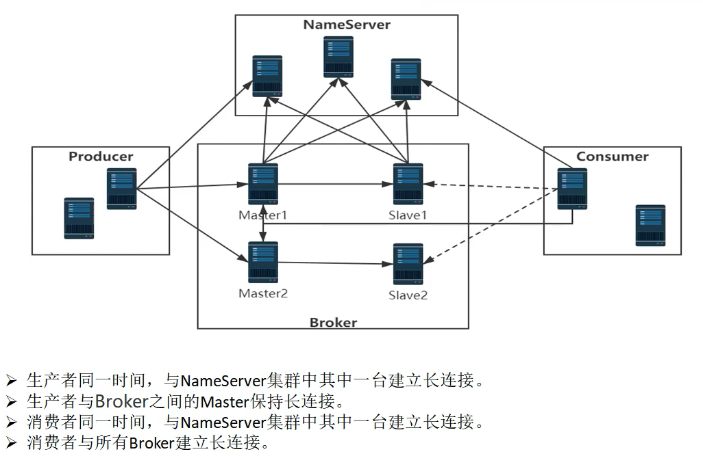

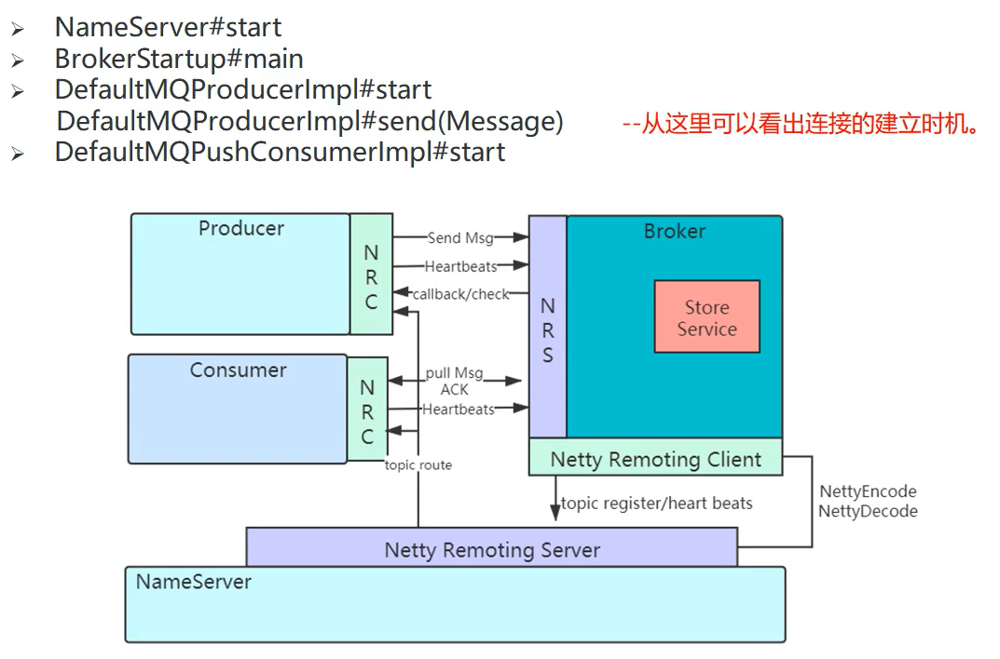

> 上图来自：Java程序员King —— https://www.bilibili.com/video/BV11Q4y1r7aW?p=9


从源码的层面，这些长连接主要接口是： `org.apache.rocketmq.remoting.RemotingService` 

结果图如下：

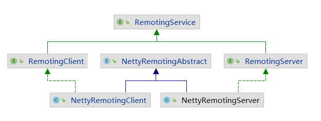

从这个结构图中，我们看到：网络组件主要分两个角色：

- client    ——  Producer、Consumer、Broker（broker想NameServer注册自己的信息时作为client角色）
- server  ——  Broker、NameServer

并且这两个角色中间有的一些公用逻辑，封装到了抽象类中：`org.apache.rocketmq.remoting.netty.NettyRemotingAbstract`

> 在了解 `RemotingService` 之前，我们先了解一下 `RemotingCommand远程命令`
>
> `RemotingCommand` 可以理解为RocketMQ之间网络数据传输的实体类。
>
> `RemotingService` 在下一章：[RemotingService](#RemotingService)

# 远程命令 RemotingCommand

无论是客户端发送的request还是server端返回的response，其实都是`数据包`，类似于http协议中，`数据包`包含`请求头`、`请求体`、`响应头`、`响应体`。

在RocketMQ中，`request`和`response`都是使用`org.apache.rocketmq.remoting.protocol.RemotingCommand`类来表示的。

只不过使用`getType()`方法，可以知道当前这个`远程命令`实例的类型是`request`还是`response`：

```java
    @JSONField(serialize = false)
    public RemotingCommandType getType() {
        if (this.isResponseType()) {
            return RemotingCommandType.RESPONSE_COMMAND;
        }

        return RemotingCommandType.REQUEST_COMMAND;
    }

    @JSONField(serialize = false)
    public boolean isResponseType() {
        int bits = 1 << RPC_TYPE;
        return (this.flag & bits) == bits;
    }
```

枚举：

```java
public enum RemotingCommandType {
    REQUEST_COMMAND,
    RESPONSE_COMMAND;
}
```


## 重要属性

```java
    /**
     * 请求id <br/>
     * 这是静态成员变量,所有请求使用同一个实例.
     */
    private static AtomicInteger requestId = new AtomicInteger(0);
    /**
     * 当前请求的请求id
     */
    private int opaque = requestId.getAndIncrement();
    /**
     * 请求code
     */
    private int code;
    /**
     * 请求体
     * 设置请求体的时候，就需要把请求体编译成字节码。
     * 解析请求体时，是根据 请求code 来区分是哪中请求。然后再把byte[]反序列化成 RemotingCommand。
     */
    private transient byte[] body;
```


## 重要方法

### 编码请求头

org.apache.rocketmq.remoting.protocol.RemotingCommand#encodeHeader()

> 其实就是把程序中表示请求的 `RemotingCommand` 根据RocketMQ自己定义的格式，进行转成byte[]字节流。
>
> 用于在网络I/O中传输数据。

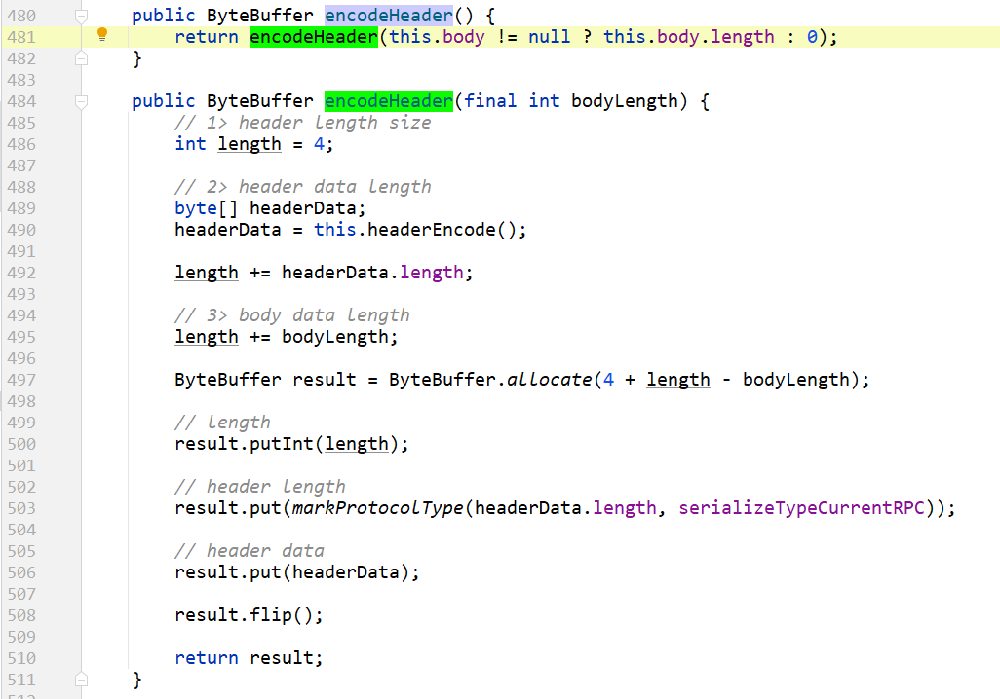

上面是编码请求头，但是`body`请求体是不需要编码的。

因为body在设置进来的时候，已经是`byte[]字节流`了。


### 解码

org.apache.rocketmq.remoting.protocol.RemotingCommand#decode(byte[])

> 解码，就是从网络I/O中收到byte[]之后，需要把byte[]字节流转成 `RemotingCommand`，
>
> 便于在程序中使用。

```java
    public static RemotingCommand decode(final byte[] array) {
        ByteBuffer byteBuffer = ByteBuffer.wrap(array);
        return decode(byteBuffer);              // 其实就是重载方法。主要看下面的方法。
    }
```

org.apache.rocketmq.remoting.protocol.RemotingCommand#decode(java.nio.ByteBuffer)

```java
    /**
     * 解码
     * 把字节流,转成 {@link RemotingCommand} 对象
     */
    public static RemotingCommand decode(final ByteBuffer byteBuffer) {
        // 字节流的总长度(总共多少个字节).
        int length = byteBuffer.limit();
        // 先获取4个字节,作为int类型.但是需要注意:这个int并不是一个整数.详见下面getHeaderLength(oriHeaderLen);方法.
        int oriHeaderLen = byteBuffer.getInt();
        // todo:疑问:再转成???另一种格式???   这有什么区别???
        int headerLength = getHeaderLength(oriHeaderLen);

        // 再从ByteBuffer中读取 headerLength 个字节  (也就是请求头)
        byte[] headerData = new byte[headerLength];
        byteBuffer.get(headerData);

        // 序列化类型:JSON 和 ROCKETMQ 两种.
        SerializeType protocolType = getProtocolType(oriHeaderLen);
        // 把请求头的byte[]字节流,反序列化成 RemotingCommand 实例.
        RemotingCommand cmd = headerDecode(headerData, protocolType);


        // 所有长度,减去int类型4个字节,再减去请求头的长度.就是请求体的长度.
        int bodyLength = length - 4 - headerLength;
        byte[] bodyData = null;
        if (bodyLength > 0) {
            bodyData = new byte[bodyLength];
            // 读取请求体
            byteBuffer.get(bodyData);
        }
        cmd.body = bodyData;

        return cmd;
    }

```


> 其实最重要的两个方法，就是编码和解码。
>
> 其他方法都是工具方法等。比如：
>
> 创建请求：
>
> 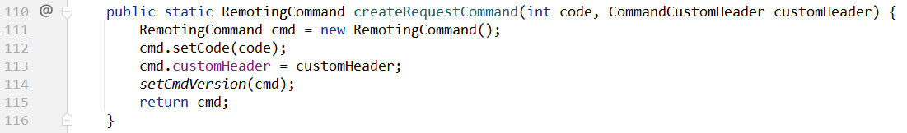
>
> 创建响应：
>
> 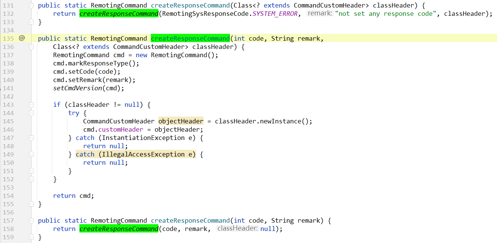


### ROCKETMQ数据传输协议格式

官方文档：[设计-通信机制-协议设计与编解码](https://gitee.com/anxiaole/rocketmq/blob/master/docs/cn/design.md#22-%E5%8D%8F%E8%AE%AE%E8%AE%BE%E8%AE%A1%E4%B8%8E%E7%BC%96%E8%A7%A3%E7%A0%81)


> 画外音：
>
> 不是很重要，第一次看源码时了解就行了。

再来说个概念，**序列化类型**：

```java
    /**
     * 请求需要序列化之后,通过netty网络框架发送出去.
     * 接收到的字节流也需要反序列化.
     * 那么序列化和反序列化的类型是那种的,就是这个字段控制的.
     * 默认是JSON类型的. {@link SerializeType#JSON}
     */
    private static SerializeType serializeTypeConfigInThisServer = SerializeType.JSON;

    static {
        // 可以通过系统属性配置.(但是启动之后,无法修改.)
        final String protocol = System.getProperty(SERIALIZE_TYPE_PROPERTY, System.getenv(SERIALIZE_TYPE_ENV));
        if (!isBlank(protocol)) {
            try {
                serializeTypeConfigInThisServer = SerializeType.valueOf(protocol);
            } catch (IllegalArgumentException e) {
                throw new RuntimeException("parser specified protocol error. protocol=" + protocol, e);
            }
        }
    }
```

JSON序列化都很好理解，就是把 `RemotingCommand` 转成json格式字符，然后在转成byte[]并使用netty发送出去。json格式的就不多说了。

RocketMQ自己定义了一种数据传输协议：

这种协议格式：todo：缺少一个图片。

具体方法详见：`org.apache.rocketmq.remoting.protocol.RocketMQSerializable#rocketMQProtocolDecode`

```java
    /**
     * rocketmq自定义的数据协议传输格式.
     *
     * @param headerArray netty网络传输过来的请求头字节流
     * @return
     */
    public static RemotingCommand rocketMQProtocolDecode(final byte[] headerArray) {
        RemotingCommand cmd = new RemotingCommand();
        ByteBuffer headerBuffer = ByteBuffer.wrap(headerArray);
        // int code(~32767)
        cmd.setCode(headerBuffer.getShort());
        // LanguageCode language
        cmd.setLanguage(LanguageCode.valueOf(headerBuffer.get()));
        // int version(~32767)
        cmd.setVersion(headerBuffer.getShort());
        // int opaque
        cmd.setOpaque(headerBuffer.getInt());
        // int flag
        cmd.setFlag(headerBuffer.getInt());
        // String remark
        int remarkLength = headerBuffer.getInt();
        if (remarkLength > 0) {
            byte[] remarkContent = new byte[remarkLength];
            headerBuffer.get(remarkContent);
            cmd.setRemark(new String(remarkContent, CHARSET_UTF8));
        }

        // HashMap<String, String> extFields
        int extFieldsLength = headerBuffer.getInt();
        if (extFieldsLength > 0) {
            byte[] extFieldsBytes = new byte[extFieldsLength];
            headerBuffer.get(extFieldsBytes);
            cmd.setExtFields(mapDeserialize(extFieldsBytes));
        }
        return cmd;
    }
```


### RemotingCommand 中的位运算


# RemotingService

从源码的层面，这些长连接主要接口是： `org.apache.rocketmq.remoting.RemotingService` 

结果图如下：


从这个结构图中，我们看到：网络组件主要分两个角色：

- client    ——  Producer、Consumer、Broker（broker想NameServer注册自己的信息时作为client角色）
- server  ——  Broker、NameServer

由于RocketMQ是使用netty作为网络I/O框架，所以

对于 client有实现：NettyRemotingClient

对于server有实现：NettyRemotingServer。

并且这两个角色中间有的一些公用逻辑，封装到了抽象类中：`org.apache.rocketmq.remoting.netty.NettyRemotingAbstract`


## RemotingService接口方法

```java
public interface RemotingService {
    void start();      // 启动

    void shutdown();   // 关闭

    void registerRPCHook(RPCHook rpcHook);   // 注册rpc钩子
}
```


## client启动：

org.apache.rocketmq.remoting.netty.NettyRemotingClient#start

```java
    @Override
    public void start() {
        // 设置默认的事件执行线程组.也就是工作线程池
        this.defaultEventExecutorGroup = new DefaultEventExecutorGroup(
            nettyClientConfig.getClientWorkerThreads(), // client执行线程数
            // 线程池的线程工厂
            new ThreadFactory() {
                private AtomicInteger threadIndex = new AtomicInteger(0);
                @Override
                public Thread newThread(Runnable r) {
                    return new Thread(r, "NettyClientWorkerThread_" + this.threadIndex.incrementAndGet());
                }
            });

        // 启动netty框架
        Bootstrap handler = this.bootstrap.group(this.eventLoopGroupWorker).channel(NioSocketChannel.class)
            .option(ChannelOption.TCP_NODELAY, true)
            .option(ChannelOption.SO_KEEPALIVE, false)
            .option(ChannelOption.CONNECT_TIMEOUT_MILLIS, nettyClientConfig.getConnectTimeoutMillis())
            .option(ChannelOption.SO_SNDBUF, nettyClientConfig.getClientSocketSndBufSize())
            .option(ChannelOption.SO_RCVBUF, nettyClientConfig.getClientSocketRcvBufSize())
            .handler(new ChannelInitializer<SocketChannel>() {
                @Override
                public void initChannel(SocketChannel ch) throws Exception {
                    ChannelPipeline pipeline = ch.pipeline();
                    if (nettyClientConfig.isUseTLS()) {
                        if (null != sslContext) {
                            pipeline.addFirst(defaultEventExecutorGroup, "sslHandler", sslContext.newHandler(ch.alloc()));
                            log.info("Prepend SSL handler");
                        } else {
                            log.warn("Connections are insecure as SSLContext is null!");
                        }
                    }
                    // 设置channel处理器
                    pipeline.addLast(
                        defaultEventExecutorGroup,
                        new NettyEncoder(), // 编码器——RemotingCommand转字节流byte[]
                        new NettyDecoder(), // 解码器——字节流byte[]转RemotingCommand
                        new IdleStateHandler(0, 0, nettyClientConfig.getClientChannelMaxIdleTimeSeconds()),
                        new NettyConnectManageHandler(), // 监听netty连接状态,并维护连接信息 —— NettyRemotingClient#channelTables
                        new NettyClientHandler()); // 处理收到的消息
                }
            });

        // 添加定时任务:延迟3秒之后,每隔1秒中执行一次:扫描 responseTable
        this.timer.scheduleAtFixedRate(new TimerTask() {
            @Override
            public void run() {
                try {
                    NettyRemotingClient.this.scanResponseTable();
                } catch (Throwable e) {
                    log.error("scanResponseTable exception", e);
                }
            }
        }, 1000 * 3, 1000);

        // 启动netty事件执行器
        if (this.channelEventListener != null) {
            this.nettyEventExecutor.start();
        }
    }

```


## server启动：

```java
    @Override
    public void start() {
        this.defaultEventExecutorGroup = new DefaultEventExecutorGroup(
            nettyServerConfig.getServerWorkerThreads(),
            new ThreadFactory() {

                private AtomicInteger threadIndex = new AtomicInteger(0);

                @Override
                public Thread newThread(Runnable r) {
                    return new Thread(r, "NettyServerCodecThread_" + this.threadIndex.incrementAndGet());
                }
            });

        prepareSharableHandlers();

        ServerBootstrap childHandler =
            this.serverBootstrap.group(this.eventLoopGroupBoss, this.eventLoopGroupSelector)
                .channel(useEpoll() ? EpollServerSocketChannel.class : NioServerSocketChannel.class)
                .option(ChannelOption.SO_BACKLOG, 1024)
                .option(ChannelOption.SO_REUSEADDR, true)
                .option(ChannelOption.SO_KEEPALIVE, false)
                .childOption(ChannelOption.TCP_NODELAY, true)
                .childOption(ChannelOption.SO_SNDBUF, nettyServerConfig.getServerSocketSndBufSize())
                .childOption(ChannelOption.SO_RCVBUF, nettyServerConfig.getServerSocketRcvBufSize())
                // 监听的端口号
                .localAddress(new InetSocketAddress(this.nettyServerConfig.getListenPort()))
                .childHandler(new ChannelInitializer<SocketChannel>() {
                    @Override
                    public void initChannel(SocketChannel ch) throws Exception {
                        ch.pipeline()
                            .addLast(defaultEventExecutorGroup, HANDSHAKE_HANDLER_NAME, handshakeHandler)
                            .addLast(defaultEventExecutorGroup,
                                encoder,                  // 编码器——RemotingCommand转字节流byte[]
                                new NettyDecoder(),       // 解码器——字节流byte[]转RemotingCommand
                                new IdleStateHandler(0, 0, nettyServerConfig.getServerChannelMaxIdleTimeSeconds()),
                                connectionManageHandler,  // 这个处理器除了打打日志,发个事件,其他没干啥事.
                                serverHandler             // 接收到消息之后,经过上面一系列的消息解码,最终的处理逻辑.
                            );
                    }
                });

        if (nettyServerConfig.isServerPooledByteBufAllocatorEnable()) {
            childHandler.childOption(ChannelOption.ALLOCATOR, PooledByteBufAllocator.DEFAULT);
        }

        try {
            // server绑定端口号,并启动.
            ChannelFuture sync = this.serverBootstrap.bind().sync();
            // 设置端口号.
            this.port = ((InetSocketAddress) sync.channel().localAddress()).getPort();
        } catch (InterruptedException e1) {
            throw new RuntimeException("this.serverBootstrap.bind().sync() InterruptedException", e1);
        }

        if (this.channelEventListener != null) {
            this.nettyEventExecutor.start();
        }

        // 定时任务:延时3秒,每隔1秒执行一次:扫描 responseTable.把其中已经超时的请求,给remove掉.
        this.timer.scheduleAtFixedRate(new TimerTask() {
            @Override
            public void run() {
                try {
                    NettyRemotingServer.this.scanResponseTable();
                } catch (Throwable e) {
                    log.error("scanResponseTable exception", e);
                }
            }
        }, 1000 * 3, 1000);
    }

```

## 解析


netty中的使用，这里就不讲了，如果对netty不太了解，那需要先去学习netty框架的使用。

**一般使用netty主要逻辑就是实现`ChannelHandler`接口，并在启动的时候设置`ChannelHandler`。**

比如client启动时设置了：

```java
// 设置channel处理器
pipeline.addLast(
    defaultEventExecutorGroup,
    new NettyEncoder(),                  // 编码器——作用：把RemotingCommand转字节流byte[]
    new NettyDecoder(),                  // 解码器——作用：把字节流byte[]转RemotingCommand
    new IdleStateHandler(0, 0, nettyClientConfig.getClientChannelMaxIdleTimeSeconds()),
    new NettyConnectManageHandler(),     // 监听netty连接状态,并维护连接信息 —— NettyRemotingClient#channelTables
    new NettyClientHandler());           // 处理收到的消息
```

server启动时设置了：

```java
ch.pipeline()
    .addLast(defaultEventExecutorGroup, HANDSHAKE_HANDLER_NAME, handshakeHandler)
    .addLast(defaultEventExecutorGroup,
        new NettyEncoder(),                  // 编码器——作用：把RemotingCommand转字节流byte[]
        new NettyDecoder(),                  // 解码器——作用：把字节流byte[]转RemotingCommand
        new IdleStateHandler(0, 0, nettyServerConfig.getServerChannelMaxIdleTimeSeconds()),
        new NettyConnectManageHandler(),     // 这个处理器除了打打日志,当监听到channel事件,其他没干啥事.（不重要）
        new NettyServerHandler()             // 接收到消息之后,经过上面一系列的消息解码,最终的处理逻辑.
    );
```

> 画外音
>
> 本小节就主要讲解client端和server端使用到的`ChannelHandler`，
>
> 比如：NettyEncoder、NettyDecoder、NettyClientHandler、NettyServerHandler
>
> IdleStateHandler、NettyConnectManageHandler （后面这两个不是很重要，了解即可）

上面都设置了 `NettyEncoder` `NettyDecoder` 编码和解码器，

- 那么通过netty网络框架发送的byte[]字节流，解码成 `RemotingCommand` 就是在 `NettyDecoder` 中。

- 把 `NettyDecoder` 编码成byte[]字节流，就是在 `NettyEncoder` 中。

简单图示：

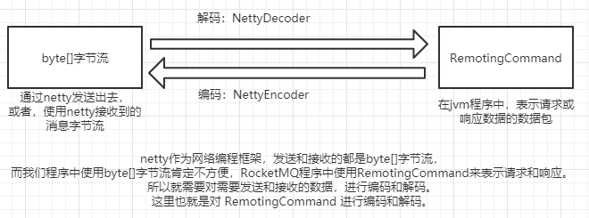

# ChannelHandler

## NettyEncoder

```java
/**
 * netty消息的编码器
 * 把 {@link RemotingCommand} 编码成 byte[] —— 使用tpc协议在网络上传输的都是byte[]字节流
 *
 * 从netty框架层面:此类实现了 {@link MessageToByteEncoder#encode } 抽象方法,目的:自定义的消息实例转成字节流byte[]
 */
@ChannelHandler.Sharable
public class NettyEncoder extends MessageToByteEncoder<RemotingCommand> {
    @Override
    public void encode(ChannelHandlerContext ctx, RemotingCommand remotingCommand, ByteBuf out) throws Exception {
        try {
            // 把请求头转码成 ByteBuffer
            ByteBuffer header = remotingCommand.encodeHeader();
            // 把字节流交给netty框架,让netty去发送
            out.writeBytes(header);
            // 获取请求体的byte[]字节流,
            byte[] body = remotingCommand.getBody();
            if (body != null) {
                // 再把请求体的字节流交给netty,让netty帮忙去发送出去.
                out.writeBytes(body);
            }
        } catch (Exception e) {
            RemotingUtil.closeChannel(ctx.channel());
        }
    }
}
```


## NettyDecoder

```java
/**
 * 使用netty框架,收到tpc协议的数据字节流之后,把字节流转成 {@link RemotingCommand}
 */
public class NettyDecoder extends LengthFieldBasedFrameDecoder {

    private static final int FRAME_MAX_LENGTH = 
        Integer.parseInt(System.getProperty("com.rocketmq.remoting.frameMaxLength", "16777216"));

    public NettyDecoder() {
        super(FRAME_MAX_LENGTH, 0, 4, 0, 4);
    }

    @Override
    public Object decode(ChannelHandlerContext ctx, ByteBuf in) throws Exception {
        ByteBuf frame = null;
        try {
            frame = (ByteBuf) super.decode(ctx, in);
            if (null == frame) {
                return null;
            }

            // 字节的转换.
            ByteBuffer byteBuffer = frame.nioBuffer();

            return RemotingCommand.decode(byteBuffer);
        } catch (Exception e) {
            RemotingUtil.closeChannel(ctx.channel());
        } finally {
            if (null != frame) {
                frame.release();
            }
        }
        return null;
    }
}
```


> 以上，我们知道了数据包的编码和解码流程。
>
> 上面我们说`RemotingCommand`这个实体，既可以代表`request`的数据包，也可以代表`response`的数据包：
>
> ```java
>     @JSONField(serialize = false)
>     public RemotingCommandType getType() {
>         if (this.isResponseType()) {
>             return RemotingCommandType.RESPONSE_COMMAND;
>         }
> 
>         return RemotingCommandType.REQUEST_COMMAND;
>     }
> 
>     @JSONField(serialize = false)
>     public boolean isResponseType() {
>         int bits = 1 << RPC_TYPE;
>         return (this.flag & bits) == bits;
>     }
> ```
>
> 枚举：
>
> ```java
> public enum RemotingCommandType {
>     REQUEST_COMMAND,
>     RESPONSE_COMMAND;
> }
> ```
>
> 那么`request`的数据包是如何发送的？
>
> server端接收到`request`数据包，是如何处理的？
>
> server端处理完`request`之后，如何给client返回一个响应`response`？
>
> client端收到表示`response`的数据包，又会如何处理？


## NettyServerHandler

这是在`NettyRemotingServer`类中的一个内部类。

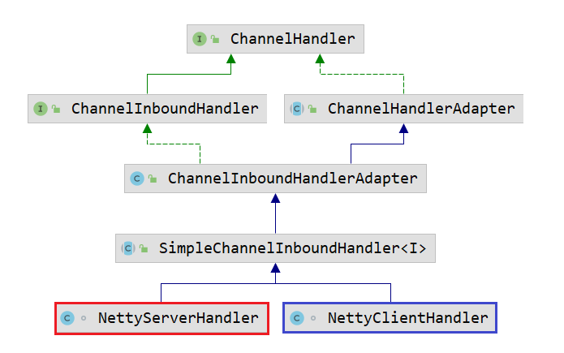

从类图中看到，本质上还是 `ChannelHandler` 。

主要是实现了`channelRead0()` 方法，当netty收到消息之后，经过`NettyDecoder`把byte[]字节流转成 `RemotingCommand`之后，会调用`channelRead0()`方法。

```java
class NettyServerHandler extends SimpleChannelInboundHandler<RemotingCommand> {

    @Override
    protected void channelRead0(ChannelHandlerContext ctx, RemotingCommand msg) throws Exception {
        processMessageReceived(ctx, msg);
    }
}
```

这里收到消息之后，调用 `processMessageReceived(ctx, msg);` 方法去处理这个消息。具体处理的逻辑详见： [收到netty远程消息之后处理流程.md](收到netty远程消息之后处理流程.md) 

## NettyClientHandler

```java
class NettyClientHandler extends SimpleChannelInboundHandler<RemotingCommand> {

    @Override
    protected void channelRead0(ChannelHandlerContext ctx, RemotingCommand msg) throws Exception {
        processMessageReceived(ctx, msg);
    }
}
```


从代码和类结构图上看，除了类名和`NettyServerHandler`不一样，并没有其他什么区别了。


## IdleStateHandler


## NettyConnectManageHandler


## 小结


---


# request数据包如何发送？

解答这个问题之前，再来看一下RocketMQ中的各个角色：

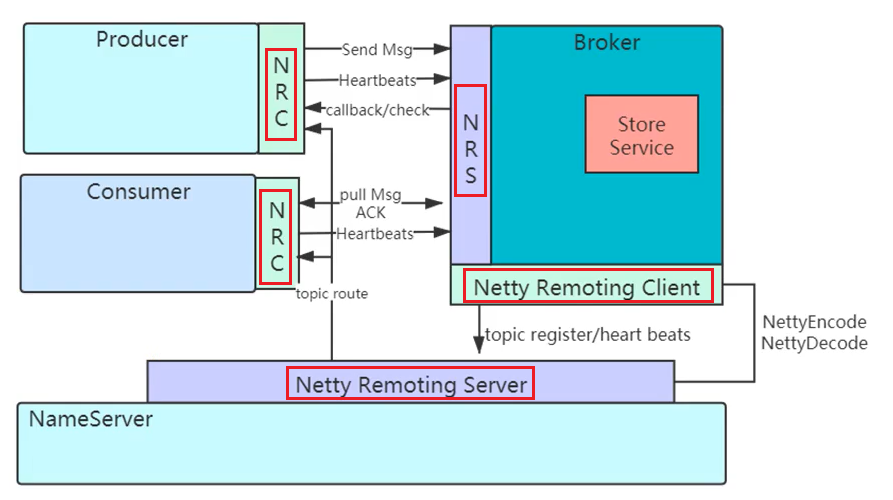

> 在网络传输数据层面：
>
> - 生产者Producer 作为 client ，使用： NettyRemotingClient
>
> - 消费者Consumer 作为 client ，使用： NettyRemotingClient
>
> - NameServer作为 server，使用：NettyRemotingServer
>
> - 而Broker就比较特殊了，Broker和Producer、Consumer之间进行通信时，作为server端，
>
>   Broker和NameServer之间通信时，作为client端。
>
> 相当于：在Consumer或Producer启动时，使用的remoting远程数据传输层实现是NettyRemotingClient
>
> NameServer启动时，使用的remoting远程数据传输层实现是NettyRemotingServer
>
> 而特殊的Broker都使用了。

这里我们就用Producer和Broker之间，以发送mq业务消息的场景举例子：Producer是client，Broker是server。

### quickstart

```java
public class Producer {
    public static void main(String[] args) throws Exception {
        DefaultMQProducer producer = new DefaultMQProducer("my_test_group_name");
        producer.setNamesrvAddr("localhost:9876");
        producer.start();

        Message msg = new Message("TopicTest", "TagA", ("Hello RocketMQ").getBytes(RemotingHelper.DEFAULT_CHARSET));
        SendResult sendResult = producer.send(msg);
        System.out.printf("%s%n", sendResult);

        producer.shutdown();
    }
}
```

发送消息，主要就是创建出一个 `Message` 实例对象，包含如下属性：

- topic名称，这里设置的是：`TopicTest`
- tags ，这是设置的是`TagA`
- 消息体。byte[]字节数组。这里设置消息体是 `Hello RocketMQ` 字符串，然后转成byte[]字节数组。

然后使用 `producer.send(msg);` 把消息发送到broker。并且返回发送结果：`SendResult`

### send

org.apache.rocketmq.client.producer.DefaultMQProducer#send(org.apache.rocketmq.common.message.Message)

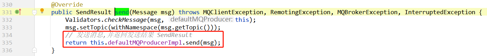

org.apache.rocketmq.client.impl.producer.DefaultMQProducerImpl#send(org.apache.rocketmq.common.message.Message)

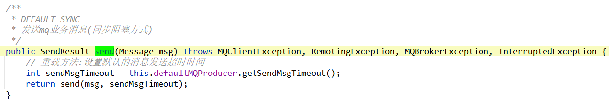

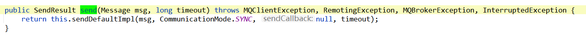

org.apache.rocketmq.client.impl.producer.DefaultMQProducerImpl#sendDefaultImpl

下面就是Producer将消息写入到某Broker中的某Queue中，其经历了如下过程：
 - Producer发送消息之前，会先向NameServer发出获取Topic路由信息的请求,NameServer返回该[Topic的路由表]及[Broker列表]

 - Producer根据代码中指定的Queue选择策略，从Queue列表中选出一个队列，用于后续存储消息 详见：{@link  DefaultMQProducerImpl#selectOneMessageQueue}

 - 发送消息：Producer向选择出的Queue所在的Broker发出RPC请求，将消息发送到选择出的Queue

    - 实际发送消息之前，Produer对消息做一些特殊处理，例如，消息压缩、消息本身超过4M会报错

    - ```java
      int compressMsgBodyOverHowmuch = 1024 * 4;       // 默认压缩大于 4k 的消息体。
      int maxMessageSize = 1024 * 1024 * 4;            // 4M  允许的最大消息大小（以字节为单位）。
      ```

 - 网络通信使用netty

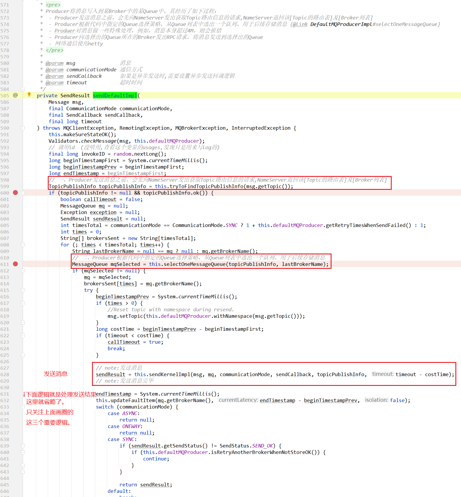


### tryToFindTopicPublishInfo

org.apache.rocketmq.client.impl.producer.DefaultMQProducerImpl#tryToFindTopicPublishInfo

这方法主要是根据broker名称，从NameServer中找到topic的路由表——也就是topic信息及queue都在哪些broker上。

会先从本地缓存中找，如果本地缓存中没有，则连接NameServer查询，查询到之后，在保存到本地缓存中。

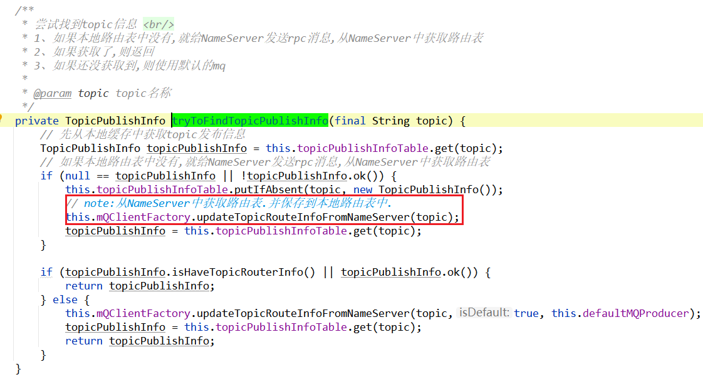

#### updateTopicRouteInfoFromNameServer

从方法名中：`从NameServer上查询并修改topic路由信息`。

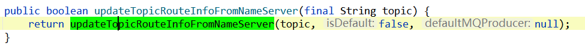

org.apache.rocketmq.client.impl.MQClientAPIImpl#getTopicRouteInfoFromNameServer

这个方法是使用`remotingClient`给NameServer发送请求的逻辑，并返回获取到`TopicRouteData`：

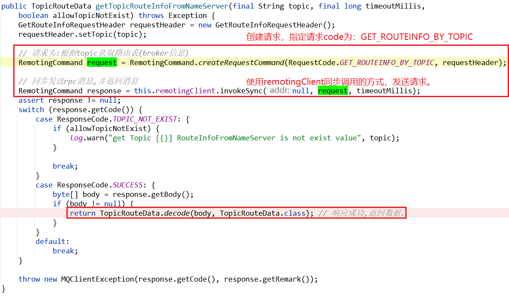

从NameServer获取到TopicRouteData之后，需要修改client客户端本地缓存的路由表 `MQClientInstance#topicRouteTable` ：

```java
/**
 * client端,本地路由表
 * 也可以理解为:路由表的本地缓存.
 * key: topic名称
 * value: TopicRouteData  topic的路由信息
 */
private final ConcurrentMap<String/* Topic */, TopicRouteData> topicRouteTable = new ConcurrentHashMap();
```

在修改本地缓存的路由表之前，还需要比较一下是否有变化：

```java
// 从本地路由表中获取topic数据,
TopicRouteData old = this.topicRouteTable.get(topic);
// 对比是否有变化
boolean changed = topicRouteDataIsChange(old, topicRouteData);
if (!changed) {
    // 如果没有变化,则判断是否需要修改 producerTable 和 consumerTable .
    changed = this.isNeedUpdateTopicRouteInfo(topic);
} else {
    log.info("the topic[{}] route info changed, old[{}] ,new[{}]", topic, old, topicRouteData);
}
```

如果有变化的话`change=true`，此时才会修改本地缓存：

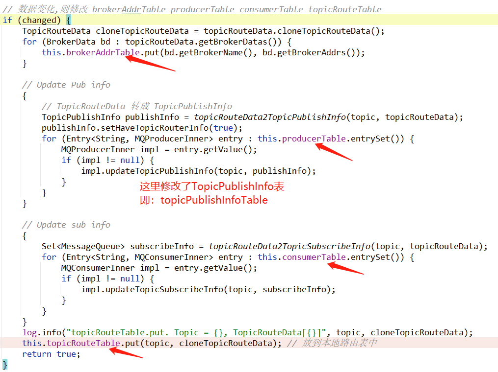

从NameServer获取并更新本地的`TopicRouteInfo`之后，会再次获取一次  `topicPublishInfo`：

```java
        // 先从本地缓存中获取topic发布信息
        TopicPublishInfo topicPublishInfo = this.topicPublishInfoTable.get(topic);
        // 如果本地路由表中没有,就给NameServer发送请求,从NameServer中获取并更新本地路由表，然后再次获取一次。
        if (null == topicPublishInfo || !topicPublishInfo.ok()) {
            // note:从NameServer中获取路由表.并保存到本地路由表中.
            this.mQClientFactory.updateTopicRouteInfoFromNameServer(topic);
            topicPublishInfo = this.topicPublishInfoTable.get(topic);
        }
```


### selectOneMessageQueue

org.apache.rocketmq.client.impl.producer.DefaultMQProducerImpl#selectOneMessageQueue

topic的路由表已经获取到了，无论是从本地缓存中获取的，还是从NameServer中获取的。

**由于一个topic对应多个queue——默认是一个topic会创建4个queue。所以在producer在发送消息时，需要选择出这条mq消息到底要发送到其中哪一个queue中的。**

关系图：

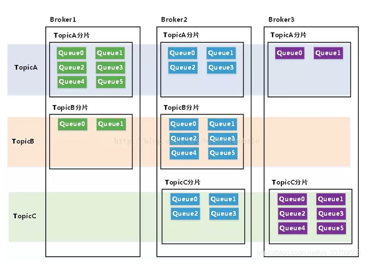

> 画外音：
>
> 对于这个结构图我最开始是有疑问的：为什么TopicA在每个机器上都有Queue0这个队里呢？不应该是`分片`的吗？
>
> 其实有这个误解是因为之前了解过一些Elasticsearch的原理：**[为了分散负载而对分片进行重新分配](https://www.elastic.co/guide/cn/elasticsearch/guide/current/_scale_horizontally.html)**
>
> 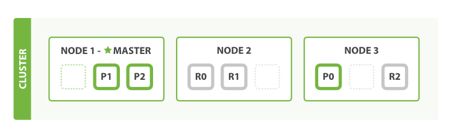
>
> 但是RocketMQ的原理和Elasticsearch这种`分片`处理方式不一样：
>
> **在broker中，相同的topic名，可以在不同的broker中创建，并且其队列数量可以不一样。**也就正如关系图中看到的这种结构。


而DefaultMQProducerImpl#selectOneMessageQueue 这个方法就是从topic中找出一个queue，然后让producer把消息发送到这个queue对应的broker里。【这相当于producer侧的负载均衡】

```java
public MessageQueue selectOneMessageQueue(final TopicPublishInfo tpInfo, final String lastBrokerName) {
    return this.mqFaultStrategy.selectOneMessageQueue(tpInfo, lastBrokerName);
}
```

`mqFaultStrategy` 英文直接翻译表示：mq故障策略。在RocketMQ这个框架中，其实表示的是：

> MQFaultStrategy : Producer的负载均衡
>
> Producer端在发送消息的时候，会先根据Topic找到指定的TopicPublishInfo，在获取了TopicPublishInfo路由信息后，RocketMQ的客户端在默认方式下 {@link #selectOneMessageQueue}方法会从TopicPublishInfo中的messageQueueList中选择一个队列（MessageQueue）进行发送消息。
> 这里有一个 {@link #sendLatencyFaultEnable}开关变量，如果开启，在随机递增取模的基础上，再过滤掉not available的Broker。
> 所谓的"latencyFaultTolerance"，是指对之前失败的，按一定的时间做退避。例如，如果上次请求的latency超过550Lms，就退避3000Lms；超过1000L，就退避60000L；
> 如果关闭，采用随机递增取模的方式选择一个队列（MessageQueue）来发送消息，latencyFaultTolerance机制是实现消息发送高可用的核心关键所在。

```java
    public MessageQueue selectOneMessageQueue(final TopicPublishInfo tpInfo, final String lastBrokerName) {
        // producer发送mq消息时,负载均衡策略是否启用
        if (!this.sendLatencyFaultEnable) {
            // sendLatencyFaultEnable = false,未启用情况,直接让 TopicPublishInfo 选择一个queue
            return tpInfo.selectOneMessageQueue(lastBrokerName);
        }

        try {
            int index = tpInfo.getSendWhichQueue().incrementAndGet();
            for (int i = 0; i < tpInfo.getMessageQueueList().size(); i++) {
                int pos = Math.abs(index++) % tpInfo.getMessageQueueList().size();
                if (pos < 0)
                    pos = 0;
                MessageQueue mq = tpInfo.getMessageQueueList().get(pos);
                if (latencyFaultTolerance.isAvailable(mq.getBrokerName()))
                    return mq;
            }

            final String notBestBroker = latencyFaultTolerance.pickOneAtLeast();
            int writeQueueNums = tpInfo.getQueueIdByBroker(notBestBroker);
            if (writeQueueNums > 0) {
                final MessageQueue mq = tpInfo.selectOneMessageQueue();
                if (notBestBroker != null) {
                    mq.setBrokerName(notBestBroker);
                    mq.setQueueId(tpInfo.getSendWhichQueue().incrementAndGet() % writeQueueNums);
                }
                return mq;
            } else {
                latencyFaultTolerance.remove(notBestBroker);
            }
        } catch (Exception e) {
            log.error("Error occurred when selecting message queue", e);
        }
        // 最终保底策略还是让 TopicPublishInfo 选择一个queue
        return tpInfo.selectOneMessageQueue();
    }
```


### sendKernelImpl

> 上面已经确定mq消息具体要发送到哪个queue了，也就知道了这个queue所在的broker机器ip了。
>
> 此时就可以给这个broker发送request了。

org.apache.rocketmq.client.impl.producer.DefaultMQProducerImpl#sendKernelImpl

- 先根据brokerName获取brokerAddress，也就是broker的ip

  ```java
  String brokerAddr = this.mQClientFactory.findBrokerAddressInPublish(mq.getBrokerName());
  ```

- 消息体超过一定大小之后,尝试压缩.

  - 批量消息目前不支持压缩

  - 默认压缩大于 4k 的消息体。

  - ```java
    boolean msgBodyCompressed = false;
    // 消息体超过一定大小之后,尝试压缩.
    if (this.tryToCompressMessage(msg)) {
        sysFlag |= MessageSysFlag.COMPRESSED_FLAG;
        msgBodyCompressed = true;
    }
    ```

- 如果有发送消息的钩子`SendMessageHook`,则去调用`sendMessageBefore()` 方法

- 构建请求 ，`SendMessageRequestHeader`

  ```java
  SendMessageRequestHeader requestHeader = new SendMessageRequestHeader();
  requestHeader.setProducerGroup(this.defaultMQProducer.getProducerGroup());
  requestHeader.setTopic(msg.getTopic());
  requestHeader.setDefaultTopic(this.defaultMQProducer.getCreateTopicKey());
  // 默认每个主题要创建的队列数。默认为4
  requestHeader.setDefaultTopicQueueNums(this.defaultMQProducer.getDefaultTopicQueueNums());
  // 队列id
  requestHeader.setQueueId(mq.getQueueId());
  requestHeader.setSysFlag(sysFlag);
  // 消息出生时间
  requestHeader.setBornTimestamp(System.currentTimeMillis());
  requestHeader.setFlag(msg.getFlag());
  requestHeader.setProperties(MessageDecoder.messageProperties2String(msg.getProperties()));
  requestHeader.setReconsumeTimes(0);
  requestHeader.setUnitMode(this.isUnitMode());
  // 是否为批量消息
  requestHeader.setBatch(msg instanceof MessageBatch);
  ```

- 根据通信类型 `CommunicationMode` 去发送消息 

  ```java
  // 简化很多判断逻辑的伪代码。
  switch (communicationMode) {
      case ASYNC: // 异步发送消息
          sendResult = this.mQClientFactory.getMQClientAPIImpl().sendMessage(brokerAddr, mq.getBrokerName(), tmpMessage, requestHeader, timeout - costTimeAsync, communicationMode, sendCallback, topicPublishInfo, this.mQClientFactory, this.defaultMQProducer.getRetryTimesWhenSendAsyncFailed(), context, this);
          break;
      case ONEWAY:
      case SYNC: // 同步发送消息
          sendResult = this.mQClientFactory.getMQClientAPIImpl().sendMessage(brokerAddr, mq.getBrokerName(), msg, requestHeader, timeout - costTimeSync, communicationMode, context, this);
          break;
      default:
          assert false;
          break;
  }
  ```

- 如果有发送消息的钩子`SendMessageHook`,则去调用 `sendMessageAfter()`方法


### sendMessage

org.apache.rocketmq.client.impl.MQClientAPIImpl#sendMessage

此方法是**真正的构建`RemotingCommand`请求，然后根据通信方式（同步或异步）去发送消息**

- 构建`RemotingCommand` 请求：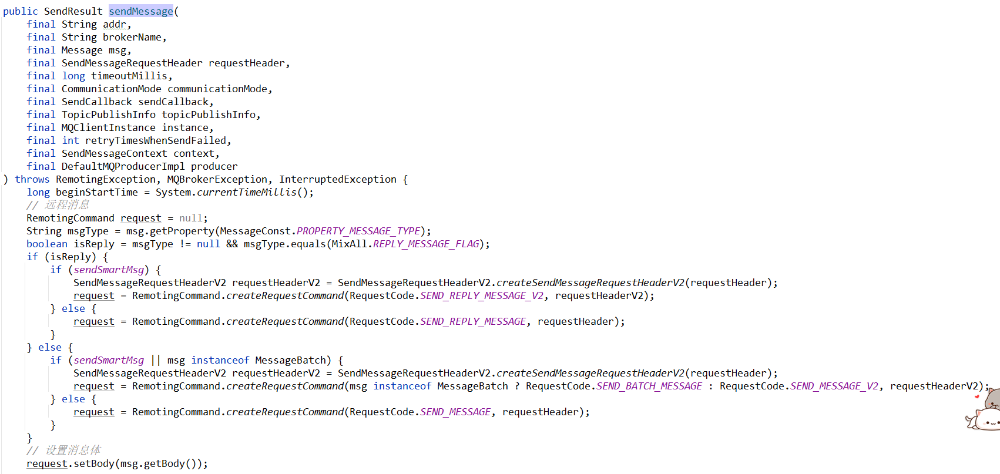


- 根据通讯方式,发送消息：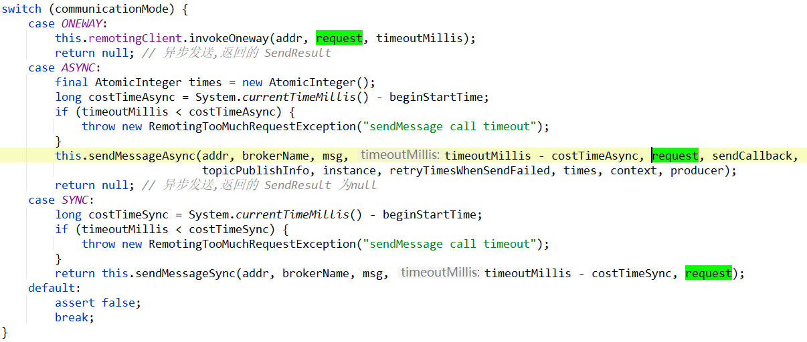


### sendMessageSync同步发送消息

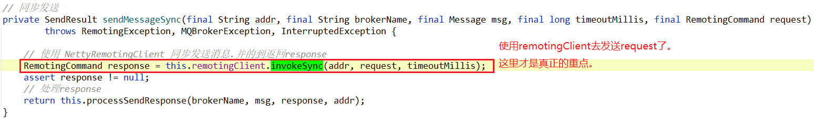

> 这里网络侧面发送数据是用 `RemotingClient` ，接下来就来详细讲解一下：
>
> - 同步发送请求
>
> - 异步发送请求

# RemotingClient 远程客户端

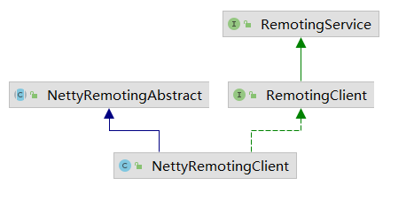

## invokeSync同步发送请求

> 详细流程图：
>
> https://docs.qq.com/flowchart/DQU14SFZDemFTcXNC

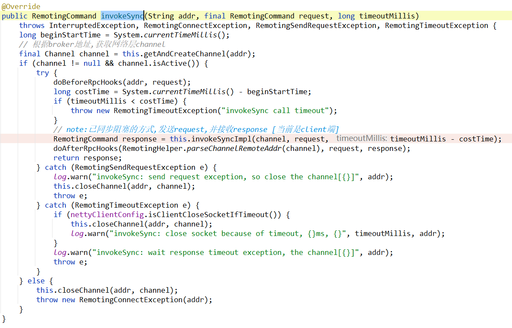

## invokeSyncImpl 同步调用实现

先获取请求id，然后实例化一个 ，并放入 `responseTable`中：

```java
// requestId：这个opaque变了就代表请求id。
int opaque = request.getOpaque();
ResponseFuture responseFuture = new ResponseFuture(channel, opaque, timeoutMillis, null, null);
this.responseTable.put(opaque, responseFuture);
```

通过与broker之间的channel，获取远程socket。

```java
final SocketAddress addr = channel.remoteAddress();
```

然后通过网络socket，把请求数据写出去，相当于把请求数据发送给broker：

```java
// 发送请求,并设置监听.
channel.writeAndFlush(request).addListener(new ChannelFutureListener() {
    @Override
    public void operationComplete(ChannelFuture f) throws Exception {
        // 请求发送完毕,如果成功了,就设置请求发送ok.否则就设置请求发送不ok
        if (f.isSuccess()) {
            responseFuture.setSendRequestOK(true);
        } else {
            responseFuture.setSendRequestOK(false);
            responseTable.remove(opaque); // 移除此请求
            responseFuture.setCause(f.cause()); // 设置不ok的原因
            responseFuture.putResponse(null); // 设置返回的响应体为null
            log.warn("send a request command to channel <" + addr + "> failed.");
        }
    }
});
```

上面，发送完毕后，会添加一个监听器：监听`操作完毕事件`。

request请求数据已经发送给了broker，在broker端需要接收并处理消息，然后给client端返回response。与此同时的client端，就使用`waitResponse()`方法，等着响应结果：

```java
// [等待响应response]
// note:这里就是异步转同步的一般实现方案.就是直接在发送完请求之后,调用获取结果的接口.
//  这样的话,就会阻塞到这里,知道请求返回.其实也就是 responseFuture.putResponse() 方法被调用时,才会解除阻塞.
RemotingCommand responseCommand = responseFuture.waitResponse(timeoutMillis);
// 如果响应数据为空,
if (null == responseCommand) {
    // 如果请求发送成功——说明是远程响应超时
    if (responseFuture.isSendRequestOK()) {
        throw new RemotingTimeoutException(RemotingHelper.parseSocketAddressAddr(addr), timeoutMillis, responseFuture.getCause());
    } else {
        // 请求没有发送成功——抛出异常:请求发送异常
        throw new RemotingSendRequestException(RemotingHelper.parseSocketAddressAddr(addr), responseFuture.getCause());
    }
}

return responseCommand;
```


## invokeAsync异步发送请求

```java
// 以下为简化之后的伪代码：
public void invokeAsync(String addr, RemotingCommand request, 
                        long timeoutMillis, InvokeCallback invokeCallback) {
    
    final Channel channel = this.getAndCreateChannel(addr);
    if (channel != null && channel.isActive()) {
            doBeforeRpcHooks(addr, request);
            this.invokeAsyncImpl(channel, request, timeoutMillis - costTime, invokeCallback);
    }
}
```


## invokeAsyncImpl异步调用实现

```java
// 以下为简化之后的伪代码：
public void invokeAsyncImpl(final Channel channel, final RemotingCommand request,
                            final long timeoutMillis, final InvokeCallback invokeCallback) {
    // 当前请求的请求id
    int opaque = request.getOpaque();
    // 响应Future.
    ResponseFuture responseFuture = new ResponseFuture(channel, opaque, timeoutMillis, invokeCallback);
    // 根据请求id保存到map中.
    this.responseTable.put(opaque, responseFuture);
    
    // 使用netty,通过tpc发送请求.并添加tpc发送状态的监听器
    channel.writeAndFlush(request).addListener((ChannelFutureListener) f -> {
        // 请求tcp消息发送成功:
        if (f.isSuccess()) {
            responseFuture.setSendRequestOK(true);// 标记发送请求成功
        } else {
            requestFail(opaque); // 在发送request阶段失败.
        }
    });
}
```

当request发送失败的处理逻辑：

```java
private void requestFail(final int opaque) {
    ResponseFuture responseFuture = responseTable.remove(opaque);
    if (responseFuture != null) {
        // 设置发送请求不ok.
        responseFuture.setSendRequestOK(false);
        // 设置响应消息体为null
        responseFuture.putResponse(null);
        try {
            executeInvokeCallback(responseFuture); // 因为是异步发送请求，所以失败的时候，直接调用回调函数。
        } finally {
            // 释放资源.具体就是:释放信号量.  (这个信号量感觉就是个限流器的作用)
            responseFuture.release();
        }
    }
}
```


# 问题

## server端接收到`request`数据包，是如何处理的？

详见：[收到netty远程消息之后处理流程.md](收到netty远程消息之后处理流程.md)


## server端处理完`request`之后，如何给client返回一个响应`response`？

伪代码：

```java
// 设置请求id
response.setOpaque(opaque);
// 标记当前发送的数据包是response类型的
response.markResponseType();
// 使用netty网络通道,把response消息发送给对方.
ctx.writeAndFlush(response);
```

详见：[收到netty远程消息之后处理流程.md](收到netty远程消息之后处理流程.md)


## client端收到表示`response`的数据包，又会如何处理？

> 如下图，client端才会收到response类型的数据包。
>
> 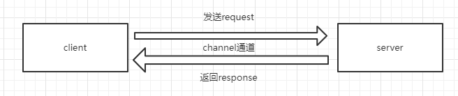
>
> 当client端收到response之后，需要根据`通信方式`做不同的处理：
>
> - 如果request是同步发送的，则需要解除阻塞。
> - 如果request是异步发送的，则需要调用回调方法。

详见： [收到netty远程消息之后处理流程.md](收到netty远程消息之后处理流程.md#处理响应命令) 


