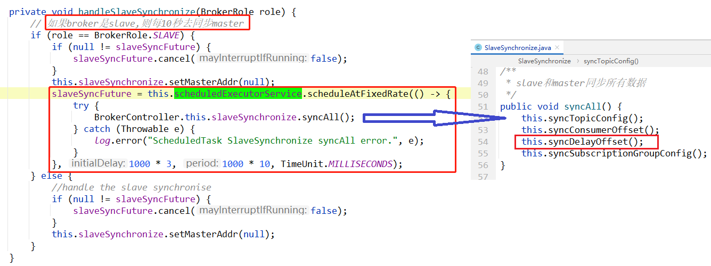

# 简述

获取所有延迟队列的消费偏移量*（逻辑偏移量，其实是consumeQueue文件的下标，后面会详细讲解）*

client：  slave的broker

server：master 的broker 

**描述：**

如果broker是slave，则slave给master发送 `GET_ALL_DELAY_OFFSET`消息获取延迟偏移量delayOffset (字符串类型)

然后把 delayOffset 保存到 `{rootDia}/config/delayOffset.json` 文件中。

**定时任务**

**此定时任务在以下场景会注册：**

[client何时发送请求](#client%E4%BD%95%E6%97%B6%E5%8F%91%E9%80%81%E8%AF%B7%E6%B1%82)

**延迟偏移量 delayOffset 的作用：**

[点击跳转](#%E5%BB%B6%E8%BF%9F%E5%81%8F%E7%A7%BB%E9%87%8Fdelayoffset%E7%9A%84%E4%BD%9C%E7%94%A8)

# client

> 如果broker是slave，则slave给master发送 消息获取延迟偏移量delayOffset (字符串类型)
>
> 然后把 delayOffset 保存到 `{rootDia}/config/delayOffset.json` 文件中。
>
> 根据上面的描述，分步骤来看：

**发送请求**

org.apache.rocketmq.broker.out.BrokerOuterAPI#getAllDelayOffset

这是在`BrokerOuterAPI`，这里表示broker作为client时，向外发送的请求。

发送请求很简单：只是构造一个request，然后同步的方式发送出去。

**把 delayOffset 保存到 `{rootDia}/config/delayOffset.json` 文件**

**只有slave才会给master发送消息**：

那么问题来了，是在哪里判断的broker的角色是slave的呢？

也就是在 ：

# client何时发送请求

> 上面我们知道了这个请求是slave发送给master的，也知道了slave收到响应之后处理逻辑。
>
> 但是slave在什么时候/什么场景才会给master发送这个请求呢？

是在定时任务中，每隔10秒slave和master之间同步一次数据：

**这个定时任务是在broker是slave的情况下，才会注册、才会执行。**

**下面两种情况，会注册定时任务：**

- broker启动时，并且broker是 slave
- 当broker的角色由master变成slave时

# server

server端，也就是master的broker，收到消息之后，是如何处理的：

上图中**master broker接收到请求之后，其实是把master节点上的 `ScheduleMessageService` encode转成String之后，返回给slave。**

那么，`ScheduleMessageService` 是什么呢？具体作用是？ 详见 [ScheduleMessageService](#ScheduleMessageService)

# 延迟偏移量delayOffset的作用

> 既然slave从master读取 `delayOffset`，并保存到 `{rootDia}/config/delayOffset.json` 文件中，
>
> 那么肯定一会要读取这个文件。

`{rootDia}/config/delayOffset.json` 文件是给 `ScheduleMessageService` 来做持久化使用的。详见：[ScheduleMessageService](#ScheduleMessageService)

# ScheduleMessageService

这个类主要负责RocketMQ延迟队列的调度，其中有个timer定时任务，对每个等级level的延迟，都注册对应的任务——`DeliverDelayedMessageTimerTask`。

详见：[配置管理ConfigManager——ScheduleMessageService.md](../../配置管理ConfigManager/ScheduleMessageService.md)

