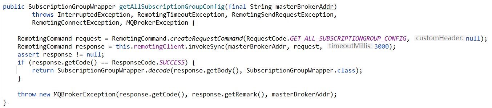
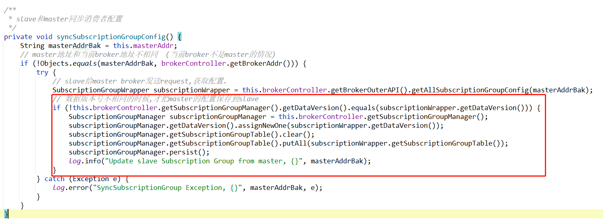
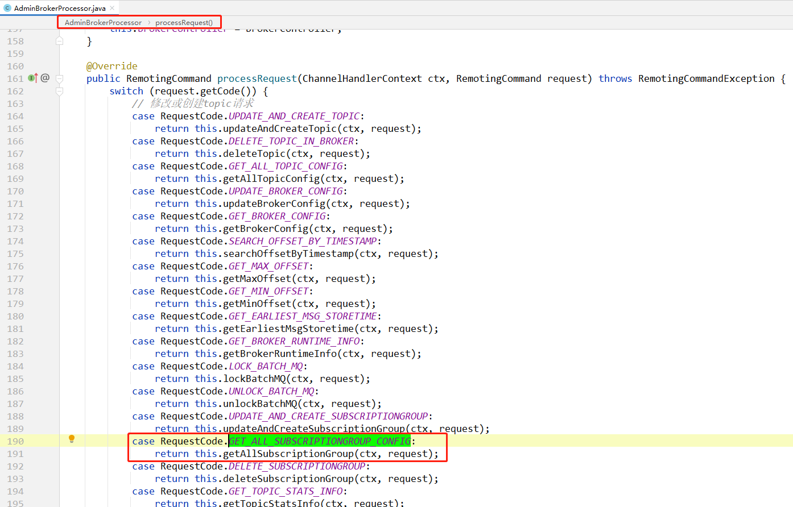
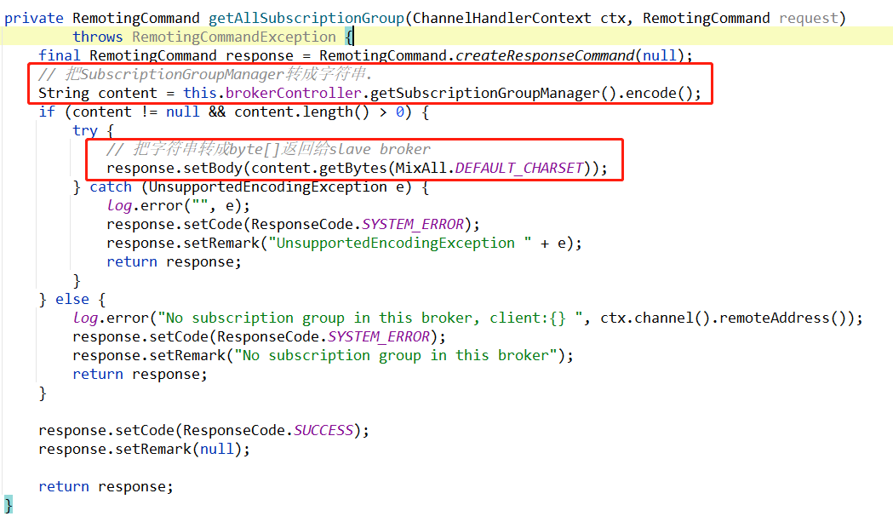

# 简述

获取所有消费者组配置

client：  slave的broker

server：master 的broker 

**描述：**

如果broker是slave，则slave给master发送 `GET_ALL_SUBSCRIPTIONGROUP_CONFIG` 消息获取`消费者组配置`

然后把对比master和slave的版本号是否相同，如果不同，则用master的配置覆盖slave的配置。

**定时任务**

[broker定时任务](../../Broker/Broker中的定时任务.md#%E5%A6%82%E6%9E%9Cbroker%E6%98%AFslave%EF%BC%8C%E5%88%99%E6%AF%8F%E9%9A%9410%E7%A7%92%E4%BB%8Emaster%E5%90%8C%E6%AD%A5%E6%95%B0%E6%8D%AE)

# client

**发送请求**

在`BrokerOuterAPI`，这里表示broker作为client时，向外发送的请求。

发送请求很简单：只是构造一个request，然后同步的方式发送出去。

**client收到master broker的配置之后：**

# client何时发送请求

> 上面我们知道了这个请求是slave发送给master的，也知道了slave收到响应之后处理逻辑。
>
> 但是slave在什么时候/什么场景才会给master发送这个请求呢？

是在定时任务中，每隔10秒slave和master之间同步一次数据：

[broker定时任务](../../Broker/Broker中的定时任务.md#%E5%A6%82%E6%9E%9Cbroker%E6%98%AFslave%EF%BC%8C%E5%88%99%E6%AF%8F%E9%9A%9410%E7%A7%92%E4%BB%8Emaster%E5%90%8C%E6%AD%A5%E6%95%B0%E6%8D%AE)

# server

server端，也就是master的broker，收到消息之后，是如何处理的：

