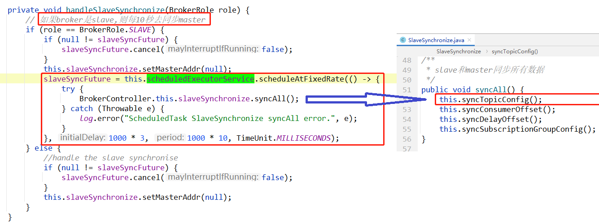
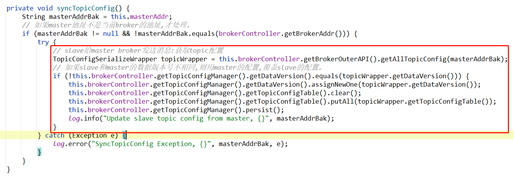
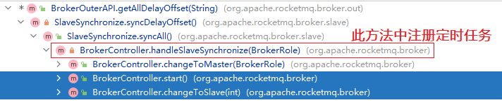

# 简述

slave broker使用定时任务，每隔10秒发送请求从master broker拉取topic配置信息，保存到slave broker中，并持久化。

client：slave broker

server：master broker


**定时任务**




**此定时任务在以下场景会注册：**

[client何时发送请求](#client%E4%BD%95%E6%97%B6%E5%8F%91%E9%80%81%E8%AF%B7%E6%B1%82)


# client

client是slave broker，也就是从master broker同步数据时，会发送这个请求：


# 请求body

client构建请求，并使用`remotingClient`同步发送请求，如果response成功，则会decode到：`TopicConfigSerializeWrapper` 序列化包装类中，从这个包装类中，我们可以知道**`GET_ALL_CONSUMER_OFFSET`这个请求类型，到底传输了哪些数据**：

```java
package org.apache.rocketmq.common.protocol.body;

public class TopicConfigSerializeWrapper extends RemotingSerializable {
    
    private ConcurrentMap<String, TopicConfig> topicConfigTable = new ConcurrentHashMap<>();
    
    private DataVersion dataVersion = new DataVersion();

    // 忽略 getter  setter
}
```

主要传输了个数据：

- topicConfigTable        topic配置表
- dataVersion                 数据版本号


# response之后，client处理逻辑

slave broker使用同步阻塞的方式，发送请求，当slave broker收到master broker的响应response之后，如果响应成功并且slave broker 和master broker的数据版本号不一样，则：slave会用master的配置覆盖自己的配置：




# client何时发送请求

> 上面我们知道了这个请求是slave发送给master的，也知道了slave收到响应之后处理逻辑。
>
> 但是slave在什么时候/什么场景才会给master发送这个请求呢？

是在定时任务中，每隔10秒slave和master之间同步一次数据：


**这个定时任务是在broker是slave的情况下，才会注册、才会执行。**

**下面两种情况，会注册定时任务：**

- broker启动时，并且broker是 slave
- 当broker的角色由master变成slave时




# server

server端是master broker，使用请求处理器来处理：


那么问题来了：

- TopicConfigManager 是什么？

- 又是如何把 `topicConfigTable` 和`dataVersion`转成字符串的？

# TopicConfigManager 

详见：[ConfigManager——TopicConfigManager.md](../../配置管理ConfigManager/TopicConfigManager.md)

