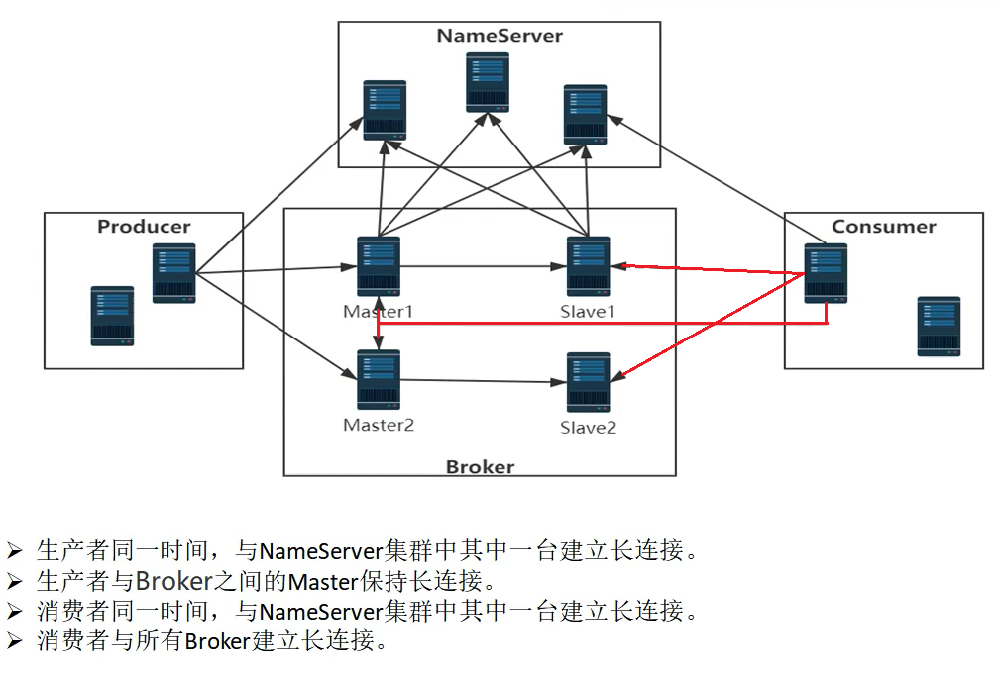
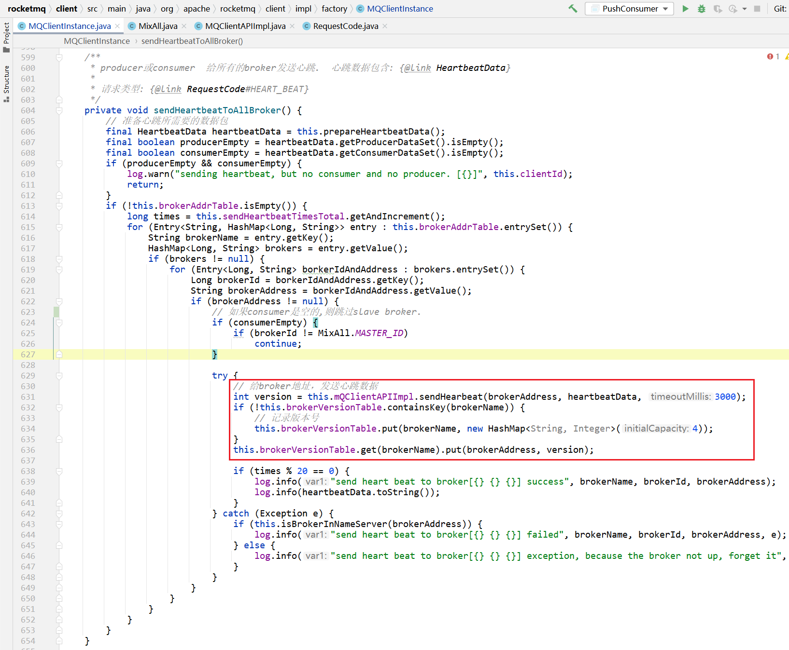
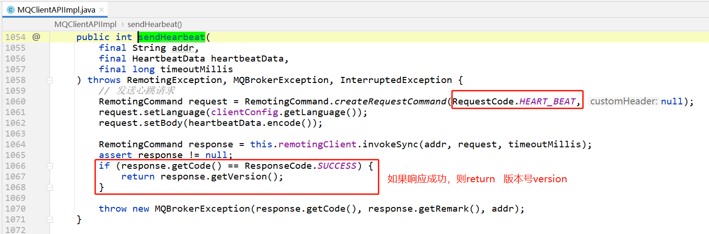
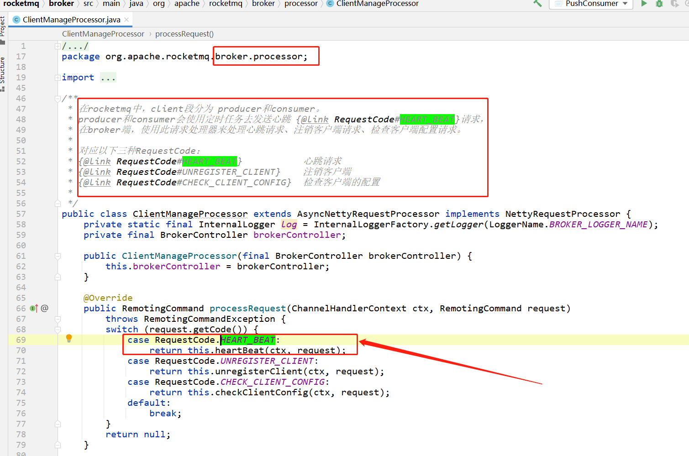
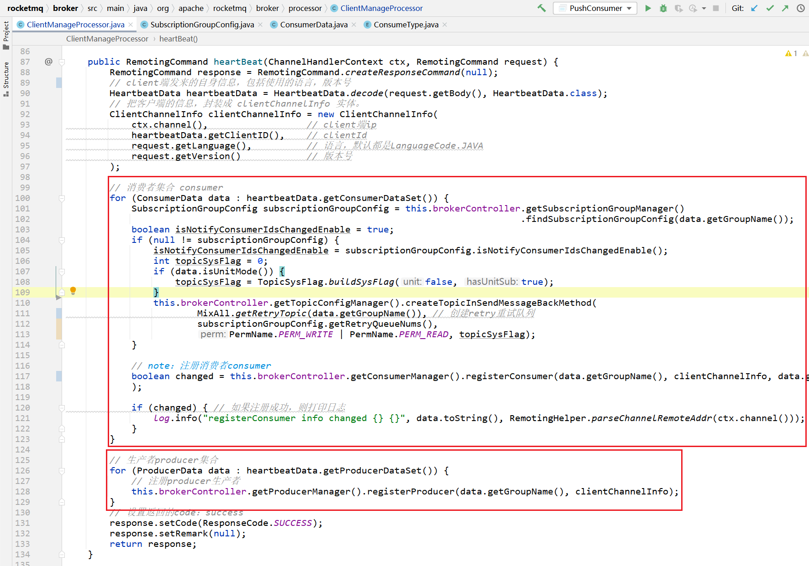
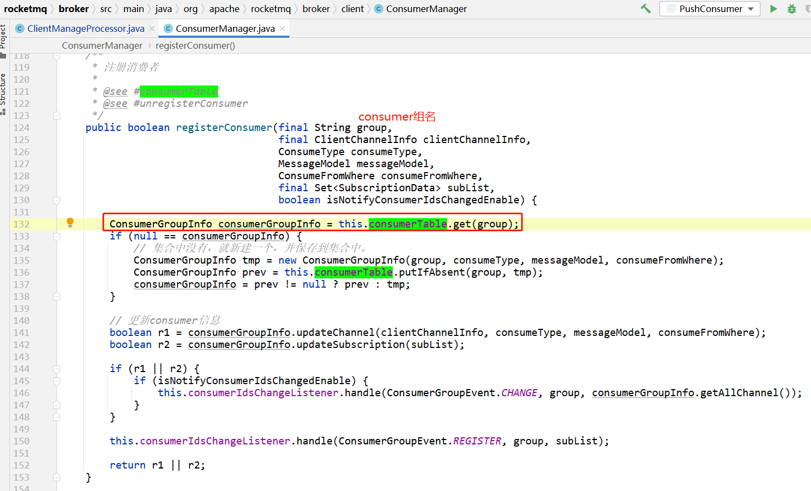
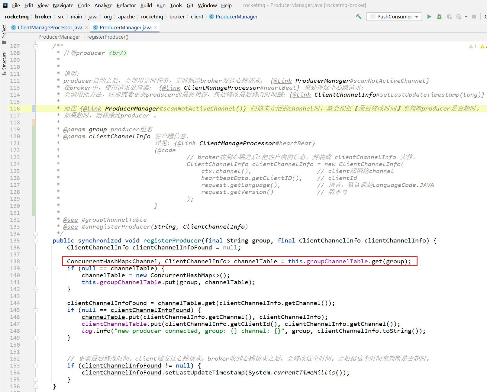
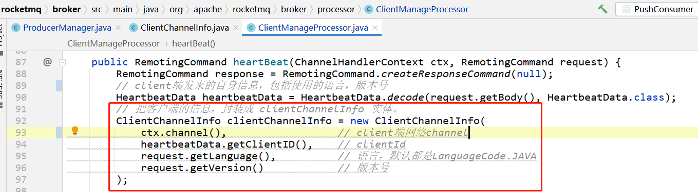

# 请求code

```java
/**
 * client给broker发送心跳请求类型
 * client包含：producer和consumer
 * 
 * 数据包: HeartbeatData
 * 请求处理器: ClientManageProcessor
 */
public static final int HEART_BEAT = 34;
```


# 示意图




# 心跳




## 发送心跳请求




# broker处理心跳请求






broker收到client的心跳之后：

- 如果是consumer：`brokerController.getConsumerManager().registerConsumer()`
- 如果是producer：  `brokerController.getProducerManager().registerProducer(data.getGroupName(), clientChannelInfo);`


## 注册consumer

注册消费者时，其实是在broker内部，使用 `org.apache.rocketmq.broker.client.ConsumerManager` 维护 `consumerTable` 

```java
/**
 * 集合
 * 用于记录consumer信息
 *
 * key：消费者组名
 * value：{@link ConsumerGroupInfo} 每个消费者组对应一个实例。
 *
 * @see #registerConsumer    注册consumer
 * @see #unregisterConsumer  注销consumer
 */
private final ConcurrentMap<String/* Group */, ConsumerGroupInfo> consumerTable = new ConcurrentHashMap<>(1024);
```




## 注册producer

注册的producer，其实是在broker内部，使用 `org.apache.rocketmq.broker.client.ProducerManager` 维护 `groupChannelTable`

```java
/**
 * 每个producer都可以设置groupName {@link DefaultMQProducer#DefaultMQProducer(java.lang.String)}
 *
 * 这里根据producer的groupName来分组。
 * Channel 客户端的网络channel。（producer作为client，broker作为server端。）
 * ClientChannelInfo   客户端相关的信息。 （详见 ClientChannelInfo 小节对应的图片）
 */
private final ConcurrentHashMap<String /* group name */, ConcurrentHashMap<Channel, ClientChannelInfo>> groupChannelTable = 
              new ConcurrentHashMap<>();
```




### ClientChannelInfo




# 更多

详见： [客户端管理器.md](..\..\Broker\客户端管理器.md) 