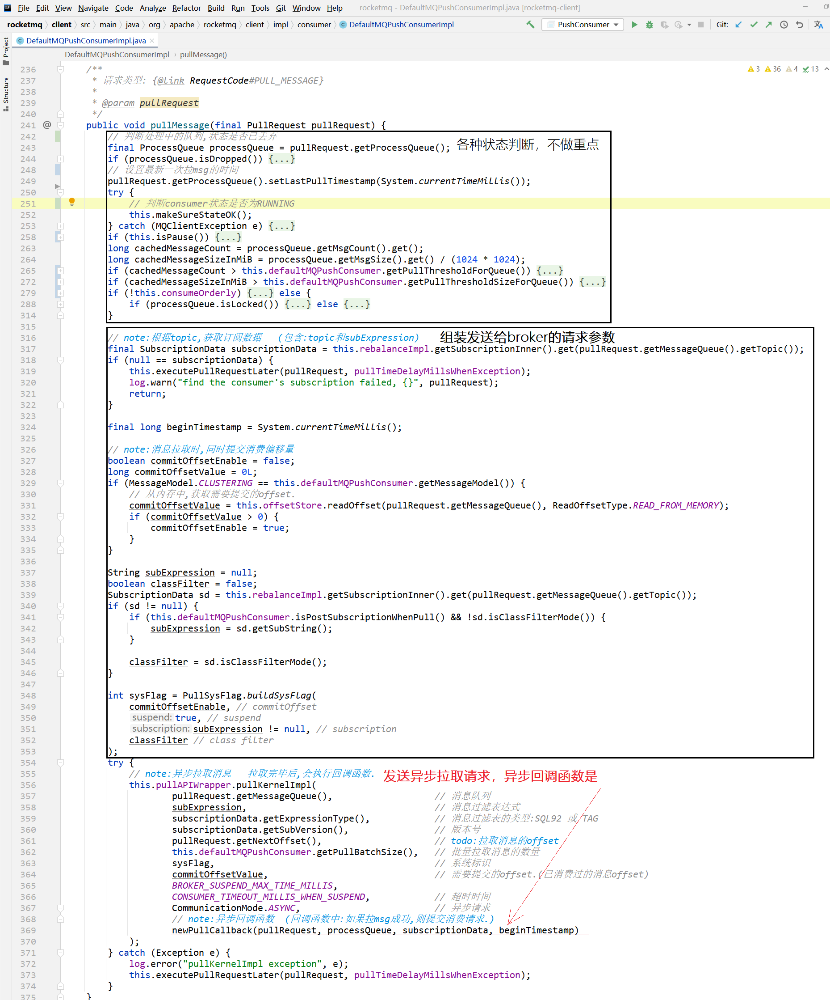
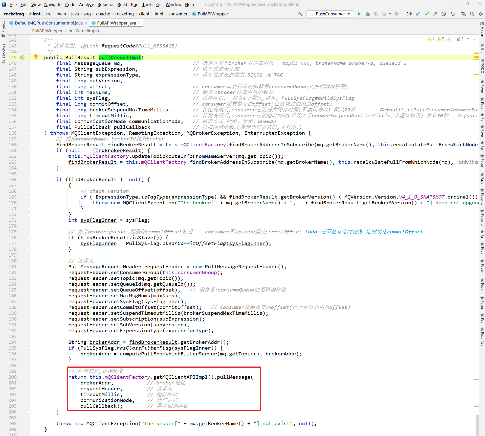
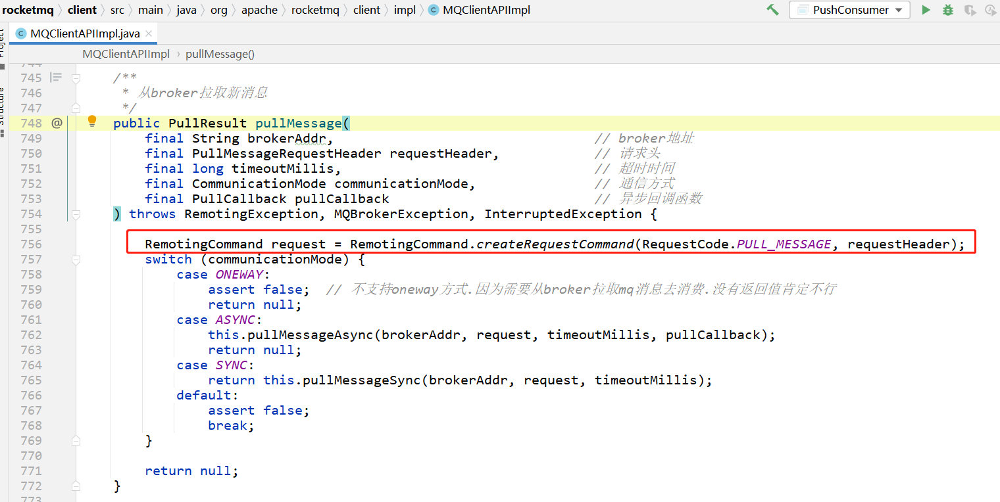
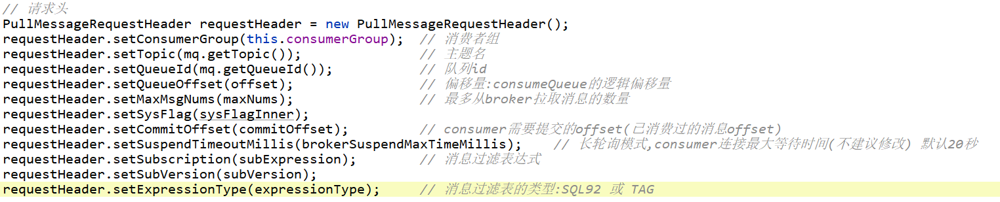
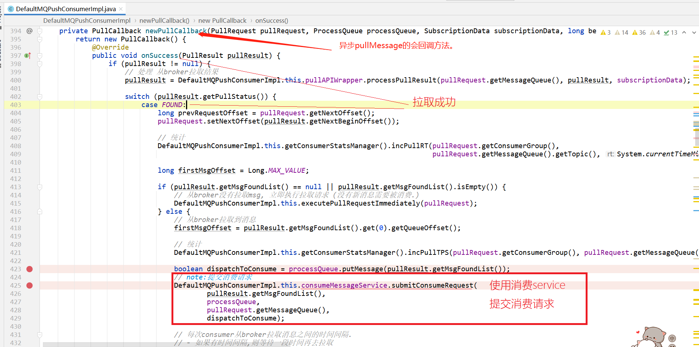
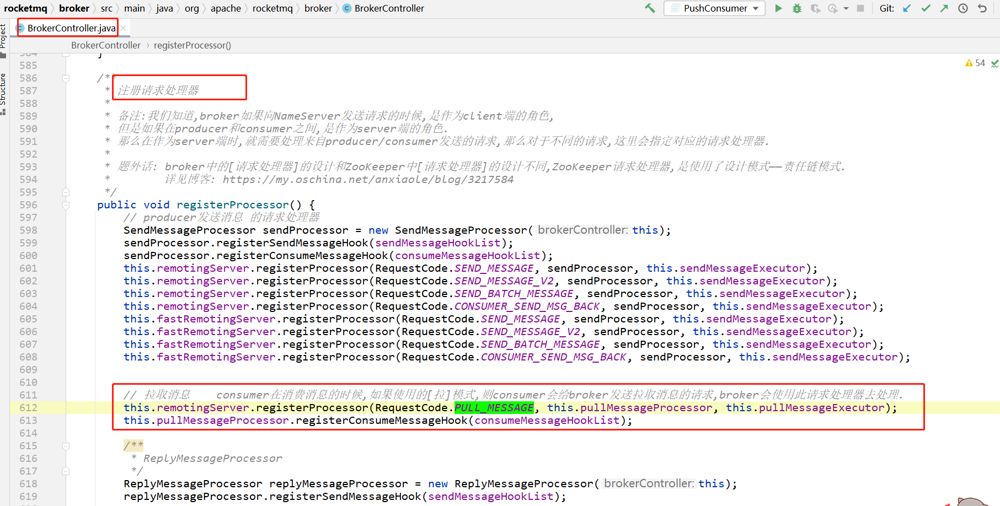
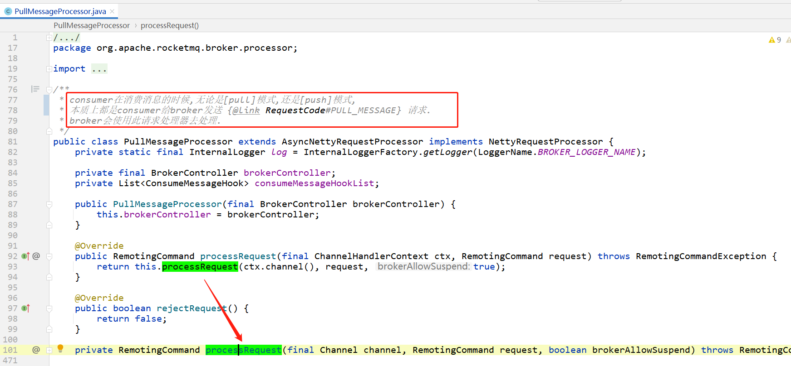
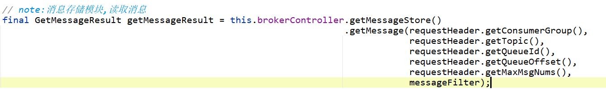
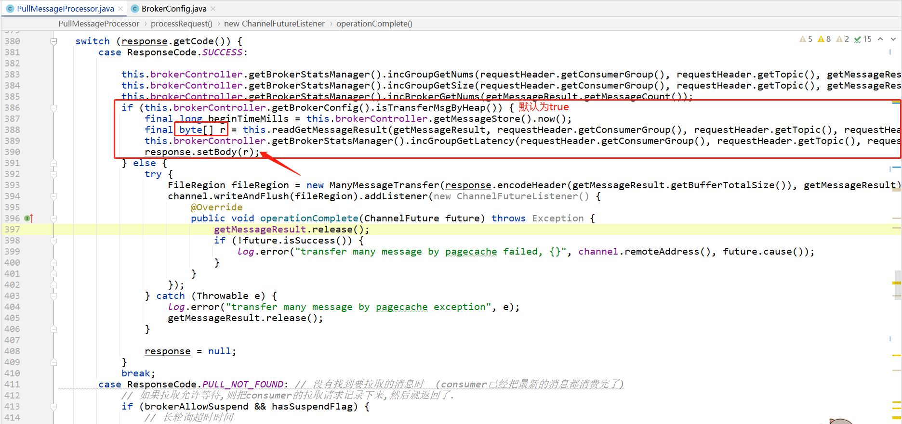

# 简述


consumer给broker发消息，拉取指定queue中的消息。

client：consumer

server：broker

请求code

```java
// org.apache.rocketmq.common.protocol.RequestCode#PULL_MESSAGE
/**
 * client给broker发送RPC请求,从broker拉取mq消息.
 */
public static final int PULL_MESSAGE = 11;
```


# client

client是consumer，当consumer从broker拉取消息并消费时，会先发送这个请求，如果拉取消息成功，则会进行消费：*[传送门去gitee查看源码](https://gitee.com/anxiaole/rocketmq/blob/master/client/src/main/java/org/apache/rocketmq/client/impl/consumer/DefaultMQPushConsumerImpl.java#L241)*



[**pullKernelImpl**](https://gitee.com/anxiaole/rocketmq/blob/master/client/src/main/java/org/apache/rocketmq/client/impl/consumer/PullAPIWrapper.java#L145)



[构造请求request，并发送：](https://gitee.com/anxiaole/rocketmq/blob/master/client/src/main/java/org/apache/rocketmq/client/impl/MQClientAPIImpl.java#L746)




## 请求参数

org.apache.rocketmq.common.protocol.header.PullMessageRequestHeader




## response之后，client处理逻辑

如果从broker成功拉取到新消息，则consumer会提交消费请求：




## client何时发送请求

详见：[消费者拉取消息服务.md](../../Consumer/消费者拉取消息服务.md)


# server

broker收到这个请求，并且使用 `org.apache.rocketmq.broker.processor.PullMessageProcessor` 来处理请求。

[broker启动的时候，注册请求处理器：](https://gitee.com/anxiaole/rocketmq/blob/master/broker/src/main/java/org/apache/rocketmq/broker/BrokerController.java#L611)



## [PullMessageProcessor](https://gitee.com/anxiaole/rocketmq/blob/master/broker/src/main/java/org/apache/rocketmq/broker/processor/PullMessageProcessor.java#L80)




## [processRequest()](https://gitee.com/anxiaole/rocketmq/blob/master/broker/src/main/java/org/apache/rocketmq/broker/processor/PullMessageProcessor.java#L100)

处理请求分为如下步骤：

[1、初始化response，并把请求id设置到response中](https://gitee.com/anxiaole/rocketmq/blob/master/broker/src/main/java/org/apache/rocketmq/broker/processor/PullMessageProcessor.java#L106)

2、校验请求参数、校验broker状态等（各种校验）

[3、从broker消息存储中，读取消息  （使用了消息过滤器 `messageFilter`）](https://gitee.com/anxiaole/rocketmq/blob/master/broker/src/main/java/org/apache/rocketmq/broker/processor/PullMessageProcessor.java#L248)

[4、根据 `getMessageResult` 设置response.code   （也是一顿判断，然后根据不同的情况，设置响应code）](https://gitee.com/anxiaole/rocketmq/blob/master/broker/src/main/java/org/apache/rocketmq/broker/processor/PullMessageProcessor.java#L296)

5、[如果responseCode == ResponseCode.SUCCESS，则使用 `Channel channel` 把消息内容通过网络io发送给consumer：](https://gitee.com/anxiaole/rocketmq/blob/master/broker/src/main/java/org/apache/rocketmq/broker/processor/PullMessageProcessor.java#L380)



[6、如果responseCode不是成功，则处理其他状态的情况，并给consumer返回对应的状态。](https://gitee.com/anxiaole/rocketmq/blob/master/broker/src/main/java/org/apache/rocketmq/broker/processor/PullMessageProcessor.java#L411)

