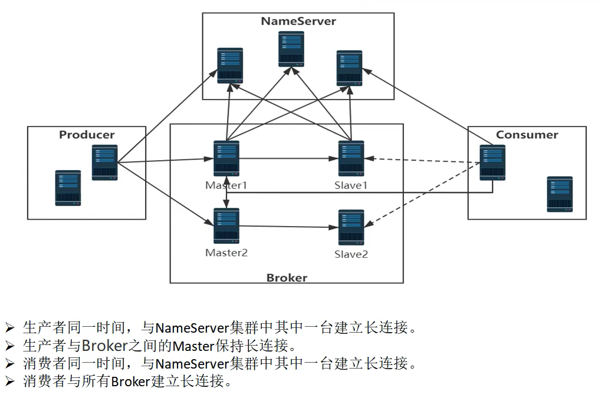

# 简述

RocketMQ有很多的角色：

- NameServer
- Broker
- Producer
- Consumer

这些角色之间会有很多的网络请求，底层是使用的netty作为网络框架传输的数据。

在各个角色之间建立的长连接，都会发送各种请求。

# 请求类型

在RocketMQ中，请求类型都是在 `org.apache.rocketmq.common.protocol.RequestCode` 中维护的。

本目录下的所有文章，讲解各种请求类型，包括：

- 请求的client和server分别是什么？（producer、consumer、broker、NameServer）
- client端如何发送请求
- server端如何处理请求          *请求处理器这个概念详见：[NettyRequestProcessor.md](../NettyRequestProcessor.md)*

