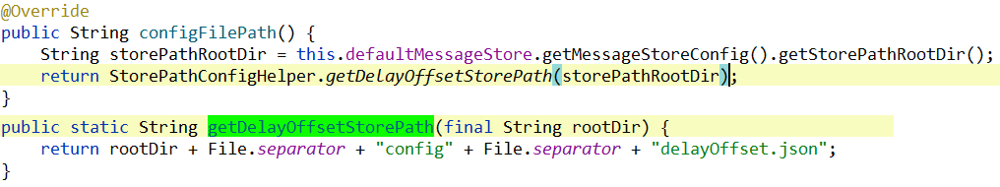
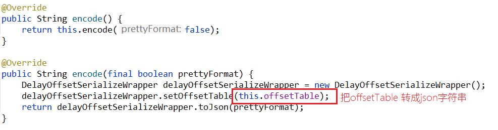
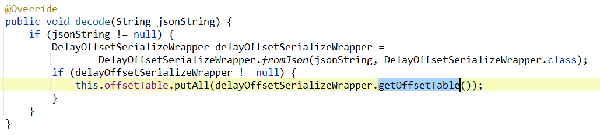
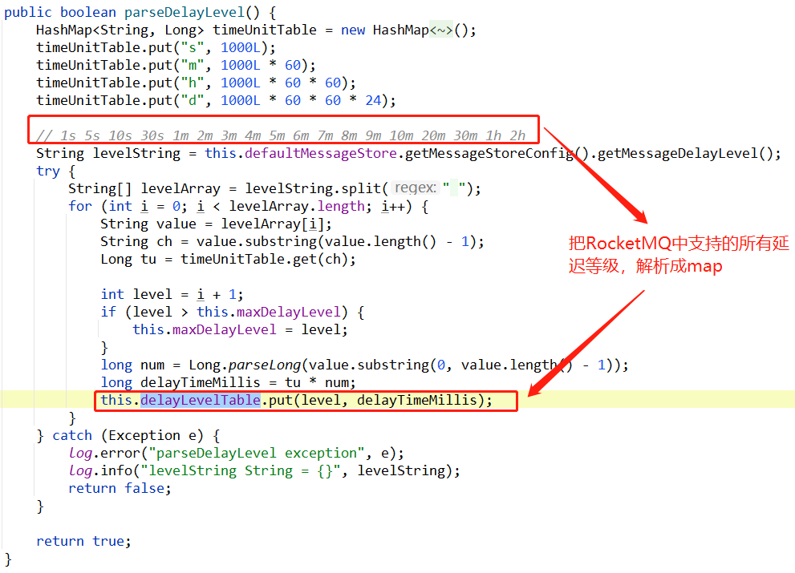
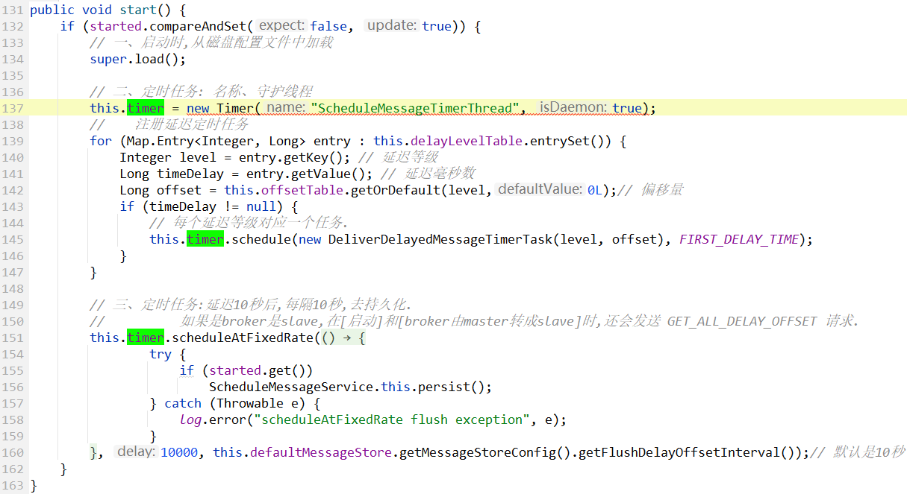
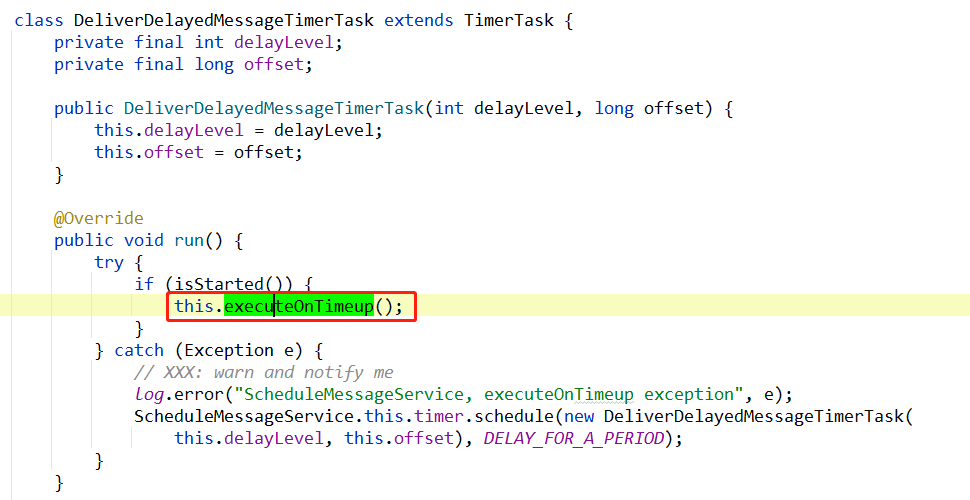

# 简述

在RocketMQ中有延迟队列，延迟队列的消费，就是由`ScheduleMessageService`来负责的。

这个延迟消息服务ScheduleMessageService中有个定时任务，对有不同等级level的延迟队列，都注册一个延迟task——`DeliverDelayedMessageTimerTask`。

另外，如果broker是slave，则slave会给master发送 `GET_ALL_DELAY_OFFSET` 请求，去获取master的延迟队列处理进度，然后持久化到slave机器的磁盘文件中。这个详见：[请求类型及处理/GET_ALL_DELAY_OFFSET.md](../网络组件Remoting/请求类型及处理/GET_ALL_DELAY_OFFSET.md)


# 类结构

```java
package org.apache.rocketmq.store.schedule;

public class ScheduleMessageService extends ConfigManager {
}
```

在 [readme.md](readme.md) 中也说了，`ConfigManager` 是个抽象类，其中有4个抽象方法需要被子类实现：

## configFilePath()

```java
指定持久化到磁盘文件的绝对路径
public abstract String configFilePath();
```



格式：{rootDir}/config/delayOffset.json


## encode();

```java
把内存中的配置，转成字符串
public abstract String encode();
public abstract String encode(final boolean prettyFormat);
```



encode 方法，就是把 `offsetTable` 表转成json字符串。

然后在`ConfigManager`的持久化方法中，就会把这个字符串保存到文件中。


## decode();

```java
把磁盘文件读取出来的字符串，转成内存中的java对象。
public abstract void decode(final String jsonString);
```




把`字符串`反序列化成`offsetTable`。然后再putAll到内存中。

> 这个  `反序列化` ，其实就是把jsonString字符串，用 fastjson 转成javaBean:
>
> 


> 画外音：
>
> 到这里已经知道了在持久化和从磁盘文件中读取配置时的流程。
>
> 接下来就看看这个类是如何来处理延迟队列的。


## load()

load() 方法不是抽象方法，但是 `ScheduleMessageService` 也重写了：

```java
@Override
public boolean load() {
    return super.load() && this.parseDelayLevel();
}
```

也就是，先调用父类中的加载逻辑，然后在 `ScheduleMessageService` 中又自定义了一些加载逻辑。

**boolean parseDelayLevel()** 方法，解析延迟等级，那么什么是`延迟等级`呢？

其实：我们在RocketMQ中使用延迟队列的时候，这个`延迟多久`并不是随意设置的，而是RocketMQ设置了几个延迟等级，`延迟多久`只能从这几个延迟等级中选一个：

```java
private String messageDelayLevel = "1s 5s 10s 30s 1m 2m 3m 4m 5m 6m 7m 8m 9m 10m 20m 30m 1h 2h";
```

所以**boolean parseDelayLevel()** 方法：




# 定时任务Timer

在这个类中，有两个map，是比较重要的：

```java
/**
 * 延迟等级表
 */
private final ConcurrentMap<Integer /* level */, Long/* delay timeMillis */> delayLevelTable = new ConcurrentHashMap<>(32);

/**
 * 偏移量表
 */
private final ConcurrentMap<Integer /* level */, Long/* offset */> offsetTable = new ConcurrentHashMap<>(32);
```


定时任务：

```java
/**
 * 是否启动中
 *
 * 在关闭方法中 {@link #shutdown()} ,会使用cas把这个设置为false
 * 如果设置为了false,则定时任务 {@link #timer} 线程就会优雅停止.
 */
private final AtomicBoolean started = new AtomicBoolean(false);

/**
 * 定时任务
 */
private Timer timer;
```


**broker启动时：**

**一、启动时,从磁盘配置文件中加载**

**二、定时任务: 注册延迟定时任务**

**三、定时任务:持久化定时任务**

> 如果是broker是slave,在[启动]和[broker由master转成slave]时,还会发送 GET_ALL_DELAY_OFFSET 请求，从master拉取最新的配置，并持久化到slave的磁盘文件中。
>
> 详见：[请求类型及处理/GET_ALL_DELAY_OFFSET.md](../网络组件Remoting/请求类型及处理/GET_ALL_DELAY_OFFSET.md)



这个类，其实就是对任务的调度。具体延迟消息任务，是`DeliverDelayedMessageTimerTask`中。


# DeliverDelayedMessageTimerTask




