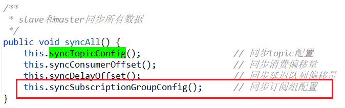
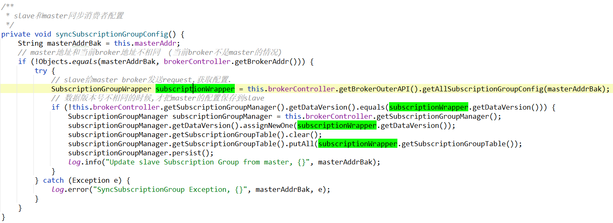

# 简述

在broker管理消费者组的。


# 类结构

```java
package org.apache.rocketmq.broker.subscription;

public class SubscriptionGroupManager extends ConfigManager {
    private transient BrokerController brokerController;
    public SubscriptionGroupManager() {
        this.init();
    }

    public SubscriptionGroupManager(BrokerController brokerController) {
        this.brokerController = brokerController;
        this.init();
    }
}
```

在构造函数中，调用了init() 初始化方法：

## init()

初始化一些RocketMQ系统自带的消费者组：


# 重要属性

```java
/**
 * 订阅者组
 * key:    groupName
 * value:  SubscriptionGroupConfig
 */
private final ConcurrentMap<String/* groupName */, SubscriptionGroupConfig> subscriptionGroupTable = 
    new ConcurrentHashMap<>(1024);

/**
 * 数据版本号
 */
private final DataVersion dataVersion = new DataVersion();
```


# 重写的方法

在 [readme.md](readme.md) 中也说了，`ConfigManager` 是个抽象类，其中有4个抽象方法需要被子类实现：

## configFilePath()

```java
指定持久化到磁盘文件的绝对路径
public abstract String configFilePath();
```


格式：{rootDir}/config/subscriptionGroup.json


## encode();

```java
把内存中的配置，转成字符串
public abstract String encode();
public abstract String encode(final boolean prettyFormat);
```


## decode();

```java
把磁盘文件读取出来的字符串，转成内存中的java对象。
public abstract void decode(final String jsonString);
```


> 这个  `反序列化` ，其实就是把jsonString字符串，用 fastjson 转成javaBean:
>
> 


# 其他方法

除了从父类中重写的方法，其他方法都是对 属性 `subscriptionGroupTable` 的*增删改查*：

- 增  没有单独的方法，直接使用map的put方法：subscriptionGroupTable.put(groupName, subscriptionGroupConfig);
- 删 public void deleteSubscriptionGroupConfig(final String groupName)
- 改 public void updateSubscriptionGroupConfig(final SubscriptionGroupConfig config)
- 查 public SubscriptionGroupConfig findSubscriptionGroupConfig(final String groupName)


## 删

public void deleteSubscriptionGroupConfig(final String groupName)


## 改

public void updateSubscriptionGroupConfig(final SubscriptionGroupConfig config)


## 查

public SubscriptionGroupConfig findSubscriptionGroupConfig(final String groupName)


# SubscriptionGroupConfig

消费者组配置

```java
public class SubscriptionGroupConfig {
    /**
     * 消费者组名称
     */
    private String groupName;
    /**
     * 消费者组是否消费消息
     */
    private boolean consumeEnable = true;
    
    private boolean consumeFromMinEnable = true;

    private boolean consumeBroadcastEnable = true;

    private int retryQueueNums = 1;

    private int retryMaxTimes = 16;
    /**
     * 从哪个broker上消费消息.
     * 默认是从master broker消费.
     */
    private long brokerId = MixAll.MASTER_ID;

    /**
     * 哪个brokerId消费比较慢
     */
    private long whichBrokerWhenConsumeSlowly = 1;

    private boolean notifyConsumerIdsChangedEnable = true;
}    
```


# slave和master数据同步

> slave和master数据同步，是使用的定时任务，每隔10秒同步一次：
>
> 详见：[broker定时任务](../Broker/Broker中的定时任务.md#%E5%A6%82%E6%9E%9Cbroker%E6%98%AFslave%EF%BC%8C%E5%88%99%E6%AF%8F%E9%9A%9410%E7%A7%92%E4%BB%8Emaster%E5%90%8C%E6%AD%A5%E6%95%B0%E6%8D%AE)





- 如果当前broker不是master，则[slave给master发送 `GET_ALL_SUBSCRIPTIONGROUP_CONFIG` 请求](../网络组件Remoting/请求类型及处理/GET_ALL_SUBSCRIPTIONGROUP_CONFIG.md)，拉取master broker上的消费者配置。
- 然后判断master和slave的数据版本号是否相同：
- 不相同：则把master的消费者配置，覆盖slave的配置。


