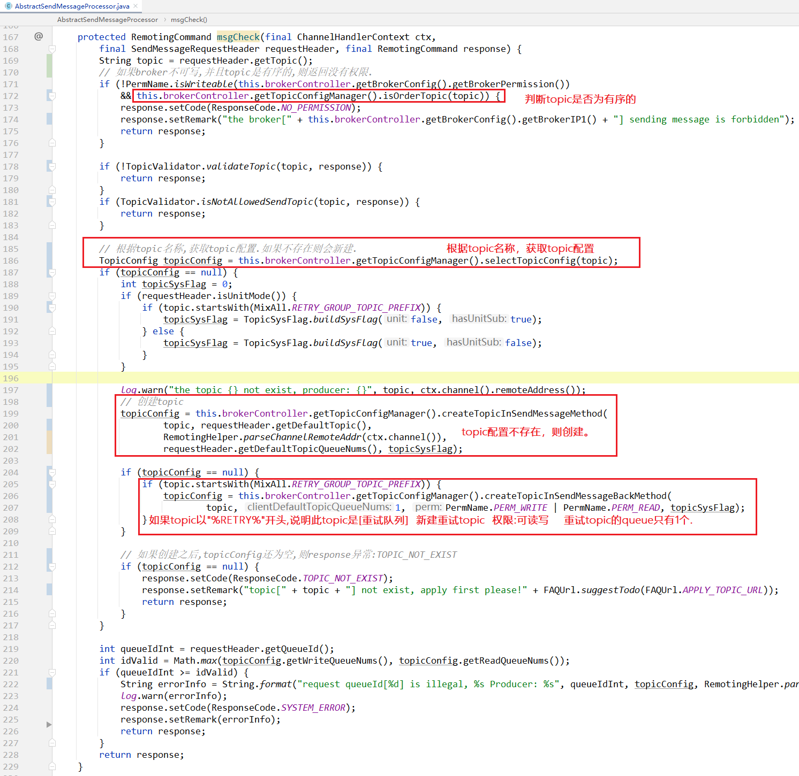
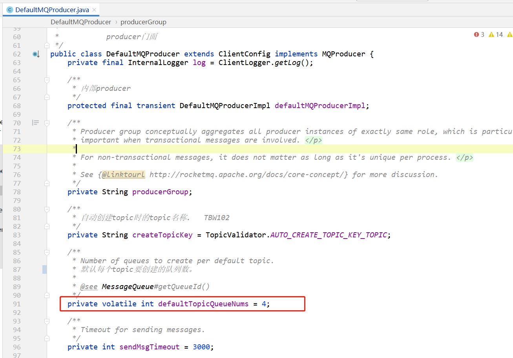

# 简述

broker用`TopicConfigManager`来管理当前broker机器上的topic。


**持久化**

- broker上的topic配置信息，需要持久化到磁盘。
- 每次topic变化的时候，都需要持久化并记录数据版本号。


**注册到NameServer**

- 当broker上的topic配置变化的时候后，给所有的NameServer发送消息
- 请求包含broker自身信息及topic配置信息
- [详见RouteInfoManager路由表管理器.md](../NameServer/RouteInfoManager路由表管理器.md) 
- slave也会注册到NameServer上。


**master和slave之间topic配置同步**

- slave会给master发送请求，拉取topic配置，然后保存到slave机器上
- [详见 GET_ALL_TOPIC_CONFIG.md](../网络组件Remoting/请求类型及处理/GET_ALL_TOPIC_CONFIG.md)
- [broker定时任务](../Broker/Broker中的定时任务.md#%E5%A6%82%E6%9E%9Cbroker%E6%98%AFslave%EF%BC%8C%E5%88%99%E6%AF%8F%E9%9A%9410%E7%A7%92%E4%BB%8Emaster%E5%90%8C%E6%AD%A5%E6%95%B0%E6%8D%AE)


# 类结构

```java
package org.apache.rocketmq.broker.topic;

public class TopicConfigManager extends ConfigManager {
}
```


# 重要属性

在这个类中，有两个map，是比较重要的：

```java
/**
 * 当前broker节点中存储的topic配置表 <br/>
 * broker会通过发送心跳包将topicConfigTable的topic信息发送给nameserver，nameserver将topic信息注册到RouteInfoManager中。 <br/>
 *
 * 使用场景:创建topic时 AdminBrokerProcessor#updateAndCreateTopic ,会把topic配置信息,保存到此map中.
 */
private final ConcurrentMap<String, TopicConfig> topicConfigTable = new ConcurrentHashMap<>(1024);
/**
 * 数据版本号 <br/>
 *
 * 每次topic配置信息变化的时候,都会更新版本号.也就是会调用 {@link DataVersion#nextVersion()} 方法
 */
private final DataVersion dataVersion = new DataVersion();
```

- `topicConfigTable` 表示broker中的topic
- `dataVersion` 表示数据版本号。

- `topicConfigTable` 和 `dataVersion` 都是需要持久化到磁盘的。
- 并且slave还需要从master获取`topicConfigTable` 和 `dataVersion` ，并持久化到slave的磁盘中。[详见](../网络组件Remoting/请求类型及处理/GET_ALL_TOPIC_CONFIG.md)
- [TopicConfig 详解](#TopicConfig)


# 构造方法

```java
/**
 * broker控制器
 */
private transient BrokerController brokerController;

public TopicConfigManager() {
}
/**
 * 实例化  并  初始化一些默认的topic
 */
public TopicConfigManager(BrokerController brokerController) {
    this.brokerController = brokerController;
    {
        // RocketMQ自己用来测试的topic名称
        String topic = TopicValidator.RMQ_SYS_SELF_TEST_TOPIC;
        TopicConfig topicConfig = new TopicConfig(topic);
        TopicValidator.addSystemTopic(topic);
        topicConfig.setReadQueueNums(1);
        topicConfig.setWriteQueueNums(1);
        this.topicConfigTable.put(topicConfig.getTopicName(), topicConfig);
    }
    //   初始化其他topic，省略，在下面详细说。
}    
```

构造方法中，传入 `BrokerController brokerController` 的引用，保存到实例变量中，然后去初始化一些默认的topic：

## 初始化默认的topic：

## RMQ_SYS_SELF_TEST_TOPIC

```java
// RocketMQ自己用来测试的topic名称
String topic = TopicValidator.RMQ_SYS_SELF_TEST_TOPIC;
TopicConfig topicConfig = new TopicConfig(topic);
TopicValidator.addSystemTopic(topic);
topicConfig.setReadQueueNums(1);
topicConfig.setWriteQueueNums(1);
this.topicConfigTable.put(topicConfig.getTopicName(), topicConfig);
```

## "TBW102"

```java
// autoCreateTopicEnable打开后，会自动创建名为“TBW102”这个topic
if (this.brokerController.getBrokerConfig().isAutoCreateTopicEnable()) {  // isAutoCreateTopicEnable 默认true
    String topic = TopicValidator.AUTO_CREATE_TOPIC_KEY_TOPIC; // "TBW102"
    TopicConfig topicConfig = new TopicConfig(topic);
    TopicValidator.addSystemTopic(topic);
    topicConfig.setReadQueueNums(this.brokerController.getBrokerConfig().getDefaultTopicQueueNums());
    topicConfig.setWriteQueueNums(this.brokerController.getBrokerConfig().getDefaultTopicQueueNums());
    int perm = PermName.PERM_INHERIT | PermName.PERM_READ | PermName.PERM_WRITE;
    topicConfig.setPerm(perm);
    // 保存到topic配置表中.
    this.topicConfigTable.put(topicConfig.getTopicName(), topicConfig);
}
```

```java
/**
 * org.apache.rocketmq.common.BrokerConfig
 * 是否开启自动创建topic
 * 官方建议:线下开启，线上关闭
 */
@ImportantField
private boolean autoCreateTopicEnable = true;
```

## RMQ_SYS_BENCHMARK_TOPIC

```java
String topic = TopicValidator.RMQ_SYS_BENCHMARK_TOPIC;
TopicConfig topicConfig = new TopicConfig(topic);
TopicValidator.addSystemTopic(topic);
topicConfig.setReadQueueNums(1024);
topicConfig.setWriteQueueNums(1024);
this.topicConfigTable.put(topicConfig.getTopicName(), topicConfig);
```

## {BrokerClusterName}

```java
// 集群名称 新建一个topic   默认是16个queue
String topic = this.brokerController.getBrokerConfig().getBrokerClusterName();
TopicConfig topicConfig = new TopicConfig(topic);
TopicValidator.addSystemTopic(topic);
int perm = PermName.PERM_INHERIT;
if (this.brokerController.getBrokerConfig().isClusterTopicEnable()) {
    perm |= PermName.PERM_READ | PermName.PERM_WRITE;
}
topicConfig.setPerm(perm);
this.topicConfigTable.put(topicConfig.getTopicName(), topicConfig);
```

## {BrokerName}

```java
// broker名称  新建一个topic
String topic = this.brokerController.getBrokerConfig().getBrokerName();
TopicConfig topicConfig = new TopicConfig(topic);
TopicValidator.addSystemTopic(topic);
int perm = PermName.PERM_INHERIT;
if (this.brokerController.getBrokerConfig().isBrokerTopicEnable()) {
    perm |= PermName.PERM_READ | PermName.PERM_WRITE;
}
topicConfig.setReadQueueNums(1);
topicConfig.setWriteQueueNums(1);
topicConfig.setPerm(perm);
this.topicConfigTable.put(topicConfig.getTopicName(), topicConfig);
```

## RMQ_SYS_OFFSET_MOVED_EVENT

```java
String topic = TopicValidator.RMQ_SYS_OFFSET_MOVED_EVENT;
TopicConfig topicConfig = new TopicConfig(topic);
TopicValidator.addSystemTopic(topic);
topicConfig.setReadQueueNums(1);
topicConfig.setWriteQueueNums(1);
this.topicConfigTable.put(topicConfig.getTopicName(), topicConfig);
```

## RMQ_SYS_SCHEDULE_TOPIC

```java
// 延迟消息delay的队列.详见: https://gitee.com/anxiaole/DayDayUp/blob/master/RocketMQ/%E6%BA%90%E7%A0%81%E9%98%85%E8%AF%BB/%E9%85%8D%E7%BD%AE%E7%AE%A1%E7%90%86ConfigManager/ScheduleMessageService.md
String topic = TopicValidator.RMQ_SYS_SCHEDULE_TOPIC;
TopicConfig topicConfig = new TopicConfig(topic);
TopicValidator.addSystemTopic(topic);
topicConfig.setReadQueueNums(SCHEDULE_TOPIC_QUEUE_NUM);
topicConfig.setWriteQueueNums(SCHEDULE_TOPIC_QUEUE_NUM);
this.topicConfigTable.put(topicConfig.getTopicName(), topicConfig);
```

## RMQ_SYS_TRACE_TOPIC

```java
if (this.brokerController.getBrokerConfig().isTraceTopicEnable()) {
    String topic = this.brokerController.getBrokerConfig().getMsgTraceTopicName();
    TopicConfig topicConfig = new TopicConfig(topic);
    TopicValidator.addSystemTopic(topic);
    topicConfig.setReadQueueNums(1);
    topicConfig.setWriteQueueNums(1);
    this.topicConfigTable.put(topicConfig.getTopicName(), topicConfig);
}
```

## {BrokerClusterName}_REPLY_TOPIC

```java
String topic = this.brokerController.getBrokerConfig().getBrokerClusterName() + "_" + MixAll.REPLY_TOPIC_POSTFIX;
TopicConfig topicConfig = new TopicConfig(topic);
TopicValidator.addSystemTopic(topic);
topicConfig.setReadQueueNums(1);
topicConfig.setWriteQueueNums(1);
this.topicConfigTable.put(topicConfig.getTopicName(), topicConfig);
```


# 重写的方法

在 [readme.md](readme.md) 中也说了，`ConfigManager` 是个抽象类，其中有4个抽象方法需要被子类实现：

## configFilePath()

```java
指定持久化到磁盘文件的绝对路径
public abstract String configFilePath();
```


格式：{rootDir}/config/topics.json


## encode();

```java
把内存中的配置，转成字符串
public abstract String encode();
public abstract String encode(final boolean prettyFormat);
```


## decode();

```java
把磁盘文件读取出来的字符串，转成内存中的java对象。
public abstract void decode(final String jsonString);
```


> 这个  `反序列化` ，其实就是把jsonString字符串，用 fastjson 转成javaBean:
>
> 


> 画外音：
>
> 到这里已经知道了在持久化和从磁盘文件中读取配置时的流程。
>


# 重要方法

## 获取topic的配置

```java
public TopicConfig selectTopicConfig(final String topic) {
    return this.topicConfigTable.get(topic);
}
```

## 判断topic是否有序

```java
public boolean isOrderTopic(final String topic) {
    TopicConfig topicConfig = this.topicConfigTable.get(topic);
    if (topicConfig == null) {
        return false;
    } else {
        return topicConfig.isOrder();
    }
}
```

## 新建topic

作用：在producer生产mq消息时，broker不存在此topic，就会新创建一个：


说明：这个方法创建topic时，需要传入 `final String defaultTopic` 参数，如果`defaultTopic`的topic不存在或者不可继承，则创建topic失败。

因为这个方法创建的topic的部分属性，需要继承自 `defaultTopic`的属性。


## 无需父级topic的方式创建topic

> 和 `createTopicInSendMessageMethod` 方法的不同是：
>
> 这个方法不需要传入  `final String defaultTopic` 参数，也就是说，创建topic时无需继承自默认的topic。
>
> 只要传入topic的参数，并且topic不存在，就能帮你无条件的创建topic。


## 方法的运用

这四个方法在producer生产mq消息的时候会用到——也就是broker在保存msg之前，msgCheck校验时：



在RocketMQ的控制台上，也能看到重试topic只有1个queue：


# TopicConfig

表示topic的配置。

```java
public class TopicConfig {
    public static int defaultReadQueueNums = 16;
    public static int defaultWriteQueueNums = 16;
    private String topicName;
    private int readQueueNums = defaultReadQueueNums;
    private int writeQueueNums = defaultWriteQueueNums;
    private int perm = PermName.PERM_READ | PermName.PERM_WRITE;
    private TopicFilterType topicFilterType = TopicFilterType.SINGLE_TAG;
    private int topicSysFlag = 0;
    private boolean order = false;
}    
```

属性中以下属性很重要：

- topicName   topic的名称
- readQueueNums      每个topic对应多少个可读的queue队列
- writeQueueNums     每个topic对应多少个可写的queue队列


## 默认topic中到底有多少个queue

上面小节中：

```java
public class TopicConfig {
    public static int defaultReadQueueNums = 16;
    public static int defaultWriteQueueNums = 16;
}    
```

在 TopicConfig 中写的默认读写queue数量都是16，

在RocketMQ控制台直接创建topic时候：


但是很多人说，在使用producer向一个不存在的topic发送消息后，自动新建topic的queue数量是4：


**那是因为当producer给broker生产消息时，如果broker没有此topic，则会新创建此topic。此时创建的topic的queue的数量是4。**

跟踪源码：

在默[DefaultMQProducer](https://gitee.com/anxiaole/rocketmq/blob/master/client/src/main/java/org/apache/rocketmq/client/producer/DefaultMQProducer.java#L86)中配置了默认每个topic创建多少queue，默认是4：



在producer给broker发送mq消息时，会把这个值发送给broker：

[DefaultMQProducerImpl#sendKernelImpl 方法](https://gitee.com/anxiaole/rocketmq/blob/master/client/src/main/java/org/apache/rocketmq/client/impl/producer/DefaultMQProducerImpl.java#L818)中：


[当broker收到消息之后，使用 AbstractSendMessageProcessor 检查时会判断topic是否存在，如果不存在，则创建：](https://gitee.com/anxiaole/rocketmq/blob/master/broker/src/main/java/org/apache/rocketmq/broker/processor/AbstractSendMessageProcessor.java#L187)


所以，如果要执行topic的queue的数量，还是在RocketMQ控制台提前新建好，比较好。


