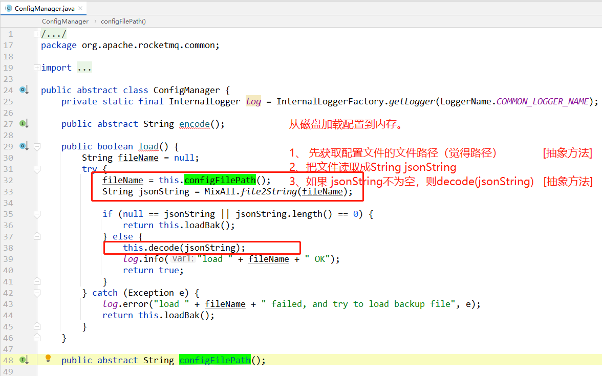
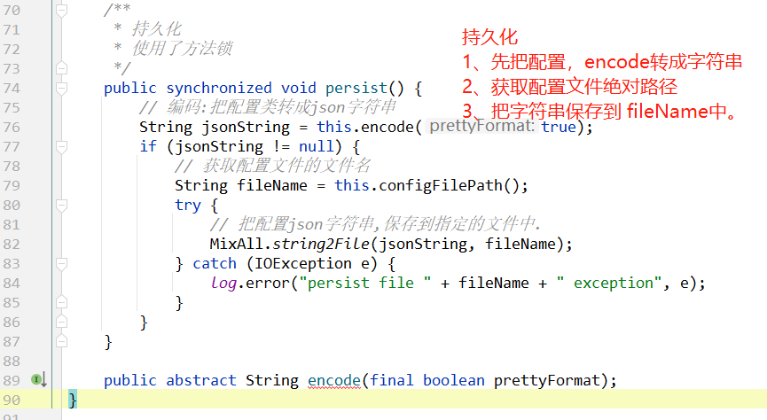

在RocketMQ中，会有很多**配置**需要持久化（这里说的并不是mq消息持久化）。

# ConfigManager 

在RocketMQ中，有个配置 org.apache.rocketmq.common.ConfigManager 管理器。

## 类结构

这是一个抽象类。

```java
package org.apache.rocketmq.common;

public abstract class ConfigManager {
}
```

## 方法

这个抽象类主要的方法是：

- 从磁盘加载配置  `load()` 方法
- 把配置从内存中，持久化到磁盘中 `persist()`


## 从磁盘加载配置




## 持久化配置




## 使用

如果有什么配置，需要持久化到磁盘文件，只需要实现这个 ConfigManager 抽象类，

实现下面这四个抽象方法：

```java
指定持久化到磁盘文件的绝对路径
public abstract String configFilePath();
```

```java
把内存中的配置，转成字符串
public abstract String encode();
public abstract String encode(final boolean prettyFormat);
```

```java
把磁盘文件读取出来的字符串，转成内存中的java对象。
public abstract void decode(final String jsonString);
```


## 实现类

在RocketMQ中，有5个`ConfigManager`的实现类。

ConsumerFilterManager (org.apache.rocketmq.broker.filter)
SubscriptionGroupManager (org.apache.rocketmq.broker.subscription)
TopicConfigManager (org.apache.rocketmq.broker.topic)
[ScheduleMessageService](ScheduleMessageService.md) (org.apache.rocketmq.store.schedule)
ConsumerOffsetManager (org.apache.rocketmq.broker.offset)


