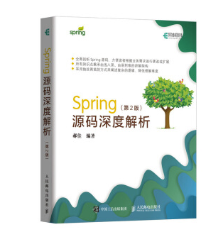

# org.springframework.beans.factory.BeanFactory

工厂模式

# 问题：

- spring 是如何获取一个bean的？
- spring 创建bean流程是？
- spring ioc容器是什么？
- spring bean生命周期是？

# 源码地址

https://github.com/liuxianfa520/spring-framework

org.springframework.beans.factory.xml.XmlBeanFactoryTests#testHelloService

# 资源

BeanFactory#getBean方法源码讲解视频： https://www.bilibili.com/video/BV1oW41167AV?p=49

《Spring源码深度解析（第2版）》

