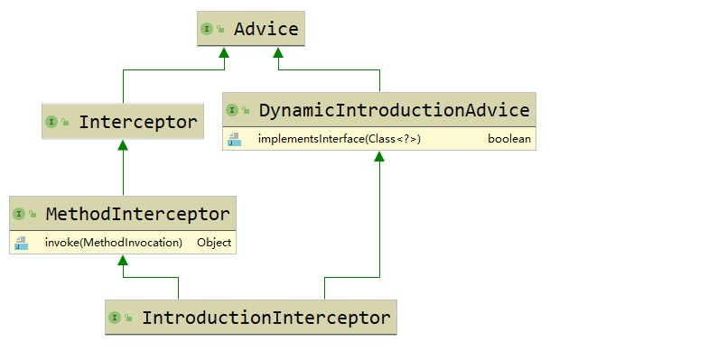
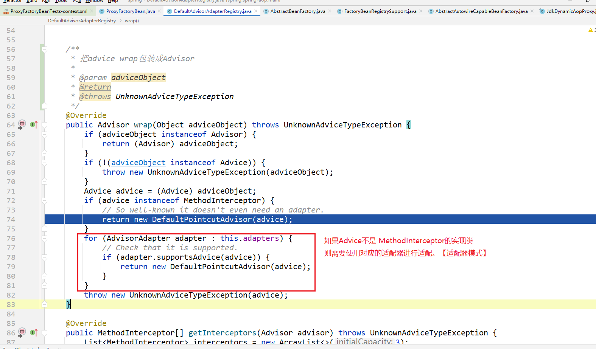
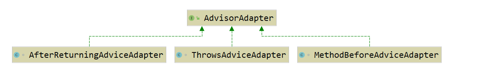
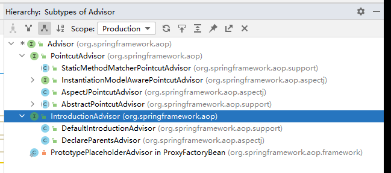

# AbstractAutoProxyCreator


- 抽象自动代理创建器


# 问题

- 默认aop创建动态代理对象有哪两种实现？如何对其进行修改？
  - JDK动态代理
  - Cglib动态代理
  - 设置proxyTargetClass=true就用Cglib动态代理
  - 如果proxyTargetClass=false并且目标class是接口，则用JDK动态代理
  
- 在bean的哪些生命周期时创建aop代理对象？
  
  - AbstractAutoProxyCreator#postProcessAfterInitialization
  - AbstractAutoProxyCreator#getEarlyBeanReference
  - AbstractAutoProxyCreator#postProcessBeforeInstantiation
  - 详见此篇文章最后，单独章节 
  
- 在什么时候解析带有 @Aspect 注解的切面？

  - 把切面解析成增强器？
  - 把切面解析成Pointcut？
  - BeanFactoryAspectJAdvisorsBuilder#buildAspectJAdvisors
  
  


# JDK原生动态代理

com.atguigu.test.jdkDynamicProxy.MyJdkDynamicProxyTest


```java
下面这些内容，也在 MyJdkDynamicProxyTest 类上的javaDoc注释上：
1、使用Proxy.newProxyInstance()方法生成代理对象,传入三个参数:
   1)类加载器
   2)目标对象的接口数组
     备注:直接使用 target.getClass().getInterfaces() 就行
   3)实现InvocationHandler的invoke方法.
2、调用proxy代理对象的任何方法都会被增强;直接调用target目标对象的任何方法,都不会被增强.
3、动态生成的代理类class文件: 在[项目根目录+包名]文件夹中.(执行一次main方法,才会生成)(目前不知道如何修改成其他目录.)
     备注:在生成的代理对象class文件中可以看到,代理对象内部所有方法都会去调用 {@link InvocationHandler#invoke} 方法.
import com.atguigu.test.jdkProxy.LoginService;
import java.lang.reflect.InvocationHandler;
import java.lang.reflect.Method;
import java.lang.reflect.Proxy;
import java.lang.reflect.UndeclaredThrowableException;
public final class LoginServiceImpl$Proxy extends Proxy implements LoginService {
    private static Method m1;
    private static Method m2;
    private static Method m3;
    private static Method m0;
    public LoginServiceImpl$Proxy(InvocationHandler var1) throws  {
        super(var1);
    }
    public final boolean equals(Object var1) throws  {
        try {
            return (Boolean)super.h.invoke(this, m1, new Object[]{var1});
        } catch (RuntimeException | Error var3) {
            throw var3;
        } catch (Throwable var4) {
            throw new UndeclaredThrowableException(var4);
        }
    }
    public final String toString() throws  {
        try {
            return (String)super.h.invoke(this, m2, (Object[])null);
        } catch (RuntimeException | Error var2) {
            throw var2;
        } catch (Throwable var3) {
            throw new UndeclaredThrowableException(var3);
        }
    }
    public final void login(String var1, String var2) throws  {
        try {
            // 动态生成的代理类中的代理方法,会直接调用{@link InvocationHandler#invoke}方法.
            super.h.invoke(this, m3, new Object[]{var1, var2});   
        } catch (RuntimeException | Error var4) {
            throw var4;
        } catch (Throwable var5) {
            throw new UndeclaredThrowableException(var5);
        }
    }
    public final int hashCode() throws  {
        try {
            return (Integer)super.h.invoke(this, m0, (Object[])null);
        } catch (RuntimeException | Error var2) {
            throw var2;
        } catch (Throwable var3) {
            throw new UndeclaredThrowableException(var3);
        }
    }
    static {
        try {
            m1 = Class.forName("java.lang.Object").getMethod("equals", Class.forName("java.lang.Object"));
            m2 = Class.forName("java.lang.Object").getMethod("toString");
            m3 = Class.forName("com.atguigu.test.jdkProxy.LoginService").getMethod("login",                                                 Class.forName("java.lang.String"), Class.forName("java.lang.String"));
            m0 = Class.forName("java.lang.Object").getMethod("hashCode");
        } catch (NoSuchMethodException var2) {
            throw new NoSuchMethodError(var2.getMessage());
        } catch (ClassNotFoundException var3) {
            throw new NoClassDefFoundError(var3.getMessage());
        }
    }
}
4、为什么jdk动态代理,必须实现接口?   阿里P7
   答:JAVA语法要求[类是单继承、多实现].
      从上面第三条看到:代理的对象的类已经继承了java.lang.reflect.Proxy类,所以只能要求[被代理类target]实现接口.
5、jdk动态代理的优点:
    依赖jdk本身的api.无需引入其他jar包.
6、jdk动态代理的缺点:
   必须要求需要代理的类实现自接口.对代码有侵入性.
   性能方面,经过jdk8优化后,已经和cglib差不多了.
7、spring官方用的jdk动态代理实现的aop源码: org.springframework.aop.framework.JdkDynamicAopProxy

```


# Cglib原生动态代理

- com.atguigu.test.cglib.CglibTest 一个简单的cglib动态代理测试用例


- com.atguigu.test.cglibDynamicProxy.MyCglibDynamicProxyTest


```java
以下内容从 MyCglibDynamicProxyTest 类上注释复制而来：
1、使用cglib动态代理原理:
   使用ASM底层字节码操作类库,动态生成的代理对象为目标对象的子类.
   在子类中的所有方法中,都调用 {@link MethodInterceptor} 方法.
   所以 无法对final类和final方法进行增强. 备注:{@link Enhancer#generateClass}中判断了superClass如果是final修饰,就抛出异常.
2、优点:
     无需要求被代理类实现接口.对代码侵入性较低.
3、缺点:
     1)、需要引入单独的cglib包和asm包等.作者只有一个人.后续版本升级维护等方面,可能没有jdk原生动态代理有优势.
     2)、无法对final类和final方法进行增强.(因为是生成的子类,final类和final方法都不能被重写.)
     上面两条的 官方文档:https://docs.spring.io/spring-framework/docs/current/reference/html/core.html#aop-api-proxying-class
     3)、在spring 4.0以前,被代理对象的构造方法会被调用两次.在spring4.x被代理对象的构造方法就不会被调用两次了.
         官方文档原文:As of Spring 4.0, the constructor of your proxied object is NOT called twice anymore, since the CGLIB proxy instance is created through Objenesis.Only if your JVM does not allow for constructor bypassing, you might see double invocations and corresponding debug log entries from Spring’s AOP support.
         官方文档:https://docs.spring.io/spring-framework/docs/current/reference/html/core.html#aop-proxying
4、性能:
     据说和jdk8的动态代理对比,性能方面已经差不多了.
     官方文档对性能方面的描述:There is little performance difference between CGLIB proxying and dynamic proxies.Performance should not be a decisive consideration in this case.
     文档地址:https://docs.spring.io/spring-framework/docs/current/reference/html/core.html#aop-api-proxying-class
5、视频地址:https://www.bilibili.com/video/BV1SJ411v7fq
6、执行此代码之后,会在[项目根目录 + /com/atguigu/test/cglibDynamicProxy/] 目录下生成代理类class文件.
7、从动态生成的代理类class文件可见,代理方法实现为:
    public final void login(String var1, String var2) {
        MethodInterceptor var10000 = this.CGLIB$CALLBACK_0;
        if (var10000 == null) {
            CGLIB$BIND_CALLBACKS(this);
            var10000 = this.CGLIB$CALLBACK_0;
        }
        // 如果能获取到 MethodInterceptor ,就调用其拦截方法.(拦截方法中定义了前后置等增强处理.)
        if (var10000 != null) {
            var10000.intercept(this, CGLIB$login$0$Method, new Object[]{var1, var2}, CGLIB$login$0$Proxy);
        } else {
            // 否则就直接调用目标方法(即父类中的方法).
            super.login(var1, var2);
        }
    }

```


# Spring-aop API

官方文档：https://docs.spring.io/spring-framework/docs/current/reference/html/core.html#aop-api

中文文档：https://www.php.cn/manual/view/21776.html

## 1、切点 Pointcut

org.springframework.aop.aspectj.AspectJExpressionPointcut


org.springframework.aop.aspectj.AspectJExpressionPointcut 的使用：


Pointcut 其他实现类：

- 抽象的静态切点 StaticMethodMatcherPointcut

  - ```java
    public abstract class StaticMethodMatcherPointcut extends StaticMethodMatcher implements Pointcut{
    	@Override
    	public final MethodMatcher getMethodMatcher() {
    		return this; // StaticMethodMatcher 静态方法匹配器器——  isRuntime()返回false
    	}
    }
    ```

- 基于正则的方法切点 JdkRegexpMethodPointcut          [官方文档](https://docs.spring.io/spring-framework/docs/current/reference/html/core.html#aop-api-pointcuts-regex)

- 动态切点    [官方文档](https://docs.spring.io/spring-framework/docs/current/reference/html/core.html#aop-api-pointcuts-dynamic)
  
  - 


## 2、通知 Advice

- 官方文档：[Advice API in Spring](https://docs.spring.io/spring-framework/docs/current/reference/html/core.html#aop-api-advice)              [中文文档](https://www.php.cn/manual/view/21790.html)

- **每个通知都是一个Spring bean。**

- **一个通知实例既可以被所有被通知的对象共享，也可以被每个被通知对象独占。** 这根据设置*类共享（per-class）*或*基于实例（per-instance）*的参数来决定。
- 【疑问：基于实例的Advice 如何开启？使用场景是？】
  - 目前有一下线索，可供理解：
  - org.springframework.aop.Advisor#isPerInstance

#### Spring里的通知类型

- [官方文档](https://docs.spring.io/spring-framework/docs/current/reference/html/core.html#aop-api-advice-types)           [中文文档](https://www.php.cn/manual/view/21790.html#aop-api-advice-types)

- 拦截环绕通知  MethodInterceptor 

- 前置通知 MethodBeforeAdvice

- 异常通知 ThrowsAdvice

  - ThrowsAdvice 不包含任何方法： 它只是一个标记接口，用来标识所给对象实现了一个或者多个针对特定类型的异常通知方法。这些方法应当满足下面的格式:

    afterThrowing([Method, args, target], subclassOfThrowable) 

- 后置通知 AfterReturningAdvice 

- 引入通知  IntroductionInterceptor ？？？ 

  - 
  - 引入通知不能和任何切入点一起使用，因为它是应用在类级别而不是方法级别。 
  - https://docs.spring.io/spring-framework/docs/current/reference/html/core.html#aop-api-advice-introduction
  - https://www.php.cn/manual/view/21790.html#aop-api-advice-introduction


## 3、通知器 Advisor 

官方文档：[The Advisor API in Spring](https://docs.spring.io/spring-framework/docs/current/reference/html/core.html#aop-api-advisor)

中文文档：[Spring里的Advisor API](https://www.php.cn/manual/view/21798.html)


把Advice包装成Advisor的方法：



#### AdvisorAdapter

- Advisor的适配器
- org.springframework.aop.framework.adapter.AdvisorAdapter
- 设计模式：适配器模式
- 总共有三个子类
- 

#### Advisor 和 Advice 的区别

这一小节只是的个人理解。

- 我们知道AOP是面向切面编程，那如何理解AOP描述了什么事情呢？如何理解Advisor和Advice两个接口的区别呢？
  
- 翻译过来，Advice表示通知；Advisor表示通知器。
  
- 可以从下面 `Advisor` 接口的实现上发现一个问题：并没有直接实现`Advisor`接口的实现类。*（PrototypePlaceholderAdvisor是私有内部类，忽略之。因为这个内部类必须依附于其外部类才能使用。）*

  

- 个人理解为：`Advice`只是对**增强逻辑**的抽象（也就是描述了要**做什么**），但我们不知道要在**哪里**做这些事情。

所以才需要有 `Pointcut`切入点接口：这个接口描述了**要在哪里做**

- `Advice`和`Pointcut`配合起来描述了：**我们要在哪里做增强。**也就是 `org.springframework.aop.PointcutAdvisor` 接口。
- 举一个房屋中介的例子来理解：
  - Advisor可以理解为：卖方中介本人，这中介会快速地帮房主卖掉房子，事成之后，收取一定的手续费。
  - 拆解一下：中介这个人拥有卖房子的能力。也就是Advice
  - 但是中介也不是随便碰到一个人就去卖人家的房子。那肯定是先要判断一下哪些人是需要卖房子的。也就是Pointcut切入点。


## 4、ProxyFactoryBean

org.springframework.aop.framework.ProxyFactoryBean

测试用例：org.springframework.aop.framework.ProxyFactoryBeanTests


本质上是个 FactoryBean 。可以很方便的对一个bean创建aop代理对象。

有几个很重要的属性：

- target 设置被代理的目标对象  <property name="target"><ref bean="test"/></property>

- targetName 被代理对象的beanName

- interfaces 目标对象实现的接口  <property name="interfaces"><value>xx.ITestBean</value></property>

- interceptorNames 设置拦截器。最后一个元素也可以设置为 目标对象的beanName 或 目标对象的 TargetSource 的beanName

- ```xml
  <bean id="testBean" class="org.springframework.tests.sample.beans.TestBean"/>
  
  <bean id="debugInterceptor" class="org.springframework.tests.aop.interceptor.NopInterceptor"/>
  <bean id="debugInterceptor" class="org.springframework.aop.interceptor.DebugInterceptor"/>
  
  <bean id="test1" class="org.springframework.aop.framework.ProxyFactoryBean">
    <!-- 设置两个拦截器 ，最后一个设置为目标对象的beanName -->
    <property name="interceptorNames"><value>debugInterceptor,debugInterceptor,testBean</value></property>
  </bean>
  ```

- 如果使用任意方式都无法找到 target ，则在方法调用的时候，就会NPE.

- [官方文档](https://docs.spring.io/spring-framework/docs/current/reference/html/core.html#aop-pfb)

- [中文文档](https://www.php.cn/manual/view/21799.html)


## 5、ProxyFactory

- org.springframework.aop.framework.ProxyFactory
- 测试用例：org.springframework.aop.framework.ProxyFactoryTests
- It is easy to create AOP proxies programmatically with Spring. This lets you use Spring AOP without dependency on Spring IoC. 使用Spring以编程方式创建AOP代理是很容易的。这使你可以使用Spring AOP而不必依赖于Spring IoC。
```java
  ProxyFactory factory = new ProxyFactory(myBusinessInterfaceImpl); 
  factory.addAdvice(myMethodInterceptor); 
  factory.addAdvisor(myAdvisor); 
  MyBusinessInterface tb = (MyBusinessInterface) factory.getProxy();
```

- 官方文档：[使用ProxyFactory以编程方式(不使用SpringIoc容器)创建aop代理](https://docs.spring.io/spring-framework/docs/current/reference/html/core.html#aop-prog)
- 中文文档：https://www.php.cn/manual/view/21807.html
- 问题：ProxyFactory 和 AopProxyFactory 有什么区别 ？？？


## 6、Advised

- Advised 类可以理解为：用来对多个Advice通知和Advisor通知器集合的管理工具类。
- 主要的方法：

| 方法 | 描述 |
| ---- | ---- |
| Advisor[] getAdvisors(); | 返回管理的Advisor集合 |
| void addAdvice(Advice advice) throws AopConfigException; | 在集合最后添加Advice通知 |
| void addAdvice(int pos, Advice advice) throws AopConfigException; | 在集合指定下标位置添加Advice通知 |
| void addAdvisor(Advisor advisor) throws AopConfigException; | 在集合最后添加Advisor通知器 |
| void addAdvisor(int pos, Advisor advisor) throws AopConfigException; | 在集合指定下标位置添加Advisor通知器 |
| int indexOf(Advisor advisor); | 获取通知器的下标 |
| boolean removeAdvisor(Advisor advisor) throws AopConfigException; | 移除Advisor通知器 |
| void removeAdvisor(int index) throws AopConfigException; | 移除指定下标的Advisor通知器 |
| boolean replaceAdvisor(Advisor a, Advisor b) throws AopConfigException; | 替换Advisor通知器 |
| boolean isFrozen(); | 是否冻结配置（冻结配置之后再修改就会报错） |

- 官方文档：[Manipulating Advised Objects](https://docs.spring.io/spring-framework/docs/current/reference/html/core.html#aop-api-advised)
- 中文文档：[操作被通知对象](https://www.php.cn/manual/view/21808.html)


## 7、使用自动代理 auto-proxy

`org.springframework.aop.framework.autoproxy`包提供了标准自动代理创建器。

- BeanNameAutoProxyCreator 为指定的beanName或beanName通配符的bean自动创建代理对象。

  - ```xml
    <bean class="org.springframework.aop.framework.autoproxy.BeanNameAutoProxyCreator">
    	<!-- 指定需要创建aop代理的beanName -->
        <property name="beanNames" value="jdk*,onlyJdk"/> 
        <property name="interceptorNames">
            <list><value>myInterceptor</value></list>
        </property>
    </bean>
    ```

- DefaultAdvisorAutoProxyCreator 

  - 会自动应用上下文中合格的通知器Advisor。使用步骤：
  - 1、在容器中注入 DefaultAdvisorAutoProxyCreator 
  - 2、在上下文中注入任意数量的**通知器(Advisor的子类)**。
    - 注意必须注入的是**通知器Advisor**而不仅仅是**拦截器MethodInterceptor**或者其它**通知Advice**。 这点是必要的，因为必须有一个切入点被评估，以便检查每个通知候选bean定义的合适性。
    - 这里需要很明确的区分出下面几个接口的概念：Advice、MethodInterceptor、Advisor
    - [官方文档](https://docs.spring.io/spring-framework/docs/current/reference/html/core.html#aop-api-autoproxy-default)           [中文文档](https://www.php.cn/manual/view/21809.html#aop-api-autoproxy-default)        


## 5、切面增强器创建工厂 AspectJAdvisorFactory


## 6、AopProxyFactory

org.springframework.aop.framework.AopProxyFactory


- 设计模式：简单工厂模式


## 7、AopProxy

org.springframework.aop.framework.AopProxy


# spring中JDK动态代理

org.springframework.aop.framework.JdkDynamicAopProxy


# spring中Cglib动态代理

org.springframework.aop.framework.CglibAopProxy


问题：CglibAopProxy并没有实现MethodInterceptor接口，那cglib的callbacks方法是在哪传入的呢？

- org.springframework.aop.framework.CglibAopProxy#getCallbacks
- cglib的callbacks可以有多个：((org.springframework.cglib.proxy.Factory) proxyInstance).setCallbacks(callbacks);
- 


# 在bean的哪些生命周期时创建aop代理对象？


- AbstractAutoProxyCreator#postProcessAfterInitialization

  - 在bean初始化完毕后，对目标bean创建代理对象。

- AbstractAutoProxyCreator#getEarlyBeanReference

  - 在早期引用的时，对目标bean创建代理对象。
  - 注：只有存在循环依赖时，才会使用此方式创建代理对象

- AbstractAutoProxyCreator#postProcessBeforeInstantiation

  - 在spring bean生命周期中的**实例化**之前，可以以自定义的方式实例化目标对象，跳过spring默认的实例化过程。然后创建代理对象。

  - 

  - 
  - TargetSource 官方文档: https://docs.spring.io/spring/docs/5.0.18.RELEASE/spring-framework-reference/core.html#aop-targetsource
  - TargetSource 中文文档: https://www.php.cn/manual/view/21815.html


# 参考

## [Spring中文文档](https://www.php.cn/manual/view/21776.html)

## [死磕Spring AOP系列5：设计模式在AOP中的使用](https://blog.51cto.com/dba10g/1786250)