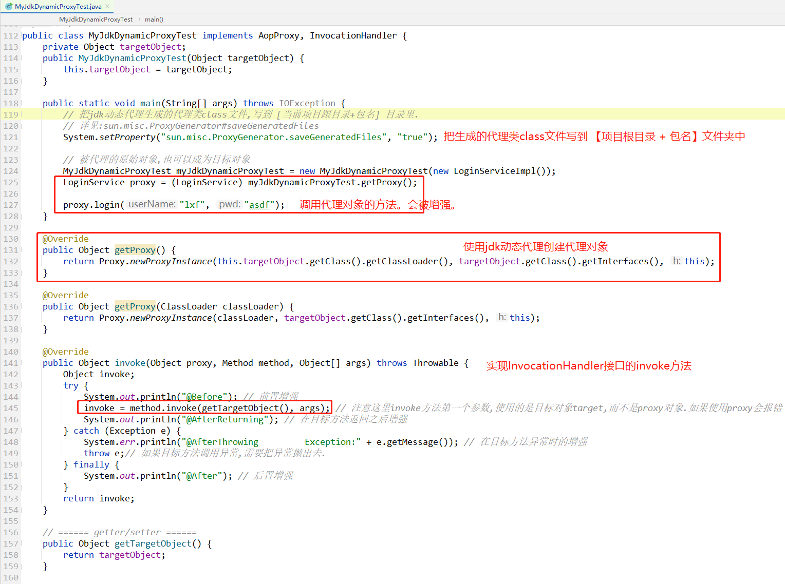

# jdk动态代理的一个小Demo

`jdk动态代理`必须要求`目标对象`实现接口。具体原因后面会讲。这里先写一个jdk动态代理的使用方法：

定义一个接口：

```java
public interface LoginService {
    void login(String userName, String pwd);
}
```

实现类：

```java
public class LoginServiceImpl implements LoginService {
    @Override
    public void login(String userName, String pwd) {
        System.out.println("当前登录用户名为:" + userName +"。登录成功，欢迎使用本系统。");
    }
}
```

代理逻辑：

```java
public class InvocationHandlerImpl implements InvocationHandler {
    private Object targetObject; // 目标对象

    public InvocationHandlerImpl(Object targetObject) {
        this.targetObject = targetObject;
    }
    
    // 在目标方法执行前后，打印日志。
    @Override
    public Object invoke(Object proxy, Method method, Object[] args) throws Throwable {
        System.out.println("Before"); 
        Object result = method.invoke(this.targetObject, args);  // 使用反射调用目标方法
        System.out.println("after");
        return result;
    }
}
```

> 注意：`invoke`方法的第一个参数`proxy`，是在应用程序运行期创建的`代理对象`。使用反射调用目标方法时，不能使用`proxy`对象。
>
> 目标对象，应该是`InvocationHandlerImpl`类中的一个`成员变量`，也就是这里的 `Object targetObject` 。

测试方法：

```java
    public static void main(String[] args) throws Exception {
        LoginServiceImpl targetObject = new LoginServiceImpl();
        InvocationHandlerImpl invocationHandlerImpl = new InvocationHandlerImpl(targetObject);
        LoginService proxy = (LoginService) Proxy.newProxyInstance(
                                                     targetObject.getClass().getClassLoader(), 
                                                     targetObject.getClass().getInterfaces(), 
                                                     invocationHandlerImpl)

        proxy.login("张三", "123456"); // 调用代理对象的方法。
    }
```

控制台输出：

```
Before
当前登录用户名为:张三。登录成功，欢迎使用本系统。
after
```

**在调用`proxy`代理对象的方法时，会直接调用 `InvocationHandlerImpl#invoke` 方法。**

接下来我们主要讲解jdk动态代理的原理。

# 原理讲解

我们写的`main`方法中，`proxy.login("张三", "123456");` 点进去，只会看到`LoginServiceImpl`的逻辑，那为什么调用代理对象的方法的时候，会调用`InvocationHandler#invoke`中的方法呢？

jdk动态代理原理是：在**运行期**，动态的创建`代理类`，我们可以使用下面一行代码，把生成的代理类class文件输出出来：

```java
// 把jdk动态代理生成的代理类class文件,输出到 [当前项目跟目录+包名] 目录里.
System.setProperty("sun.misc.ProxyGenerator.saveGeneratedFiles", "true");
// 详见:sun.misc.ProxyGenerator#saveGeneratedFiles
```

添加完这一行代码，`main`方法如下：

```java
public static void main(String[] args) throws Exception {
    // 把jdk动态代理生成的代理类class文件,输出到 [当前项目跟目录+包名] 目录里.
    System.setProperty("sun.misc.ProxyGenerator.saveGeneratedFiles", "true");
    
    LoginServiceImpl targetObject = new LoginServiceImpl();
    InvocationHandlerImpl invocationHandlerImpl = new InvocationHandlerImpl(targetObject);
    LoginService proxy = (LoginService) Proxy.newProxyInstance(
                                                 targetObject.getClass().getClassLoader(), 
                                                 targetObject.getClass().getInterfaces(), 
                                                 invocationHandlerImpl)

    proxy.login("张三", "123456"); // 调用代理对象的方法。
}
```

此时再次执行，你就会在  [当前项目跟目录+包名] 目录里发现了几个class类，这里我们生成的`代理类class`反编译后的内容：*（有删减）*

```java
 import com.service.LoginService;
 import java.lang.reflect.InvocationHandler;
 import java.lang.reflect.Method;
 import java.lang.reflect.Proxy;
 import java.lang.reflect.UndeclaredThrowableException;

 public final class $Proxy0 extends Proxy implements LoginService {
     
     // 使用反射从 com.service.LoginService 接口中获得login方法。
     private static Method m3 = Class.forName("com.service.LoginService")
                   .getMethod("login", Class.forName("java.lang.String"), Class.forName("java.lang.String"));

     public $Proxy0(InvocationHandler var1) throws  {
         super(var1);
     }

     public final void login(String var1, String var2) throws  {
         try {
             // 动态生成的代理类中的代理方法,会直接调用{@link InvocationHandler#invoke}方法.
             super.h.invoke(this, m3, new Object[]{var1, var2});   
         } catch (RuntimeException | Error var4) {
             throw var4;
         } catch (Throwable e) {
             throw new UndeclaredThrowableException(e);
         }
     }
     
     // 省略 Object类中的三个方法，主要看login方法。
 }
```

根据上面运行期生成的代理类反编译代码，就解答我们上面的疑问：为什么调用代理对象的方法的时候，会调用`InvocationHandler#invoke`中的方法呢？

在`login`方法中，直接调用 `super.h.invoke(this, m3, new Object[]{var1, var2});`   方法，那么`super.h` 其实是`Proxy`类中的属性：


而我们的代理逻辑`InvocationHandlerImpl`就是`InvocationHandler`的子类，也就是在代理类的`login`方法中，直接调用了`InvocationHandlerImpl#login`方法。


> 画外音：
>
> 对于jdk动态代理的原理我们先讲到这里。其实还有 `java.lang.reflect.Proxy#newProxyInstance` 方法执行流程还没有讲解，
>
> 但是到这里其实就基本理解了jdk动态代理了。
>
> 
>
> 对于  `java.lang.reflect.Proxy#newProxyInstance` 方法执行流程详解：[Proxy#newProxyInstance](#Proxy#newProxyInstance)


# Proxy#newProxyInstance

> 理解这个方法原理有点困难，如果有时间、有兴趣的伙伴可以研究研究。
>
> 否则可以直接看下一章节：[总结](#%E6%80%BB%E7%BB%93)

结合下面 `newProxyInstance`静态方法，我们看到主要有两个步骤：

- **查找**或**生成**指定的`代理类`
- 调用代理类的构造方法，实例化代理对象。

```java
public class Proxy implements java.io.Serializable {
  /** 
    * parameter types of a proxy class constructor 代理类构造方法的参数列表 
    * 
    * 从反编译的代理类中看到构造器方法参数是固定的:
    *    public $Proxy0(InvocationHandler var1) throws  {
    *        super(var1);
    *    }
    */
    private static final Class<?>[] constructorParams = { InvocationHandler.class };

    public static Object newProxyInstance(ClassLoader loader,
                                          Class<?>[] interfaces,
                                          InvocationHandler h) {
        Objects.requireNonNull(h);
        
        // 安全管理器是一个允许应用程序实现安全策略的类。
        // 它允许应用程序在执行一个可能不安全或敏感的操作前确定该操作是什么，以及是否是在允许执行该操作的安全上下文中执行它。
        final SecurityManager sm = System.getSecurityManager();
        // 忽略：安全管理器相关check的代码。

        /*
         * Look up or generate the designated proxy class.
         * 1、查找或生成指定的代理类
         */
        final Class<?>[] intfs = interfaces.clone();
        Class<?> cl = getProxyClass0(loader, intfs);

        // 2、调用构造方法，实例化对象。
        try {
            // 忽略：安全管理器相关check的代码。

            // 获得代理类的构造方法。构造方法的参数为：  InvocationHandler.class
            final Constructor<?> cons = cl.getConstructor(constructorParams);
            // 如果构造方法不是public的，就给构造器设置可访问。
            if (!Modifier.isPublic(cl.getModifiers())) {
                AccessController.doPrivileged(new PrivilegedAction<Void>() {
                    public Void run() {
                        cons.setAccessible(true);
                        return null;
                    }
                });
            }
            // 构造方法，实例化对象。
            return cons.newInstance(new Object[]{h});
        } catch (Exception e) {
            // 忽略异常处理。。。。
        }
    }
}    
```

## 查找或生成指定的`代理类`

```java
    private static final WeakCache<ClassLoader, Class<?>[], Class<?>> proxyClassCache = 
                         new WeakCache<>(new KeyFactory(), new ProxyClassFactory());

    private static Class<?> getProxyClass0(ClassLoader loader, Class<?>... interfaces) {
        // If the proxy class defined by the given loader implementing
        // the given interfaces exists, this will simply return the cached copy;
        // otherwise, it will create the proxy class via the ProxyClassFactory
        // 翻译成中文：如果缓存中存在要求的代理类proxy class,就直接返回缓存
        //           否则，将会通过 ProxyClassFactory 来创建代理类，并放到缓存中。
        return proxyClassCache.get(loader, interfaces);
    }
```

`proxyClassCache`是 `WeakCache<ClassLoader, Class<?>[], Class<?>>` 类型，是 `软引用缓存`  。java中的软引用不多说了，有不会的百度查一下。

## 软引用缓存WeakCache

这里的 `WeakCache`软引用缓存，就是用软引用思想，实现的缓存。其构造方法需要传入两个参数：

```java
    public WeakCache(BiFunction<K, P, ?> subKeyFactory, BiFunction<K, P, V> valueFactory) {
        this.subKeyFactory = Objects.requireNonNull(subKeyFactory);
        this.valueFactory = Objects.requireNonNull(valueFactory);
    }
```

第一个是 `keyFactory`，顾名思义，就是创建key的工厂；

第二个参数是 `valueFactory` 顾名思义，就是缓存中不存在值时，会使用此value工厂来创建对应的值，并保存到缓存中。

在new实例化时：

```java
WeakCache<ClassLoader, Class<?>[], Class<?>> proxyClassCache = 
                         new WeakCache<>(new KeyFactory(), new ProxyClassFactory());
```

传入的value创建工厂是：`ProxyClassFactory`，我们就来研究研究这个类，来探究一下`代理类`是如何被创建出来的。

## 代理类工厂ProxyClassFactory

java.lang.reflect.Proxy.ProxyClassFactory 类是在 java.lang.reflect.Proxy 类中的一个静态内部类，并实现了 `BiFunction`接口：

```java
    private static final class ProxyClassFactory implements BiFunction<ClassLoader, Class<?>[], Class<?>>
    {
        // prefix for all proxy class names   代理类的类名前缀
        private static final String proxyClassNamePrefix = "$Proxy";

        // next number to use for generation of unique proxy class names   
        // 在生成代理类时，会在代理类中添加一个自增的数字来标识类名唯一。比如本例中，代理类的类名是：$Proxy0
        private static final AtomicLong nextUniqueNumber = new AtomicLong();
    }        
```

`BiFunction`接口是java8中新增加的一个接口，其中方法是`apply`，使用两个参数，返回一个返回值。

```java
@FunctionalInterface
public interface BiFunction<T, U, R> {
    R apply(T t, U u);
}
```

那我们仔细看一下 `ProxyClassFactory#apply` 方法，也是这个方法中写了`生成代理类`的逻辑：

```java
@Override
public Class<?> apply(ClassLoader loader, Class<?>[] interfaces) {
    // 忽略：对接口的各种校验 及 生成包名 proxyPkg 的逻辑。。。。
    
    // Choose a name for the proxy class to generate.
    // 1、代理类的类名（类权限定名，包含包名）
    long num = nextUniqueNumber.getAndIncrement();
    String proxyName = proxyPkg + proxyClassNamePrefix + num; // 代理类的类名。proxyName

    // Generate the specified proxy class.
    // 2、生成指定的代理类。proxyClassFile 是代理类class的二进制数据流
    byte[] proxyClassFile = ProxyGenerator.generateProxyClass(proxyName, interfaces, accessFlags);
    try {
        // 3、使用二进制流，定义Calss 并返回代理类的Class对象。
        return defineClass0(loader, proxyName, proxyClassFile, 0, proxyClassFile.length);
    } catch (ClassFormatError e) {
        throw new IllegalArgumentException(e.toString());
    }
}
```

> 画外音：
>
> .java文件会编译成.class文件保存到磁盘中，在类加载的时候，会从磁盘上读取.class文件的二进制文件流，然后使用类加载器定义成class类并把类保存到内存中。
>
> 更多类加载的逻辑可以看  jvm——类加载器，这里不多赘述。
>
> 本章节我们的重点是：梳理生成代理类的逻辑。也就是下面一小节：

## 生成代理类二进制流

```java
byte[] proxyClassFile = ProxyGenerator.generateProxyClass(proxyName, interfaces, accessFlags);
```

`sun.misc.ProxyGenerator` 根据包名看到，这已经是`sun`包中的了。所以并没有源码，下面看到的也是经过`反编译`的结果：


```java
public class ProxyGenerator {
  private String className;                      // 代理类类名
  private Class<?>[] interfaces;                 // 代理类的所有接口
  private int accessFlags;                       // 访问标识符,也就是public static final  这些.
  private ProxyGenerator.ConstantPool cp = new ProxyGenerator.ConstantPool();  // 常量池.注意:这是类中的常量池,使用javap命令可以看到.学习过jvm就能理解了.
  private List<ProxyGenerator.FieldInfo> fields = new ArrayList();            // 代理类中的所有字段
  private List<ProxyGenerator.MethodInfo> methods = new ArrayList();          // 代理类中的所有方法,包括构造方法,静态代码块
  private Map<String, List<ProxyGenerator.ProxyMethod>> proxyMethods = new HashMap();   //    所有的代理方法.
  
  
  private ProxyGenerator(String className, Class<?>[] interfaces, int accessFlags) {
    this.className = className;
    this.interfaces = interfaces;
    this.accessFlags = accessFlags;
  }
  
  // 生成类二进制文件.................. 
  private byte[] generateClassFile() {
    this.addProxyMethod(hashCodeMethod, Object.class); // 给代理类添加 hashCode 方法
    this.addProxyMethod(equalsMethod, Object.class);   // 给代理类添加 equals   方法
    this.addProxyMethod(toStringMethod, Object.class); // 给代理类添加 toString 方法
    int interfaceLength = this.interfaces.length;
  
    // 获取所有接口,把接口中的所有方法都生成代理方法,并添加到代理类中.
    for(int i = 0; i < interfaceLength; ++i) {
      Class interfaceClass = this.interfaces[i];
      int methodLength = interfaceClass.getMethods().length;
      for(int methodIndex = 0; methodIndex < methodLength; ++methodIndex) {
        Method method = interfaceClass.getMethods()[methodIndex];
        // 给代理类,添加接口中的所有方法,接口中的所有方法都需要被代理.
        this.addProxyMethod(method, interfaceClass);
      }
    }
  
    Iterator proxyMethodsIterator = this.proxyMethods.values().iterator();
  
    List<ProxyGenerator.ProxyMethod> proxyMethod;
    while(proxyMethodsIterator.hasNext()) {
      proxyMethod = (List)proxyMethodsIterator.next();
      checkReturnTypes(proxyMethod);
    }
  
    Iterator iterator;
    try {
      // 给代理类添加 构造方法
      this.methods.add(this.generateConstructor());
  
      // 解析所有的代理方法，
      proxyMethodsIterator = this.proxyMethods.values().iterator();
      while(proxyMethodsIterator.hasNext()) {
        proxyMethod = (List)proxyMethodsIterator.next();
        iterator = proxyMethod.iterator();
  
        while(iterator.hasNext()) {
          ProxyGenerator.ProxyMethod var16 = (ProxyGenerator.ProxyMethod)iterator.next();
          // 给代理类 添加字段；字段类型为 Method
          this.fields.add(new ProxyGenerator.FieldInfo(var16.methodFieldName, "Ljava/lang/reflect/Method;", 10));
          // 给代理类 添加方法
          this.methods.add(var16.generateMethod());
        }
      }
  
      // 给代理类添加静态代码块
      this.methods.add(this.generateStaticInitializer());
    } catch (IOException e) {
      throw new InternalError("unexpected I/O Exception", e);
    }

    if (this.methods.size() > 65535) {                              // 方法个数最大值校验
      throw new IllegalArgumentException("method limit exceeded");
    } else if (this.fields.size() > 65535) {                        // 字段个数最大值校验
      throw new IllegalArgumentException("field limit exceeded");
    } else {
      this.cp.setReadOnly(); // 常量池设置为只读
      // ====开始把类中的所有内容都写到byte[]数组中====
      
      // 把class文件中的内容,都使用输出流,写入到`byteArrayOutputStream`中,在最后return时,返回二进制数组.
      ByteArrayOutputStream byteArrayOutputStream = new ByteArrayOutputStream();
      DataOutputStream out = new DataOutputStream(byteArrayOutputStream);
      try {
        out.writeInt(-889275714);
        out.writeShort(0);
        out.writeShort(49); 
        this.cp.write(out);                                           // 把常量池写入到代理类中
        out.writeShort(this.accessFlags);                             // 代理类的访问标识   也就是 public/static/final 这些关键字.
        out.writeShort(this.cp.getClass(dotToSlash(this.className))); // 代理类的类名
        out.writeShort(this.cp.getClass("java/lang/reflect/Proxy"));  // 代理类继承 java.lang.reflect.Proxy 类

        out.writeShort(this.interfaces.length);                       // 代理类实现的接口个数
        for(int i = 0; i < this.interfaces.length; ++i) {             // 代理类实现的接口
          out.writeShort(this.cp.getClass(dotToSlash(this.interfaces[i].getName())));
        }

        out.writeShort(this.fields.size());                           // 字段个数
        iterator = this.fields.iterator();                            // 代理类中的字段
        while(iterator.hasNext()) {
          (ProxyGenerator.FieldInfo)iterator.next().write(out);
        }

        out.writeShort(this.methods.size());                          // 方法个数
        iterator = this.methods.iterator();                           // 代理类中的方法
        while(iterator.hasNext()) {
          (ProxyGenerator.MethodInfo)iterator.next().write(out);
        }

        out.writeShort(0);                          
        return byteArrayOutputStream.toByteArray();       返回byte[]数组.也就是class类的二进制数据数组.
      } catch (IOException e) {
        throw new InternalError("unexpected I/O Exception", e);
      }
    }
  }
}
```

创建`代理类`的逻辑，其实就是：

- 生成代理类的类名、父类 `java.lang.reflect.Proxy` 、实现的接口等
- 生成代理类的方法、字段、构造方法、静态方法等
- 生成代理类的常量池、访问标识符
- 最后还往类二进制byte[]数组中添加了0   （我也不知道是为啥？难道是类填充？？这是猜测，我也不知道）
- 最后使用  `return byteArrayOutputStream.toByteArray();`  返回byte[]数组.也就是class类的二进制数据数组.

再往里面的细节，有兴趣的可以去分析分析。

> 我要偷懒了：
>
> 其实我们把生成的代理类输出到磁盘中，反编译之后，就知道代理类中都有什么内容、就知道代理类的实现了。
>
> 根据反编译的代理类class文件，再来看这生成代理类的过程，大致能理解了。
>
> 所以到这里，我要偷懒了，不继续往里面研究了。这里再说一下如何把生成的代理类class文件输出到磁盘中：（本文上面demo也有）
>
> ```java
> // 把jdk动态代理生成的代理类class文件,输出到 [当前项目跟目录+包名] 目录里.
> System.setProperty("sun.misc.ProxyGenerator.saveGeneratedFiles", "true");
> // 详见:sun.misc.ProxyGenerator#saveGeneratedFiles
> ```


到这里我们已经拿到了代理类class的二进制数据，那么接下来就是要把byte[]转换成Class：

## 使用代理类二进制流定义Class

```java
byte[] proxyClassFile = ProxyGenerator.generateProxyClass(proxyName, interfaces, accessFlags);
Class proxyClass = defineClass0(loader, proxyName, proxyClassFile, 0, proxyClassFile.length);
```

也就是 `defineClass0` 方法：

```java
private static native Class<?> defineClass0(ClassLoader loader, String name, byte[] b, int off, int len);
```

没办法了，此方法是静态`native`本地方法，看不了方法实现了。

只需要知道，这个方法使用类加载器`loader`,把byte[]数组解析成名为`name`的类，并加载到jvm中。


# 总结

1、使用`Proxy.newProxyInstance()`静态方法创建代理对象，需要传入三个参数:
     1）类加载器——因为会在运行期动态生成代理类，会使用此类加载器加载生成的代理类。
     2）目标对象的接口数组——备注:直接使用 `target.getClass().getInterfaces()` 就行
     3）实现`InvocationHandler#invoke`方法的子类.
2、使用 `System.setProperty("sun.misc.ProxyGenerator.saveGeneratedFiles", "true");` 会把代理类的class文件输出到 [项目根目录+包名]文件夹中。
      备注:反编译代理类可以看到，代理类中所有方法都会去调用 `InvocationHandler#invoke` 方法。
3、调用代理对象proxy的任何方法都会被拦截，直接调用target目标对象的任何方法，都不会被拦截。
4、为什么jdk动态代理,必须实现接口?   阿里P7
     答：从反编译的代理中上我们看到：`代理类`已经继承了`java.lang.reflect.Proxy`类，而在java中类只能`单继承`，所以只能要求[被代理类target]实现接口.
5、jdk动态代理的优点:
       依赖jdk本身的api，无需引入其他jar包.
6、jdk动态代理的缺点:
       必须要求需要代理的类实现自接口.对代码有侵入性.
       性能方面,经过jdk8优化后，已经和cglib差不多了.
7、spring官方用的jdk动态代理实现的aop源码: org.springframework.aop.framework.JdkDynamicAopProxy


# Spring+jdk动态代理

> 这个demo结合了一些spring源码，所以看这会有点绕。不过仔细看，还是能理解的。
>
> 但并不是spring中使用jdk动态代理的所有内容，只是为了阅读spring的一个入门级小demo。
>
> 建议：把jdk动态代理的使用先理解了，再开始看spring aop。否则很痛苦的。

测试用例详见：[com.atguigu.test.jdkDynamicProxy.MyJdkDynamicProxyTest](https://gitee.com/anxiaole/spring-framework/blob/5.0.x/spring-example/src/test/java/com/atguigu/test/jdkDynamicProxy/MyJdkDynamicProxyTest.java)




# 

# 


# 实验

## 如果目标类实现了两个接口，但是在创建代理对象的时候，只指定了一个接口，会怎么样？

定义两个接口：

```java
public interface LoginService {
    void login();
}

public interface LoginService2 {
    void login2();
}
```

实现类：

```java
public class LoginServiceImpl implements LoginService,LoginService2 {

  @Override
  public void login() {
    System.out.println("登录成功!");
  }

  @Override
  public void login2() {
    System.out.println("登录成功!222");
  }
}
```

代理逻辑（拦截器）：

```java
public class MyInvocationHandler implements InvocationHandler {
    private Object target;
    public MyInvocationHandler(Object target) {
        this.target = target;
    }
    
    @Override
    public Object invoke(Object proxy, Method method, Object[] args) throws Throwable {
        System.out.println("目标方法执行前，打印这句话。");
        return method.invoke(this.target, args);;
    }
}    
```

测试用例：

创建代理对象的时候，指定 `LoginService.class` 一个接口，不指定 `LoginService2.class` 接口：

```java
public static void main(String[] args) throws IOException {
    System.setProperty("sun.misc.ProxyGenerator.saveGeneratedFiles", "true"); // 输出代理类

    LoginServiceImpl target = new LoginServiceImpl();
    MyInvocationHandler myInvocationHandler = new MyInvocationHandler(target);
    
    LoginService proxy = (LoginService) Proxy.newProxyInstance(target.getClass().getClassLoader(), 
                                                               new Class[]{LoginService.class}, //只指定LoginService接口
                                                               myInvocationHandler);

    proxy.login();
}
```

执行之后，是可以正常执行。

打开生成的代理类：（有删减）

```java
final class $Proxy0 extends Proxy implements LoginService {
    private static Method m3;

    public $Proxy0(InvocationHandler var1) throws  {
        super(var1);
    }

    public final void login() throws  {
        try {
            super.h.invoke(this, m3, new Object[]{});
        } catch (RuntimeException | Error var4) {
            throw var4;
        } catch (Throwable var5) {
            throw new UndeclaredThrowableException(var5);
        }
    }
}
```

从代理类中，我们看到，代理类只继承了`LoginService`接口，并没有继承`LoginService2`接口。

那么我们也就知道了，这种情况下，并不能把`代理对象`类型转化成`LoginService2`，否则就会报错.

```
Exception in thread "main" java.lang.ClassCastException: com.sun.proxy.$Proxy0 cannot be cast to com.mytest.LoginService2
	at com.mytest.Test.main(Test.java:24)
```

既然不能类型转成`LoginService2`，那么可想而知：我们也无法使用`代理对象`调用到`LoginService2`接口中的方法。

