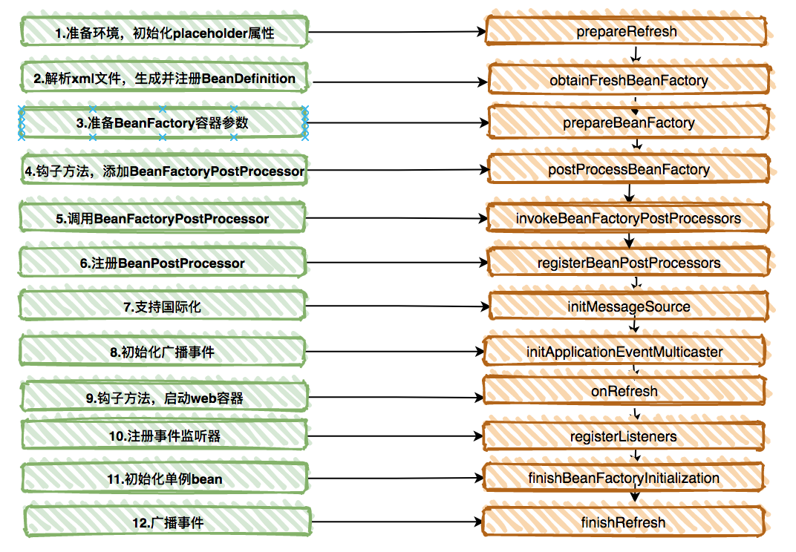

# [org.springframework.context.ApplicationContext](https://docs.spring.io/spring-framework/docs/current/reference/html/core.html#beans-basics)
- The `org.springframework.context.ApplicationContext` interface represents the Spring IoC container and is responsible for instantiating, configuring, and assembling the beans. 
- The container gets its instructions on what objects to instantiate, configure, and assemble by reading configuration metadata. 

# 问题
- spring ioc容器是什么？
- [spring ioc容器创建及初始化过程?](https://www.bilibili.com/video/BV1oW41167AV?p=44)

