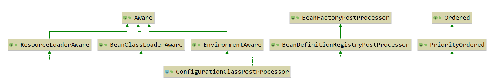

# BeanDefinition
- BeanDefinitionReader

  - ```java
    BeanDefinitionRegistry getRegistry();
    
    int loadBeanDefinitions(Resource resource);
    ```
    
  - 接口定义了：从各种资源中，加载 `BeanDefinition`，并注册到 `BeanDefinitionRegistry` 中
  
  - 返回int：表示从此资源加载的 `BeanDefinition` 的数量
  
- BeanDefinitionParser

  - ```java
    BeanDefinition parse(Element element, ParserContext parserContext);
    ```

  - 此接口用于处理**顶级自定义的标签** *(指:<beans/>标签的直接子标签)*

- ClassPathBeanDefinitionScanner

   ```java
    	public int scan(String... basePackages) {
    		int beanCountAtScanStart = this.registry.getBeanDefinitionCount();
    
    		// 包扫描
    		doScan(basePackages);
    
    		// Register annotation config processors, if necessary.
            // 如果需要,则注册 注解配置处理器.相当于开启<context:annotation-config/> 
    		if (this.includeAnnotationConfig) {
    			AnnotationConfigUtils.registerAnnotationConfigProcessors(this.registry);
    		}
    
    		return (this.registry.getBeanDefinitionCount() - beanCountAtScanStart);
    	}
   ```


# 问题：

- 写的beans.xml配置文件是如何解析成bean定义的？
  -  <bean id="helloService" class="test.HelloService" />
  - 在 `BeanDefinitionReader` 中把资源加载成bean定义。
- 在beans.xml配置文件中，spring默认的标签有哪些？
  - bean
  - import
  - alias
  - `DefaultBeanDefinitionDocumentReader#parseBeanDefinitions`中会调用 `delegate.isDefaultNamespace(root)` 方法来判断是否为默认标签。
- spring是如何认识dubbo的标签的？

  - <dubbo:service interface="com.newbanker.pco.service.MessageConsumerService" ref="messageConsumerService" />
  - 实现`BeanDefinitionParser`
  - `com.alibaba.dubbo.config.spring.schema.DubboNamespaceHandler`
  - META-INF\spring.handlers 中配置：http\://code.alibabatech.com/schema/dubbo=com.alibaba.dubbo.config.spring.schema.DubboNamespaceHandler
- *超纲问题：使用@Controller、@Service、@Component注解的类，spring是如何解析的呢？*
  - org.springframework.context.annotation.ConfigurationClassPostProcessor#postProcessBeanDefinitionRegistry
  - 


# 源码阅读

https://github.com/liuxianfa520/spring-framework

org.springframework.beans.factory.xml.XmlBeanFactoryTests#testRegisterBeanDefinition
org.springframework.beans.factory.xml.XmlBeanFactoryTests#testLoadBeanDefinitions


# 参考：

spring官方文档:[**Table 1. The bean definition**](https://docs.spring.io/spring-framework/docs/current/reference/html/core.html#beans-definition)

