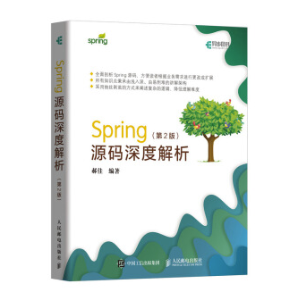

# org.springframework.beans.factory.BeanFactory

- 工厂模式
- The `org.springframework.beans` and `org.springframework.context` packages are the basis for Spring Framework’s IoC container. 
- The [`BeanFactory`](https://docs.spring.io/spring-framework/docs/5.3.5/javadoc-api/org/springframework/beans/factory/BeanFactory.html) interface provides an advanced configuration mechanism capable of managing any type of object. [`ApplicationContext`](https://docs.spring.io/spring-framework/docs/5.3.5/javadoc-api/org/springframework/context/ApplicationContext.html) is a sub-interface of `BeanFactory`. It adds:
  - Easier integration with Spring’s AOP features
  - Message resource handling (for use in internationalization)
  - Event publication
  - Application-layer specific contexts such as the `WebApplicationContext` for use in web applications.
- In short, the `BeanFactory` provides the configuration framework and basic functionality, and the `ApplicationContext` adds more enterprise-specific functionality.
- 来源：[spring官方文档](https://docs.spring.io/spring-framework/docs/current/reference/html/core.html#beans-introduction)

# 问题

- spring bean生命周期是？[参考博客](https://www.jianshu.com/p/1dec08d290c1)
  - 实例化 createBeanInstance()
  - 属性赋值 populateBean()
  - 初始化 initializeBean()
  - 销毁 Destruction
- *spring 实例化bean三种方式 [参考官方文档](https://docs.spring.io/spring-framework/docs/current/reference/html/core.html#beans-factory-class)
  - 使用构造器
  - 使用静态工厂方法
  - 使用一个工厂方法

# 源码阅读

https://github.com/liuxianfa520/spring-framework

org.springframework.beans.factory.xml.XmlBeanFactoryTests#testHelloService

# 资源

BeanFactory#getBean方法源码讲解视频： https://www.bilibili.com/video/BV1oW41167AV?p=49

强烈推荐的一本书：《Spring源码深度解析（第2版）》

