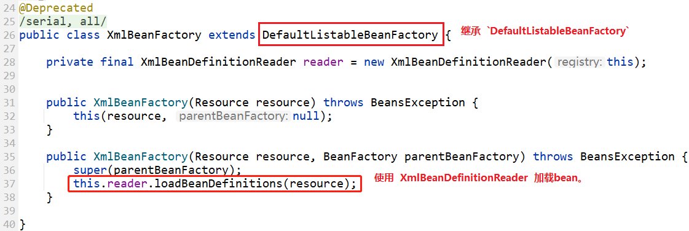
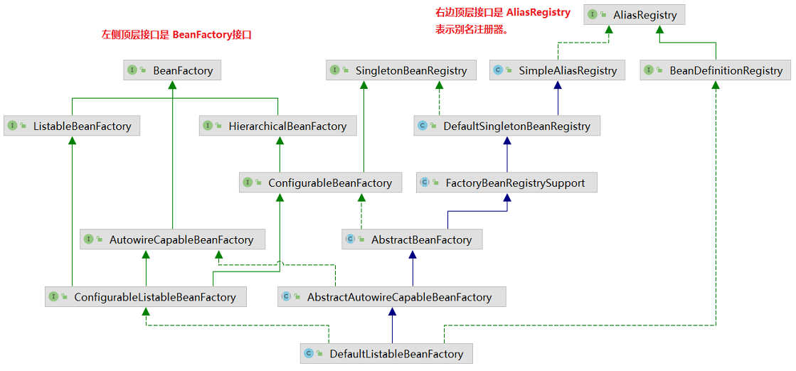
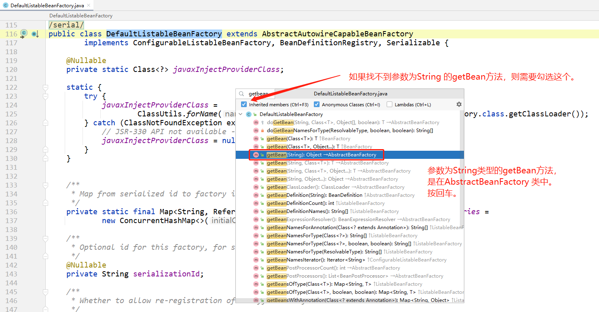
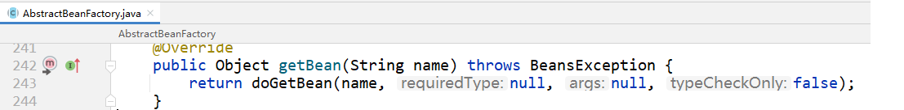

# 概述
- 工厂模式
- `org.springframework.beans` 包和 `org.springframework.context` 包是 Spring Framework 的 IoC 容器的基础。
- [`BeanFactory`](https:docs.spring.iospring-frameworkdocs5.3.5javadoc-apiorgspringframeworkbeansfactoryBeanFactory.html) 接口提供了一种能够管理任何类型对象的高级配置机制。 [`ApplicationContext`](https:docs.spring.iospring-frameworkdocs5.3.5javadoc-apiorgspringframeworkcontextApplicationContext.html)是`BeanFactory`的一个子接口,`ApplicationContext`增加了如下功能:
  - 更容易与 Spring 的 AOP 特性集成
  - 消息资源处理（用于国际化）
  - 事件发布
  - 应用层特定上下文，例如用于 Web 应用程序的`WebApplicationContext`。
- 简而言之，`BeanFactory` 提供了配置框架和基本功能，而`ApplicationContext` 添加了更多企业特定的功能。
> - *来源：[spring官方文档](https://docs.spring.io/spring-framework/docs/current/reference/html/core.html#beans-introduction)   原文:*
  - *The `org.springframework.beans` and `org.springframework.context` packages are the basis for Spring Framework’s IoC container.*
  - *The [`BeanFactory`](https://docs.spring.io/spring-framework/docs/5.3.5/javadoc-api/org/springframework/beans/factory/BeanFactory.html) interface provides an advanced configuration mechanism capable of managing any type of object. [`ApplicationContext`](https://docs.spring.io/spring-framework/docs/5.3.5/javadoc-api/org/springframework/context/ApplicationContext.html) is a sub-interface of `BeanFactory`. It adds:*
      - *Easier integration with Spring’s AOP features*
      - *Message resource handling (for use in internationalization)*
      - *Event publication*
      - *Application-layer specific contexts such as the `WebApplicationContext` for use in web applications.*
  - *In short, the `BeanFactory` provides the configuration framework and basic functionality, and the `ApplicationContext` adds more enterprise-specific functionality.*


# BeanFactory

- `BeanFactory`是访问 Spring bean 容器的根接口，是 bean 容器的基本客户端视图；

- 该接口的实现，持有了一些`bean定义`，每个`bean定义`由一个字符串名称唯一标识。根据 `bean 定义`，`bean工厂`将返回包含对象的独立实例（原型设计模式），或单例共享实例（单例设计模式的高级替代方案，其中实例是工厂范围内的单例）。返回哪种类型的实例取决于 bean factory 配置：API 是相同的。从 Spring 2.0 开始，根据具体的应用程序上下文可以使用更多范围（例如，网络环境中的`request`和`session`范围）。

- 请注意，通常最好依靠依赖注入（“推送”配置）通过 setter 或构造函数来配置应用程序对象，而不是使用任何形式的“拉”配置，例如 BeanFactory 查找。Spring 的依赖注入功能是使用这个 BeanFactory 接口及其子接口实现的。

- 此接口中的所有操作还将检查父工厂是否为 `HierarchicalBeanFactory`。如果在此工厂实例中未找到 bean，则会询问父工厂。此工厂实例中的 Bean 应该覆盖任何父工厂中的同名 Bean。

## bean生命周期
详见:[bean生命周期——初始化.md](./bean生命周期——初始化.md)
详见:[bean生命周期——销毁.md](./bean生命周期——销毁.md)


## 重要方法

```java
package org.springframework.beans.factory;
public interface BeanFactory {
    /**
	 * 用于取消引用 FactoryBean 实例并将其与 FactoryBean 创建的 bean 区分开来。
     * 例如，如果名为 myJndiObject 的 bean 是 FactoryBean，
     * 则获取 &myJndiObject 将返回工厂，而不是工厂返回的实例
	 */
	String FACTORY_BEAN_PREFIX = "&";

	Object getBean(String name) throws BeansException;
	<T> T  getBean(String name, Class<T> requiredType) throws BeansException;
	Object getBean(String name, Object... args) throws BeansException;
	<T> T  getBean(Class<T> requiredType) throws BeansException;
	<T> T  getBean(Class<T> requiredType, Object... args) throws BeansException;

	boolean containsBean(String name);

	boolean isSingleton(String name) throws NoSuchBeanDefinitionException;
	boolean isPrototype(String name) throws NoSuchBeanDefinitionException;

	boolean isTypeMatch(String name, ResolvableType typeToMatch) throws NoSuchBeanDefinitionException;
	boolean isTypeMatch(String name, Class<?> typeToMatch) throws NoSuchBeanDefinitionException;

	Class<?> getType(String name) throws NoSuchBeanDefinitionException;

	String[] getAliases(String name);
}
```

以上方法都很好理解。

包含了对bean的获取、判断是否存在、判断单例/原型、判断bean类型、获取bean类型、获取别名。

其中`getBean()`方法是最重要的。我们主要分析`getBean()`方法。

## `getBean`方法源码实现

## 容器基本用法

bean.xml

```xml
<?xml version="1.0" encoding="UTF-8"?>
<beans xmlns="http://www.springframework.org/schema/beans"
       xmlns:xsi="http://www.w3.org/2001/XMLSchema-instance"
       xsi:schemaLocation="http://www.springframework.org/schema/beans https://www.springframework.org/schema/beans/spring-beans-2.0.xsd">
    <bean id="helloService" class="org.springframework.tests.sample.beans.HelloService" />
</beans>
```

上面spring的xml配置中，我们只定义了一个bean：`org.springframework.tests.sample.beans.HelloService`

HelloService：

```java
package org.springframework.tests.sample.beans;

public class HelloService {
    public HelloService() {
        System.out.println("HelloService 构造方法.");
    }
    public void hello() {
        System.out.println("hello");
    }
}
```

测试用例：

```
    @Test
    public void testSimpleLoad() {
        XmlBeanFactory beanFactory = new XmlBeanFactory("bean.xml");
        HelloService bean = ((HelloService) beanFactory.getBean("helloService"));
        bean.hello();
    }
```

控制台打印：

```
HelloService 构造方法.
hello
```

以上就是基于xml的bean工厂最简单的使用方式。

> `XmlBeanFactory`其实已经过期了：
>
> @Deprecated   从 Spring 3.1 开始支持 `DefaultListableBeanFactory` 和 `XmlBeanDefinitionReader`
>
> 也就是从3.1开始，推荐使用上面这两个类来替代`XmlBeanFactory`。
>
> 改一下测试用例：
>
> ```
>     @Test
>     public void testHelloService() {
>         DefaultListableBeanFactory factory = new DefaultListableBeanFactory();
>         new XmlBeanDefinitionReader(factory).loadBeanDefinitions("bean.xml");
> 
>         HelloService bean = ((HelloService) factory.getBean("helloService"));
>         bean.hello();
>     }
> ```
>
> 其实看一眼`XmlBeanFactory`源码：发现其实`XmlBeanFactory`也是使用  `DefaultListableBeanFactory` 和 `XmlBeanDefinitionReader`来实现的。
>
> 
>
> 所以，我们主要从  `DefaultListableBeanFactory` 和 `XmlBeanDefinitionReader`这两个类入手看源码。


# DefaultListableBeanFactory

根据类名我们知道，这个类是：**默认的可列出的Bean工厂**    

> 其实就是`默认的Bean工厂`，就这么理解就行了！！别纠结 `Listable` 什么意思——并没有什么特殊的意思！！

## 类图



> 本篇文章主要讲解BeanFactory。AliasRegistry 别名注册器，[详见](../AliasRegistry别名注册器)

## `getBean(String)`源码：

> 我们一般在获取bean时，最常用的就是使用String类型的bean的id，来获取bean实例。
>
> 也就是`getBean(String)` 方法——参数有且只有一个，参数是`String`类型的。

我们用idea打开 `DefaultListableBeanFactory`类，然后使用 idea的`File Structure`功能*（默认快捷键是Ctrl+F3）*，找到`getBean(String)`这个方法：



**抽象BeanFactory：**



**`AbstractBeanFactory#doGetBean` 方法：**

> FBI WAINING :   下面源码逻辑非常复杂！！！
>
> 建议把源码下载下来，debug运行测试用例 `XmlBeanFactoryTests#testHelloService`，通过debug来阅读源码！！！

```java
	protected <T> T doGetBean(final String name, @Nullable final Class<T> requiredType,
							  @Nullable final Object[] args, boolean typeCheckOnly) throws BeansException {

		// transformedBeanName 做了两件事：
		// 1、删除工厂方法的&前缀（如果有）
		// 2、如果是 alias，则转换成真实的 beanName
		final String beanName = transformedBeanName(name);
		Object bean;

		// Eagerly check singleton cache for manually registered singletons.
		// 积极地尝试从缓存中获取单例bean，可能拿不到bean
		/*
		 * bean没在缓存中并且bean也不在创建中（需要从头执行创建流程），返回null
		 * 或 beanName对应的bean根本不存在，返回null
		 * 或 bean正在创建中，但spring还没构建好 ObjectFactory，返回null
		 * 后文还会调用此方法
		 */
		Object sharedInstance = getSingleton(beanName);
		if (sharedInstance != null && args == null) {
			// 取到了实例
			if (logger.isDebugEnabled()) {
				if (isSingletonCurrentlyInCreation(beanName)) {
					// 打出bean还未完全初始化好的log，因为有循环引用存在，Factory没处理完就先返回了bean实例
					logger.debug("Returning eagerly cached instance of singleton bean '" + beanName + "' that is not fully initialized yet - a consequence of a circular reference");
				} else {
					// log：返回了缓存的实例
					// 程序走到这里，bean应该是初始化完成了的，只不过在getSingleton时拿到的是创建过程中缓存的bean，
					// 通过 isSingletonCurrentlyInCreation 的判断，现在应该是处理完了。
					logger.debug("Returning cached instance of singleton bean '" + beanName + "'");
				}
			}

			// 获取给定bean实例的对象，bean实例本身或其创建的对象（如果是 FactoryBean）。
			bean = getObjectForBeanInstance(sharedInstance, name, beanName, null);
		} else {
			// Fail if we're already creating this bean instance:
			// We're assumably within a circular reference.
			if (isPrototypeCurrentlyInCreation(beanName)) {
				// 如果原型（prototype）bean在当前线程正在创建中（说明prototype类型的bean有循环依赖），抛出异常。
				// 比如: A(创建前先放入 prototypesCurrentlyInCreation )
				// 		-> B(创建前先放入 prototypesCurrentlyInCreation )
				// 		-> A(这里判断在prototypesCurrentlyInCreation中有，就是循环依赖)
				throw new BeanCurrentlyInCreationException(beanName);
			}

			// Check if bean definition exists in this factory.
			// 检查此工厂中是否存在bean定义。
			BeanFactory parentBeanFactory = getParentBeanFactory();
			if (parentBeanFactory != null && !containsBeanDefinition(beanName)) {
				// 当前BeanFactory没有beanName的BeanDefinition，检查父BeanFactory
				// Not found -> check parent.

				// 确定原始bean名称，将本地定义的别名解析为规范名称。
				// originalBeanName方法 比 transformedBeanName 多做了一件事：
				// 如果name以"&"开头，将转化后的标准名称加上"&"前缀
				String nameToLookup = originalBeanName(name);
				if (parentBeanFactory instanceof AbstractBeanFactory) {
					// 在父工厂取得bean
					return ((AbstractBeanFactory) parentBeanFactory).doGetBean(nameToLookup, requiredType, args, typeCheckOnly);
				} else if (args != null) {
					// Delegation to parent with explicit args.
					// 使用显式args委托父级。
					return (T) parentBeanFactory.getBean(nameToLookup, args);
				} else {
					// No args -> delegate to standard getBean method.
					// 没有args -> 委托给标准的getBean方法。
					return parentBeanFactory.getBean(nameToLookup, requiredType);
				}
			}
			// 调用此方法获取当前bean,是否仅为了类型检查
			if (!typeCheckOnly) {
				// 删除名为 beanName 的 mergedBeanDefinition 缓存
				// 让bean定义重新合并，以防万一其中一些元数据在此期间发生变化。
				// 添加 alreadyCreated 标记
				markBeanAsCreated(beanName);
			}

			try {
				// 重新合并BeanDefinition
				final RootBeanDefinition mbd = getMergedLocalBeanDefinition(beanName);
				// 校验是否是抽象类，是的话抛出异常
				checkMergedBeanDefinition(mbd, beanName, args);

				// Guarantee initialization of beans that the current bean depends on.
				// 保证当前bean依赖的bean的初始化。
				String[] dependsOn = mbd.getDependsOn();
				if (dependsOn != null) {
					for (String dep : dependsOn) {
						if (isDependent(beanName, dep)) {
							// 循环依赖的情况报错 : 使用 @DependsOn 注解标注的循环依赖,Spring无法自动解决.
							throw new BeanCreationException(mbd.getResourceDescription(), beanName, "Circular depends-on relationship between '" + beanName + "' and '" + dep + "'");
						}
						// 记录依赖关系
						registerDependentBean(dep, beanName);
						try {
							// 先初始化依赖的bean，递归getBean
							getBean(dep);
						} catch (NoSuchBeanDefinitionException ex) {
							throw new BeanCreationException(mbd.getResourceDescription(), beanName, "'" + beanName + "' depends on missing bean '" + dep + "'", ex);
						}
					}
				}

				// Create bean instance.
				// 创建bean实例
				if (mbd.isSingleton()) {
					// Singleton 的情况

					// 创建一个 ObjectFactory 隐藏实际创建 bean 的细节(注:这里并没有把ObjectFactory放到三级缓存中)
					sharedInstance = getSingleton(beanName, new ObjectFactory<Object>() {
                        @Override
                        public Object getObject() throws BeansException {
                            try {
                                Object createdBean = createBean(beanName, mbd, args);
                                return createdBean;
                            } catch (BeansException ex) {
                                // Explicitly remove instance from singleton cache: It might have been put there
                                // eagerly by the creation process, to allow for circular reference resolution.
                                // Also remove any beans that received a temporary reference to the bean.
                                // 从单例缓存中显式删除实例：它可能已经被创建过程急切地放在那里，以允许循环引用解析。
                                // 也删除任何接收到bean的临时引用的bean。
                                destroySingleton(beanName);
                                throw ex;
                            }
                        }
                    });
					// 获取给定 bean 实例的对象，bean 实例本身或其创建的对象（如果是 FactoryBean）。
					// 这里正常会调用到 AbstractAutowireCapableBeanFactory 类的 getObjectForBeanInstance()
					// 里边调用super.getObjectForBeanInstance 最终调用到 AbstractBeanFactory(本类)的 getObjectForBeanInstance()
					bean = getObjectForBeanInstance(sharedInstance, name, beanName, mbd);
				} else if (mbd.isPrototype()) {
					// Prototype 的情况
					// It's a prototype -> create a new instance.
					Object prototypeInstance = null;
					try {
						// 记录当前线程正在创建的 beanName
						beforePrototypeCreation(beanName);
						prototypeInstance = createBean(beanName, mbd, args);
					} finally {
						// 移除当前线程正在创建的 beanName
						afterPrototypeCreation(beanName);
					}
					// 获取给定bean实例的对象，bean实例本身或其创建的对象（如果是 FactoryBean）。
					bean = getObjectForBeanInstance(prototypeInstance, name, beanName, mbd);
				} else {
					// 非单例非原型 的情况
					String scopeName = mbd.getScope();
					final Scope scope = this.scopes.get(scopeName);
					if (scope == null) {
						// 没找到Scope报错
						throw new IllegalStateException("No Scope registered for scope name '" + scopeName + "'");
					}
					try {
						// 由注册进来的Scope来保证bean的范围
						Object scopedInstance = scope.get(beanName, () -> {
							beforePrototypeCreation(beanName);
							try {
								return createBean(beanName, mbd, args);
							} finally {
								afterPrototypeCreation(beanName);
							}
						});
						// 获取给定bean实例的对象，bean实例本身或其创建的对象（如果是 FactoryBean）。
						bean = getObjectForBeanInstance(scopedInstance, name, beanName, mbd);
					} catch (IllegalStateException ex) {
						throw new BeanCreationException(beanName,
								"Scope '" + scopeName + "' is not active for the current thread; consider " +
										"defining a scoped proxy for this bean if you intend to refer to it from a singleton",
								ex);
					}
				}
			} catch (BeansException ex) {
				// 清除 alreadyCreated 标记
				cleanupAfterBeanCreationFailure(beanName);
				throw ex;
			}
		}

		// Check if required type matches the type of the actual bean instance.
		// 检查所需类型是否与实际bean实例的类型匹配。举例:如果当前bean是String类型,但是需要的类型requiredType=Integer类型,则会进行类型转换.
		if (requiredType != null && !requiredType.isInstance(bean)) {
			try {
				T convertedBean = getTypeConverter().convertIfNecessary(bean, requiredType);
				if (convertedBean == null) {
					throw new BeanNotOfRequiredTypeException(name, requiredType, bean.getClass());
				}
				return convertedBean;
			} catch (TypeMismatchException ex) {
				if (logger.isDebugEnabled()) {
					logger.debug("Failed to convert bean '" + name + "' to required type '" +
							ClassUtils.getQualifiedName(requiredType) + "'", ex);
				}
				throw new BeanNotOfRequiredTypeException(name, requiredType, bean.getClass());
			}
		}
		return (T) bean;
	}
```

> 建议：
>
> 上面代码中，注释了很多内容，比如循环依赖、Bean后置处理器、AOP等，
>
> 但是建议刚开始学的源码的时候，先不要纠结这些高级模块，
>
> 就先使用debug，把测试用例  `XmlBeanFactoryTests#testHelloService` 主要流程理解透，就非常牛逼了。
>
> 本篇文章，也只是学习`BeanFactory`这一个类。千万不要钻的太里面了。


# XmlBeanDefinitionReader


支持三种`bean定义读取器`，其实也就对应三种配置bean的方式：

- xml
- groovy
- properties

详见：[bean定义读取器](../bean定义读取器)


# 问题

- spring bean生命周期是？[参考博客](https://www.jianshu.com/p/1dec08d290c1)
  - 实例化 createBeanInstance()
  - 属性赋值 populateBean()
  - 初始化 initializeBean()
  - 销毁 Destruction
- *spring 实例化bean三种方式 [参考官方文档](https://docs.spring.io/spring-framework/docs/current/reference/html/core.html#beans-factory-class)
  - 使用构造器
  - 使用静态工厂方法
  - 使用一个工厂方法


# 源码阅读

https://github.com/liuxianfa520/spring-framework

org.springframework.beans.factory.xml.XmlBeanFactoryTests#testHelloService


# 资源

BeanFactory#getBean方法源码讲解视频： https://www.bilibili.com/video/BV1oW41167AV?p=49

强烈推荐的一本书：《Spring源码深度解析（第2版）》


