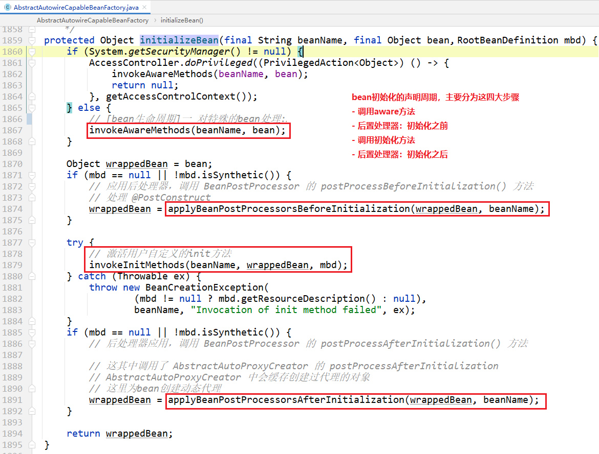

# bean生命周期——初始化

全套初始化方法及其标准顺序是：

org.springframework.beans.factory.support.AbstractAutowireCapableBeanFactory#initializeBean

- [invokeAwareMethods(beanName, bean);](images/image-20210813210151581.png)
    - BeanNameAware#setBeanName
    - BeanClassLoaderAware#setBeanClassLoader
    - BeanFactoryAware#setBeanFactory
- [applyBeanPostProcessorsBeforeInitialization](images/image-20210813210129856.png)   后置处理器：初始化之前
    - [ApplicationContextAwareProcessor](images/image-20210813210649664.png) 其实调用到了这个后置处理器中。
        - EnvironmentAware#setEnvironment
        - EmbeddedValueResolverAware#setEmbeddedValueResolver
        - ResourceLoaderAware#setResourceLoader                                            (仅在应用程序上下文中运行时适用)
        - ApplicationEventPublisherAware#setApplicationEventPublisher        (仅在应用程序上下文中运行时适用)
        - MessageSourceAware#setMessageSource                                              (仅在应用程序上下文中运行时适用)
        - ApplicationContextAware#setApplicationContext                                  (仅在应用程序上下文中运行时适用)
    - [ServletContextAware#setServletContext](images/image-20210813201437975.png)                                                         (仅适用于在 Web 应用程序上下文中运行时)
    - BeanPostProcessors#postProcessBeforeInitialization                                （用户自己的bean）
- [invokeInitMethods(beanName, wrappedBean, mbd);](images/image-20210813203630259.png)
    - InitializingBean#afterPropertiesSet
    - a custom init-method definition
- [applyBeanPostProcessorsAfterInitialization](images/image-20210813210031183.png)
    - BeanPostProcessors#postProcessAfterInitialization

# bean生命周期——销毁

在关闭 bean 工厂时，以下生命周期方法会被调用：  [销毁bean详见](./bean生命周期——销毁.md)

- DestructionAwareBeanPostProcessor#postProcessBeforeDestruction
- DisposableBean#destroy
- a custom destroy-method definition

# 生命周期的应用

**问题：上述生命周期中，开发者可以实现哪些呢？**

> - 所有的Aware接口
> - BeanPostProcessors
> - InitializingBean#afterPropertiesSet
> - a custom init-method definition
> - DestructionAwareBeanPostProcessor 后置处理器：销毁前
> - DisposableBean#destroy
> - a custom destroy-method definition

貌似是，以上生命周期的接口、方法，都是可以实现的。
