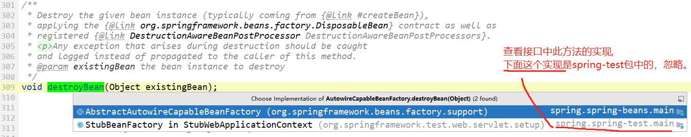
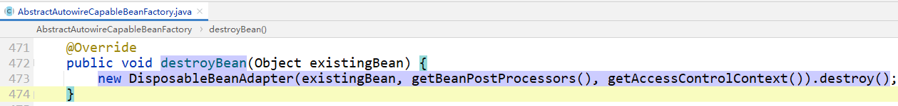
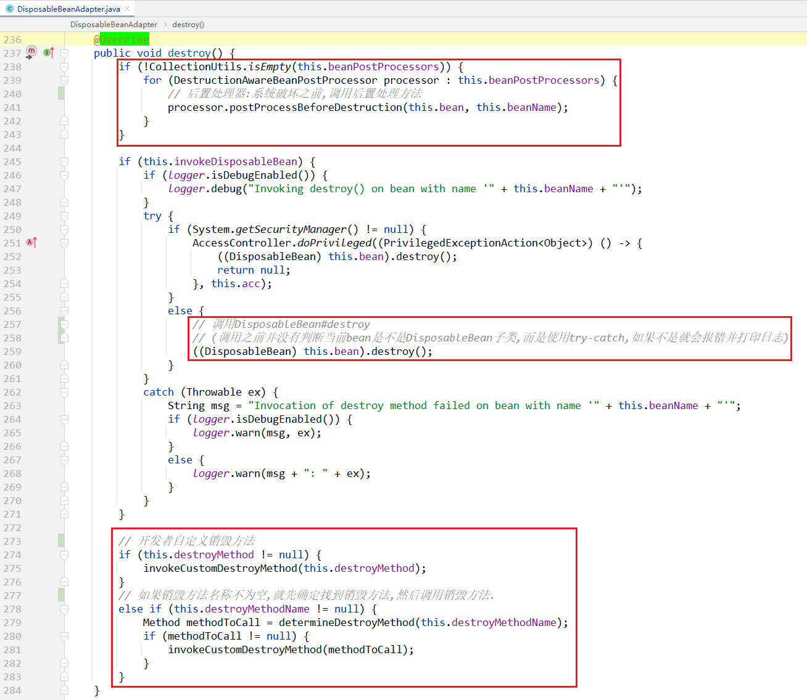

bean生命周期中，包含了三个销毁的方法：

在关闭 bean 工厂时，以下生命周期方法会被调用：

- DestructionAwareBeanPostProcessor#postProcessBeforeDestruction
- DisposableBean#destroy
- a custom destroy-method definition


# bean工厂销毁bean

在 org.springframework.beans.factory.BeanFactory 这个最基本的bean工厂中，并**没有销毁bean的方法**，但是其中一个子接口中有：

```java
public interface AutowireCapableBeanFactory extends BeanFactory {
    void destroyBean(Object existingBean); // 传入一个存在的bean对象，销毁这个bean
}    
```


并且这个方法只在一个子类中实现了：`AbstractAutowireCapableBeanFactory#destroyBean`



实现方法：



上面方法中，new了一个`DisposableBeanAdapter`，并调用其 `destroy()` 方法。


# DisposableBeanAdapter

从名字上我们猜测是：销毁bean的适配器

类上的注释：

```java
/**
 * Adapter that implements the {@link DisposableBean} and {@link Runnable}
 * interfaces performing various destruction steps on a given bean instance:
 * <ul>
 * <li>DestructionAwareBeanPostProcessors;
 * <li>the bean implementing DisposableBean itself;
 * <li>a custom destroy method specified on the bean definition.
 * </ul>
 */
class DisposableBeanAdapter implements DisposableBean, Runnable, Serializable {
}    
```

实现了 `DisposableBean` 和 `Runnable` 接口，在给定的 bean 实例上执行各种销毁步骤：

- DestructionAwareBeanPostProcessors
- 实现 DisposableBean 本身的 bean；
- 在 bean 定义中指定的自定义销毁方法。




# 疑问

一、为什么此类实现了 `DisposableBean` 和 `Runnable` 接口？有什么作用呢？


