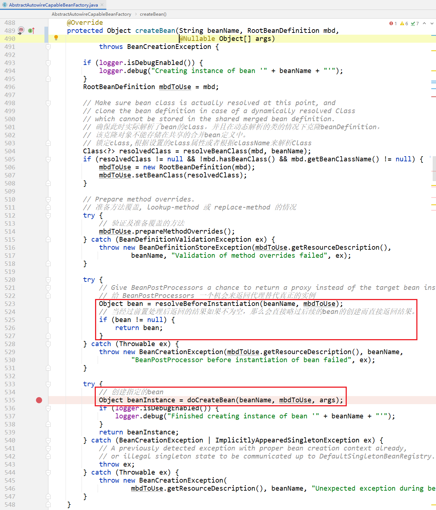
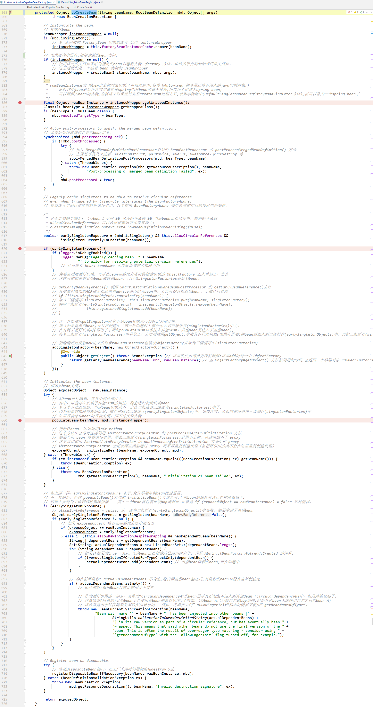

# AbstractAutowireCapableBeanFactory

创建bean的方法，都是在 `AbstractAutowireCapableBeanFactory` 类中。主要由以下两个方法来完成的：

- createBean 
- doCreateBean


# createBean方法

这个方法中，主要有两个步骤：

- 给bean后置处理器一个机会，如果bean后置处理器可以返回bean实例，就直接使用，并放到容器中。
- 返回就调用 `doCreateBean(beanName, mbd, args);` 方法去真正的创建bean实例。
- *（下面方法把各种校验、日志、异常控制全都忽略了。只留下最重要的两个步骤）*

```java
@Override
protected Object createBean(String beanName, RootBeanDefinition mbd, @Nullable Object[] args) {
    Object bean = resolveBeforeInstantiation(beanName, mbd); // 实例化bean之前的处理器
    if (bean != null) {
        return bean;
    }
	return doCreateBean(beanName, mbd, args);
}
```




# doCreateBean方法

流程图，见腾讯文档：https://docs.qq.com/flowchart/DQWtWUG5acVZsdXV6




# 流程图

https://docs.qq.com/mind/DQUlJSm5Zdnlub25L

