# bean后置处理器

顶级接口是 `org.springframework.beans.factory.config.BeanPostProcessor`

> 后置处理器，算是一种`bean生命周期`的接口。
>
> 详见： [bean生命周期——初始化.md](..\BeanFactory\bean生命周期——初始化.md)      [bean生命周期——销毁.md](..\BeanFactory\bean生命周期——销毁.md) 
>
> Spring中很多组件，都是基于`后置处理器`来实现的。所以非常重要！！！

子接口结构图如下：

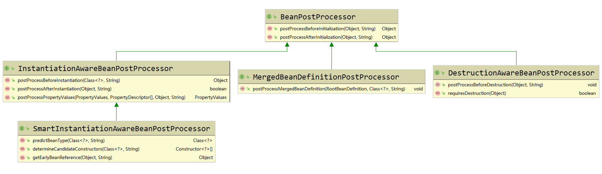


# BeanPostProcessor

此接口是顶级接口。存在的两个方法，可以对每个bean，在初始化前后，做一些自定义的操作。

- Object postProcessBeforeInitialization(Object bean, String beanName);
  - 在bean初始化之前，可以对bean做一些处理。
- Object postProcessAfterInitialization(Object bean, String beanName);
  - 在bean初始化之后，可以对bean做一些处理。

### 调用栈：

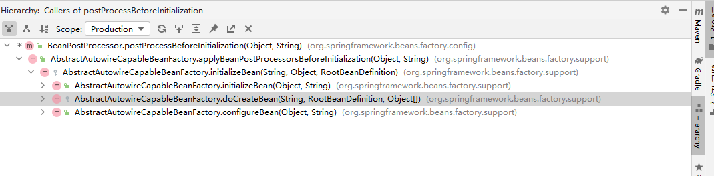

通过调用栈，可以看到：

1、在doCreateBean()创建bean过程中，填充bean中的属性之后，会调用 `initializeBean(beanName, exposedObject, mbd);`去初始化bean：

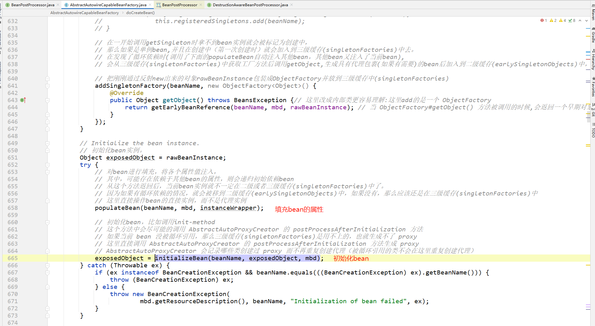

具体初始化流程：

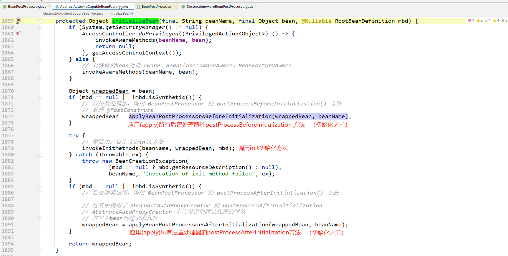

### 应用：

org.springframework.context.support.ApplicationContextAwareProcessor

结构：是 BeanPostProcessor 的直接实现类。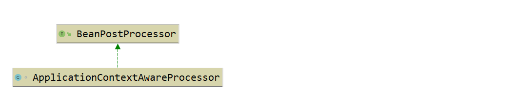

作用：

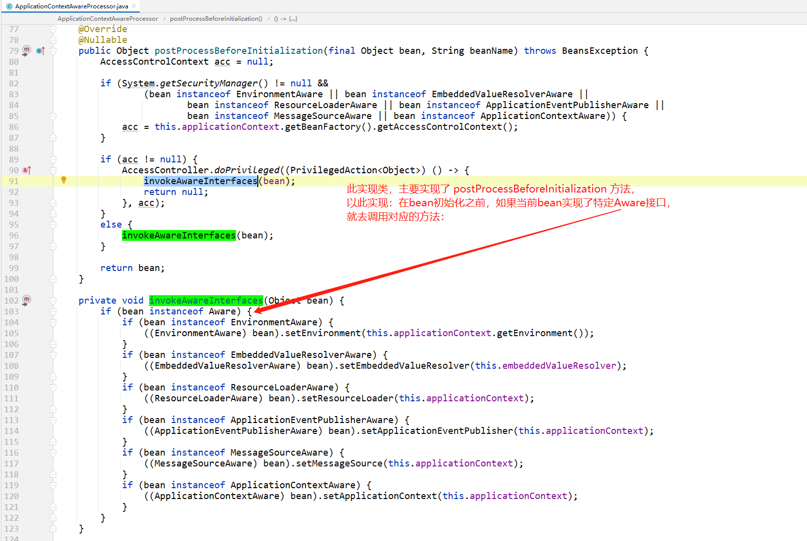


# InstantiationAwareBeanPostProcessor

根据接口名可以理解：这是个可以感知bean实例化的bean后置处理器。

也就是可以在bean实例化之前/之后做一些操作。

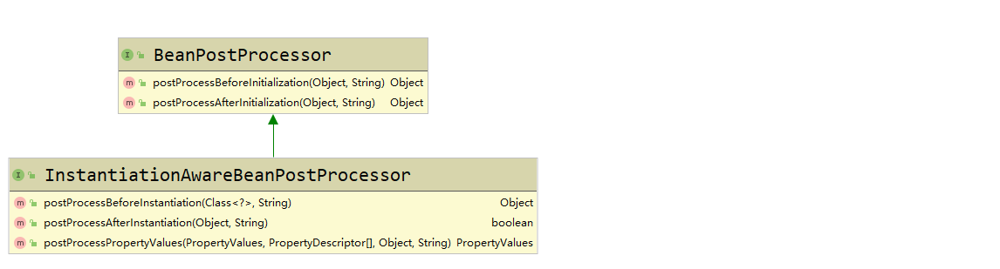

- ```java
  Object postProcessBeforeInstantiation(Class<?> beanClass, String beanName) throws BeansException;
  ```

  - 在spring默认的bean创建(实例化)之前，如果后置处理器返回一个bean实例（bean !=null），则直接拿去使用。
  - 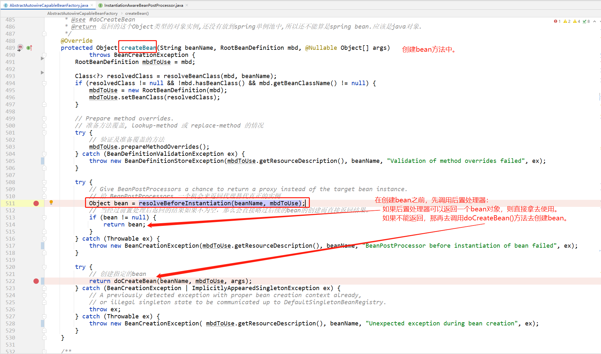
  - 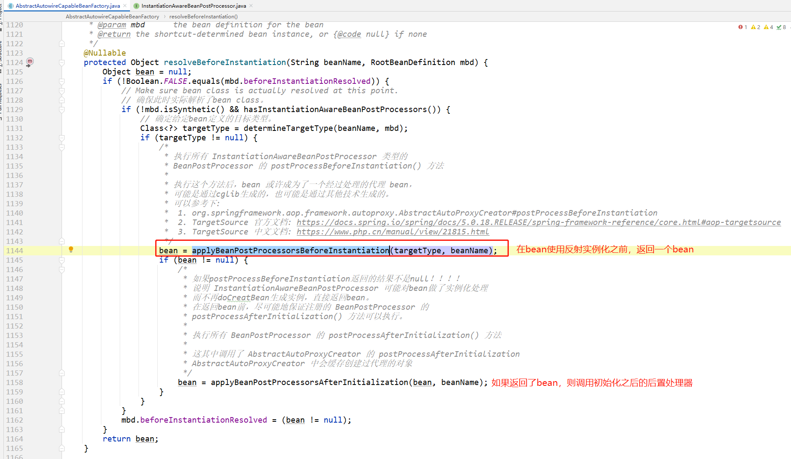
  - 应用：
    - 

- ```java
  boolean postProcessAfterInstantiation(Object bean, String beanName) throws BeansException;
  ```

  - 在bean实例化之后，做一些操作。
  - 返回值boolean：如果需要给当前bean填充属性则返回true；否则返回false。默认为true 。返回false还将防止在此bean上调用任何后续的InstantiationAwareBeanPostProcessor实例。【bean填充的短路操作】
  - 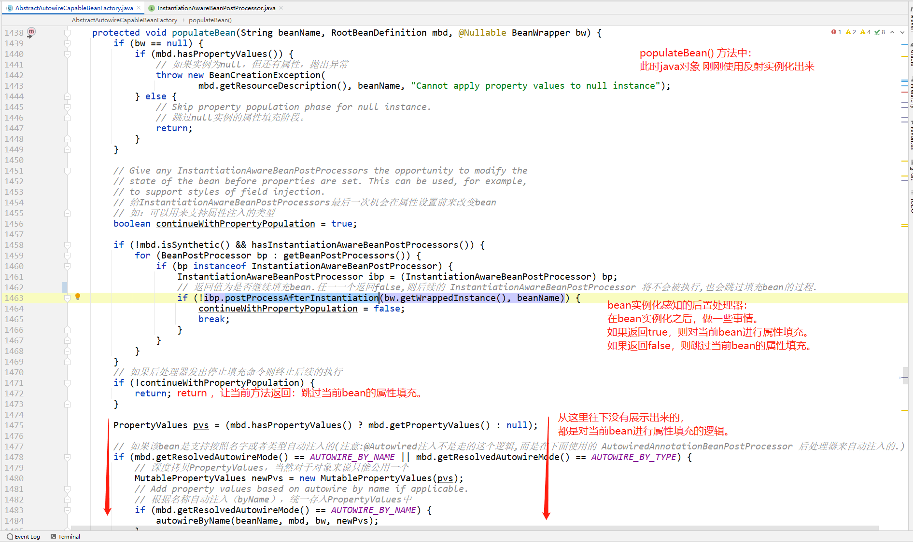
  - 应用：
    - 

- ```java
  PropertyValues postProcessPropertyValues(
       PropertyValues pvs, PropertyDescriptor[] pds, Object bean, String beanName) throws BeansException;
  ```

  - 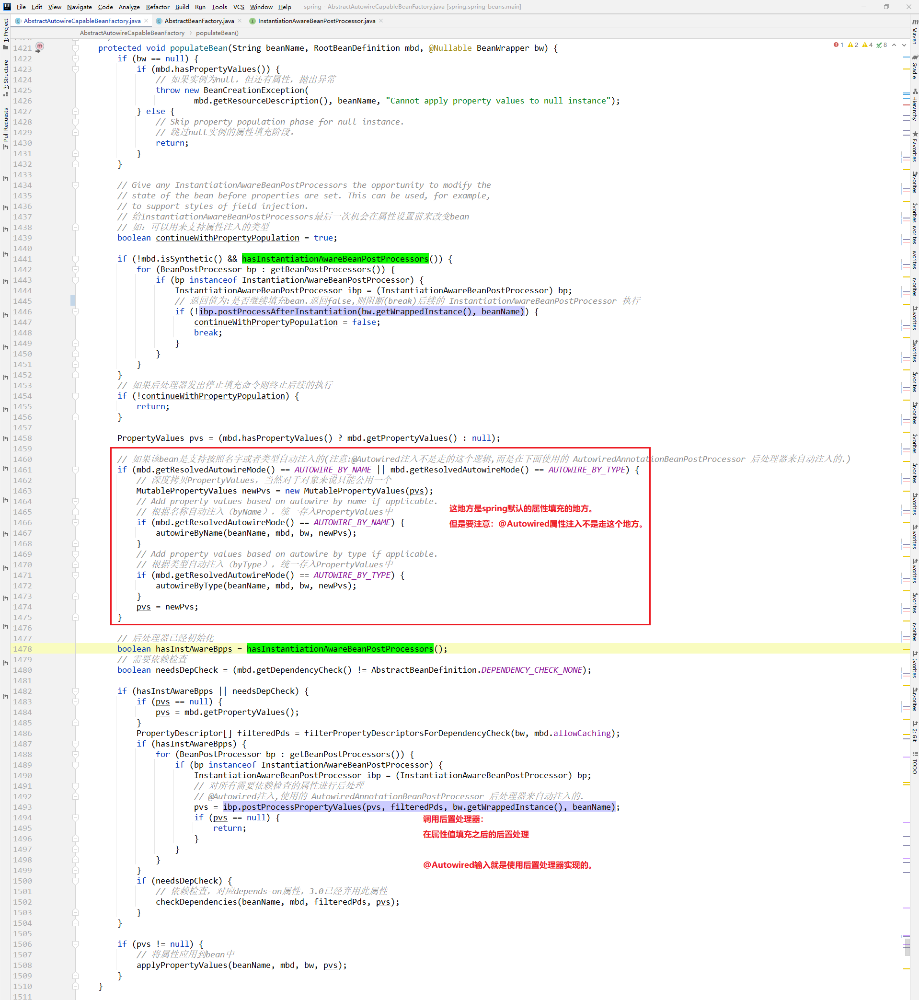
  - 应用：
    - AutowiredAnnotationBeanPostProcessor#postProcessPropertyValues 
    - CommonAnnotationBeanPostProcessor#postProcessPropertyValues


# SmartInstantiationAwareBeanPostProcessor

此接口是 上一章节 InstantiationAwareBeanPostProcessor 的子接口，又添加了三个方法：

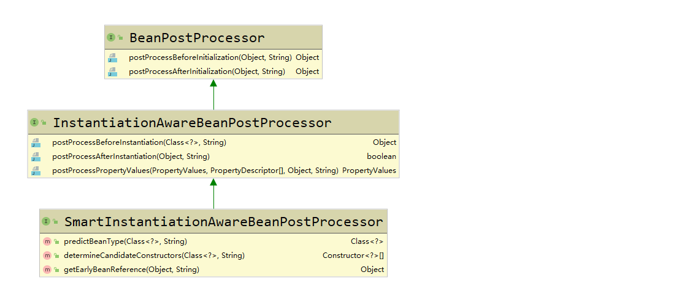

其中最后一个方法  `Object getEarlyBeanReference(Object bean, String beanName)` 在aop中使用到了：

> **AbstractAutoProxyCreator#getEarlyBeanReference**
>
> - 在早期引用的时，对目标bean创建代理对象。
>
> - 注：只有存在循环依赖时，才会使用此方式创建代理对象
>
>   详见[《aop.md》中：在bean的哪些生命周期时创建aop代理对象？](../AOP/aop.md)


# DestructionAwareBeanPostProcessor

结构：是 BeanPostProcessor 的子接口。

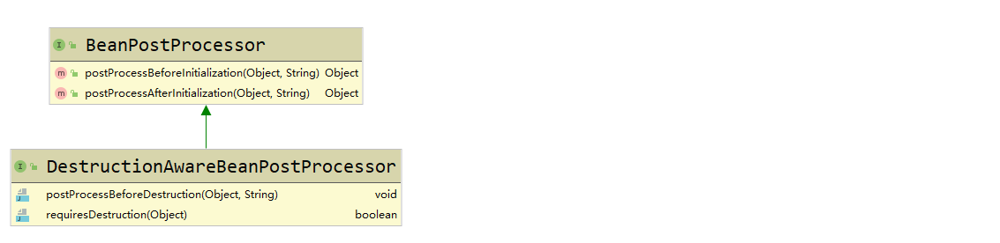

新增了两个方法：

- 在bean销毁方法调用之前，可以做一些事情。

```java
void postProcessBeforeDestruction(Object bean, String beanName)
```

- 确定给定的bean实例是否需要此后处理器销毁。
  默认实现返回true 。 如果Spring 5之前版本未实现此方法则Spring会默认为true。

```java
default boolean requiresDestruction(Object bean) {
   return true;
}
```

应用：

- [生命周期注解@PostConstruct和@PreDestroy源码实现](../面试题/生命周期注解@PostConstruct和@PreDestroy源码实现/readme.md)


# MergedBeanDefinitionPostProcessor

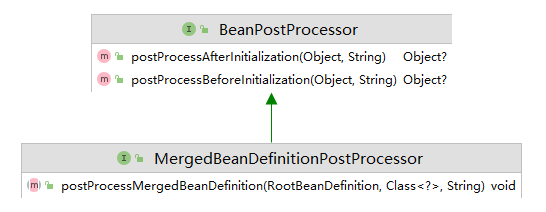

应用：

- [生命周期注解@PostConstruct和@PreDestroy源码实现](../面试题/生命周期注解@PostConstruct和@PreDestroy源码实现)         InitDestroyAnnotationBeanPostProcessor
- [@Autowired注解源码实现](../面试题/@Autowired注解源码实现)       AutowiredAnnotationBeanPostProcessor
- [@Resource注解源码实现](../面试题/@Resource注解源码实现)         CommonAnnotationBeanPostProcessor


# 不同容器的处理方式

> 重要的一点是，`BeanFactory`和`ApplicationContext`对待bean后置处理器稍有不同。`ApplicationContext`会自动检测在配置文件中实现了`BeanPostProcessor`接口的所有bean，并把它们注册为后置处理器，然后在容器创建bean的适当时候调用它。部署一个后置处理器同部署其他的bean并没有什么区别。而使用`BeanFactory`实现的时候，bean 后置处理器必须通过下面类似的代码显式地去注册：
>
> ```java
> ConfigurableBeanFactory factory = new XmlBeanFactory(...);
>             
> // 需要手动注册需要的 BeanPostProcessor
> MyBeanPostProcessor postProcessor = new MyBeanPostProcessor();
> factory.addBeanPostProcessor(postProcessor);
> 
> // 开始使用factory
> factory.getBean("xxxxx");
> ```
>
> 因为显式注册的步骤不是很方便，这也是为什么在各种Spring应用中首选`ApplicationContext`的一个原因，特别是在使用`BeanPostProcessor`时。

对于上面的描述，你是否有这样的疑问：`ApplicationContext`为什么就能够自动检测`BeanPostProcessor`呢？

其实在 refresh() 方法中有  `registerBeanPostProcessors(beanFactory);` 方法去处理这部分逻辑：

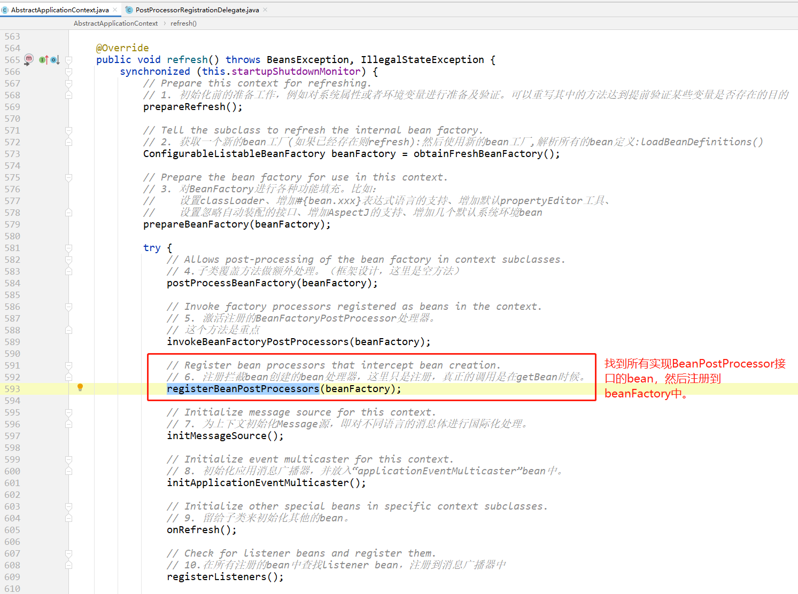


# 设计模式

- 使用了策略模式

- 理解：所有的bean后置处理器都实现了相同的接口，每个子类存在不同的实现逻辑：可以根据参数在子类的方法中判断如何进行处理：
  - 有的对bean做了修改
    - aop   详见 [aop.md](..\AOP\aop.md)
      - AbstractAutoProxyCreator#getEarlyBeanReference 在早期引用的时，对目标bean创建代理对象。（只有存在循环依赖时，才会使用此方式创建代理对象）
      - AbstractAutoProxyCreator#postProcessAfterInitialization 在bean初始化完毕后，对目标bean创建代理对象。
  - 有的对bean中方法进行调用
    - AutowiredAnnotationBeanPostProcessor 在postProcessPropertyValues方法中，处理@Autowired、@Value、@Inject 注解
    - CommonAnnotationBeanPostProcessor 在postProcessPropertyValues方法中，处理javax.annotation.Resource、javax.xml.ws.WebServiceRef、javax.ejb.EJB 注解。
    - ApplicationContextAwareProcessor 在postProcessBeforeInitialization方法中，调用invokeAwareInterfaces(Object bean)方法，去调用实现了Aware接口相关方法。
    - InitDestroyAnnotationBeanPostProcessor#postProcessBeforeInitialization调用有javax.annotation.PostConstruct注解的方法
- 使用策略模式代替了if-else
- BeanPostProcessor使用了策略模式视频讲解：https://m.bilibili.com/video/BV1uE411d7L5?p=13 （子路老师）


# spring文档

- [容器扩展点之——使用BeanPostProcessor自定义bean](https://docs.spring.io/spring-framework/docs/current/reference/html/core.html#beans-factory-extension-bpp)

- [使用BeanPostProcessor实现bean生命周期](https://docs.spring.io/spring-framework/docs/current/reference/html/core.html#beans-factory-lifecycle)


# 参考

