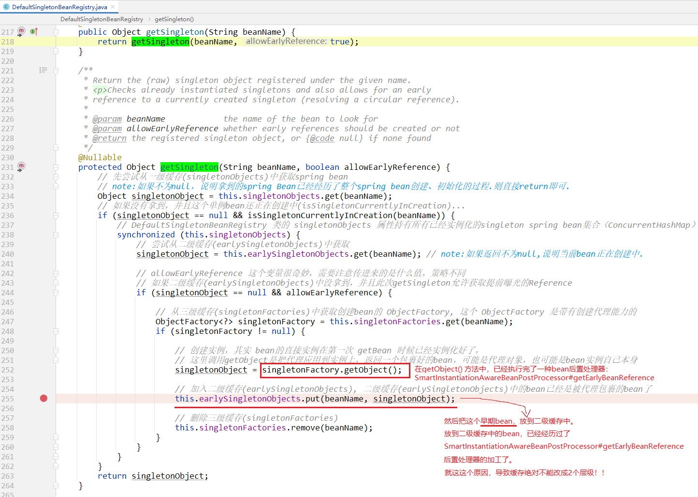
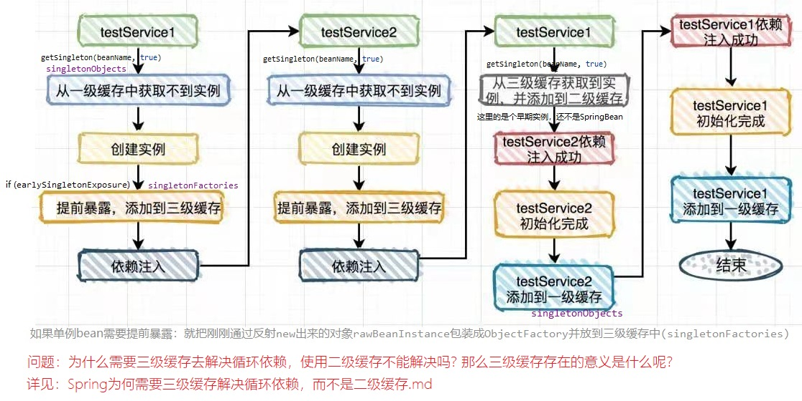
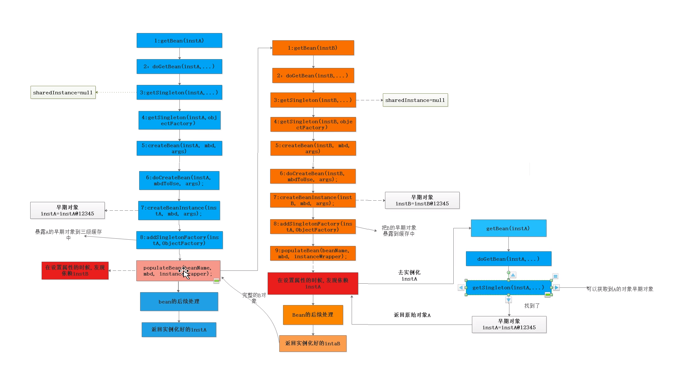
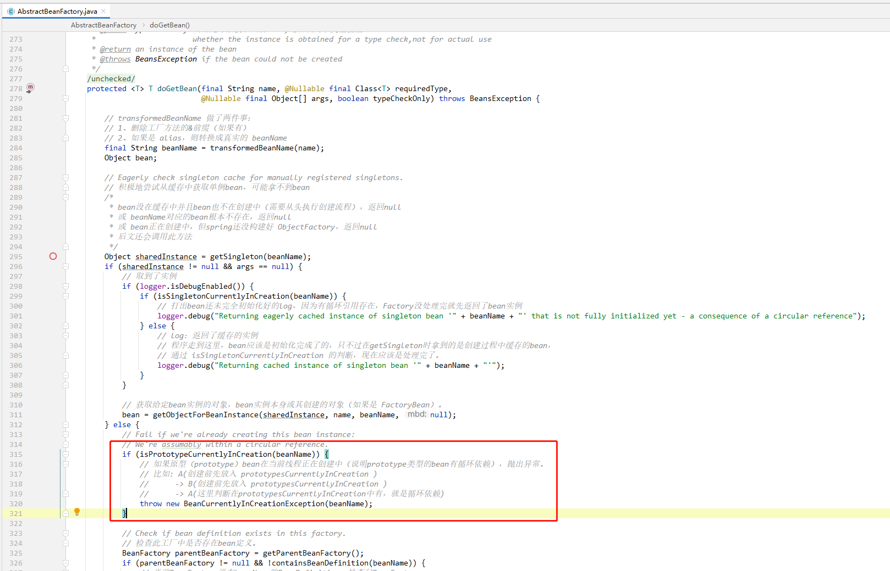
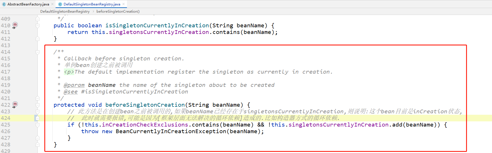
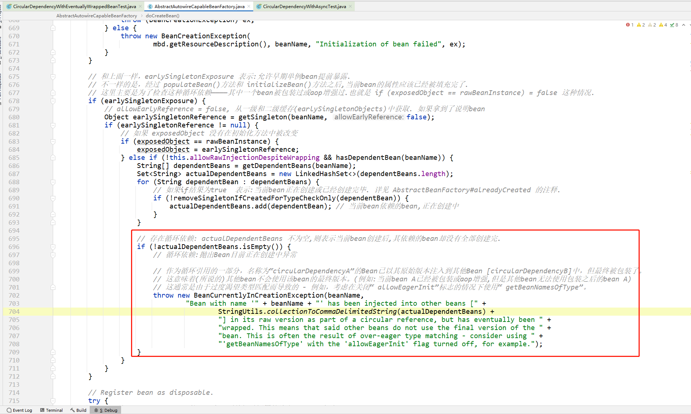
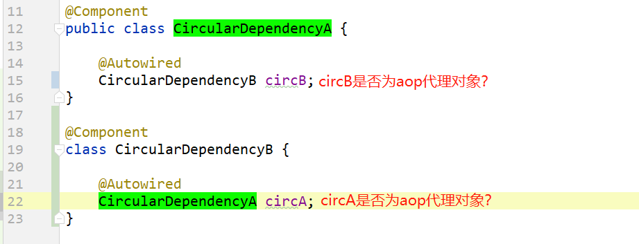

# spring循环依赖

- spring**默认**支持**单例bean**之间**基于setter注入**的循环依赖。
- 默认：AbstractAutowireCapableBeanFactory#allowCircularReferences 默认为true。只要修改为false则让spring不支持循环依赖。
- 单例bean：protype原型模式的bean存在循环依赖时，会直接报错。
- 基于setter：如果单例bean是基于构造器注入的循环依赖，会直接报错。

[spring官方文档：依赖处理过程](https://docs.spring.io/spring-framework/docs/current/reference/html/core.html#beans-dependency-resolution)

# 问题

- spring能解决哪种循环依赖问题？
  - 单例bean setter方式依赖注入的循环依赖问题。
  - 通过构造器注入的循环依赖问题，无法解决。
  - prototype bean的循环依赖问题，无法解决。
  - 会抛出异常： `BeanCurrentlyInCreationException`
- 是通过哪种方式解决的？
  - 是使用 暴露**早期bean**引用的方式 —— 把早期bean的引用放到 **singletonFactories** 三级缓存中。
  - 早期bean：指尚未经过**bean填充**和**初始化**的对象。
  - bean填充：populateBean(beanName, mbd, instanceWrapper);
  - 初始化：initializeBean(beanName, exposedObject, mbd);
- 【重要】Spring ioc容器中的三级缓存分别是什么？存放的分别是什么样的对象？能否改成两个缓存？
  - 不能的！
  - 一级缓存   单例的Spring bean        `Map<String, Object> singletonObjects`
  - 二级缓存   早期单例对象                  `Map<String, Object> earlySingletonObjects `    
    - 刚刚new出来的`原生的bean对象` （我称其为`rawBeanInstance`），但是已经经历过 `SmartInstantiationAwareBeanPostProcessor#getEarlyBeanReference` 这个bean生命周期了。
  - 三级缓存   早期单例对象的工厂      `Map<String, ObjectFactory<?>> singletonFactories`
  - 参考 [Spring解决循环依赖的步骤【简图】.jpg](./Spring解决循环依赖的步骤【简图】.jpg) ，我们看到：
    - 如果正在创建中的单例bean A需要允许提前暴露（`earlySingletonExposure`），就把刚刚通过反射new出来的对象`rawBeanInstance`包装成`ObjectFactory`并放到三级缓存中(`singletonFactories`)
    - 当bean B需要注入bean A时，就会调用`getBean("A")`，然后调用到：

# 测试用例

https://github.com/liuxianfa520/spring-framework

com.atguigu.test.circularReference.useSetter.CircularDependencyTest

# 图示

# 无法解决的循环依赖

## 原型模式

com.atguigu.test.circularReference.prototype.CircularDependencyWithPrototypeBeanTest

## 构造器方式

com.atguigu.test.circularReference.useConstructor.CircularDependencyUseConstructorTest

## 最终bean被包装 has eventually been wrapped

com.atguigu.test.circularReference.withEventuallyWrappedBean.withEventuallyWrappedBean.CircularDependencyWithEventuallyWrappedBeanTest

com.atguigu.test.circularReference.withEventuallyWrappedBean.withAsyncAnnotation.CircularDependencyWithAsyncTest

# 一个超纲的问题

在spring中，aop增强两个存在循环引用的bean，各自注入的bean，是否为代理对象呢？spring是如何实现的？

- 首先要知道spring是如何解决循环依赖的
- 要知道aop在bean生命周期中，什么时候创建代理对象的。（有两个地方）