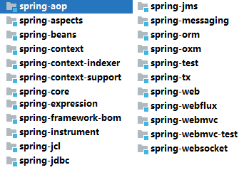

以下内容转自并有所修改:
https://github.com/ThinkingHan/Java-note/blob/master/Spring%E9%9D%A2%E8%AF%95.md

# **一、基本概念面试题集（ Spring 相关概念梳理）**

1. 谈谈对 Spring IoC 的理解？

2. 谈谈对 Spring DI 的理解？

3. BeanFactory 接口和 ApplicationContext 接口不同点是什么？

   > [`BeanFactory`](https:docs.spring.iospring-frameworkdocs5.3.5javadoc-apiorgspringframeworkbeansfactoryBeanFactory.html) 接口提供了一种能够管理任何类型对象的高级配置机制。 [`ApplicationContext`](https:docs.spring.iospring-frameworkdocs5.3.5javadoc-apiorgspringframeworkcontextApplicationContext.html)是`BeanFactory`的一个子接口,`ApplicationContext`增加了如下功能:
   >
   > - 更容易与 Spring 的 AOP 特性集成
   > - 消息资源处理（用于国际化）
   > - 事件发布
   > - 应用层特定上下文，例如用于 Web 应用程序的`WebApplicationContext`。
   >
   > 简而言之，`BeanFactory` 提供了配置框架和基本功能，而`ApplicationContext` 为企业级应用程序开发而添加了特定的功能模块。

4. 请介绍你熟悉的 Spring 核心类，并说明有什么作用？

   > BeanFactory  ApplicationContext  AliasRegistry
   >
   > BeanDefinition  BeanDefinitionRegistry  
   >
   > BeanPostProcessor  Aware  InitializingBean  DisposableBean

5. 介绍一下 Spring 的事务的了解？

   > - 什么是事务？
   >
   > - ACID——为了保证数据一致性（要么全部成功，要么全部失败）
   >
   > - Spring事务：编程式事务、声明式事务
   > - 事务传播特性

6. 介绍一下 Spring 的事务实现方式？

   > 声明式事务，是基于AOP实现的
   >
   > 编程式事务，使用什么实现？todo：

7. 解释 AOP 模块

   > [详见](./AOP/aop.md)

8. Spring 的通知类型有哪些，请简单介绍一下？

   > Before  After  AfterReturning  AfterThrowing  Around

9. Spring 通知类型使用场景分别有哪些？

10. 请介绍一下你对 Spring Beans 的理解?

11. Spring 有哪些优点?

12. Spring 框架由那几部分组成？

    > 
    >
    > core   beans   context  aop   aspects
    >
    > jdbc   tx  
    >
    > web   webmvc

13. 谈谈你对 BeanFactory的理解，BeanFactory 实现举例     [BeanFactory.md](BeanFactory\BeanFactory.md) 

14. 谈谈对 Spring 中的 Web 模块的理解

15. 谈谈你对 Spring 依赖注入的理解？

16. 什么是 Bean 装配?

17. 什么是 Bean 的自动装配？

18. 介绍一下自动装配有几种方式？

19. 什么是基于注解的容器配置?

20. 简述 JdbcTemplate 类的作用

21. 解释 AOP

22. 解释 Aspect 切面

23. 简述 Spring AOP 中的通知

24. Spring AOP 中的织入你怎样理解？

25. 请详细介绍一下 Spring MVC 的流程？

26. Spring 配置文件?

27. @RequestMapping 注解用在类上面有什么作用

28. 怎么样把某个请求映射到特定的方法上面

29. 谈谈 Spring 对 DAO 的支持

# **二、应用场景面试题集（各知识点不同使用场景选型）**

1.  Spring 配置 Bean 实例化有哪些方式？

2.  Bean 注入属性有哪几种方式

3.  在 Spring 中如何实现时间处理？

4.  Spring 中如何更高效的使用 JDBC ？

5.  请介绍一下设计模式在 Spring 框架中的使用？

6.  讲讲 Spring 框架的优点有哪些？

7.  哪种依赖注入方式你建议使用，构造器注入，还是 Setter 方法注入？

8.  你怎样定义类的作用域?

9.  解释 Spring 支持的几种 Bean 的作用域

10.  在 Spring 中如何注入一个 Java 集合？

11.  你可以在 Spring 中注入一个 null 和一个空字符串吗？

12.  什么是基于 Java 的 Spring 注解配置? 给一些注解的例子

13.  你更倾向用那种事务管理类型？

14.  Bean 的调用方式有哪些？

15.  Spring MVC 里面拦截器是怎么写的

16.  当一个方法向 AJAX 返回特殊对象，譬如 Object、List 等，需要做什么处理?

17.  如何使用 Spring MVC 完成 JSON 操作

18.  Spring 如何整合 Hibernate

19.  Spring 如何整合 Struts2 ?

20.  开发中主要使用 Spring 的什么技术 ?

21.  介绍一下 Spring MVC 常用的一些注解

22.  Spring 框架的事务管理有哪些优点

# **三、深度度知识面试题集（底层实现原理详解）**

1. IoC 控制反转设计原理？

2. Spring Bean的生命周期？          [bean生命周期——初始化.md](BeanFactory\bean生命周期——初始化.md)        [bean生命周期——销毁.md](BeanFactory\bean生命周期——销毁.md) 

3. Spring 如何处理线程并发问题？

4. 核心容器（应用上下文）模块的理解？

5. 为什么说 Spring 是一个容器？

6. Spring 框架中的单例 Beans 是线程安全的么？

7. Spring 框架中有哪些不同类型的事件？

8. IoC 的优点是什么？

9. 什么是 Spring 的内部 Bean？

10. 自动装配有哪些局限性 ?

11. Spring 框架的事务管理有哪些优点？

12. 在 Spring AOP 中，关注点和横切关注的区别是什么？

13. 说说 Spring AOP 的底层实现原理？

14. 如何给 Spring 容器提供配置元数据?

15. 哪些是重要的 Bean 生命周期方法？ 你能重载它们吗？

    > 生命周日中的所有接口、方法都是可以重载的。详见： [bean生命周期——初始化.md](BeanFactory\bean生命周期——初始化.md#生命周期的应用) 

16. 讲下 Spring MVC 的执行流程

17. Spring MVC 的控制器是不是单例模式,如果是,有什么问题,怎么解决？

18. Spring 中循环注入的方式？

19. Spring MVC 比较 Struts2

 

# **四、拓展内容面试题集（Spring Boot 相关题集）**

1.  什么是 Spring Boot？

2.  Spring Boot 自动配置的原理？

3.  Spring Boot 读取配置文件的方式?

4.  什么是微服务架构？

5.  Ribbon 和 Feign 的区别？

6.  Spring Cloud 断路器的作用?

7.  为什么要用 Spring Boot？

8.  Spring Boot 的核心配置文件有哪几个？它们的区别是什么？

9.  Spring Boot 的配置文件有哪几种格式？它们有什么区别？

10.  Spring Boot 的核心注解是哪个？它主要由哪几个注解组成的？

11.  开启 Spring Boot 特性有哪几种方式？

12.  Spring Boot 需要独立的容器运行吗？

13.  运行 Spring Boot 有哪几种方式？

14.  你如何理解 Spring Boot 中的 Starters？

15.  如何在 Spring Boot 启动的时候运行一些特定的代码？

16.  Spring Boot 有哪几种读取配置的方式？

17.  Spring Boot 实现热部署有哪几种方式？

18.  Spring Boot 多套不同环境如何配置？

19.  Spring Boot 可以兼容老 Spring 项目吗，如何做？

20.  什么是 Spring Cloud？

21.  介绍一下 Spring Cloud 常用的组件？

22.  Spring Cloud 如何实现服务注册的？

23.  什么是负载均衡？有什么作用？

24.  什么是服务熔断？

25.  请介绍一下 Ribbon 的主要作用？