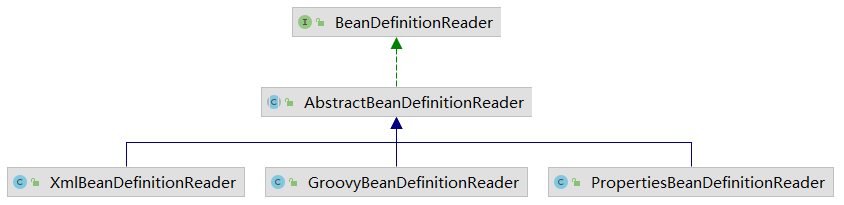
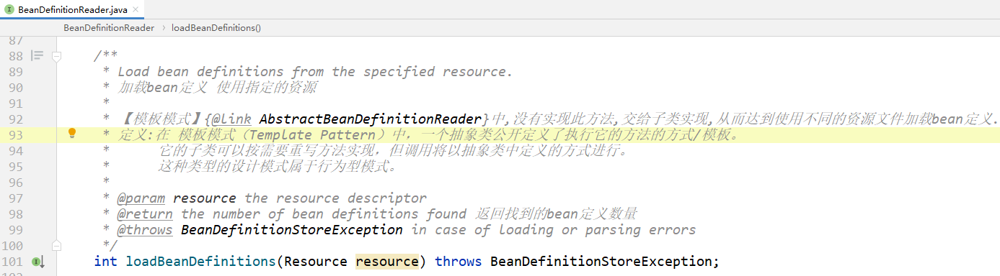
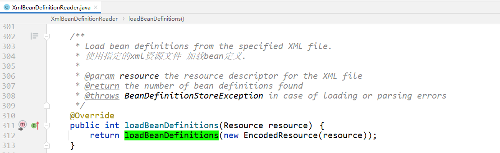
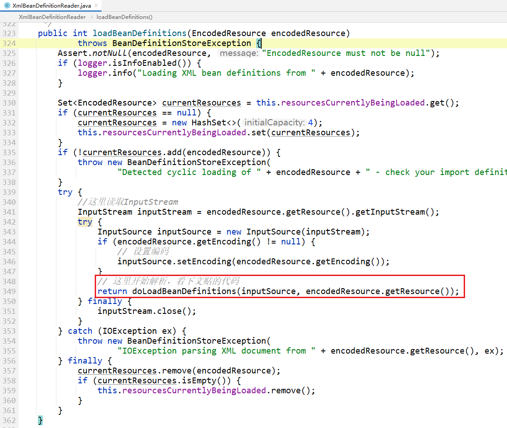
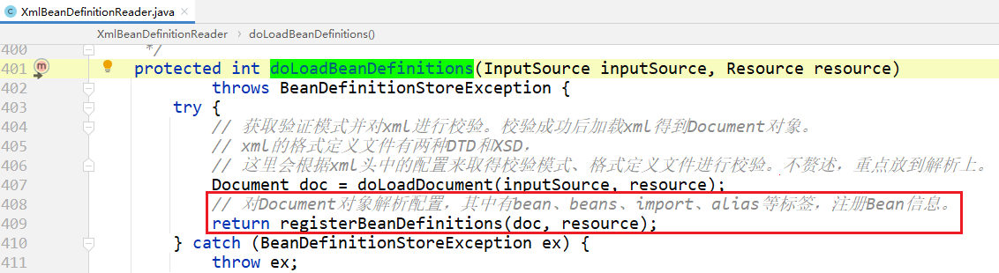

我们写的xml，其实就是为了`定义`bean！

```xml
<?xml version="1.0" encoding="UTF-8"?>
<beans xmlns="http://www.springframework.org/schema/beans"
       xmlns:xsi="http://www.w3.org/2001/XMLSchema-instance"
       xsi:schemaLocation="http://www.springframework.org/schema/beans https://www.springframework.org/schema/beans/spring-beans-2.0.xsd">
    <bean id="helloService" class="org.springframework.tests.sample.beans.HelloService" />
</beans>
```

`HelloService`是一个java类，经过上述xml配置，spring就知道了`HelloService`会作为一个bean，

那么这个配置的过程，就是`定义bean`.

从使用层面，可以使用xml配置bean，那么就需要解析xml，把这些配置解析成`bean定义`—— [org.springframework.beans.factory.config.BeanDefinition](../BeanDefinition/BeanDefinition.md)


此类 `XmlBeanDefinitionReader`就是`读取bean定义`的。

## bean定义读取器



支持三种bean定义读取器，其实也就对应三种配置bean的方式：

- xml
- groovy
- properties


## 主要方法



> `loadBeanDefinitions`总共有四个重载方法，但是最终都是调用 `int loadBeanDefinitions(Resource resource)` 完成的逻辑。

## 源码实现








