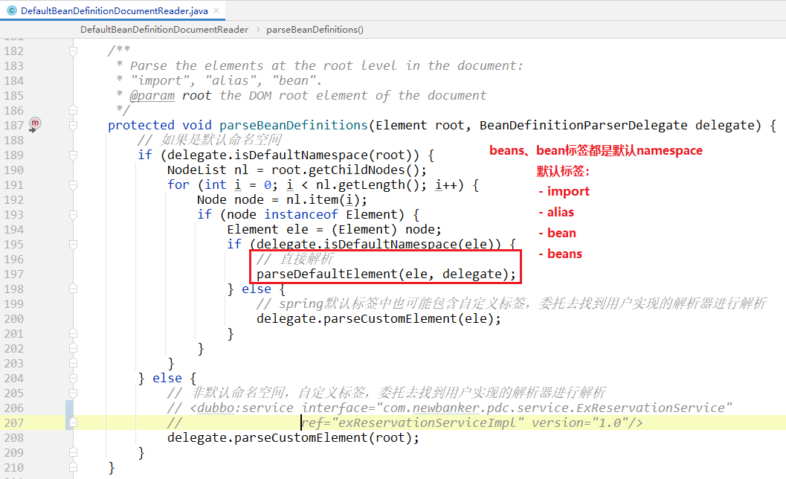

# 如何配置bean

我们写的xml，其实就是为了`定义`bean！

```xml
<?xml version="1.0" encoding="UTF-8"?>
<beans xmlns="http://www.springframework.org/schema/beans" xmlns:xsi="http://www.w3.org/2001/XMLSchema-instance"
       xsi:schemaLocation="http://www.springframework.org/schema/beans 
                           https://www.springframework.org/schema/beans/spring-beans-2.0.xsd">
    
    <bean id="helloService" class="org.springframework.tests.sample.beans.HelloService" />
</beans>
```

`HelloService`是一个java类，经过上述xml配置，spring就知道了`HelloService`会作为一个bean，

那么这个配置的过程，就是`定义bean`.


**从使用层面，开发者可以使用xml配置bean；**

**从源码层面，就需要解析xml；把这些xml配置文件，解析成java程序可以运行的数据结构。**


那么spring框架是如何进行`解析bean定义`的？就是本篇文章的内容。

> 什么是bean定义？
>
> 详见： [BeanDefinition](../BeanDefinition/BeanDefinition.md)
>
> 如果不了解`bean定义`，先点击上面连接，先了解一下`bean定义——BeanDefinition`


# bean定义读取器


支持三种bean定义读取器，其实也就对应三种配置bean的方式：

- xml
- groovy
- properties


# 主要方法


> `loadBeanDefinitions`总共有四个重载方法，但是最终都是调用 `int loadBeanDefinitions(Resource resource)` 完成的逻辑。

# 源码实现


**先创建一个reader，然后使用reader去加载bean定义，并返回新增bean定义数量。**

> `BeanDefinitionDocumentReader ` 其实只有一个实现类。
>
> 为了开发者可扩展性，spring作者单独抽出来一个接口。

**DefaultBeanDefinitionDocumentReader**





我们主要解析`bean`标签的逻辑：


根据xml标签，解析bean定义：

其实就是读取xml元素的属性，然后保存到`BeanDefinition`对象的字段中。


