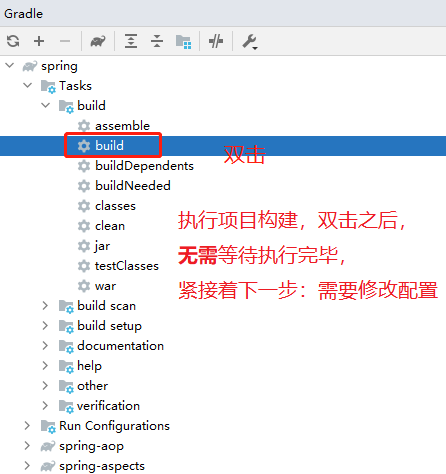

# Spring Framework源码注释

https://gitee.com/anxiaole/spring-framework


# 【导入idea】

git clone 之后，打开idea，让idea自动处理一会。

找到 Gradle 窗口。

## 构建源码




配置完毕后，再重新执行一次。编译项目源码，等到片刻 

> 执行过程需要去下载依赖包，根据网速不同，可能执行时间长短也不同。

*此源码编译配置和官方不完全一致，有适当的增删，会跳过doc文档等的编译。*


# 【遇到问题及解决方案】

## 一、IDEA Gradle项目控制台输出乱码


解决方案参考：https://blog.csdn.net/xiaopihair123/article/details/105161231 （记得重启idea)


## 二、spring-aspects 模块编译的时候，找不到符号

报错信息：

```
D:\WorkSpaces\learn\tanguosheng\spring-framework\spring-aspects\src\main\java\org\springframework\cache\aspectj\AspectJCachingConfiguration.java:42:12
java: 找不到符号
  符号:   类 AnnotationCacheAspect
  位置: 类 org.springframework.cache.aspectj.AspectJCachingConfiguration
D:\WorkSpaces\learn\tanguosheng\spring-framework\spring-aspects\src\main\java\org\springframework\cache\aspectj\AspectJCachingConfiguration.java:43:9
java: 找不到符号
  符号:   类 AnnotationCacheAspect
  位置: 类 org.springframework.cache.aspectj.AspectJCachingConfiguration
D:\WorkSpaces\learn\tanguosheng\spring-framework\spring-aspects\src\main\java\org\springframework\cache\aspectj\AspectJCachingConfiguration.java:43:45
java: 找不到符号
  符号:   变量 AnnotationCacheAspect
  位置: 类 org.springframework.cache.aspectj.AspectJCachingConfiguration

```

解决方案：https://blog.csdn.net/cs373616511/article/details/107833530