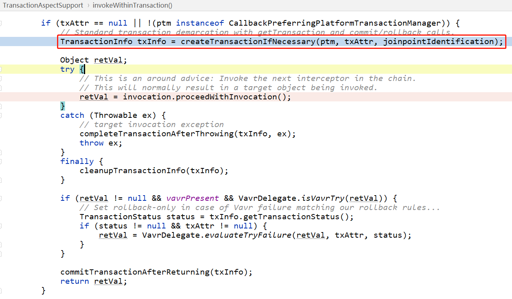
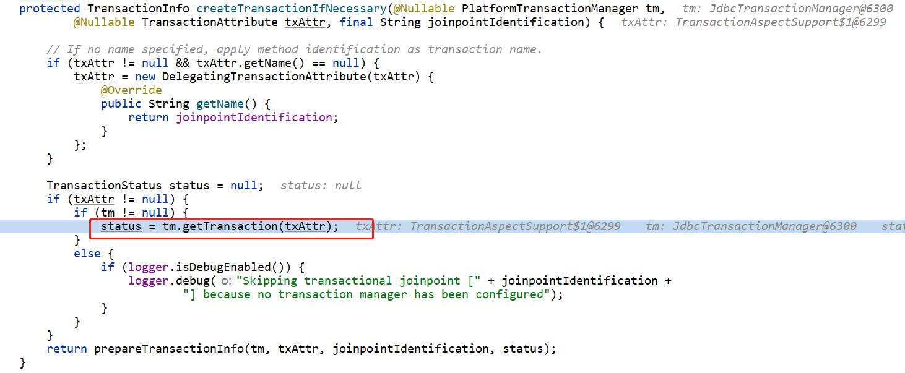
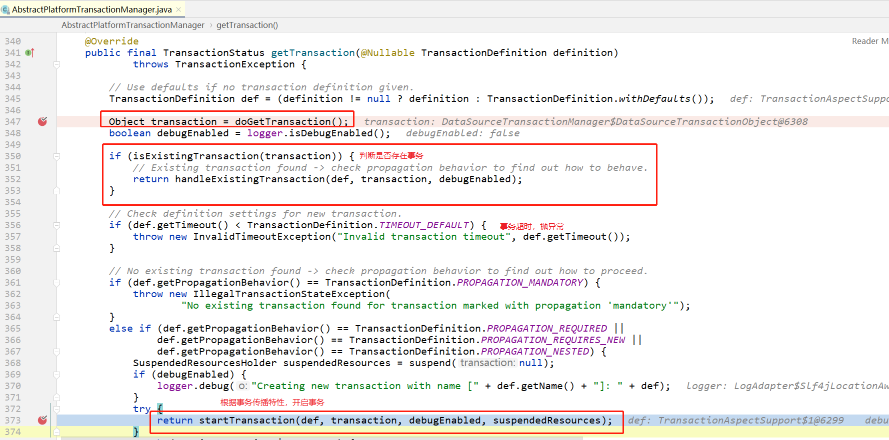
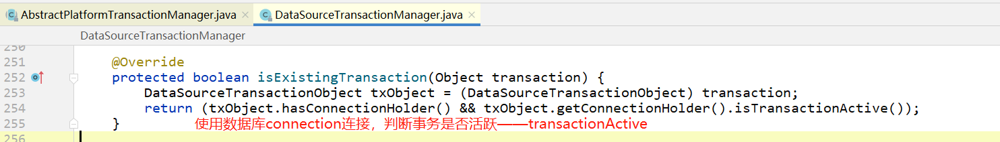
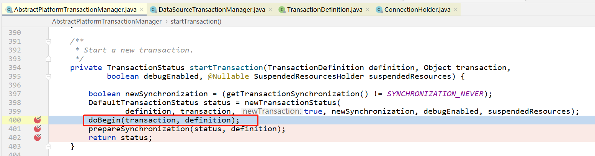
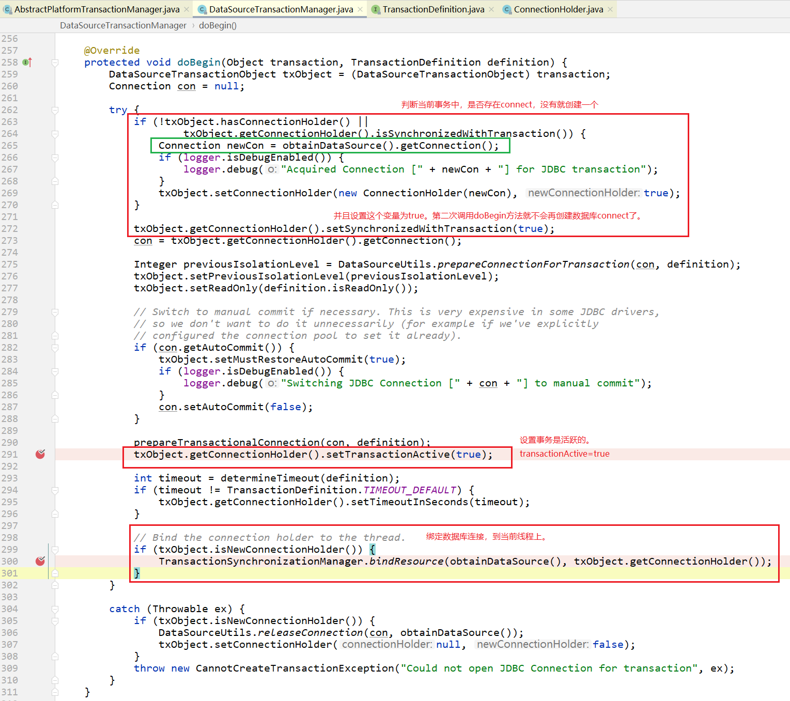

内容：

- [看源码和你说说Spring事务为什么会失效.md](看源码和你说说Spring事务为什么会失效.md)
- 在同一个事务内，所有的sql都需要在同一个connection中执行的。这是如何保证的？
- 在同一个事务中，不支持数据源切换。

声明式事务

# 创建事务

## 判断是否存在事务

## 根据事务传播特性，创建新事务

> 画外音：
>
> 我之前做的多数据源切换，是在mapper的方法上进行AOP拦截，而开启事务是在service方法上使用@Transactional注解，
>
> 此时会先开启事务，在事务中，会创建一个数据库连接（也就是图中画绿色框框的地方），然后把当前事务的数据库连接connection绑定到当前线程上。
>
> 那么，此时肯定还没进入mapper的AOP中，那也就肯定还没指定数据库，
>
> 此时就会使用 AbstractRoutingDataSource 指定的默认DataSource 
>
> 