> 以下文章来源于微信公众号：Java识堂 ，作者小识
>
> 原文链接：https://mp.weixin.qq.com/s/Zxi5azgdVfthZITLKbUtJQ


##  不用Spring管理事务？

如果对AOP的实现不太熟悉的话可以看我之前的文章，或者到我网站www.javashitang.com上查看系列文章

[2w字搞懂Spring AOP的前世今生](http://mp.weixin.qq.com/s?__biz=MzIxMzk3Mjg5MQ==&mid=2247491440&idx=1&sn=62882186b0b22c72603fe194ab3753fc&chksm=97affd84a0d87492066bf95b1b43bb9b0264455faf7cba136d6dfa35a6e2b45ad46ca4caab89&scene=21#wechat_redirect)

让我们先来看一下不用spring管理事务时，各种框架是如何管理事务的

使用JDBC来管理事务

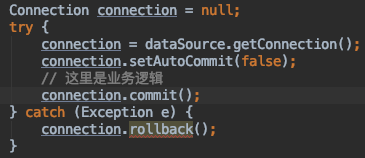

使用Hibernate来管理事务

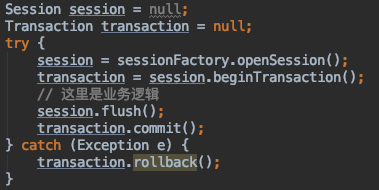

业务逻辑和事务代码是耦合到一块的，并且和框架的具体api绑定了。当我们换一种框架来实现时，里面对事务控制的代码就要推倒重写，并不一定能保证替换后的api和之前的api有相同的行为。

**「统一的事务抽象」**

基于这些问题，Spring抽象了一些事务相关的顶层接口。无论是全局事务还是本地事务，JTA，JDBC还是Hibernate，Spring都使用统一的编程模型。使得应用程序可以很容易的在全局事务与本地事务，或者不同事物框架之间进行切换。

**「下图为Spring事物抽象的核心类」**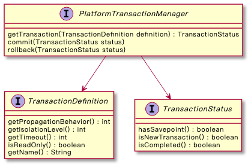

| 常用api                    | 接口                                       |
| :------------------------- | :----------------------------------------- |
| PlatformTransactionManager | 对事务进行管理                             |
| TransactionDefinition      | 定义事务的相关属性，例如隔离级别，传播行为 |
| TransactionStatus          | 保存事务状态                               |

针对不同的数据访问技术，使用不用的PlatformTransactionManager类即可

| 数据访问技术 | PlatformTransactionManager实现类 |
| :----------- | :------------------------------- |
| JDBC/Mybatis | DataSourceTransactionManager     |
| Hibernate    | HibernateTransactionManager      |
| Jpa          | JpaTransactionManager            |
| Jms          | JmsTransactionManager            |

## 编程式事务管理

当我们使用Spring的事务时，可以使用编程式事务或者声明式事务。

当使用编程式事务的时候，可以直接使用事务的顶层接口，也可以使用模版类TransactionTemplate

### 使用PlatformTransactionManager

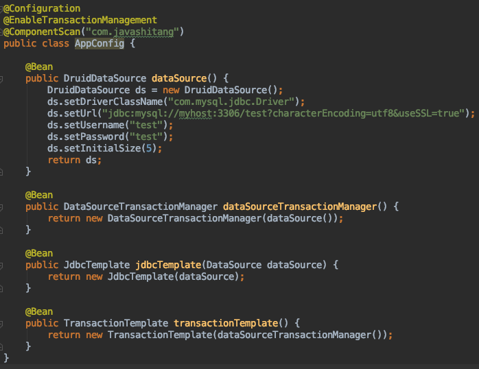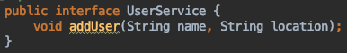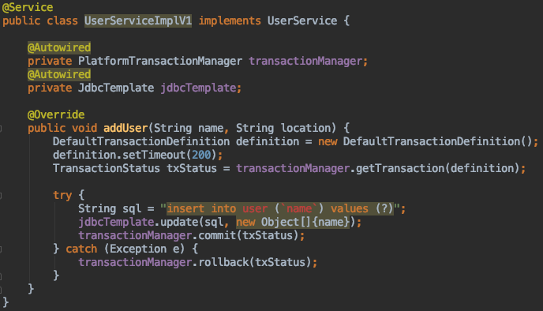

### 使用TransactionTemplate

当我们直接使用PlatformTransactionManager来管理事务时，有很多模版代码。例如业务代码正常执行，提交事务，否则回滚事务。我们可以把这部分模版代码封装成一个模版类，这样使用起来就很方便了，如下所示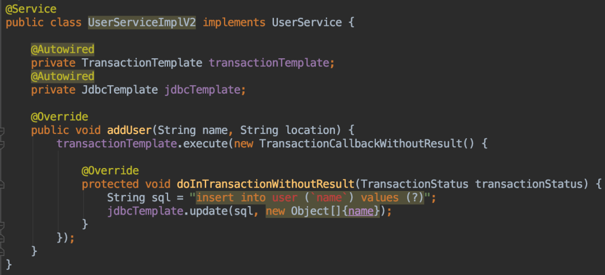如下图所示，TransactionTemplate#execute方法就是一个典型的模版方法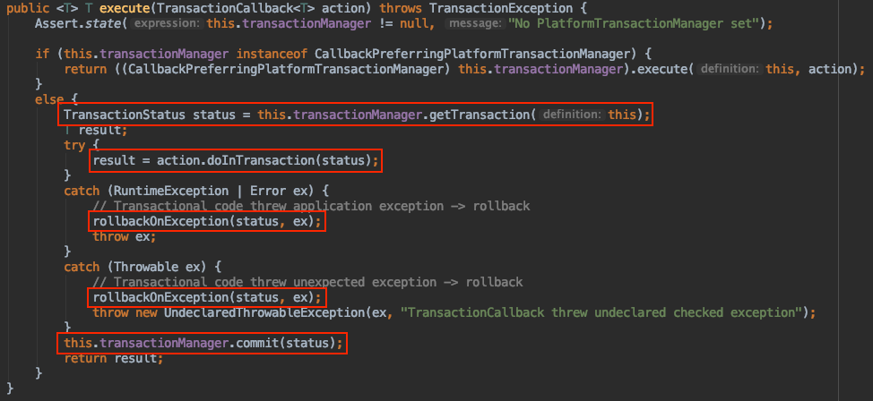我们可以传入如下2个接口的实现类来执行业务逻辑，TransactionCallback（需要返回执行结果）或TransactionCallbackWithoutResult（不需要返回结果）

## 声明式事务管理

为了让使用更加简洁，Spring直接把事务代码的执行放到切面中了，我们只需要在业务代码方法上加上一个@Transactional注解即可，这种方式我们最常用哈

### 使用@Transactional注解

此时事务相关的定义我们就可以通过@Transactional注解来设置了

| 属性名                                | 类型              | 描述                                                         | 默认值     |
| :------------------------------------ | :---------------- | :----------------------------------------------------------- | :--------- |
| value（和transactionManager互为别名） | String            | 当在配置文件中有多个PlatformTransactionManager ，用该属性指定选择哪个事务管理器 | 空字符串"" |
| propagation                           | 枚举：Propagation | 事务的传播行为                                               | REQUIRED   |
| isolation                             | 枚举：Isolation   | 事务的隔离度                                                 | DEFAULT    |
| timeout                               | int               | 事务的超时时间。如果超过该时间限制但事务还没有完成，则自动回滚事务 | -1         |
| readOnly                              | boolean           | 指定事务是否为只读事务                                       | false      |
| rollbackFor                           | Class[]           | 需要回滚的异常                                               | 空数组{}   |
| rollbackForClassName                  | String[]          | 需要回滚的异常类名                                           | 空数组{}   |
| noRollbackFor                         | Class[]           | 不需要回滚的异常                                             | 空数组{}   |
| noRollbackForClassName                | String[]          | 不需要回滚的异常类名                                         | 空数组{}   |

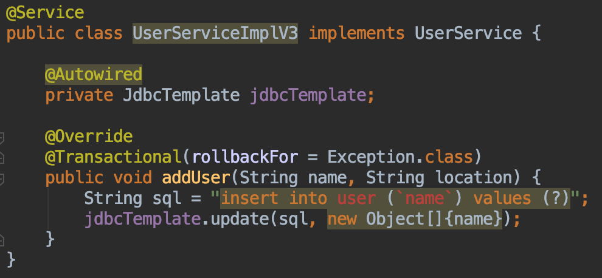在这里插入图片描述

## 源码解析

我们需要在配置类上加上@EnableTransactionManagement注解，来开启spring事务管理功能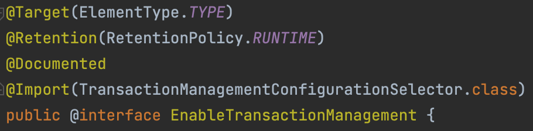**「TransactionManagementConfigurationSelector#selectImports」**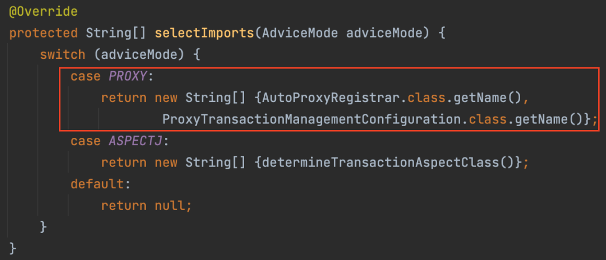往容器中注入AutoProxyRegistrar和ProxyTransactionManagementConfiguration这2个类，那这2个类有啥作用呢？（源码太多了，我就不贴代码一步一步分析了，主要是理清思路）


AutoProxyRegistrar主要就是往容器中注入一个类InfrastructureAdvisorAutoProxyCreator，这个类有什么作用呢？

**「看一下继承关系，原来是继承自AbstractAutoProxyCreator，用来实现自动代理没跑了！」**

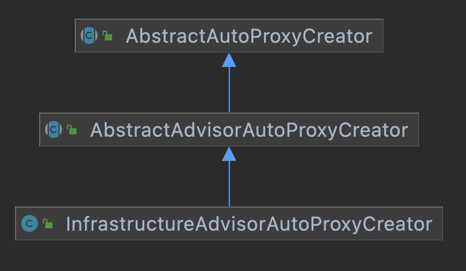BeanFactoryTransactionAttributeSourceAdvisor主要就是往容器中注入了一个Advisor类，用来保存Pointcut和Advice

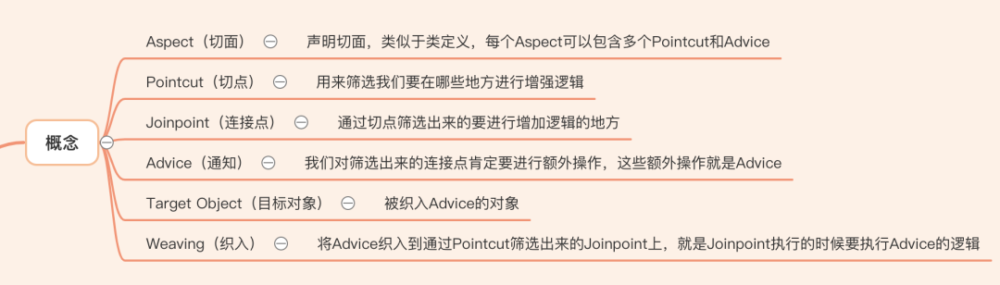对应的Pointcut为TransactionAttributeSourcePointcut的实现类，是一个匿名内部类，即筛选的逻辑是通过TransactionAttributeSourcePointcut类来实现的

BeanFactoryTransactionAttributeSourceAdvisor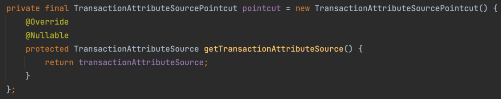对应的Advice的实现类为TransactionInterceptor，即针对事务增强的逻辑都在这个类中。

筛选的逻辑我们就先不分析了，后面会再简单提一下

我们来看针对事务增强的逻辑，当执行被@Transactional标记的方法时，会调用到如下方法（TransactionInterceptor#invoke有点类似我们的@Around）

TransactionInterceptor#invoke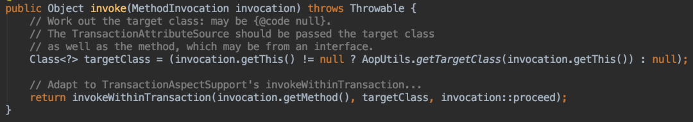TransactionAspectSupport#invokeWithinTransaction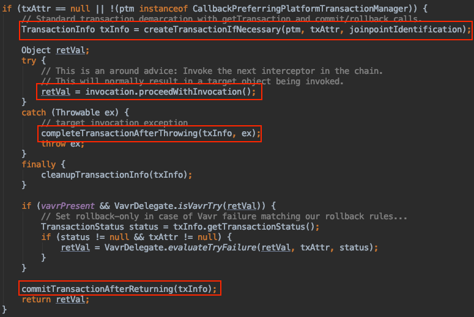我挑出这个方法比较重要的几个部分来分析吧（上图圈出来的部分）

1. 如果需要的话开启事务（和传播属性相关，我们后面会提到）
2. 执行业务逻辑
3. 如果发生异常则会滚事务
4. 如果正常执行则提交事务

**「所以当发生异常需要会滚的时候，我们一定不要自己把异常try catch掉，不然事务会正常提交」**

TransactionAspectSupport#createTransactionIfNecessary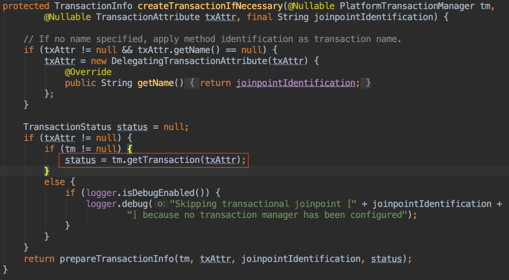当开启事务的时候，可以看到各种传播属性的行为（即@Transactional方法调用@Transactional方法会发生什么？）

AbstractPlatformTransactionManager#getTransaction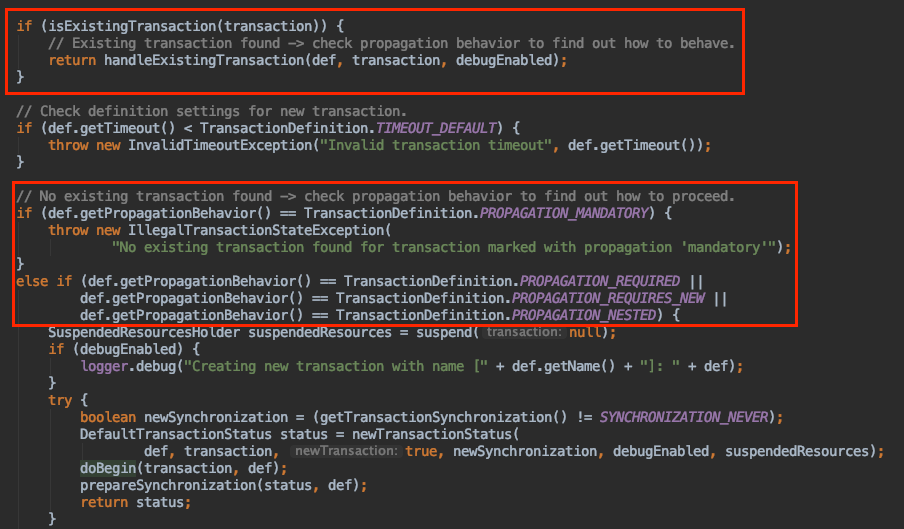

Spring事务的传播行为在Propagation枚举类中定义了如下几种选择

**「支持当前事务」**

- REQUIRED ：如果当前存在事务，则加入该事务。如果当前没有事务，则创建一个新的事务
- SUPPORTS：如果当前存在事务，则加入该事务 。如果当前没有事务， 则以非事务的方式继续运行
- MANDATORY  ：如果当前存在事务，则加入该事务 。如果当前没有事务，则抛出异常

**「不支持当前事务」**

- REQUIRES_NEW ：如果当前存在事务，则把当前事务挂起，创建一个新事务
- NOT_SUPPORTED ：如果当前存在事务，则把当前事务挂起，以非事务方式运行，
- NEVER ：如果当前存在事务，则抛出异常

**「其他情况」**

- NESTED ：如果当前存在事务，则创建一个事务作为当前事务的嵌套事务来执行 。如果当前没有事务，则该取值等价于REQUIRED

以NESTED启动的事务内嵌于外部事务中 （如果存在外部事务的话），此时内嵌事务并不是一个独立的事务，它依赖于外部事务。只有通过外部事务的提交，才能引起内部事务的提交，嵌套的子事务不能单独提交

## 事务失效的场景有哪些？

因为我们经常使用声明式事务，如果一步消息就会导致事务失效，所以我们就从源码角度来盘一下事务为什么失效

### 异常被你try catch了

首先就是我们上面刚提到的，**「异常被你try catch了」**。因为声明式事物是通过目标方法是否抛出异常来决定是提交事物还是会滚事物的

### 自调用

当自调用时，方法执行不会经过代理对象，所以会导致事务失效

```java
// 事务失效
@Service
public class UserServiceV2Impl implements UserService {

    @Autowired
    private JdbcTemplate jdbcTemplate;

    @Override
    public void addUser(String name, String location) {
        doAdd(name);
    }

    @Transactional
    public void doAdd(String name) {
        String sql = "insert into user (`name`) values (?)";
        jdbcTemplate.update(sql, new Object[]{name});
        throw new RuntimeException("保存用户失败");
    }
}
```

我们可以通过如下三种方式来解决自调用失效的场景

**「1.@Autowired注入代理对象，然后调用方法」**

```java
// @Service
public class UserServiceV3Impl implements UserService {

    @Autowired
    private JdbcTemplate jdbcTemplate;
    @Autowired
    private UserService userService;

    @Override
    public void addUser(String name, String location) {
        userService.doAdd(name);
    }

    @Override
    @Transactional
    public void doAdd(String name) {
        String sql = "insert into user (`name`) values (?)";
        jdbcTemplate.update(sql, new Object[]{name});
        throw new RuntimeException("保存用户失败");
    }
}
```

**「2.从ApplicationContext获取代理对象，然后调用方法」**

```java
@Service
public class UserServiceV4Impl implements UserService {

    @Autowired
    private JdbcTemplate jdbcTemplate;
    @Autowired
    private ApplicationContext applicationContext;

    @Override
    public void addUser(String name, String location) {
        UserService userService = applicationContext.getBean(UserService.class);
        userService.doAdd(name);
    }

    @Override
    @Transactional
    public void doAdd(String name) {
        String sql = "insert into user (`name`) values (?)";
        jdbcTemplate.update(sql, new Object[]{name});
        throw new RuntimeException("保存用户失败");
    }
}
```

**「3.进行如下设置@EnableAspectJAutoProxy(exposeProxy = true)，从AopContext中获取代理对象，然后调用方法」**

```java
@Service
public class UserServiceV5Impl implements UserService {

    @Autowired
    private JdbcTemplate jdbcTemplate;

    @Override
    public void addUser(String name, String location) {
        UserService userService = (UserService) AopContext.currentProxy();
        userService.doAdd(name);
    }

    @Override
    @Transactional
    public void doAdd(String name) {
        String sql = "insert into user (`name`) values (?)";
        jdbcTemplate.update(sql, new Object[]{name});
        throw new RuntimeException("保存用户失败");
    }
}
```

### 非public方法导致事务失效

我们先来猜一下为什么非public方法会导致事务失效？

**「难道是因为非public方法不会生成代理对象？」**

我们给一个非public方法加上@Transactional，debug到如下代码看一下是否会生成代理对象

AbstractAutoProxyCreator#wrapIfNecessary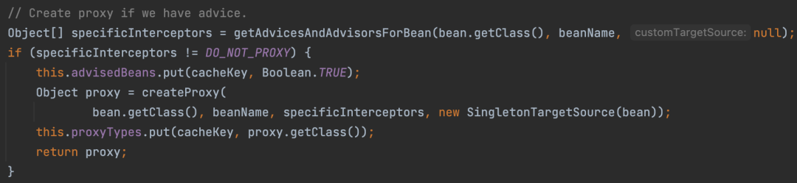**「结论是不会生成代理对象，那为什么不会生成代理对象呢？」**

应该就是不符合Pointcut的要求了呗，我们在前面已经提到了事务对应的Pointcut为TransactionAttributeSourcePointcut

TransactionAttributeSourcePointcut#matches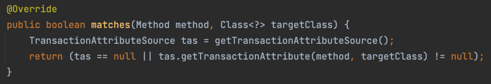matches方法返回false，为什么会返回false呢？

一直debug发现是如下代码导致的

AbstractFallbackTransactionAttributeSource#computeTransactionAttribute

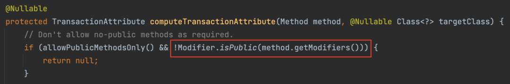即public方法能正常生成代理对象，而非public方法因为不符合Pointcut的要求，根本就不会生成代理对象

### 异常类型不正确，默认只支持RuntimeException和Error，不支持检查异常

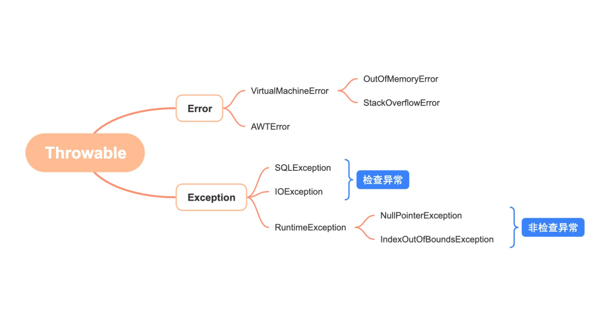**「为什么不支持检查异常呢？」**

拿出我们上面分析过的代码当执行业务逻辑发生异常的时候，会调用到TransactionAspectSupport#completeTransactionAfterThrowing方法

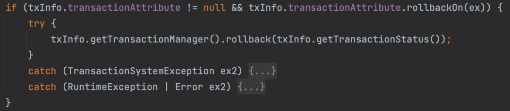可以看到对异常类型做了判断，根据返回的结果来决定是否会滚事务，会调用到如下方法进行判断

RuleBasedTransactionAttribute#rollbackOn如果用户指定了回滚的异常类型，则根据用户指定的规则来判断，否则用默认的规则

DefaultTransactionAttribute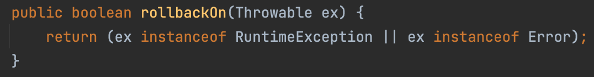默认的规则为只支持RuntimeException和Error

我们可以通过@Transactional属性指定回滚的类型，一般为Exception即可

```
@Transactional(rollbackFor = Exception.class)
```

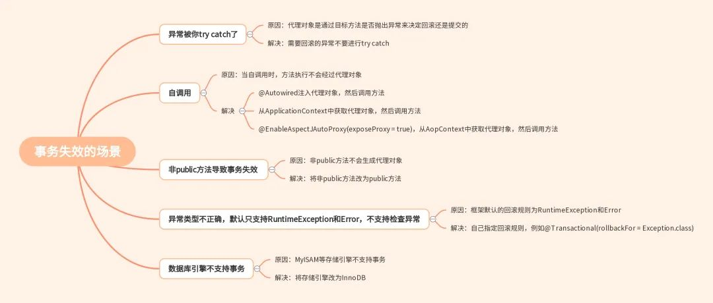