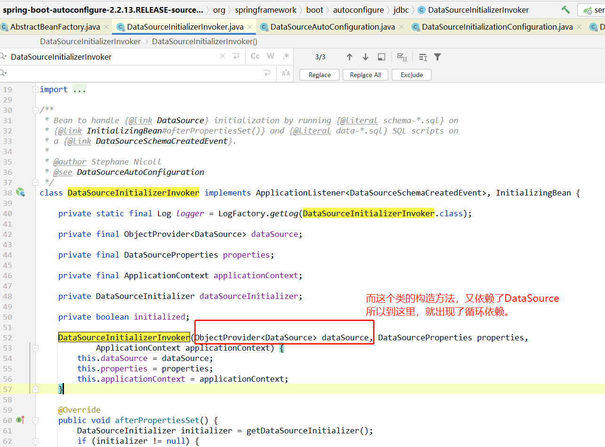

# 背景描述

在同一个SpringBoot项目中，需要连接两个数据库。所以需要配置多数据源。

多数据源配置方式详见： https://gitee.com/anxiaole/DayDayUp/tree/master/junit/02-dynamicDatasources


这种方式肯定是没有问题的，因为在公司的之前一个项目已经实现了。

但是在修改另外一个项目时：需要把druid连接池改成 HikariDataSource 修改完毕后，启动时，就**循环依赖**了。

```
***************************
APPLICATION FAILED TO START
***************************

Description:

The dependencies of some of the beans in the application context form a cycle:

   channelFilter
      ↓
   channelService
      ↓
   customerChannelMapper defined in file [D:\WorkSpace\mam-service\target\classes\com\mam\account\dao\mapper\CustomerChannelMapper.class]
      ↓
   sqlSessionFactory defined in class path resource [com/baomidou/mybatisplus/autoconfigure/MybatisPlusAutoConfiguration.class]
┌─────┐
|  dataSource defined in class path resource [com/mam/common/datasources/DynamicDataSourceConfig.class]
↑     ↓
|  firstDataSource defined in class path resource [com/mam/common/datasources/DynamicDataSourceConfig.class]
↑     ↓
|  org.springframework.boot.autoconfigure.jdbc.DataSourceInitializerInvoker
```


# 解决方法

在网上找到下面这篇文章，顺利解决问题。
r
**[使用springboot 整合多数据源 遇到的坑](https://blog.csdn.net/K_Tang/article/details/83117354)**

产生问题的代码如下:

```java
@Configuration
public class DynamicDataSourceConfig {

    @Bean("firstDataSource")
    @ConfigurationProperties(prefix = "spring.datasource.druid.first")
    public DataSource firstDataSource(){
        return DruidDataSourceBuilder.create().build();
    }

    @Bean("secondDataSource")
    @ConfigurationProperties(prefix = "spring.datasource.druid.second")
    public DataSource secondDataSource(){
        return DruidDataSourceBuilder.create().build();
    }

    @Bean("dataSource")
    @Primary
    public DynamicDataSource dataSource(DataSource firstDataSource, DataSource secondDataSource) {
        Map<Object, Object> targetDataSources = new HashMap<>();
        targetDataSources.put(DataSourceType.TYPE_PFMSC, firstDataSource);
        targetDataSources.put(DataSourceType.TYPE_PFMSC_TEST, secondDataSource);
        return new DynamicDataSource(firstDataSource, targetDataSources);
    }

}

```

根据图中的引用圈可以看 出
1.创建sqlSessionFactory时需要dataSource
2.创建dataSource的时候,需要创建firsrDataSource和secondDataSource
3.然后创建firstDataSource时需要DataSourceInitializerInvoker
4.DataSourceInitializerInvoker又会去引用dataSource造成循环引用

```java
@Configuration
public class DynamicDataSourceConfig {

    @Bean("firstDataSource")
    @ConfigurationProperties(prefix = "spring.datasource.druid.first")
    public DataSource firstDataSource(){
        return DruidDataSourceBuilder.create().build();
    }

    @Bean("secondDataSource")
    @ConfigurationProperties(prefix = "spring.datasource.druid.second")
    public DataSource secondDataSource(){
        return DruidDataSourceBuilder.create().build();
    }

    @Bean("dataSource")
    @DependsOn({ "firstDataSource", "secondDataSource"})
    @Primary
    public DynamicDataSource dataSource(DataSource firstDataSource, DataSource secondDataSource) {
        Map<Object, Object> targetDataSources = new HashMap<>();
        targetDataSources.put(DataSourceType.TYPE_PFMSC, firstDataSource);
        targetDataSources.put(DataSourceType.TYPE_PFMSC_TEST, secondDataSource);
        return new DynamicDataSource(firstDataSource, targetDataSources);
    }

}

```

加入注解 `@DependsOn({ "firstDataSource", "secondDataSource"})` 后可以解决上述问题.
该注解用于声明当前bean依赖于另外一个bean。所依赖的bean会被容器确保在当前bean实例化之前被实例化.


以上都是  **[使用springboot 整合多数据源 遇到的坑](https://blog.csdn.net/K_Tang/article/details/83117354)** 文章中的内容。

主要来分析一下这样修改的原因。


**发生问题的SpringBoot版本号**

spring-boot-autoconfigure-2.2.13.RELEASE

**没有发生循环依赖的SpringBoot版本号：**

spring-boot-autoconfigure-2.6.0


对比了一下这两个版本的代码，发现，在 2.6.0 版本中，已经删除了 `DataSourceInitializerInvoker` 这个类：

```java
/**
 * Bean to handle {@link DataSource} initialization by running {@literal schema-*.sql} on
 * {@link InitializingBean#afterPropertiesSet()} and {@literal data-*.sql} SQL scripts on
 * a {@link DataSourceSchemaCreatedEvent}.
 *
 * @author Stephane Nicoll
 * @see DataSourceAutoConfiguration
 */
class DataSourceInitializerInvoker implements ApplicationListener<DataSourceSchemaCreatedEvent>, InitializingBean {
```

从类继承的接口和类上的注释，我们知道这个类是个 `InitializingBean` ，并且主要目的是在 `InitializingBean#afterPropertiesSet()` 方法中，

去执行 `schema-*.sql` 和 `data-*.sql`  脚本文件。


但是在 在 2.6.0 版本中，已经删除了 `DataSourceInitializerInvoker` 这个类。所以在另外一个项目中并没有出现循环依赖。


# 原因分析

## 循环依赖发生原因

我们先来看一下异常日志：

```
***************************
APPLICATION FAILED TO START
***************************

Description:

The dependencies of some of the beans in the application context form a cycle:

   channelFilter
      ↓
   channelService
      ↓
   customerChannelMapper defined in file [D:\WorkSpace\mam-service\target\classes\com\mam\account\dao\mapper\CustomerChannelMapper.class]
      ↓
   sqlSessionFactory defined in class path resource [com/baomidou/mybatisplus/autoconfigure/MybatisPlusAutoConfiguration.class]
┌─────┐
|  dataSource defined in class path resource [com/mam/common/datasources/DynamicDataSourceConfig.class]
↑     ↓
|  firstDataSource defined in class path resource [com/mam/common/datasources/DynamicDataSourceConfig.class]
↑     ↓
|  org.springframework.boot.autoconfigure.jdbc.DataSourceInitializerInvoker
```

也就是：


那么我们看一下代码执行的流程：

显示自动配置数据源：




循环依赖的原因如上4图。

不过这个 `DataSourceInitializerInvoker`要实现的功能是：

> 当容器中`DataSource`数据源`初始化`完毕之后，
>
> 会在 `DataSourceInitializerInvoker#afterPropertiesSet` 方法中，去执行 `schema-*.sql` 和 `data-*.sql`  脚本文件。
>
> 相当于当SpringBoot项目启动完毕后，就去执行数据库的初始化脚本。

其实spring提供这个功能，也不能说他有问题。只是和多数据源结合的时候，就会发生循环依赖问题。

注意：新版本的SpringBoot已经移除了`DataSourceInitializerInvoker`类，所以使用新的SpringBoot版本号也是一种解决办法。

​           可以把SpringBoot版本改成 `2.6.0` 或者更高，亲测可用。


那为什么加上  `@DependsOn({ "firstDataSource", "secondDataSource"})` 注解之后，就不出现循环依赖了呢？

## @DependsOn为何能解决循环依赖

这就要分析Spring创建bean的过程了。


需要注意的是：

```
使用 @DependsOn 注解标注的循环依赖,Spring无法自动解决.
```


