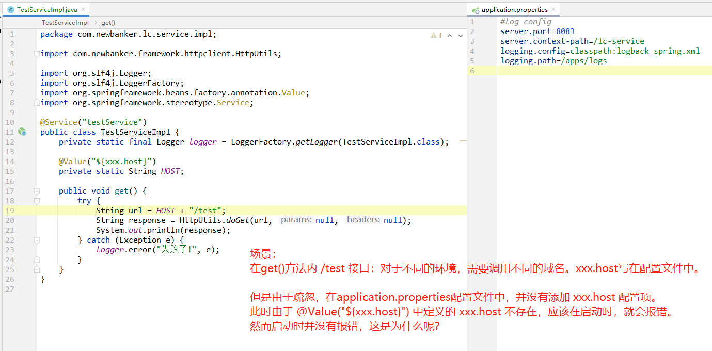

# 场景




# 原因

上图可见 `HOST`  字段是 `static` 修饰的。

而spring 自动注入的属性，不支持静态字段。

在启动时，会在控制台看到 `WARN` 日志：

```
03:22:53.687 [main] WARN  org.springframework.beans.factory.annotation.AutowiredAnnotationBeanPostProcessor - Autowired annotation is not supported on static fields: private static java.lang.String com.newbanker.lc.service.impl.TestServiceImpl#HOST
```


# 源码分析

https://github.com/liuxianfa520/spring-framework

org.springframework.beans.factory.annotation.AutowiredAnnotationBeanPostProcessorTests#testAutowiredStaticField

