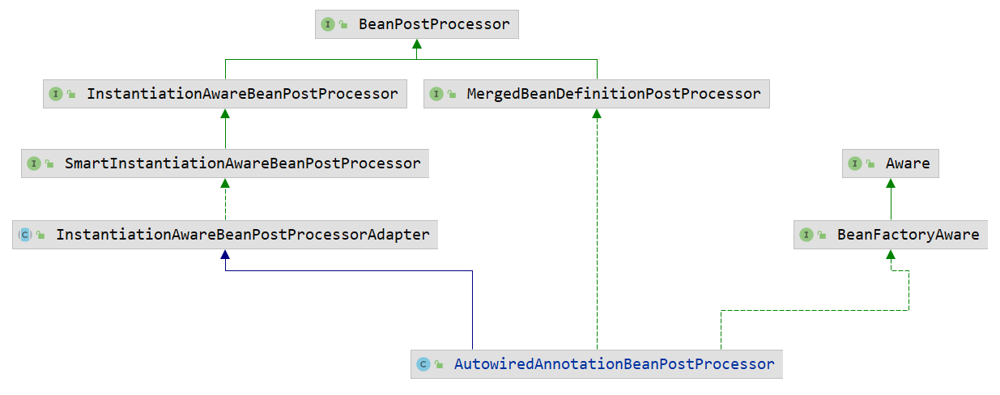
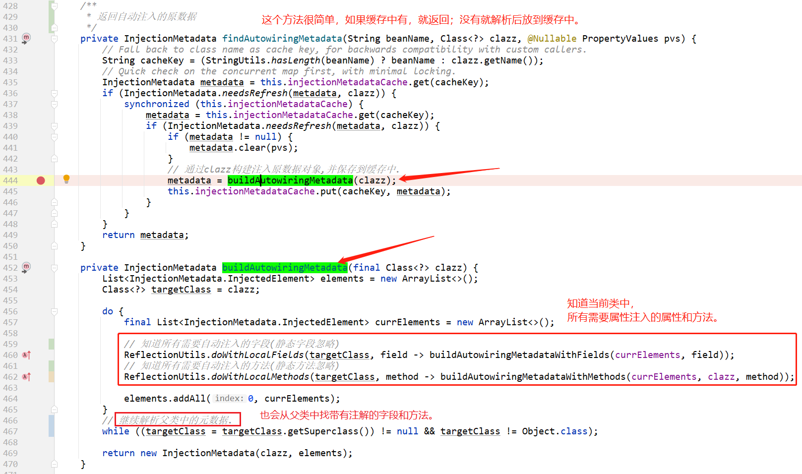
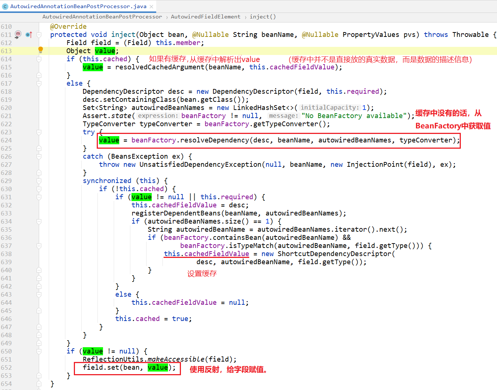
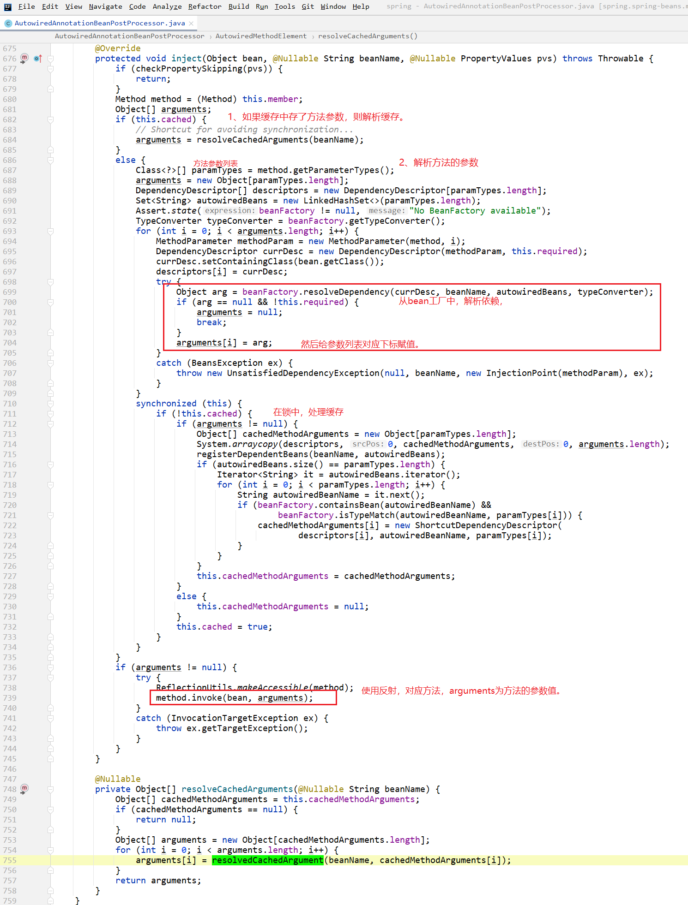
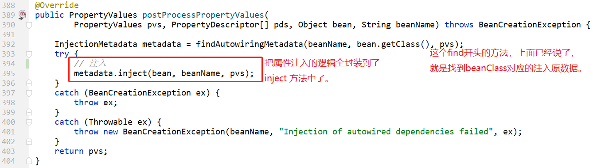
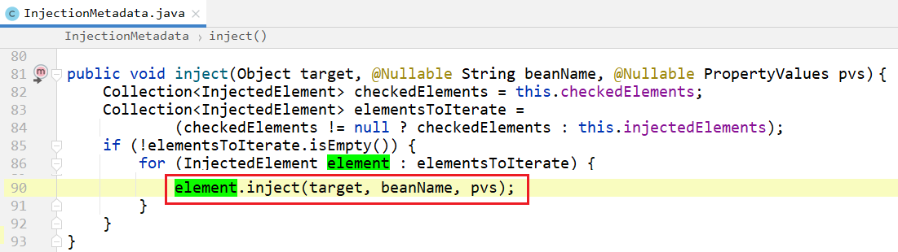

我们知道spring的bean属性注入可以使用两种：

- @org.springframework.beans.factory.annotation.Autowired 注解
- @javax.annotation.Resource 注解


本篇文章主要探讨用 @Autowired 注解自动注入的源码实现。


 

# AutowiredAnnotationBeanPostProcessor

`org.springframework.beans.factory.annotation.AutowiredAnnotationBeanPostProcessor`

## 类图



从类结构上看，主要是实现了 bean后置处理器，和`BeanFactoryAware` 接口。

## 重要属性

```java
    /**
     * <pre>
     * 表示此类会处理spring bean中的哪些注解.
     * 默认有三个:{@link Autowired} {@link Value} {@link Inject}.
     * 详见:{@link AutowiredAnnotationBeanPostProcessor#AutowiredAnnotationBeanPostProcessor()}
     * </pre>
     */
	private final Set<Class<? extends Annotation>> autowiredAnnotationTypes = new LinkedHashSet<>(4);

    /**
     * {@link Autowired#required()}
     */
	private String requiredParameterName = "required";

	private boolean requiredParameterValue = true;

    /**
     * @see BeanFactoryAware
     */
	@Nullable
	private ConfigurableListableBeanFactory beanFactory;
```

对于`beanFactory`属性，其实是应为实现了`BeanFactoryAware#setBeanFactory` 方法，在这个方法中赋值的：

```java
	@Override
	public void setBeanFactory(BeanFactory beanFactory) {
		this.beanFactory = (ConfigurableListableBeanFactory) beanFactory;
	}
```


## 构造方法

```java
	public AutowiredAnnotationBeanPostProcessor() {
		this.autowiredAnnotationTypes.add(Autowired.class);
		this.autowiredAnnotationTypes.add(Value.class);
		try {
			this.autowiredAnnotationTypes.add((Class<? extends Annotation>) ClassUtils.forName("javax.inject.Inject", AutowiredAnnotationBeanPostProcessor.class.getClassLoader()));
			logger.info("JSR-330 'javax.inject.Inject' annotation found and supported for autowiring");
		}
		catch (ClassNotFoundException ex) {
			// JSR-330 API not available - simply skip.
		}
	}
```

构造方法中也表现了：此类会处理三个注解：

- Autowired

- Value
- Inject


## 后置处理方法

我们已经知道了是使用后置处理器来实现的，

所以我们主要看一下，实现了哪些后置处理器的方法，并看一下实现这些方法，主要干了什么。


### 自动注入元数据

```java
	@Override
	public void postProcessMergedBeanDefinition(RootBeanDefinition beanDefinition, Class<?> beanType, String beanName) {
		InjectionMetadata metadata = findAutowiringMetadata(beanName, beanType, null);
		metadata.checkConfigMembers(beanDefinition);
	}
```

说明：这个方法主要是在**bean定义合并**的时候，找到当前类的所有需要注入的原数据信息，并check一下。

其实主要是 `findAutowiringMetadata(beanName, beanType, null);` 方法。



具体方法就不往里面看了，其实就是使用反射，找到属性、方法上的注解，

然后把`属性`或`方法`封装成 `InjectionMetadata.InjectedElement` 对象。


### InjectionMetadata

org.springframework.beans.factory.annotation.InjectionMetadata

上面 `InjectionMetadata findAutowiringMetadata(beanName, beanType, null);` 方法的返回值就是`InjectionMetadata`。

这里面主要封装了哪些类的哪些字段/方法需要自动注入。

```java
public class InjectionMetadata {
	private final Class<?> targetClass;                // bean的Class

	private final Collection<InjectedElement> injectedElements; // 此类中需要注入的元素（包含字段和方法）

	@Nullable
	private volatile Set<InjectedElement> checkedElements;

	public InjectionMetadata(Class<?> targetClass, Collection<InjectedElement> elements) {
		this.targetClass = targetClass;
		this.injectedElements = elements;
	}
}
```

注入原数据和beanClass是一对一的关系。一个beanClass对应一个`InjectionMetadata`实例对象。

而对于一个类中的属性、方法，则对应：`InjectedElement`。所以是一个`Set`集合。


### InjectedElement

```java
	public abstract static class InjectedElement {

		protected final Member member;

		protected final boolean isField;

		@Nullable
		protected final PropertyDescriptor pd;

		@Nullable
		protected volatile Boolean skip;
   }
```

注意：`InjectedElement`虽然是个抽象类，但是并没有抽象方法。最重要的方法是：

```java
/**
 * Either this or {@link #getResourceToInject} needs to be overridden.
 * 需要重写此方法   或者  重写 {@link #getResourceToInject} 方法
 */
protected void inject(Object target, String requestingBeanName, PropertyValues pvs) {

    if (this.isField) {
        Field field = (Field) this.member;
        ReflectionUtils.makeAccessible(field);
        field.set(target, getResourceToInject(target, requestingBeanName));
    } else {
        if (checkPropertySkipping(pvs)) {      // 基于方法的输入是否需要跳过。如果需要跳过，就直接返回
            return;
        }
        try {
            Method method = (Method) this.member;
            ReflectionUtils.makeAccessible(method);
            method.invoke(target, getResourceToInject(target, requestingBeanName));
        } catch (InvocationTargetException ex) {
            throw ex.getTargetException();
        }
    }
}
```

属性注入的方法中，如果当前是基于字段，则使用反射给字段赋值；如果是基于方法，则使用反射调用方法。

并且`值` 是 `getResourceToInject(target, requestingBeanName)` 方法返回的：

```java
/**
 * Either this or {@link #inject} needs to be overridden.
 * 需要重写此方法   或者  重写 {@link #inject} 方法
 */
@Nullable
protected Object getResourceToInject(Object target, @Nullable String requestingBeanName) {
   return null;
}
```

根据这两个方法上的注释，我们知道此抽象类：**要么重写 `getResourceToInject()`方法，要么重写 `inject()` 方法。**

如果不重新其中一个方法的话，其实不能使用的。


#### <u>*类图*</u>


其实此抽象类的子类还有很多，但是这里只关注这两个：

- 基于类中的字段进行自动注入的：AutowiredFieldElement
- 基于类中的方法进行自动注入的：AutowiredMethodElement

> 根据上面的描述：**要么重写 `getResourceToInject()`方法，要么重写 `inject()` 方法。**
>
> 我们主要看看这两个子类中，分别是如何实现的。

#### *AutowiredFieldElement*

```java
private class AutowiredFieldElement extends InjectionMetadata.InjectedElement {
    private final boolean required;              // 需要属性注入的值，是否不能为null
    private volatile boolean cached = false;     // 属性值是否有缓存
    private volatile Object cachedFieldValue;    // 属性值的缓存对象

    public AutowiredFieldElement(Field field, boolean required) {
        super(field, null);
        this.required = required;
    }
}    
```

我们发现，其实现了 `inject`方法：



上面最重要的获取`value`时调用的：

```java
value = beanFactory.resolveDependency(desc, beanName, autowiredBeanNames, typeConverter);
```

详见：[解析依赖resolveDependency方法.md](../BeanFactory/解析依赖resolveDependency方法.md)


#### *AutowiredMethodElement*

```java
private class AutowiredMethodElement extends InjectionMetadata.InjectedElement {

    private final boolean required;

    private volatile boolean cached = false;

    @Nullable
    private volatile Object[] cachedMethodArguments;

    public AutowiredMethodElement(Method method, boolean required, @Nullable PropertyDescriptor pd) {
        super(method, pd);
        this.required = required;
    }
}    
```

从写 `inject()` 方法：

- 如果有缓存，则从缓存中解析方法的参数列表
- 从bean工厂中， 解析依赖，并保存到参数列表数组的指定下标位置上
- 把费劲解析出来的参数列表数组，保存到缓存中。
- 使用反射调用自动注入的方法。



#### *小结*

- 属性注入，可以使用三个注解：`@Autowired` `@Value` `@Inject`

- 这三个注解，可以在类的`字段`上使用，也可以在`方法`上使用。
- 基于字段的属性注入，使用：AutowiredFieldElement
- 基于方法的属性注入，使用：AutowiredMethodElement
- 这两个子类都是重写了 InjectedElement#inject 方法


### 确定候选的构造方法

这也是一种后置处理器的方法：

org.springframework.beans.factory.config.SmartInstantiationAwareBeanPostProcessor

```java
	@Override
	public Constructor<?>[] determineCandidateConstructors(Class<?> beanClass, final String beanName) {
    }    
```

其实就是为了确定当前beanClass的构造方法是哪个。

这个方法，就不仔细看了，逻辑很多。

在使用层面，也可以在构造方法上，添加自动注入的注解。所以这里还是要对构造方法处理一下的。


### 自动注入  【重点】

> 终于到自动注入属性的地方了，可以说前面的这些都是为自动注入做的`准备`  工作。



>  注意：此时跳转到了 `InjectionMetadata `类的`inject` 方法中了。



上面我们知道，对于 `inject()` 方法，都是`子类重写`的。所以详见：[AutowiredFieldElement](#AutowiredFieldElement)  和 [AutowiredMethodElement](#AutowiredMethodElement)   的`inject()` 方法部分的讲解。


## 总结

- 到这里，我们就讲完了基于 @Autowired 注解的属性注入原理。
- 是基于AutowiredAnnotationBeanPostProcessor 这个后置处理器来实现的。
- 属性注入是  postProcessPropertyValues() 方法中写的。
- 另外，spring把需要注入的`字段、属性`分别封装成了 [AutowiredFieldElement](#AutowiredFieldElement)  和 [AutowiredMethodElement](#AutowiredMethodElement) 


# 课后作业

- @javax.annotation.Resource 注解是如何实现的？
- 属性注入是  postProcessPropertyValues() 方法中写的。那问题来了：postProcessPropertyValues()  这个后置处理方法是在bean生命周期的那时间节点被调用的呢？

