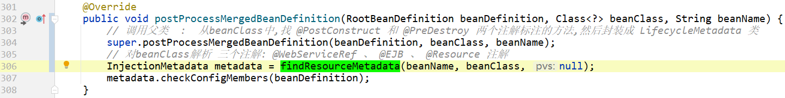

# 问题

1、在spring的bean中，我们可以使用以下两个注释，标注 `初始化方法` 和 `销毁方法` ：

- @PostConstruct
- @PreDestroy

那么这两个注解，从源码层面是如何实现的呢？

2、基于beanName进行依赖注入的 @javax.annotation.Resource 注解，实现原理是？


# 答案

我们看一下 @PostConstruct 注解的Usage：


所以我们找到这个方法：


所以，对于`@PostConstruct` `@PreDestroy`两个注解，是由 `CommonAnnotationBeanPostProcessor` 来实现的。

**也就是使用bean后置处理器来实现的。**

下面开始源码解析。


# CommonAnnotationBeanPostProcessor


继承自 `InitDestroyAnnotationBeanPostProcessor` ，也是其父类 InitDestroyAnnotationBeanPostProcessor 才是对**初始化、销毁注解进行处理的后置处理器。**

> *CommonAnnotationBeanPostProcessor 源码后面讲，先来说说其父类 InitDestroyAnnotationBeanPostProcessor。*
>
> *[CommonAnnotationBeanPostProcessor 详解](#CommonAnnotationBeanPostProcessor详解)*

# InitDestroyAnnotationBeanPostProcessor

> 类名翻译：初始化、销毁注解bean后置处理器。

## 类图


从类图中我们知道，这个类实现了 `BeanPostProcessor`接口，是一个**bean后置处理器**。

> 所以阅读源码的时候，我们主要关注的方法，就是后置处理器相关的方法。
>
> 按照惯例，先看类中的属性。

## 重要属性

```java
public class InitDestroyAnnotationBeanPostProcessor
        implements DestructionAwareBeanPostProcessor, MergedBeanDefinitionPostProcessor, PriorityOrdered, Serializable {

    // 初始化注解   {@link javax.annotation.PostConstruct}
    private Class<? extends Annotation> initAnnotationType;

    // 销毁方法注解   {@link javax.annotation.PreDestroy}
    private Class<? extends Annotation> destroyAnnotationType;

    // 缓存：beanClass对应解析出来的生命周期原数据
    private final transient Map<Class<?>, LifecycleMetadata> lifecycleMetadataCache = new ConcurrentHashMap<>(256);
}    
```

上面属性中，分别表示 `@PostConstruct` 注解和 `@PreDestroy` 注解。

`lifecycleMetadataCache` 用来记录`缓存`，因为解析beanClass中的注解是使用的反射，而反射有比较慢，所以解析完就放到缓存中，避免重复解析。

## 重要方法

> 上面说了，InitDestroyAnnotationBeanPostProcessor 是各bean后置处理器，所以我们最关注的就是后置处理相关方法。

### postProcessMergedBeanDefinition

在这个方法中，解析beanClass，把beanClass中的 生命周期注解，解析成  [LifecycleMetadata](#LifecycleMetadata) 并放到缓存中。


遍历class中的所有方法，找到方法上的 `@javax.annotation.PostConstruct 注解` 和 `@javax.annotation.PreDestroy 注解`，封装成[`LifecycleElement`](#LifecycleElement)。

对于解析beanClass，解析出来的`LifecycleMetadata`，详见：[**生命周期原数据**](#LifecycleMetadata)

### postProcessBeforeInitialization


方法的调用，就是直接使用反射调用的：


### postProcessBeforeDestruction


### requiresDestruction

这也是各后置处理器的方法，是在 `DestructionAwareBeanPostProcessor` 接口中的，是个`default`方法：

```java
public interface DestructionAwareBeanPostProcessor extends BeanPostProcessor {

    void postProcessBeforeDestruction(Object bean, String beanName) throws BeansException;

    default boolean requiresDestruction(Object bean) {
        return true;
    }
}
```


`InitDestroyAnnotationBeanPostProcessor` 实现此方法的原因：就是判断beanClass中是否存在 `@PreDestroy` 注解来：

- 如果存在：表示beanClass中有销毁方法。
- 如果不存在：表示beanClass中没有销毁方法。

> 到这里，[InitDestroyAnnotationBeanPostProcessor](#InitDestroyAnnotationBeanPostProcessor) 类中的 重要方法 都讲解完了。
>
> 应该对这个类已经有一个完整的认知了。

----

# LifecycleMetadata

> 生命周期原数据
>
> 是 `InitDestroyAnnotationBeanPostProcessor` 类中的一个内部类。

## 类注释

```java
/**
 * Class representing information about annotated init and destroy methods.
 */
private class LifecycleMetadata {
}    
```

类注释上说：表示有关带注释的 init 和 destroy 方法的信息的类。

## 重要属性

```java
private class LifecycleMetadata {

    private final Class<?> targetClass;                              // beanClass
    private final Collection<LifecycleElement> initMethods;          // 此类中的所有初始化方法
    private final Collection<LifecycleElement> destroyMethods;       // 此类中的所有销毁方法

    // 构造方法
    public LifecycleMetadata(Class<?> targetClass,
                             Collection<LifecycleElement> initMethods,
                             Collection<LifecycleElement> destroyMethods) {

        this.targetClass = targetClass;
        this.initMethods = initMethods;
        this.destroyMethods = destroyMethods;
    }
}    
```

`Collection<LifecycleElement> initMethods`  存储的是`LifecycleElement`对象，表示：生命周期元素。详见：[LifecycleElement](#LifecycleElement)

> 一个java类对应一个 `LifecycleMetadata` 实例对象
>
> 一个java类中存在多个方法，一个方法对应一个 `LifecycleElement`。

## 重要方法

`LifecycleMetadata`类中主要有四个方法：

- invokeInitMethods 调用初始化方法 详见：[postProcessBeforeInitialization](#postProcessBeforeInitialization)
- invokeDestroyMethods 调用销毁方法 详见：[postProcessBeforeDestruction](#postProcessBeforeDestruction)
- hasDestroyMethods 是否存在销毁方法 详见：[requiresDestruction](#requiresDestruction)
- checkConfigMembers （这个方法不知道干啥用的，感觉就是记录了一下数据。 ）

# LifecycleElement

生命周期元素，其实就是封装封装了beanClass类中的初始化/销毁方法。

是 InitDestroyAnnotationBeanPostProcessor 类的一个内部类。

```java
private static class LifecycleElement {
    private final Method method;          // 方法
    private final String identifier;      // 方法的id

    public LifecycleElement(Method method) {
        if (method.getParameterCount() != 0) {       // 如果方法有参数，则报错。
            throw new IllegalStateException("Lifecycle method annotation requires a no-arg method: " + method);
        }
        this.method = method;
        this.identifier = (ModifieInjectionMetadatar.isPrivate(method.getModifiers()) ? ClassUtils.getQualifiedMethodName(method) : method.getName());
    }

    public void invoke(Object target) throws Throwable {
        ReflectionUtils.makeAccessible(this.method);
        this.method.invoke(target, (Object[]) null);            // 使用反射调用方法。
    }
}
```

----


# CommonAnnotationBeanPostProcessor详解

## 类图


从类图上我们看到，`CommonAnnotationBeanPostProcessor` 是 [InitDestroyAnnotationBeanPostProcessor](#InitDestroyAnnotationBeanPostProcessor) 的子类。

也就包含了`生命周期`的相关功能。

另外，`CommonAnnotationBeanPostProcessor` 也对以下三个注解进行了支持：

- @javax.xml.ws.WebServiceRef
- @javax.ejb.EJB
- @javax.annotation.Resource

## 重要方法

此类也是后置处理器，所以我们还是最关注后置处理器中的方法。也就是带有 `@Override`  注解的方法。

### setBeanFactory

这是bean工厂对象，是 org.springframework.beans.factory.BeanFactoryAware 接口中的方法。

通过实现此方法，可以把获取到spring容器中的bean工厂：

```java
@Override
public void setBeanFactory(BeanFactory beanFactory){
        Assert.notNull(beanFactory,"BeanFactory must not be null");
        this.beanFactory=beanFactory;
        if(this.resourceFactory==null){
        this.resourceFactory=beanFactory;
        }
        if(beanFactory instanceof ConfigurableBeanFactory){
        this.embeddedValueResolver=new EmbeddedValueResolver((ConfigurableBeanFactory)beanFactory);
        }
        }
```

### postProcessMergedBeanDefinition



- 先调用父类中的方法，其实就是调用 [`InitDestroyAnnotationBeanPostProcessor#postProcessMergedBeanDefinition` 方法](#postProcessMergedBeanDefinition)
    - 父类方法，是从当前beanClass中,找 @PostConstruct 和 @PreDestroy 两个注解标注的方法,然后封装成 LifecycleMetadata 类
- 然后调用当前类中的 [`findResourceMetadata(beanName, beanClass, null);`](#findResourceMetadata) 方法：
    - 对beanClass解析 三个注解: @WebServiceRef 、 @EJB 、 @Resource 注解

###### findResourceMetadata


虽然下面这方法很长，但是逻辑很简单：

- 遍历beanClass及其父类中的所有字段：解析字段上的 @WebServiceRef 、 @EJB 、 @Resource 注解
- 遍历beanClass及其父类中的所有方法：解析方法上的 @WebServiceRef 、 @EJB 、 @Resource 注解
- 然后封装成 [`org.springframework.beans.factory.annotation.InjectionMetadata`](../@Autowired注解源码实现/readme.md#InjectionMetadata)


### postProcessPropertyValues


先调用 [findResourceMetadata()](#findResourceMetadata) 方法，找到当前类对应的`InjectionMetadata`注入原数据信息。

然后调用 `inject方法`：


如果beanClass的字段或方法上，使用了 @Resource 注解，则对应的 的是：`CommonAnnotationBeanPostProcessor.ResourceElement` 内部类：

###### ResourceElement

`ResourceElement`类图：


> 我们在之前的文章中说了：
>
> `InjectedElement` 是一个静态内部类，**要么重写 `getResourceToInject()`方法，要么重写 `inject()` 方法。**
>
> 详见：[InjectedElement](../@Autowired注解源码实现/readme.md#InjectedElement)

`ResourceElement` 是重写的 `getResourceToInject()`方法：

```java
private class ResourceElement extends LookupElement {
		@Override
		protected Object getResourceToInject(Object target, @Nullable String requestingBeanName) {
			return this.lazyLookup ?
                    buildLazyResourceProxy(this, requestingBeanName) :
                    getResource(this, requestingBeanName);
		}
}
```

> `getResourceToInject()` 方法的返回值，是在`InjectionMetadata.InjectedElement#inject` 注入方法中使用的：
>
> 

`getResource(this, requestingBeanName)`


>  这里的参数 `this.resourceFactory`  其实是就是 `setBeanFactory` 方法中，设置的 bean工厂：
>
> 


# 总结

本文，我们主要了解了以下三个注解的实现原理：

- 初始化方法和销毁方法注解：
  - @PostConstruct
  - @PreDestroy

- 基于beanName注入的注解：
  - @javax.annotation.Resource

