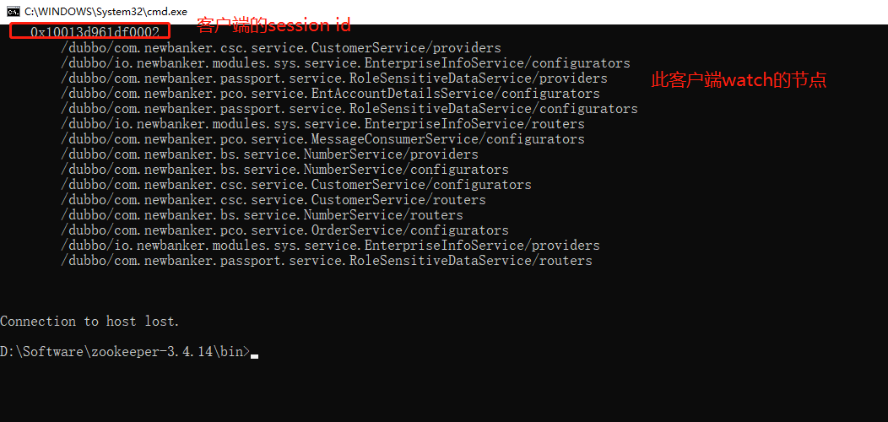

# 场景

配置中心：SpringBoot+mysql+ZooKeeper

业务系统：使用xxl-job连接ZooKeeper，获取数据源配置信息。

今天在配置中心中修改了一个租户的数据源配置之后，业务系统竟然没有接收到监听。导致业务系统还是连接的之前的url域名。

# 问题猜测

猜测是passport业务系统对ZooKeeper /nb-conf/ent614/datasource节点的watch监听丢失了。

# 操作思路

想要查看一下ZooKeeper上，哪些zk客户端对 /nb-conf/ent614/datasource节点进行了watch监听。

# 操作步骤

使用ZooKeeper四字命令

## 1、添加到白名单

默认情况，执行 `wchc` 四字命令报错，说这个命令没有在白名单中。

所以修改zk配置文件`zoo.cfg`：
`4lw.commands.whitelist=*`

然后重启ZooKeeper服务。

## 2、查看客户端watch信息

`echo wchc | nc localhost 2181`

返回信息是 session id 对应path。由于我们能查询出来passport服务的ip，但不知道对应的sessionid是多少。

所以还需要查询session id 对应的ip是多少

## 3、查询session id对应ip

`echo cons | nc localhost 2181`

# zookeeper四字命令

来源：http://zookeeper.apache.org/doc/trunk/zookeeperAdmin.html#The+Four+Letter+Words 

ZooKeeper3.4.6支持某些特定的四字命令字母与其的交互。它们大多是查询命令，用来获取 ZooKeeper 服务的当前状态及相关信息。用户在客户端可以通过 telnet 或 nc 向 ZooKeeper 提交相应的命令。 

其中stat、srvr、cons三个命令比较类似："stat"提供服务器统计和客户端连接的一般信息；

"srvr"只有服务的统计信息，

"cons"提供客户端连接的更加详细的信息。 

 使用方式，在shell 终端输入：echo mntr | nc localhost 2181    或者使用 telnet locaohost 2181 然后输入 四字命令

 在64位CentOS6下，默认使用不了netcat，请参考上篇 ：[64位CentOS6系统下安装netcat](http://blog.csdn.net/u013673976/article/details/47084841)

命令	| 示例	| 描述 
----|-----|-----|-----
conf	| echo conf \| nc localhost 2181 |	(New in 3.3.0)输出相关服务配置的详细信息。比如端口、zk数据及日志配置路径、最大连接数，session超时时间、serverId等|
cons	| echo cons \| nc localhost 2181 |	(New in 3.3.0)列出所有连接到这台服务器的客户端连接/会话的详细信息。包括“接受/发送”的包数量、session id 、操作延迟、最后的操作执行等信息。|
crst	| echo crst \| nc localhost 2181 |	(New in 3.3.0)重置当前这台服务器所有连接/会话的统计信息|
dump	| echo dump \| nc localhost 2181 |	列出未经处理的会话和临时节点（只在leader上有效）。|
envi	| echo envi \| nc localhost 2181 |	输出关于服务器的环境详细信息（不同于conf命令），比如host.name、java.version、java.home、user.dir=/data/zookeeper-3.4.6/bin之类信息|
ruok	| echo ruok \| nc localhost 2181 |	测试服务是否处于正确运行状态。如果正常返回"imok"，否则返回空。|
srst	| echo srst \| nc localhost 2181 |	重置服务器的统计信息|
srvr	| echo srvr \| nc localhost 2181 |	(New in 3.3.0)输出服务器的详细信息。zk版本、接收/发送包数量、连接数、模式（leader/follower）、节点总数。|
stat	| echo stat \| nc localhost 2181 |	输出服务器的详细信息：接收/发送包数量、连接数、模式（leader/follower）、节点总数、延迟。 所有客户端的列表。|
wchs	| echo wchs \| nc localhost 2181 |	(New in 3.3.0)列出服务器watches的简洁信息：连接总数、watching节点总数和watches总数|
wchc	| echo wchc \| nc localhost 2181 |	(New in 3.3.0)通过session分组，列出watch的所有节点，它的输出是一个与 watch 相关的会话的节点列表。如果watches数量很大的话，将会产生很大的开销，会影响性能，小心使用。|
wchp	| echo wchp \| nc localhost 2181 |	(New in 3.3.0)通过路径分组，列出所有的 watch 的session id信息。它输出一个与 session 相关的路径。如果watches数量很大的话，将会产生很大的开销，会影响性能，小心使用。|
mntr	| echo mntr \| nc localhost 2181 |	(New in 3.4.0)列出集群的健康状态。包括“接受/发送”的包数量、操作延迟、当前服务模式（leader/follower）、节点总数、watch总数、临时节点总数。|

监控指标(参照hackerwin7的博客 http://blog.csdn.net/hackerwin7/article/details/43985049)：

## conf:

clientPort:客户端端口号 
dataDir：数据文件目录
dataLogDir：日志文件目录  
tickTime：间隔单位时间
maxClientCnxns：最大连接数  
minSessionTimeout：最小session超时
maxSessionTimeout：最大session超时  
serverId：id  
initLimit：初始化时间  
syncLimit：心跳时间间隔  
electionAlg：选举算法 默认3  
electionPort：选举端口  
quorumPort：法人端口  
peerType：未确认

## cons：

ip=ip
port=端口
queued=所在队列
received=收包数
sent=发包数
sid=session id
lop=最后操作
est=连接时间戳
to=超时时间
lcxid=最后id(未确认具体id)
lzxid=最后id(状态变更id)
lresp=最后响应时间戳
llat=最后/最新 延时
minlat=最小延时
maxlat=最大延时
avglat=平均延时

## crst:

重置所有连接

## dump:

session id : znode path  (1对多   ,  处于队列中排队的session和临时节点)

## envi:

zookeeper.version=版本
host.name=host信息
java.version=java版本
java.vendor=供应商
java.home=jdk目录
java.class.path=classpath
java.library.path=lib path
java.io.tmpdir=temp目录
java.compiler=<NA>
os.name=Linux
os.arch=amd64
os.version=2.6.32-358.el6.x86_64
user.name=hhz
user.home=/home/hhz
user.dir=/export/servers/zookeeper-3.4.6

## ruok:

查看server是否正常
imok=正常

## srst:

重置server状态

## srvr：

Zookeeper version:版本
Latency min/avg/max: 延时
Received: 收包
Sent: 发包
Connections: 连接数
Outstanding: 堆积数
Zxid: 操作id
Mode: leader/follower
Node count: 节点数

## stat：

Zookeeper version: 3.4.6-1569965, built on 02/20/2014 09:09 GMT
Clients:
 /192.168.147.102:56168[1](queued=0,recved=41,sent=41)
 /192.168.144.102:34378[1](queued=0,recved=54,sent=54)
 /192.168.162.16:43108[1](queued=0,recved=40,sent=40)
 /192.168.144.107:39948[1](queued=0,recved=1421,sent=1421)
 /192.168.162.16:43112[1](queued=0,recved=54,sent=54)
 /192.168.162.16:43107[1](queued=0,recved=54,sent=54)
 /192.168.162.16:43110[1](queued=0,recved=53,sent=53)
 /192.168.144.98:34702[1](queued=0,recved=41,sent=41)
 /192.168.144.98:34135[1](queued=0,recved=61,sent=65)
 /192.168.162.16:43109[1](queued=0,recved=54,sent=54)
 /192.168.147.102:56038[1](queued=0,recved=165313,sent=165314)
 /192.168.147.102:56039[1](queued=0,recved=165526,sent=165527)
 /192.168.147.101:44124[1](queued=0,recved=162811,sent=162812)
 /192.168.147.102:39271[1](queued=0,recved=41,sent=41)
 /192.168.144.107:45476[1](queued=0,recved=166422,sent=166423)
 /192.168.144.103:45100[1](queued=0,recved=54,sent=54)
 /192.168.162.16:43133[0](queued=0,recved=1,sent=0)
 /192.168.144.107:39945[1](queued=0,recved=1825,sent=1825)
 /192.168.144.107:39919[1](queued=0,recved=325,sent=325)
 /192.168.144.106:47163[1](queued=0,recved=17891,sent=17891)
 /192.168.144.107:45488[1](queued=0,recved=166554,sent=166555)
 /172.17.36.11:32728[1](queued=0,recved=54,sent=54)
 /192.168.162.16:43115[1](queued=0,recved=54,sent=54)

Latency min/avg/max: 0/0/599
Received: 224869
Sent: 224817
Connections: 23
Outstanding: 0
Zxid: 0x68000af707
Mode: follower
Node count: 101081

（同上面的命令整合的信息）

## wchs:

connectsions=连接数
watch-paths=watch节点数
watchers=watcher数量

## wchc:

session id 对应 path

## wchp:

path 对应 session id

## mntr:

zk_version=版本
zk_avg_latency=平均延时
zk_max_latency=最大延时
zk_min_latency=最小延时
zk_packets_received=收包数  
zk_packets_sent=发包数
zk_num_alive_connections=连接数
zk_outstanding_requests=堆积请求数
zk_server_state=leader/follower 状态
zk_znode_count=znode数量
zk_watch_count=watch数量
zk_ephemerals_count=临时节点（znode）
zk_approximate_data_size=数据大小
zk_open_file_descriptor_count=打开的文件描述符数量
zk_max_file_descriptor_count=最大文件描述符数量
zk_followers=follower数量
zk_synced_followers=同步的follower数量
zk_pending_syncs=准备同步数
————————————————
版权声明：本文为CSDN博主「Scub」的原创文章，遵循CC 4.0 BY-SA版权协议，转载请附上原文出处链接及本声明。
原文链接：https://blog.csdn.net/u013673976/article/details/47279707