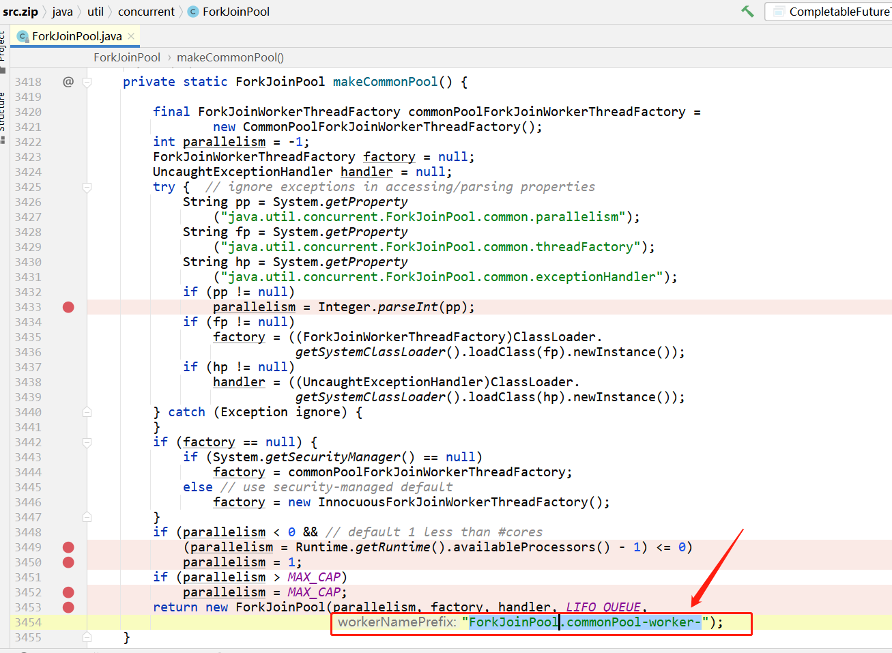
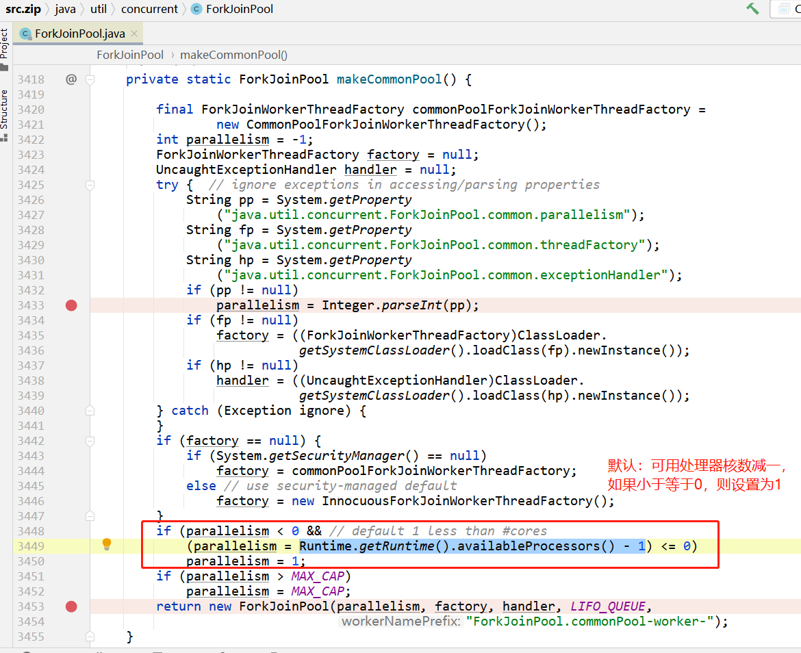

# ForkJoinPool

ForkJoinPool线程池是`CompletableFuture`默认使用的线程池。

## 线程名前缀

`ForkJoinPool.commonPool-worker-`

## 默认线程数量

`可用处理器核数 - 1`

## 线程数量

如果任务没有运行，则线程池中，不会创建线程；

如果任务执行完毕，则线程池中的线程，会自动销毁。

# [Java Fork Join 框架-并发编程网](http://ifeve.com/a-java-fork-join-framework/)

