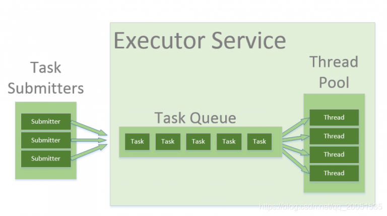

# JDK线程池示意图

# 线程优化的切入点

能进行优化的关键是了解线上线程池的运行状况；所以第一步就是要对线程池进行监控。

**一个是数据的监控，一个是时间的监控。**

有了记录的参数后，我们才能做性能瓶颈的分析。

瓶颈可能但不限于出现在一下几个地方：
**核心线程池数量过小，处理时间过长，导致阻塞队列堆积过大：**可以根据机器性能适当调节核心线程数的大小。同是控制任务提交的评论，能处理多少就提交多少。
**机器重启导致任务丢失：**控制任务的提交频率，尽量不要排队；或者条件允许，采用可靠的任务提交模式。将未处理完成的任务都记录下来，只有收到处理成功的消息，再删除掉原数据

Executor框架主要由三个部分组成：任务、任务的执行、异步计算的结果

1. Executor是一个接口，它将任务的提交和任务的执行分离。
2. ThreadPoolExecutor是线程池的核心，用来执行被提交的 `任务`
3. Future接口和实现Future接口的FutureTask类，表明异步计算的结果。
4. Runnable接口和Callable接口的实现类，均可以被ThreadPoolExecutor或其余执行。

# Java8  CompletableFuture回调函数

[Java8 CompletableFuture（2）回调函数 thenApply thenAccept thenRun](https://blog.csdn.net/winterking3/article/details/116025829)

