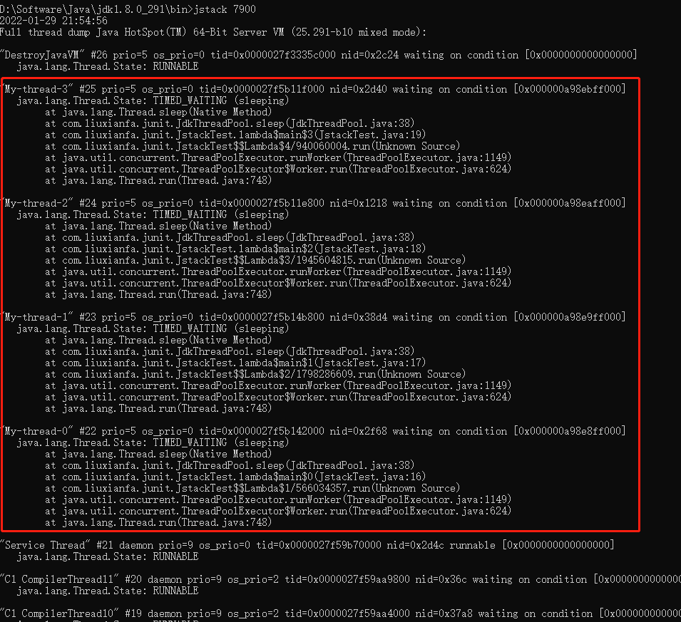

这个项目主要是为了研究线程池：

- 对比jdk自带的线程池和guava线程池。


# jdk线程池

## 线程工厂

```java
/**
 * 线程工厂,指定线程的名称.
 * <p>
 * %d   可以指定线程池中的线程下标.从0开始.
 */
static ThreadFactory threadFactory = new ThreadFactoryBuilder().setNameFormat("My-thread-%d").build();
```

这个线程工厂，是使用的guava创建的。

如果不想用guava也可以使用java原生创建：首先需要先创建一个线程工厂实现类：`ThreadFactoryImpl`  

```java


import java.util.concurrent.ThreadFactory;
import java.util.concurrent.atomic.AtomicLong;

/**
 * 线程工厂
 * @author LiuXianfa
 * @author xianfaliu2@creditease.cn
 * @date 2021/12/30 9:54
 */
public class ThreadFactoryImpl implements ThreadFactory {
    private final AtomicLong threadIndex = new AtomicLong(0);
    private final String threadNamePrefix;
    private final boolean daemon;

    public ThreadFactoryImpl(final String threadNamePrefix) {
        this(threadNamePrefix, false);
    }

    public ThreadFactoryImpl(final String threadNamePrefix, boolean daemon) {
        this.threadNamePrefix = threadNamePrefix;
        this.daemon = daemon;
    }

    @Override
    public Thread newThread(Runnable r) {
        Thread thread = new Thread(r, threadNamePrefix + this.threadIndex.incrementAndGet());
        thread.setDaemon(daemon);
        return thread;
    }
}
```

使用方法：

```java
// 构造方法表示指定创建线程的线程名称前缀。
// 第二个构造参数：daemon 表示创建的线程是否为守护线程。默认false
ThreadFactoryImpl threadFactory = new ThreadFactoryImpl("xxxThreadPool-", true);
```


## 创建JDK线程池

```java
/**
 * jdk线程池
 */
ThreadPoolExecutor JDK_THREAD_POOL = new ThreadPoolExecutor(10, 100,
                                                                   0L, TimeUnit.MILLISECONDS,
                                                                   new LinkedBlockingQueue<>(1000),
                                                                   threadFactory,
                                                                   // 拒绝策略:调用者执行.
                                                                   new ThreadPoolExecutor.CallerRunsPolicy());
```

这里的7个参数就不赘述了。


# 使用jstack查看线程名




# 直接线程池

```java
public class DirectExectorTest {

    public static void main(String[] args) {
        // 单例对象
        Executor executor = MoreExecutors.directExecutor();
        System.out.println("提交5秒的任务.");
        executor.execute(() -> {
            sleep(5);
            System.out.println(String.format("5秒的任务结束.任务是在[%s]线程中执行的.", Thread.currentThread().getName()));
        });
        System.out.println("main线程结束..");
    }
}
```

控制台打印：

```
提交5秒的任务.
5秒的任务结束.任务是在[main]线程中执行的.
main线程结束..
```

1、返回一个Executor实例，具体是DirectExecutor类型，
DirectExecutor是一个实现了Executor接口的枚举类。调用execute(Runnable command)方法时，
在当前线程执行任务，而不会另起一个线程。
2、当前线程执行完毕后,会退出.

# 守护线程池

当线程池中的任务都执行完毕之后，jvm会退出。如下例子，当2个线程sleep4秒之后，jvm会正常退出。

```java
    public static void main(String[] args) {
        /*
         * getExitingExecutorService()方法的三个重载： 把一个ThreadPoolExecutor实例转成一个应用结束后自动退出的ExecutorService实例。
         * 这个线程池,最多等待15秒,如果15秒之后任务还是没有执行完毕,那么也会退出.
         */
        ExecutorService exitingExecutorService = MoreExecutors.getExitingExecutorService(JDK_THREAD_POOL, 15, TimeUnit.SECONDS);
        
        exitingExecutorService.execute(() -> {
            sleep(4);
            System.out.println("线程执行完毕." + Thread.currentThread().getName());
        });
        System.out.println("1");

        exitingExecutorService.execute(() -> {
            sleep(4);
            System.out.println("线程执行完毕." + Thread.currentThread().getName());
        });
        System.out.println("2");
        
        System.out.println("main 线程执行到最后了.");
    }
```

控制台打印：

```
1
2
main 线程执行到最后了.
线程执行完毕.My-thread-0
线程执行完毕.My-thread-1

Process finished with exit code 0

```

如果使用jdk线程池，并且线程工厂创建的线程都是守护线程，是无法达到这个效果的。

因为：线程池中的线程都是守护线程，jvm并不会等待守护线程执行完毕之后，才退出jvm。而是main方法执行完之后，直接关闭jvm进程。

```java
    static ThreadFactory daemonThreadFactory = new ThreadFactoryBuilder().setNameFormat("MyDaemonThread-%d").setDaemon(true).build();

    static ThreadPoolExecutor DAEMON_JDK_THREAD_POOL = new ThreadPoolExecutor(10, 100,
                                                                              0L, TimeUnit.MILLISECONDS,
                                                                              new LinkedBlockingQueue<>(1000),
                                                                              daemonThreadFactory,
                                                                              new ThreadPoolExecutor.CallerRunsPolicy());
                                                                              
	public static void main(String[] args) {
        DAEMON_JDK_THREAD_POOL.execute(() -> {
            sleep(4);
            System.out.println("线程执行完毕." + Thread.currentThread().getName());
        });
        System.out.println("1");


        DAEMON_JDK_THREAD_POOL.execute(() -> {
            sleep(4);
            System.out.println("线程执行完毕." + Thread.currentThread().getName());
        });
        System.out.println("2");

        System.out.println("main 线程执行到最后了.");
    }
```

控制台打印：

```
1
2
main 线程执行到最后了.

Process finished with exit code 0

```

可见，并没有等待两个线程执行完毕。就直接退出jvm进程了。


# 可监听线程池

Future接口为异步计算取回结果提供了一个存根(stub)，
然而这样每次调用Future接口的get方法取回计算结果每每是须要面临阻塞的可能性。
这样在最坏的状况下，异步计算和同步计算的消耗是一致的。
所以,Guava库中提供一个很是强大的装饰后的Future接口，
使用观察者模式为在异步计算完成以后,立刻执行addListener指定一个Runnable对象，从而实现“完成当即通知”。
更多详见:  http://ifeve.com/google-guava-listenablefuture/

```java
static ListeningExecutorService pool = MoreExecutors.listeningDecorator(JDK_THREAD_POOL);

@SneakyThrows
public static void main(String[] args) {
    ListenableFuture<String> future = pool.submit(() -> {
        sleep(4);
        System.out.println("线程执行完毕." + Thread.currentThread().getName());
        return "[hello pool]";
    });

    ListenableFuture<Integer> future2 = pool.submit(() -> 1 / 0);


    Futures.addCallback(future, callback, pool);
    Futures.addCallback(future2, callback, pool);

    System.out.println("main 线程执行到最后了.");
}

    // future 执行成功或异常的时候，回调函数。
    static FutureCallback<Object> callback = new FutureCallback<Object>() {
        @Override
        public void onSuccess(Object result) {
            System.out.println("成功" + Thread.currentThread().getName() + "  异步任务执行结果:" + result);
        }

        @Override
        public void onFailure(Throwable t) {
            System.out.println("失败" + Thread.currentThread().getName() + "  异步任务异常:");
            t.printStackTrace();
        }
    };
```

控制台打印：

```
main 线程执行到最后了.
失败My-thread-2  异步任务异常:
java.lang.ArithmeticException: / by zero
	at com.liuxianfa.junit.ListeningDecoratorTest.lambda$testWithListeningDecorator$4(ListeningDecoratorTest.java:77)
	at com.google.common.util.concurrent.TrustedListenableFutureTask$TrustedFutureInterruptibleTask.runInterruptibly(TrustedListenableFutureTask.java:125)
	at com.google.common.util.concurrent.InterruptibleTask.run(InterruptibleTask.java:69)
	at com.google.common.util.concurrent.TrustedListenableFutureTask.run(TrustedListenableFutureTask.java:78)
	at java.util.concurrent.ThreadPoolExecutor.runWorker(ThreadPoolExecutor.java:1149)
	at java.util.concurrent.ThreadPoolExecutor$Worker.run(ThreadPoolExecutor.java:624)
	at java.lang.Thread.run(Thread.java:748)
线程执行完毕.My-thread-0
成功My-thread-3  异步任务执行结果:[hello pool]

// 注意，这里并没有打印jvm正常退出的日志。jvm是不会自动退出的。因为线程池中的线程不是守护线程，不会自动退出jvm。
```


不过使用java8也轻松实现：

```java
    public static void main(String[] args) {
        CompletableFuture<String> future = CompletableFuture.supplyAsync(() -> {
            sleep(4);
            System.out.println("线程执行完毕." + Thread.currentThread().getName());
            return "[hello pool]";
        });

        CompletableFuture<Integer> future2 = CompletableFuture.supplyAsync(() -> 1 / 0);

        BiConsumer<Object, Throwable> callback = (s, t) -> {
            if (t != null) {
                System.out.println("失败" + Thread.currentThread().getName() + "  异步任务异常:");
                t.printStackTrace();
            } else {
                System.out.println("成功" + Thread.currentThread().getName() + "  异步任务执行结果:" + s);
            }
        };
        
        future.whenCompleteAsync(callback);
        future2.whenCompleteAsync(callback);


        System.out.println("main 线程执行到最后了.");
        sleep(5);
    }
```

控制台输出：

```
main 线程执行到最后了.
失败ForkJoinPool.commonPool-worker-18  异步任务异常:
java.util.concurrent.CompletionException: java.lang.ArithmeticException: / by zero
	at java.util.concurrent.CompletableFuture.encodeThrowable(CompletableFuture.java:273)
	at java.util.concurrent.CompletableFuture.completeThrowable(CompletableFuture.java:280)
	at java.util.concurrent.CompletableFuture$AsyncSupply.run(CompletableFuture.java:1606)
	at java.util.concurrent.CompletableFuture$AsyncSupply.exec(CompletableFuture.java:1596)
	at java.util.concurrent.ForkJoinTask.doExec(ForkJoinTask.java:289)
	at java.util.concurrent.ForkJoinPool$WorkQueue.runTask(ForkJoinPool.java:1067)
	at java.util.concurrent.ForkJoinPool.runWorker(ForkJoinPool.java:1703)
	at java.util.concurrent.ForkJoinWorkerThread.run(ForkJoinWorkerThread.java:172)
Caused by: java.lang.ArithmeticException: / by zero
	at com.liuxianfa.junit.ListeningDecoratorTest.lambda$main$1(ListeningDecoratorTest.java:49)
	at java.util.concurrent.CompletableFuture$AsyncSupply.run(CompletableFuture.java:1604)
	... 5 more
线程执行完毕.ForkJoinPool.commonPool-worker-25
成功ForkJoinPool.commonPool-worker-25  异步任务执行结果:[hello pool]

Process finished with exit code 0
```


网上说, guava 比较好用的是 可监听的执行器 ListeningExecutorService、可监听的Future ListenableFuture
但是其实使用java8也能实现. 而且java8的 CompletableFuture 让开发者更专注于[任务]和[执行任务时是否需要异步]. 并不需要关心线程池.

[Java8 CompletableFuture（2）回调函数 thenApply thenAccept thenRun](https://blog.csdn.net/winterking3/article/details/116025829)


# 顺序线程池

线程执行的顺序和任务提交的顺序相同。上一个任务执行不完，下一个任务就不会开始。

```java
public static void main(String[] args) {
    Executor executor = MoreExecutors.newSequentialExecutor(JdkThreadPool.JDK_THREAD_POOL);
    for (int i = 0; i < 10; i++) {
        int index = i;
        executor.execute(() -> {
            sleep(index);
            System.out.println(Thread.currentThread().getName() + "@" + index + ", now= " + LocalTime.now());
        });
    }
}
```

控制台输出：

```
My-thread-0@0, now= 22:19:00.213
My-thread-0@1, now= 22:19:01.223
My-thread-0@2, now= 22:19:03.232
My-thread-0@3, now= 22:19:06.237
My-thread-0@4, now= 22:19:10.251
My-thread-0@5, now= 22:19:15.260
My-thread-0@6, now= 22:19:21.273
My-thread-0@7, now= 22:19:28.274
My-thread-0@8, now= 22:19:36.283
My-thread-0@9, now= 22:19:45.292
```


# 线程优化的切入点

能进行优化的关键是了解线上线程池的运行状况；所以第一步就是要对线程池进行监控。

**一个是数据的监控，一个是时间的监控。**

有了记录的参数后，我们才能做性能瓶颈的分析。


瓶颈可能但不限于出现在一下几个地方：
**核心线程池数量过小，处理时间过长，导致阻塞队列堆积过大：**可以根据机器性能适当调节核心线程数的大小。同是控制任务提交的评论，能处理多少就提交多少。
**机器重启导致任务丢失：**控制任务的提交频率，尽量不要排队；或者条件允许，采用可靠的任务提交模式。将未处理完成的任务都记录下来，只有收到处理成功的消息，再删除掉原数据


Executor框架主要由三个部分组成：任务、任务的执行、异步计算的结果

1. Executor是一个接口，它将任务的提交和任务的执行分离。
2. ThreadPoolExecutor是线程池的核心，用来执行被提交的 `任务`
3. Future接口和实现Future接口的FutureTask类，表明异步计算的结果。
4. Runnable接口和Callable接口的实现类，均可以被ThreadPoolExecutor或其余执行。


# 资料参考

### [Java8 CompletableFuture回调函数](https://blog.csdn.net/winterking3/article/details/116025829)


