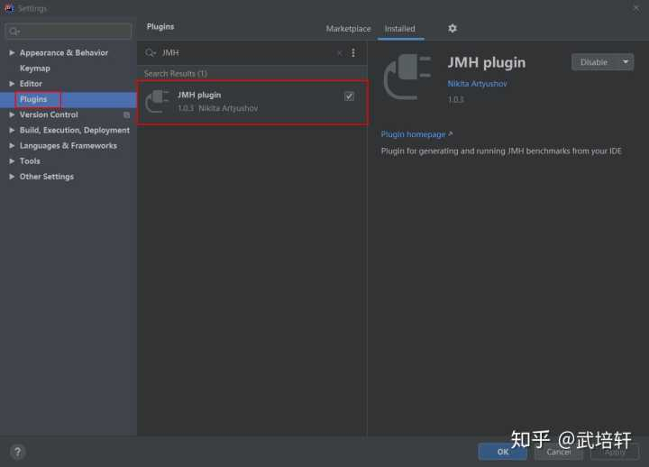
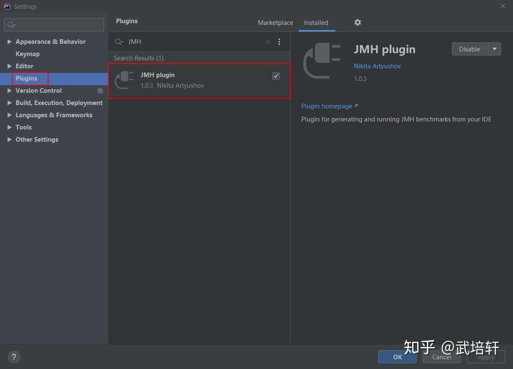
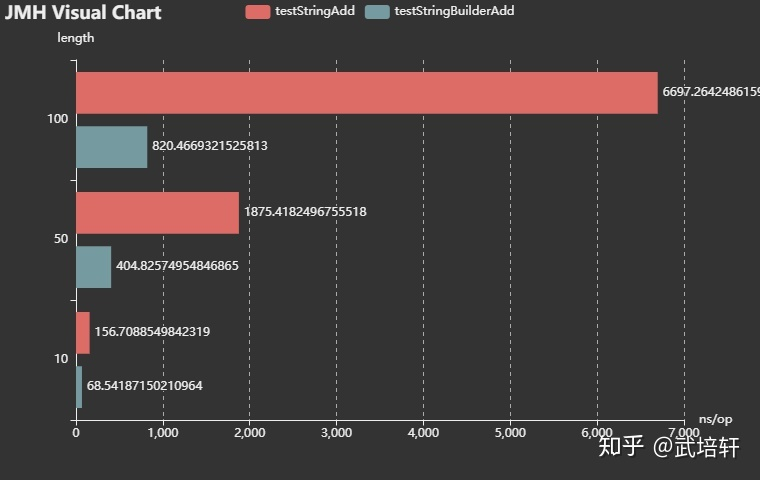

[为什么要用JMH？何时应该用？](https://www.zhihu.com/question/276455629/answer/1259967560)


作者：武培轩
链接：https://www.zhihu.com/question/276455629/answer/1259967560
来源：知乎
著作权归作者所有。商业转载请联系作者获得授权，非商业转载请注明出处。


if 快还是 switch 快？HashMap 的初始化 size 要不要指定，指定之后性能可以提高多少？各种序列化方法哪个耗时更短？

无论出自何种原因需要进行性能评估，量化指标总是必要的。

在大部分场合，简单地回答谁快谁慢是远远不够的，如何将程序性能量化呢？

这就需要我们的主角 JMH 登场了！

## JMH 简介

JMH(Java Microbenchmark Harness)是用于代码微基准测试的工具套件，主要是基于方法层面的基准测试，精度可以达到纳秒级。该工具是由 Oracle 内部实现 JIT 的大牛们编写的，他们应该比任何人都了解 JIT 以及 JVM 对于基准测试的影响。

当你定位到热点方法，希望进一步优化方法性能的时候，就可以使用 JMH 对优化的结果进行量化的分析。

JMH 比较典型的应用场景如下：

1. 想准确地知道某个方法需要执行多长时间，以及执行时间和输入之间的相关性
2. 对比接口不同实现在给定条件下的吞吐量
3. 查看多少百分比的请求在多长时间内完成

下面我们以字符串拼接的两种方法为例子使用 JMH 做基准测试。

### 加入依赖

因为 JMH 是 JDK9 自带的，如果是 JDK9 之前的版本需要加入如下依赖（目前 JMH 的最新版本为 `1.23`）：

```text
<dependency>
    <groupId>org.openjdk.jmh</groupId>
    <artifactId>jmh-core</artifactId>
    <version>1.23</version>
</dependency>
<dependency>
    <groupId>org.openjdk.jmh</groupId>
    <artifactId>jmh-generator-annprocess</artifactId>
    <version>1.23</version>
</dependency>
```

### 编写基准测试

接下来，创建一个 JMH 测试类，用来判断 `+` 和 `StringBuilder.append()` 两种字符串拼接哪个耗时更短，具体代码如下所示：

```text
@BenchmarkMode(Mode.AverageTime)
@Warmup(iterations = 3, time = 1)
@Measurement(iterations = 5, time = 5)
@Threads(4)
@Fork(1)
@State(value = Scope.Benchmark)
@OutputTimeUnit(TimeUnit.NANOSECONDS)
public class StringConnectTest {

    @Param(value = {"10", "50", "100"})
    private int length;

    @Benchmark
    public void testStringAdd(Blackhole blackhole) {
        String a = "";
        for (int i = 0; i < length; i++) {
            a += i;
        }
        blackhole.consume(a);
    }

    @Benchmark
    public void testStringBuilderAdd(Blackhole blackhole) {
        StringBuilder sb = new StringBuilder();
        for (int i = 0; i < length; i++) {
            sb.append(i);
        }
        blackhole.consume(sb.toString());
    }

    public static void main(String[] args) throws RunnerException {
        Options opt = new OptionsBuilder()
                .include(StringConnectTest.class.getSimpleName())
                .result("result.json")
                .resultFormat(ResultFormatType.JSON).build();
        new Runner(opt).run();
    }
}
```

其中需要测试的方法用 `@Benchmark` 注解标识，这些注解的具体含义将在下面介绍。

在 main() 函数中，首先对测试用例进行配置，使用 Builder 模式配置测试，将配置参数存入 Options 对象，并使用 Options 对象构造 Runner 启动测试。

另外大家可以看下官方提供的 jmh 示例 demo：`http://hg.openjdk.java.net/code-tools/jmh/file/tip/jmh-samples/src/main/java/org/openjdk/jmh/samples/`

### 执行基准测试

准备工作做好了，接下来，运行代码，等待片刻，测试结果就出来了，下面对结果做下简单说明：

```text
# JMH version: 1.23
# VM version: JDK 1.8.0_201, Java HotSpot(TM) 64-Bit Server VM, 25.201-b09
# VM invoker: D:\Software\Java\jdk1.8.0_201\jre\bin\java.exe
# VM options: -javaagent:D:\Software\JetBrains\IntelliJ IDEA 2019.1.3\lib\idea_rt.jar=61018:D:\Software\JetBrains\IntelliJ IDEA 2019.1.3\bin -Dfile.encoding=UTF-8
# Warmup: 3 iterations, 1 s each
# Measurement: 5 iterations, 5 s each
# Timeout: 10 min per iteration
# Threads: 4 threads, will synchronize iterations
# Benchmark mode: Average time, time/op
# Benchmark: com.wupx.jmh.StringConnectTest.testStringBuilderAdd
# Parameters: (length = 100)
```

该部分为**测试的基本信息**，比如使用的 Java 路径，预热代码的迭代次数，测量代码的迭代次数，使用的线程数量，测试的统计单位等。

```text
# Warmup Iteration   1: 1083.569 ±(99.9%) 393.884 ns/op
# Warmup Iteration   2: 864.685 ±(99.9%) 174.120 ns/op
# Warmup Iteration   3: 798.310 ±(99.9%) 121.161 ns/op
```

该部分为每一次热身中的性能指标，预热测试不会作为最终的统计结果。预热的目的是**让 JVM 对被测代码进行足够多的优化**，比如，在预热后，被测代码应该得到了充分的 JIT 编译和优化。

```text
Iteration   1: 810.667 ±(99.9%) 51.505 ns/op
Iteration   2: 807.861 ±(99.9%) 13.163 ns/op
Iteration   3: 851.421 ±(99.9%) 33.564 ns/op
Iteration   4: 805.675 ±(99.9%) 33.038 ns/op
Iteration   5: 821.020 ±(99.9%) 66.943 ns/op

Result "com.wupx.jmh.StringConnectTest.testStringBuilderAdd":
  819.329 ±(99.9%) 72.698 ns/op [Average]
  (min, avg, max) = (805.675, 819.329, 851.421), stdev = 18.879
  CI (99.9%): [746.631, 892.027] (assumes normal distribution)

Benchmark                               (length)  Mode  Cnt     Score     Error  Units
StringConnectTest.testStringBuilderAdd       100  avgt    5   819.329 ±  72.698  ns/op
```

该部分显示测量迭代的情况，每一次迭代都显示了当前的执行速率，即一个操作所花费的时间。在进行 5 次迭代后，进行统计，在本例中，length 为 100 的情况下 `testStringBuilderAdd` 方法的平均执行花费时间为 `819.329 ns`，误差为 `72.698 ns`。

最后的测试结果如下所示：

```text
Benchmark                               (length)  Mode  Cnt     Score     Error  Units
StringConnectTest.testStringAdd               10  avgt    5   161.496 ±  17.097  ns/op
StringConnectTest.testStringAdd               50  avgt    5  1854.657 ± 227.902  ns/op
StringConnectTest.testStringAdd              100  avgt    5  6490.062 ± 327.626  ns/op
StringConnectTest.testStringBuilderAdd        10  avgt    5    68.769 ±   4.460  ns/op
StringConnectTest.testStringBuilderAdd        50  avgt    5   413.021 ±  30.950  ns/op
StringConnectTest.testStringBuilderAdd       100  avgt    5   819.329 ±  72.698  ns/op
```

结果表明，在拼接字符次数越多的情况下，`StringBuilder.append()` 的性能就更好。

### 生成 jar 包执行

对于一些小测试，直接用上面的方式写一个 main 函数手动执行就好了。

对于大型的测试，需要测试的时间比较久、线程数比较多，加上测试的服务器需要，一般要放在 Linux 服务器里去执行。

JMH 官方提供了生成 jar 包的方式来执行，我们需要在 maven 里增加一个 plugin，具体配置如下：

```text
<plugins>
    <plugin>
        <groupId>org.apache.maven.plugins</groupId>
        <artifactId>maven-shade-plugin</artifactId>
        <version>2.4.1</version>
        <executions>
            <execution>
                <phase>package</phase>
                <goals>
                    <goal>shade</goal>
                </goals>
                <configuration>
                    <finalName>jmh-demo</finalName>
                    <transformers>
                        <transformer
                                implementation="org.apache.maven.plugins.shade.resource.ManifestResourceTransformer">
                            <mainClass>org.openjdk.jmh.Main</mainClass>
                        </transformer>
                    </transformers>
                </configuration>
            </execution>
        </executions>
    </plugin>
</plugins>
```

接着执行 maven 的命令生成可执行 jar 包并执行：

```text
mvn clean install
java -jar target/jmh-demo.jar StringConnectTest
```

## JMH 基础

为了能够更好地使用 JMH 的各项功能，下面对 JMH 的基本概念进行讲解：

### @BenchmarkMode

用来配置 Mode 选项，可用于类或者方法上，这个注解的 value 是一个数组，可以把几种 Mode 集合在一起执行，如：`@BenchmarkMode({Mode.SampleTime, Mode.AverageTime})`，还可以设置为 `Mode.All`，即全部执行一遍。

1. Throughput：整体吞吐量，每秒执行了多少次调用，单位为 `ops/time`
2. AverageTime：用的平均时间，每次操作的平均时间，单位为 `time/op`
3. SampleTime：随机取样，最后输出取样结果的分布
4. SingleShotTime：只运行一次，往往同时把 Warmup 次数设为 0，用于测试冷启动时的性能
5. All：上面的所有模式都执行一次

### @State

通过 State 可以指定一个对象的作用范围，JMH 根据 scope 来进行实例化和共享操作。@State 可以被继承使用，如果父类定义了该注解，子类则无需定义。由于 JMH 允许多线程同时执行测试，不同的选项含义如下：

1. Scope.Benchmark：所有测试线程共享一个实例，测试有状态实例在多线程共享下的性能
2. Scope.Group：同一个线程在同一个 group 里共享实例
3. Scope.Thread：默认的 State，每个测试线程分配一个实例

### @OutputTimeUnit

统计结果的时间单位。可用于类或者方法注解

### @Warmup

预热所需要配置的一些基本测试参数，可用于类或者方法上。一般前几次进行程序测试的时候都会比较慢，所以要让程序进行几轮预热，保证测试的准确性。参数如下所示：

1. iterations：预热的次数
2. time：每次预热的时间
3. timeUnit：时间的单位，默认秒
4. batchSize：批处理大小，每次操作调用几次方法

> **为什么需要预热？**
>  因为 JVM 的 JIT 机制的存在，如果某个函数被调用多次之后，JVM 会尝试将其编译为机器码，从而提高执行速度，所以为了让 benchmark 的结果更加接近真实情况就需要进行预热。
>  

### @Measurement

实际调用方法所需要配置的一些基本测试参数，可用于类或者方法上，参数和 `@Warmup` 相同。

### @Threads

每个进程中的测试线程，可用于类或者方法上。

### @Fork

进行 fork 的次数，可用于类或者方法上。如果 fork 数是 2 的话，则 JMH 会 fork 出两个进程来进行测试。

### @Param

指定某项参数的多种情况，特别适合用来测试一个函数在不同的参数输入的情况下的性能，只能作用在字段上，使用该注解必须定义 @State 注解。

在介绍完常用的注解后，让我们来看下 JMH 有哪些陷阱。

## JMH 陷阱

在使用 JMH 的过程中，一定要避免一些陷阱。

比如 JIT 优化中的死码消除，比如以下代码：

```text
@Benchmark
public void testStringAdd(Blackhole blackhole) {
    String a = "";
    for (int i = 0; i < length; i++) {
        a += i;
    }
}
```

JVM 可能会认为变量 `a` 从来没有使用过，从而进行优化把整个方法内部代码移除掉，这就会影响测试结果。

JMH 提供了两种方式避免这种问题，一种是将这个变量作为方法返回值 return a，一种是通过 Blackhole 的 consume 来避免 JIT 的优化消除。

其他陷阱还有常量折叠与常量传播、永远不要在测试中写循环、使用 Fork 隔离多个测试方法、方法内联、伪共享与缓存行、分支预测、多线程测试等，感兴趣的可以阅读 `https://github.com/lexburner/JMH-samples` 了解全部的陷阱。

## JMH 插件

大家还可以通过 IDEA 安装 JMH 插件使 JMH 更容易实现基准测试，在 IDEA 中点击 `File->Settings...->Plugins`，然后搜索 jmh，选择安装 JMH plugin：





这个插件可以让我们能够以 JUnit 相同的方式使用 JMH，主要功能如下：

1. 自动生成带有 `@Benchmark` 的方法
2. 像 JUnit 一样，运行单独的 Benchmark 方法
3. 运行类中所有的 Benchmark 方法

比如可以通过右键点击 `Generate...`，选择操作 `Generate JMH benchmark` 就可以生成一个带有 `@Benchmark` 的方法。

还有将光标移动到方法声明并调用 Run 操作就运行一个单独的 Benchmark 方法。

将光标移到类名所在行，右键点击 Run 运行，该类下的所有被 `@Benchmark` 注解的方法都会被执行。

## JMH 可视化

除此以外，如果你想将测试结果以图表的形式可视化，可以试下这些网站：

- `JMH Visual Chart`：http://deepoove.com/jmh-visual-chart/
- `JMH Visualizer`：https://jmh.morethan.io/

比如将上面测试例子结果的 json 文件导入，就可以实现可视化：





## 总结

本文主要介绍了性能基准测试工具 JMH，它可以通过一些功能来规避由 JVM 中的 JIT 或者其他优化对性能测试造成的影响。

只需要将待测的业务逻辑用 `@Benchmark` 注解标识，就可以让 JMH 的注解处理器自动生成真正的性能测试代码，以及相应的性能测试配置文件。

**最好的关系就是互相成就**，大家的**在看、转发、留言**三连就是我创作的最大动力。

>  参考
>  http://openjdk.java.net/projects/code-tools/jmh/
>  深入拆解Java虚拟机
>  《实战Java高并发程序设计》
