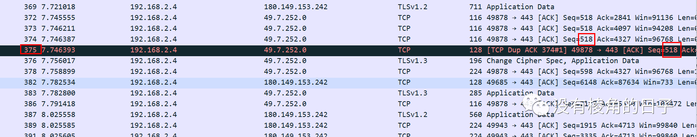

# TCP抓包常见问题分析

## 1、TCP Previous segment not captured

在TCP传输过程中，同一台主机发出的数据段应该是连续的，即后一个包的Seq号等于前一个包的Seq + Len。如果Wireshark发现后一个包的Seq号大于前一个包的Seq+Len，就知道中间缺失了一段数据。如图所示例：72752 之后应该是74160，之后是75568、76976。此时未收到75568，提示TCP Previous segment not captured。

前一个分片丢失，有可能是网络中确实丢失了，或者晚到了，也有可能是wireshark本身并没有抓到2、TCP Out-Of-Order

TCP Out-Of-Order指的是TCP发送端传输过程中报文乱序了。Wireshark判断TCP out-of-order是基于TCP包中SEQ number并非期望收到的下一个SEQ number，则判断为out-of-order。因此，出现TCP out-of-order时，很大可能是TCP存在乱序或丢包，导致接收端的seq number不连续。接上图分析：74160出现在76976之后，所以被判定为乱序有可能因为网络拥塞的情况下，TCP包不能按顺序到达，如果抓包中出现大量的out-of-order包，则说明网络存在较大的TCP乱序或丢包。

## 3、TCP Dup ack XXX #X

TCP dup ack XXX#X表示第几次重新请求某一个包，#前面的XXX表示第几个包（不是Seq），#后的X表示第几次请求。重复ack，当网络中存在乱序或者丢包时，将会导致接收端接收到的seq number不连续。此时接收端会向发送端回复重复ack，ack值为期望收到的下一个seq number。重复ack数大于等于3次将会触发快速重传重复ACK标志，丢包或者乱序的情况下，会出现该标志。

## 4、TCP Retransmission

TCP超时重传。当同时抓到2次同一数据报文，且没有抓到初传包的反馈ack，wireshark就会判断发生了重传，标记为TCP Retransmission。

如果一个包丢了，又没有后续包可以在接收方触发Dup Ack，或者Dup Ack也丢失的话就不会快速重传。这种情况下发送方只能等到超时再重传。

## 5、TCP Fast Retransmission

TCP快速重传，一般快速重传算法在收到三次冗余的Ack，即三次TCP dup ack XXX#3后，发送端进行快速重传。

## 6、TCP Spurious Retransmission

TCP虚假重传。当抓到2次同一包数据时，wireshark判断网络发生了重传，同时，wireshark抓到初传包的反馈ack，因此wireshark判断初传包实际并没有丢失，因此称为虚假重传。

## 7、TCP RST

是TCP协议结束异常连接的一种方式，通过flag中的reset=1标记。当TCP连接无法通过正常的4次挥手结束时，一方可以通过发送携带reset标志的TCP包结束TCP连接。

旁挂设备进行阻断可以伪造RST报文达到阻断的效果收到RST置位报文可能的原因：

1、被安全设备拦截；

2、对方端口未打开，发生在连接建立；

3、全连接队列满，发生在连接建立；

4、长时间无流量超时，导致连接被清除

5、超过超时重传次数、网络暂时不可达

6、非正常报文等

## 8、TCP acked unseen segment

ACK指向未知的TCP片段。wireshark上反馈是ACK指到不存在的TCP包。很可能是wireshark漏抓了这个包，但却抓到了对端反馈的该报文的ack包。如图。

## 9、TCP port numbers reused

tcp端口重复使用。在高并发的场景下，TIME_WAIT连接存在，属于正常现象。 线上场景中，持续的高并发场景一些部分TIME_WAIT连接被回收，但新的TIME_WAIT连接产生；一些极端情况下，会出现大量的TIME_WAIT。在出现大量TIME_WAIT的情况下，可能就会发生此种现象

> 转：
>
> http://www.elinkcloud.cn/article/20210922103549.html

