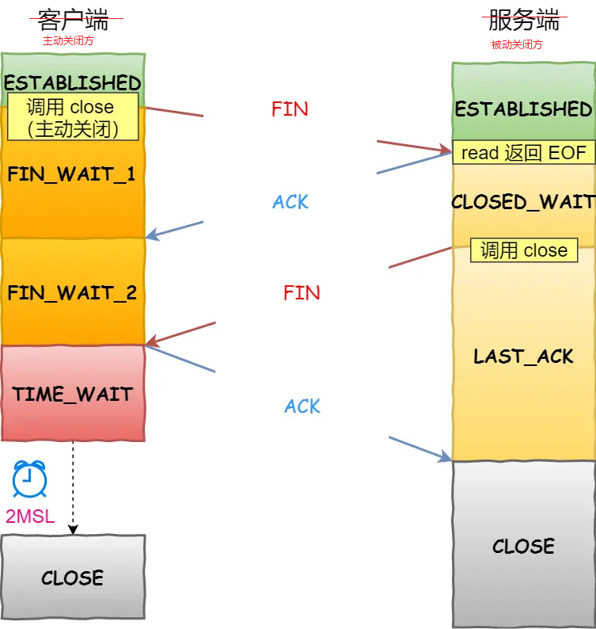

# TCP的状态总结

# 三次握手

不管是半连接队列还是全连接队列，都有最大长度限制，超过限制时，内核会直接丢弃，或返回 RST 包。

> 摘自：[小林图解TCP](https://www.xiaolincoding.com/network/3_tcp/tcp_interview.html#tcp-%E8%BF%9E%E6%8E%A5%E5%BB%BA%E7%AB%8B)

## TCP Fast Open

[在 Linux 3.7 内核版本之后，提供了 TCP Fast Open 功能，这个功能可以减少 TCP 连接建立的时延。](https://www.xiaolincoding.com/network/3_tcp/tcp_optimize.html#%E5%A6%82%E4%BD%95%E7%BB%95%E8%BF%87%E4%B8%89%E6%AC%A1%E6%8F%A1%E6%89%8B)

# 四次挥手

> 摘自：[小林图解TCP](https://www.xiaolincoding.com/network/3_tcp/tcp_interview.html#tcp-%E8%BF%9E%E6%8E%A5%E5%BB%BA%E7%AB%8B)

关闭连接的方式通常有两种，分别是 RST 报文关闭和 FIN 报文关闭。

如果进程收到 RST 报文，就直接关闭连接了，不需要走四次挥手流程，是一个暴力关闭连接的方式。