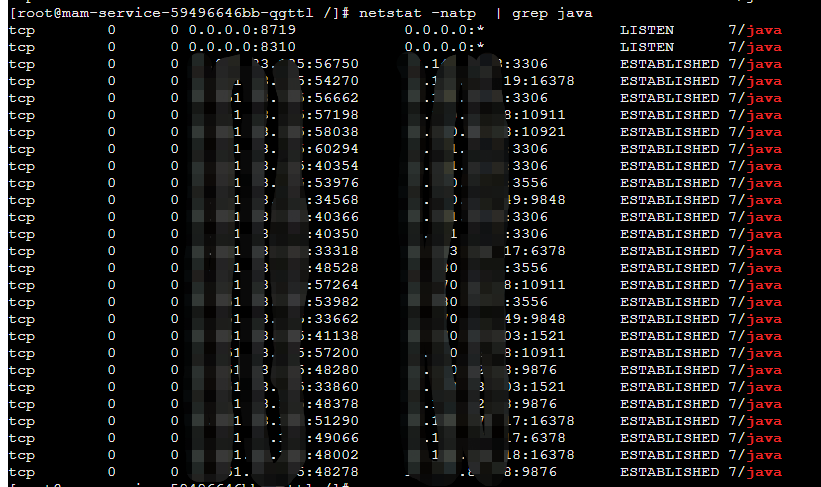

# 安装netstat

yum search netstat

```
yum search netstat
Loaded plugins: fastestmirror, ovl
Loading mirror speeds from cached hostfile
============================================================================================ Matched: netstat =============================================================================================bwm-ng.x86_64 : Bandwidth Monitor NG
dstat.noarch : Versatile resource statistics tool
net-snmp.x86_64 : A collection of SNMP protocol tools and libraries
net-tools.x86_64 : Basic networking tools
python2-psutil.x86_64 : A process and system utilities module for Python
python34-psutil.x86_64 : A process and system utilities module for Python
python36-psutil.x86_64 : A process and system utilities module for Python
unhide.x86_64 : Tool to find hidden processes and TCP/UDP ports from rootkits
```

yum install net-tools.x86_64


# 用法

https://www.runoob.com/linux/linux-comm-netstat.html


# netstat -natp

- -n或--numeric 直接使用IP地址，而不通过域名服务器。

- -a或--all 显示所有连线中的Socket。

- -t或--tcp 显示TCP传输协议的连线状况。

- -p或--programs 显示正在使用Socket的程序识别码和程序名称。

  


`netstat -natp | grep java`  查看java进程中的所有TCP连接。

发现：

- java程序监听了两个端口：8310和8719
- java进程作为TCP的客户端，建立了很多的TCP连接
  - 3306 mysql数据
  - 6378 redis
  - 9876 RocketMQ NameServer


作为TCP的服务端，监听的8310端口：


疑问：我本地使用http，访问这台服务器的接口，为啥没有跟我本地的ip，创建TCP连接呢？是有转发吗？


