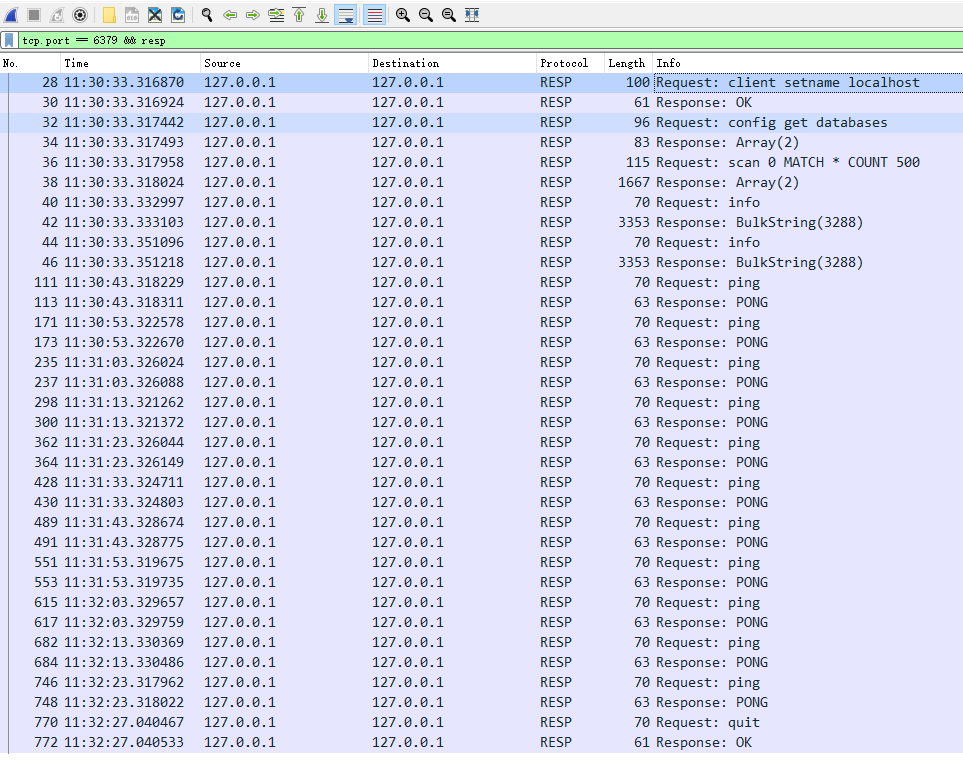
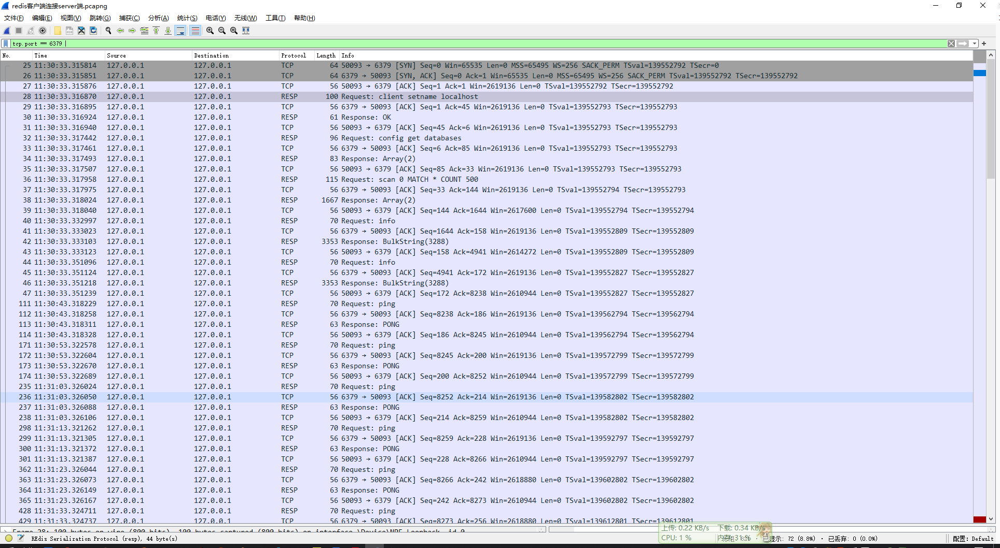
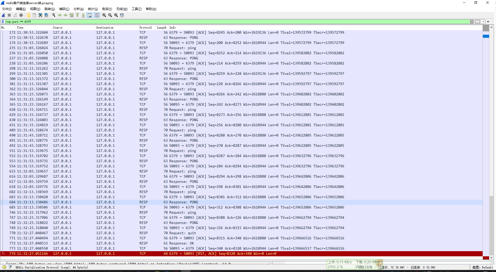

# redis客户端连接服务端

这里我使用的是

 

连接的redis服务

redis客户端和服务端之间，使用的是 redis 自定义的一种协议：`RESP`，此协议基于`TCP`协议。

## 先看`RESP`协议交互过程：

## 包含TCP协议的交互过程：

客户端与server端断开连接的时候，并没有使用TCP四次挥手，估计服务端直接把TCP连接的文件描述符删掉，

此时客户端再给服务端发消息，服务端直接返回RST报文

