# 查看DNS服务器IP

win+r

ipconfig /all

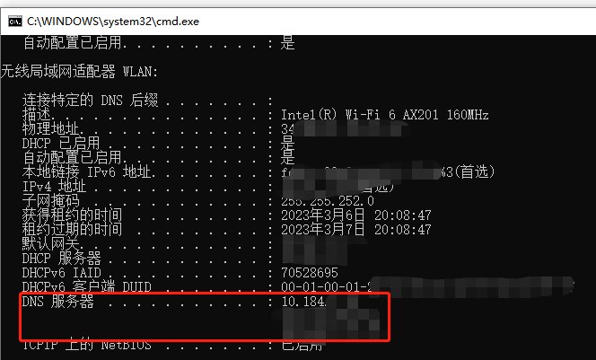


# DNS协议

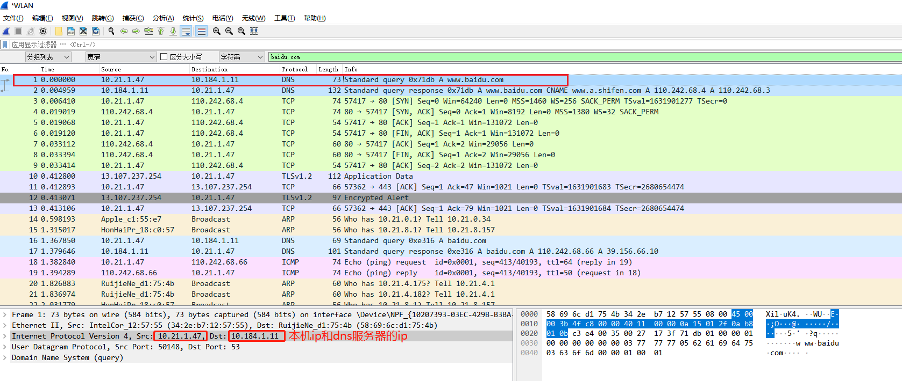

- ip协议下面是，UDP，也就是说，DNS查询网络请求，是基于UDP协议的。

- DNS（query）协议格式：

  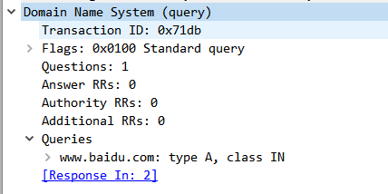

- DNS（response）协议格式：

  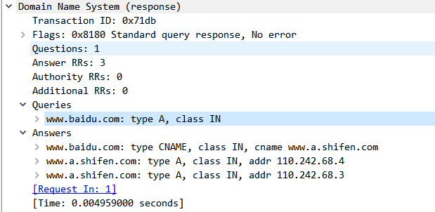


# TCP协议

## 握手、挥手

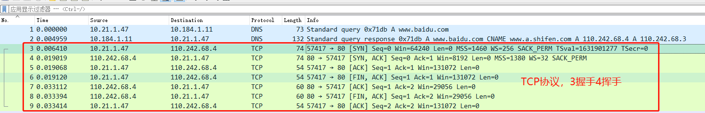


## MSL

在 TCP 四次挥手结束后，客户端的端口会处于 TIME_WAIT一段时间(2*MSL)，这期间端口不会被释放，从而导致端口被占满。

MSL(Maximum Segment Lifetime，**报文最大生存时间**)

TCP Segment在网络上的存活时间不会超过MSL（RFC793定义了MSL为2分钟，Linux设置成了30s）

> **如果客户端和服务端的确需要进行多次通信，则开启 keep-alive 是更好的选择**，例如在微服务架构中，通常微服务的使用方和提供方会长期有交流。
>
> **在一些 TPS/QPS 很高的 REST 服务中，如果使用的是短连接（即没有开启keep-alive），则很可能发生客户端端口被占满的情形**。
>
> 这是由于短时间内会创建大量TCP 连接，而在 TCP 四次挥手结束后，客户端的端口会处于 TIME_WAIT一段时间(2*MSL)，
>
> 这期间端口不会被释放，从而导致端口被占满。这种情况下最好使用长连接。


## MTU MSS

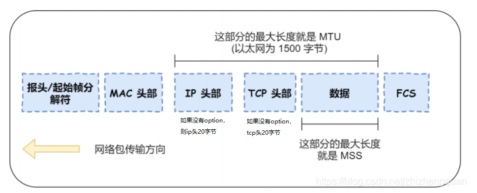


## [大量的TIME_WAIT状态的解决办法](https://www.cnblogs.com/soft-engineer/p/15117468.html)


# ICMP协议

ping命令使用的是ICMP协议，从抓包截图中看到，

ICMP协议的request数据包，在IP头部设置的TTL=64

而从下图中，看到reply响应的数据包，TTL=49,

64-49=15，这说明ping命令的请求数据包，在网络中经过了15个网络设备。

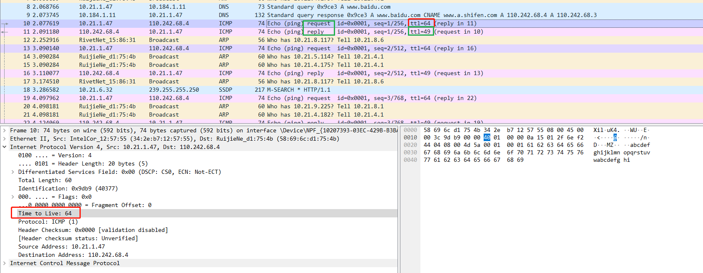


ping命令输出：

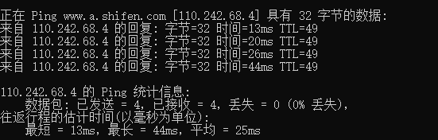

从抓包看到，由于我们ping的是百度的域名，所以需要先去DNS服务器查询ip地址。DNS请求数据包、DNS响应数据包。

向百度的ip发送了四次数据包，也就对应四组ICMP协议：

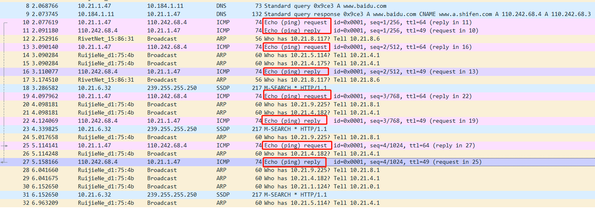


# HTTP协议

## 使用curl命令发送请求（window电脑）

curl -X GET --location "http://localhost:8080/hello?name=1111111111"


对于一个http协议，这是完整的请求流程：

- 由于http基于TCP，所以，先三次握手，建立TCP连接。
- 然后客户端使用TCP数据传输层协议，给服务端发送数据，
  - 发送的数据符合http协议格式。都是在TCP数据body中传输的。
  - 所以http协议，是应用层协议。
- 接收方，也就是server端在收到数据后，会给发送方也就是client发送Seq=1 ACK=100
  - 因为TCP数据包，长度是99，server收到后，进行ACK时，会在长度+1作为ACK的值。
  - 表示可以开始接收第100字节的数据了。
- http服务处理完请求结果后，会给client返回数据。
- client收到返回数据后，会给server发送TCP ACK，表示收到返回的数据了。
- 然后进行四次挥手，断开TCP连接。


## 使用idea 的HTTP Client组件发送请求

### Connection: keep-alive

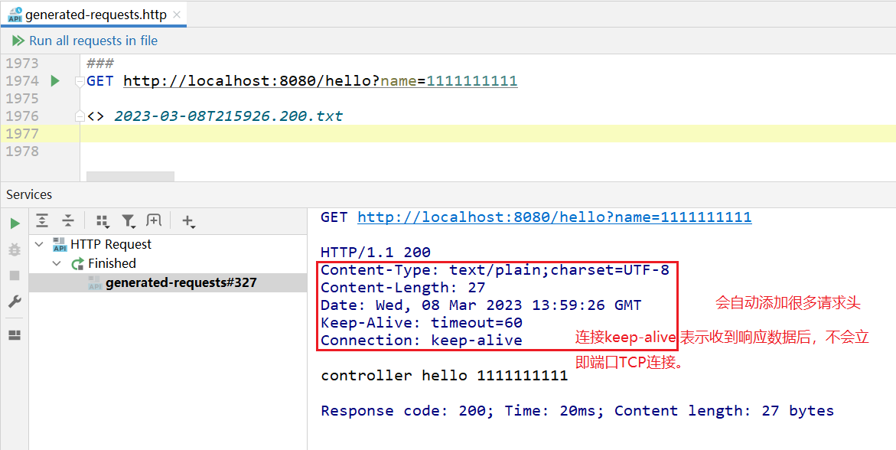


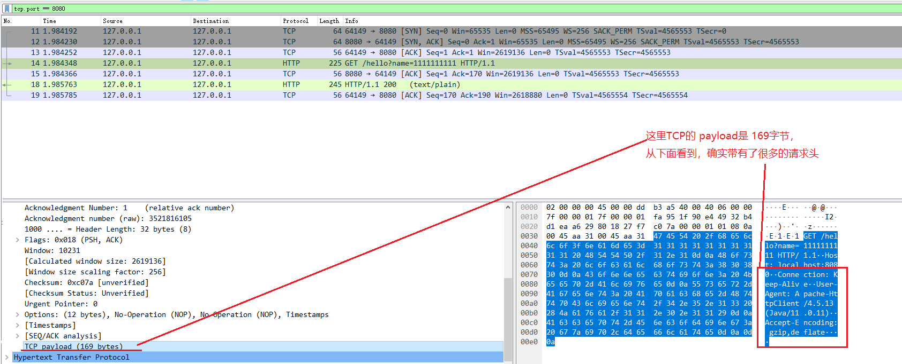

如果设置 `Connection: keep-alive` ，由于使用完TCP连接之后，client没有把TCP连接断开，

达到tomcat最大连接数的时，并且tomcat的线程都在`RUNNING`时，此时新的client再发送请求，就会被阻塞。


### Connection: close

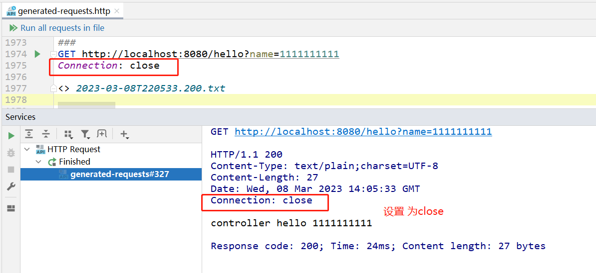

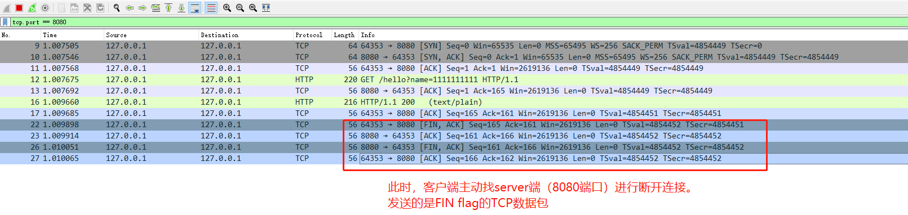


### Tomcat最大连接数

启动时，tomcat默认连接数是10，

默认10，最小也是10；

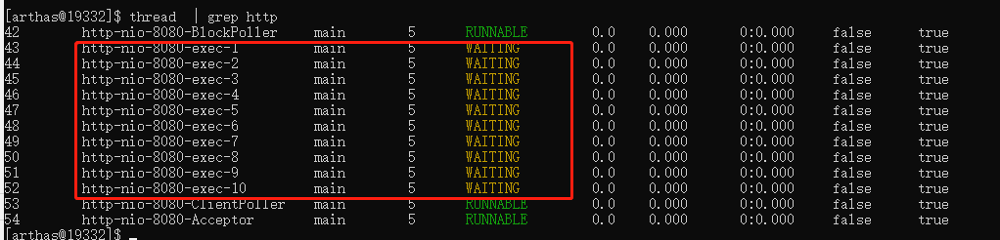


```yaml
server:
  tomcat:
  	# 这里设置最大连接数为15
    max-connections: 15
```

当服务端收到的请求，超过10个连接数的时候，会创建新的连接。

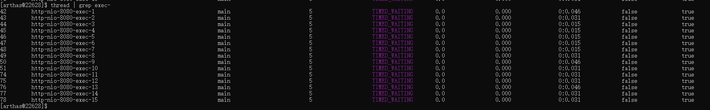

- 当任务处理完毕，http的这些线程会 `TIMED_WAITING` 状态，也就是等着有新的http连接过来。

- 一段时间后（问题：这个时间是多久，有什么配置项？）会重新变成10个线程，并且线程状态会变成：`WAITING`

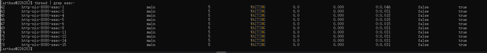

> 画外音：
>
> tomcat这相关原理，抽空还是要学一下。


### 请求未处理完时shutdown server

修改controller接口，让处理慢一点：

```java
    @RequestMapping("hello")
    public String hello(String name) {
        helloService.hello(name);

        ThreadUtil.sleep(10, TimeUnit.SECONDS); // 这里等待10秒钟。

        return "controller hello " + name;
    }
```

发送请求：

```shell
curl -X GET --location "http://localhost:8080/hello?name=anxiaole"
```

当服务端响应未返回的时候，我尝试了两种方式关闭SpringBoot服务，分别进行了抓包：


1）使用kill -9直接杀掉服务端进程，抓包如下：

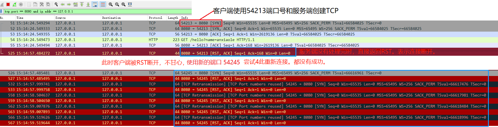

- 服务端被kill -9 时，server端直接给client发送`RST`报文。告诉client重置TCP连接。
- 此时client使用`新端口号`，尝试与server端重新建立TCP连接——发送`SYN`报文。
- 但是由于此时server端已经被kill，所以服务端不会`ACK`，而是继续返回`RST`。


2）直接把SpringBoot在idea中关掉：

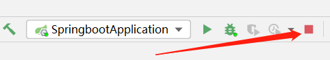

抓包：

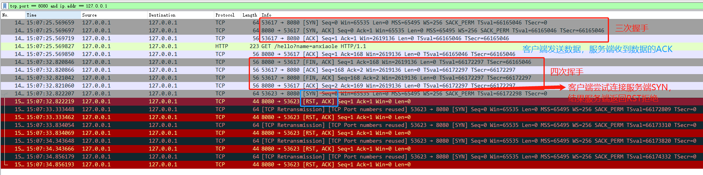

> 可以看到，在idea中点击关闭按钮时，
>
> 8080端口所在的服务端，会主动给client发送`FIN`报文，跟client端断开。
>
> 这也相当于优雅关闭。


### 服务端未启动【RST】

> TCP四次挥手可以称之为——优雅分手
>
> RST可以理解为：其中一方强制分手，或者其中一方挂掉了，不分不行了。

当服务端未启动时，端口不存在。

```
curl -X GET --location "http://localhost:8080/hello?name=anxiaole"
```

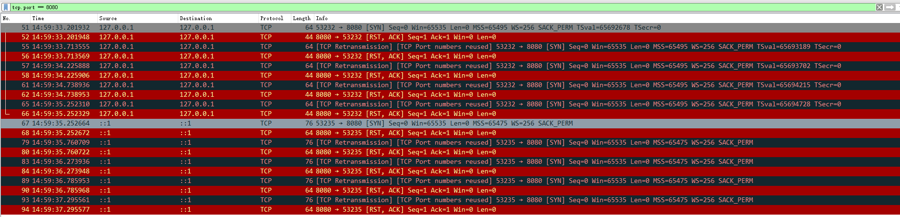

当目标端口不存在，发送方会收到【RST】类型的TCP报文。

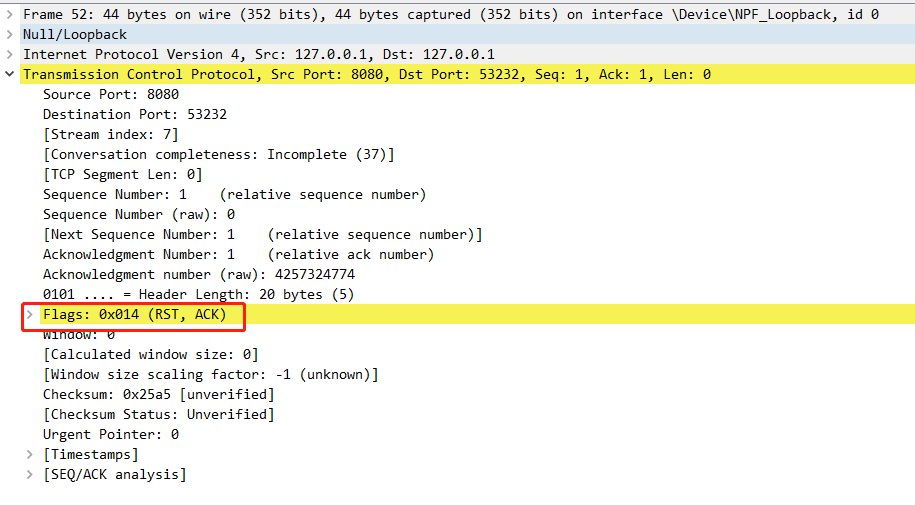

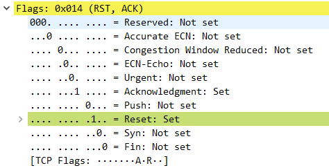

此时发送方会尝试重试几次：

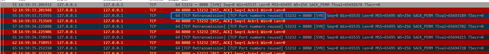

> 画外音：
>
> 想到以前看到的面试题：
>
> ​	如果TCP连接建立后，传输部分数据图中，TCP双方有任意一方kill -9，或直接断电 ，
>
> ​	此时TCP连接会如何处理？
>
> 个人理解：
>
> ​	假设有TCP连接：双方分别用A和B表示：
>
> ​	B被kill -9，则B会给A发送`RST`报文：告诉A，此tcp连接有问题，如果仍然需要TCP连接发送数据，你可以重新创建一个TCP连接。
>
> ​	此时，收到`RST`的A，就会使用一个新的端口号，重新发起TCP三次握手，尝试创建TCP连接。


# 使用http文件上传

```java
@PostMapping("fileUpload")
public String fileUpload(MultipartFile file) throws Exception {
    InputStream inputStream = file.getInputStream();
    FileOutputStream out = new FileOutputStream("d://tmp.file");
    IoUtil.copy(inputStream, out);
    IoUtil.close(out);
    return file.getSize() + "";
}
```


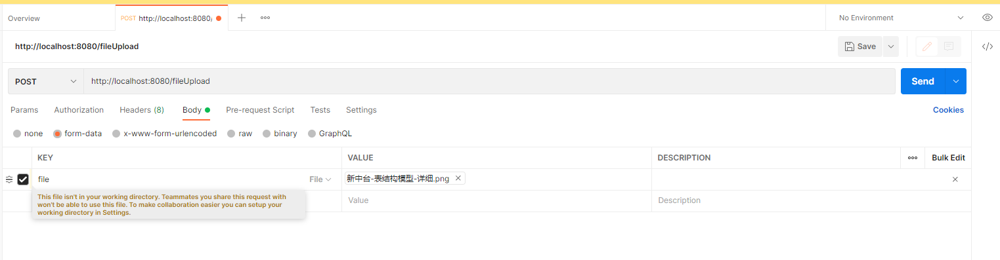


## PSH

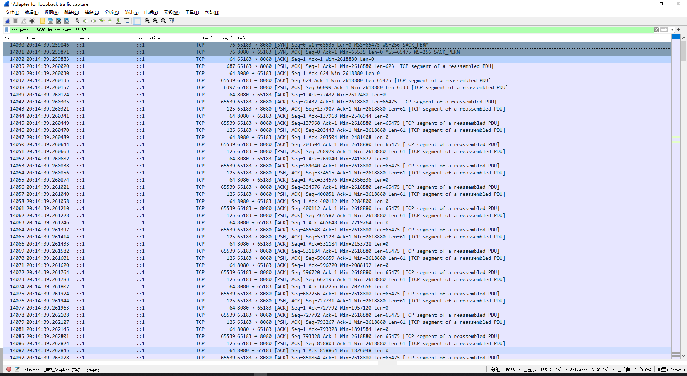

- PSH（PUSH）标志位所表达的是，发送方通知接收方传输层应该尽快的将这个报文段交给应用层。
- 传输层及以下的数据往往是由系统所带的协议栈进行处理的，客户端在收到一个个报文之后，经由协议栈解封装之后会立马把数据交给应用层去处理吗？如果说在收到报文之后立马就交给上层，这时候应用层由于数据不全，可能也不会进行处理。而且每来一个报文就交一次，效率很低。因此传输层一般会是隔几个报文，统一上交数据。什么时候上交数据呢，就是在发送方**将PUSH标志位置1的时候**。那么什么时候标志位会置1呢，通常是发送端觉得传输的数据应用层可以进行处理了的时候。
- 举个例子来说，TLS 协议中的的证书交换部分，通常证书链的大小在3K-4K左右，一般分三个报文来进行传输。只有当这3K-4K的报文传输完毕之后，那么数据形成完整的证书链，这个时候对于接收方才是有意义的（可以进行证书链的验证），单纯的一个报文无异于乱码。因此在TLS连接中，**通常会发现证书的第三个报文同上设置了push位，是发送方来告知接收方，可以把数据送往tcp的上层了，因为这些报文已经组成了有意义的内容了。**同样接收方在解析了TCP的PUSH字段后，也会清空自己的缓冲区，向上层交数据。
- [TCP PSH+ACK攻击是什么意思？PSH+ACK攻击原理](https://www.jianshu.com/p/9878a8102310)


> [**TCP协议的PSH标志）**](https://blog.51cto.com/u_15766689/5623282)
>
> **1. PSH 标志位**
>
> 从你第一次抓包以来，PSH 标志位几乎与你形影不离。它的英文单词是 PUSH，表示“推”的意思。
>
> **1.1 接收缓冲区和发送缓冲区**
>
> 在谈 PSH 标志位前，先来说说 TCP 双方是如何发送数据的。
>
> 假设有发送方 A 和接收方 B。发送方有一个发送缓冲区，接收方有一个接收缓冲区，见图 1。进程 A 发送”hello”, “world” 后，只是将这些数据写到自己的发送缓冲区，为了能讲清 PSH 的作用，**不妨假设我们可以自己指定 PSH 标志**。在图 1 所示的情况中，第一次 write 没有指定 PSH 标记，而第二次指定了 PSH 标志。
>
> 
>
> 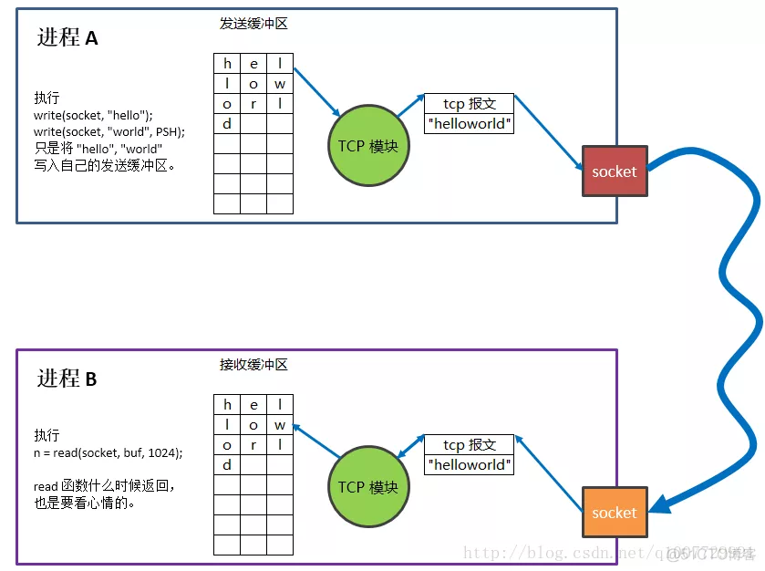
>
> 
>
> 图1 TCP 协议中的发送缓冲区与接收缓冲区
>
> 
>
> 接收进程 B，接收到 TCP 报文后，将数据放入到接收缓冲区。
>
> **1.2 PSH 的作用**
>
> 在 1.1 节中，TCP 模块什么时候将数据发送出去（从发送缓冲区中取数据），以及 read 函数什么时候将数据从接收缓冲区读取都是未知的。
>
> 如果使用 PSH 标志，上面这件事就确认下来了：
>
> - 发送端
>
> 对于发送方来说，**由 TCP 模块自行决定**，何时将接收缓冲区中的数据打包成 TCP 报文，并加上 PSH 标志（在图 1 中，为了演示，我们假设人为的干涉了 PSH 标志位）。一般来说，每一次 write，都会将这一次的数据打包成一个或多个 TCP 报文段（如果数据量大于 MSS 的话，就会被打包成多个 TCP 段），并将最后一个 TCP 报文段标记为 PSH。
>
> 当然上面说的只是一般的情况，如果发送缓冲区满了，TCP 同样会将发送缓冲区中的所有数据打包发送。
>
> - 接收端
>
> 如果接收方接收到了某个 TCP 报文段包含了 PSH 标志，则立即将缓冲区中的所有数据推送给应用进程（read 函数返回）。
>
> 当然有时候接收缓冲区满了，也会推送。


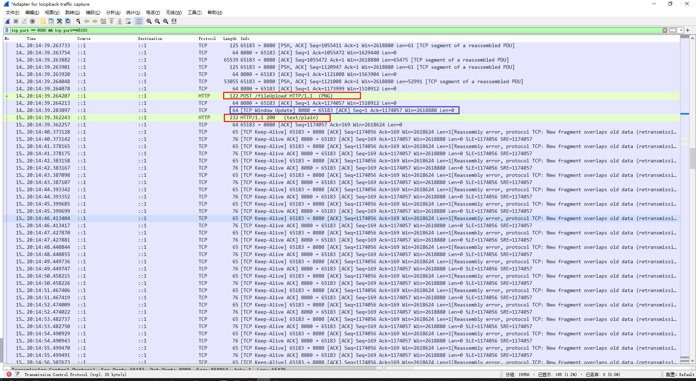


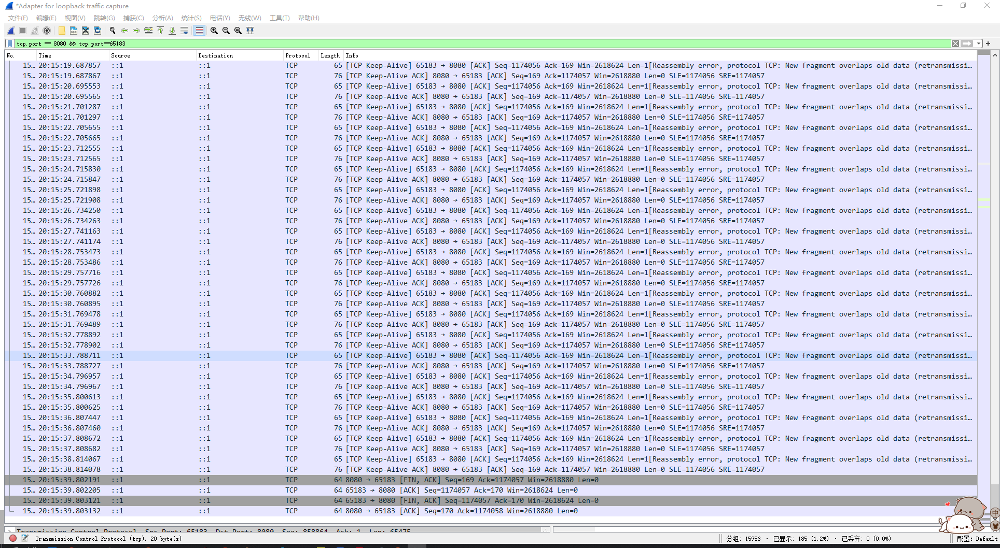


## HTTP

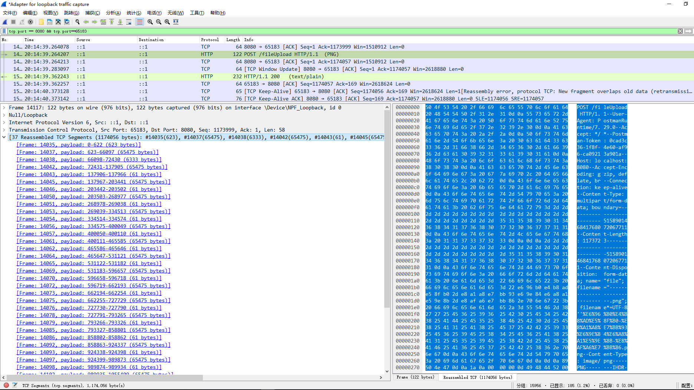

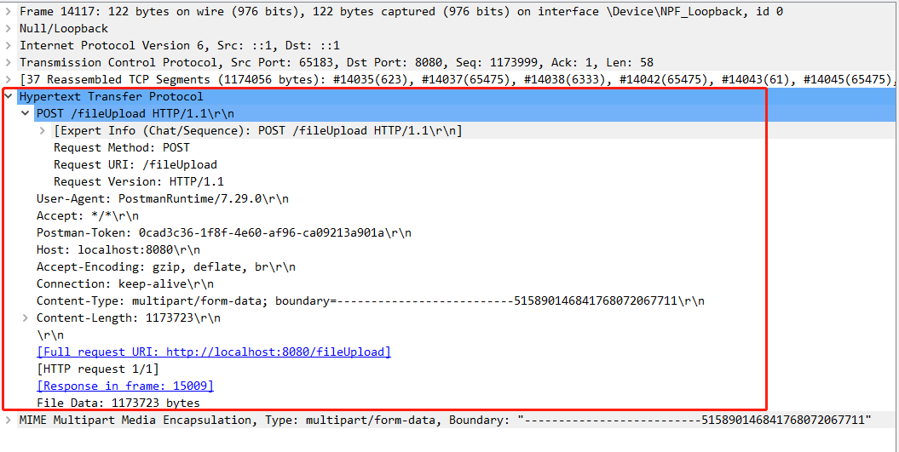


## TCP Keep-Alive


## TCP Window Update

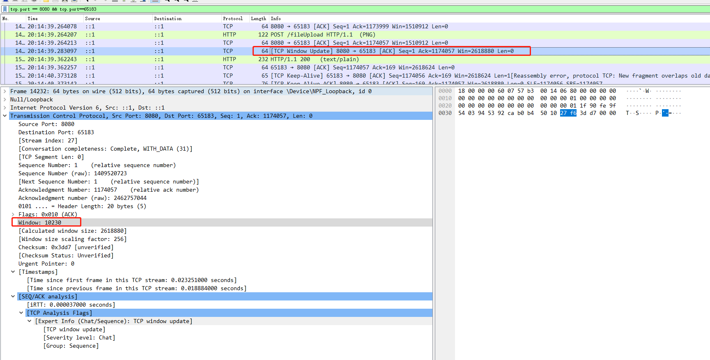


## TCP segment data 65475 bytes

疑问：65475 bytes 有什么特殊的地方？

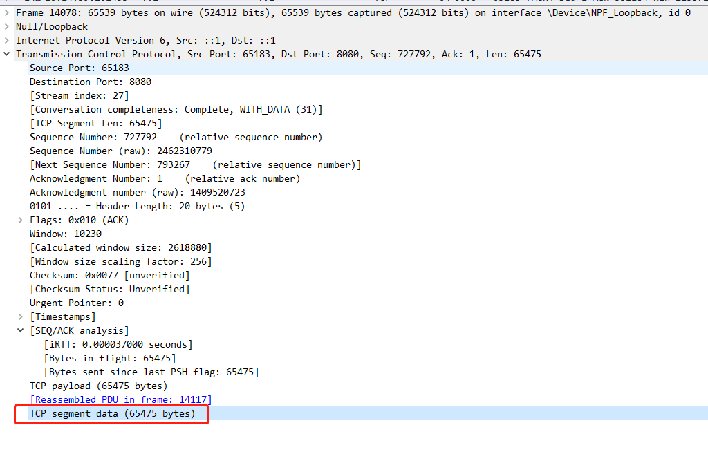