# 查看DNS服务器IP

win+r

ipconfig /all

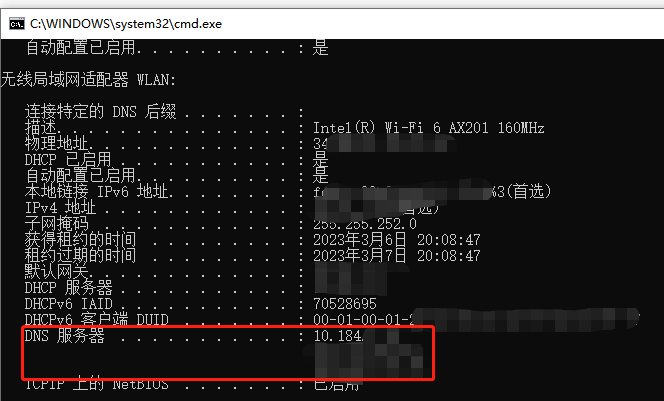

# DNS协议

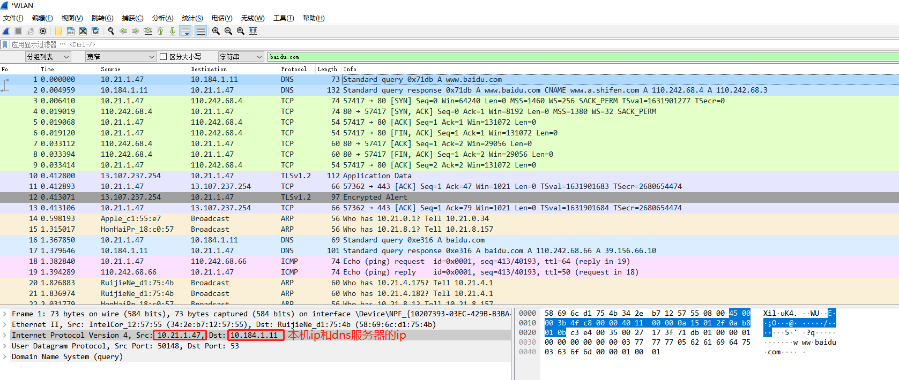

- ip协议下面是，UDP，也就是说，DNS查询网络请求，是基于UDP协议的。

- DNS（query）协议格式：

  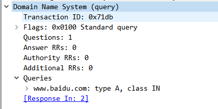

- DNS（response）协议格式：

  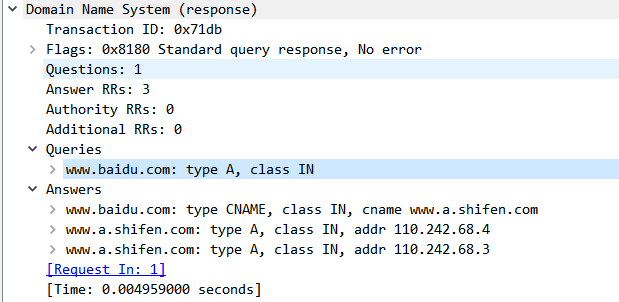

# ICMP协议

ping命令使用的是ICMP协议，从抓包截图中看到，

ICMP协议的request数据包，在IP头部设置的TTL=64

而从下图中，看到reply响应的数据包，TTL=49,

64-49=15，这说明ping命令的请求数据包，在网络中经过了15个网络设备。

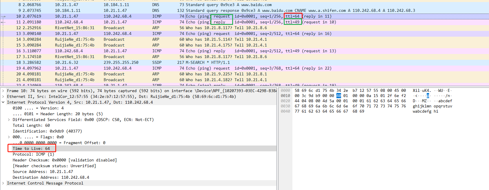

ping命令输出：

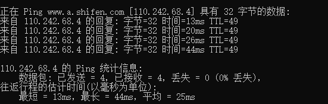

从抓包看到，由于我们ping的是百度的域名，所以需要先去DNS服务器查询ip地址。DNS请求数据包、DNS响应数据包。

向百度的ip发送了四次数据包，也就对应四组ICMP协议：

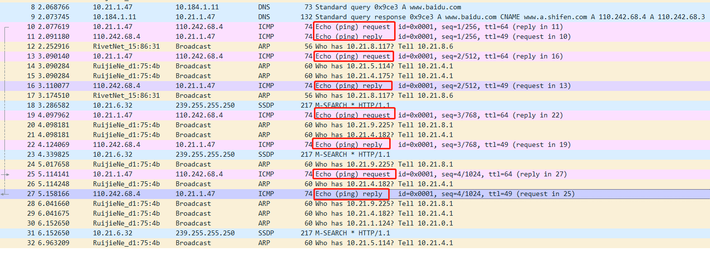

# TCP协议握手、挥手

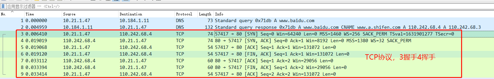

# HTTP协议

## 使用curl命令发送请求（window电脑）

curl -X GET --location "http://localhost:8080/hello?name=1111111111"

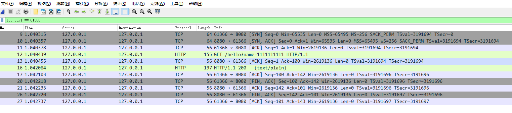

对于一个http协议，这是完整的请求流程：

- 由于http基于TCP，所以，先三次握手，建立TCP连接。
- 然后客户端使用TCP数据传输层协议，给服务端发送数据，
  - 发送的数据符合http协议格式。都是在TCP数据body中传输的。
  - 所以http协议，是应用层协议。
- 接收方，也就是server端在收到数据后，会给发送方也就是client发送Seq=1 ACK=100
  - 因为TCP数据包，长度是99，server收到后，进行ACK时，会在长度+1作为ACK的值。
  - 表示可以开始接收第100字节的数据了。
- http服务处理完请求结果后，会给client返回数据。
- client收到返回数据后，会给server发送TCP ACK，表示收到返回的数据了。
- 然后进行四次挥手，断开TCP连接。

## 使用idea 的HTTP Client组件发送请求

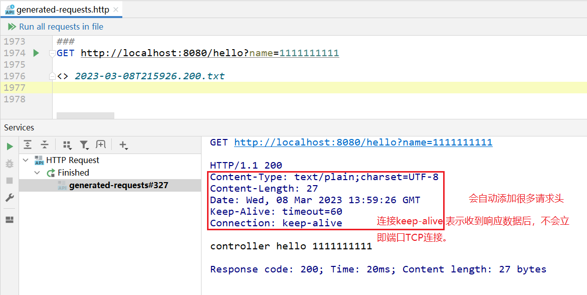

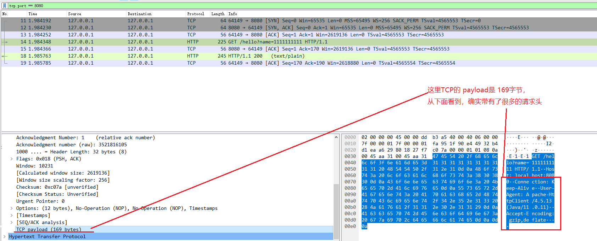

### Connection: close

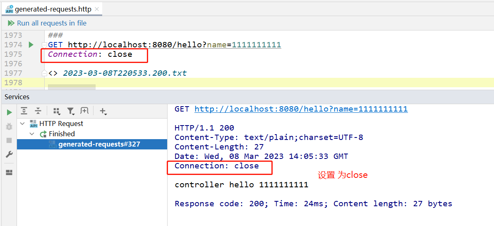

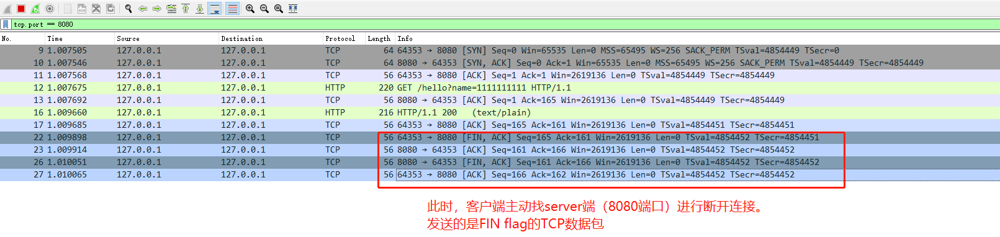

### 测试tomcat的最大连接数

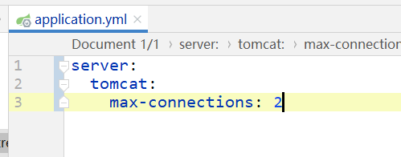

当设置  Connection: close  时，可以一直发送请求：

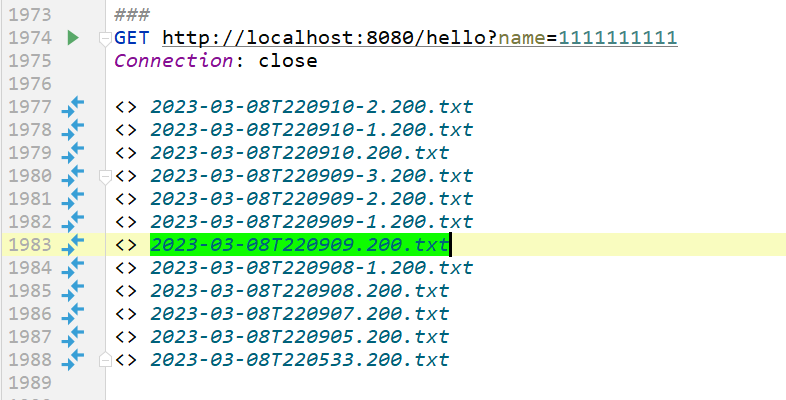

否则，由于client没有把TCP连接断开，就会一直被占用，达到tomcat最大连接数的时，此时新的client再发送请求，就会被阻塞。

todo：

### 当请求未处理完毕时，shutdown server

todo：

